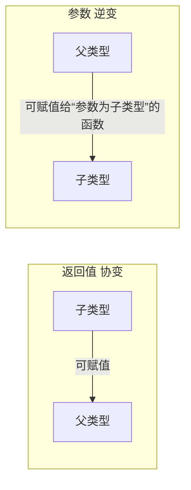
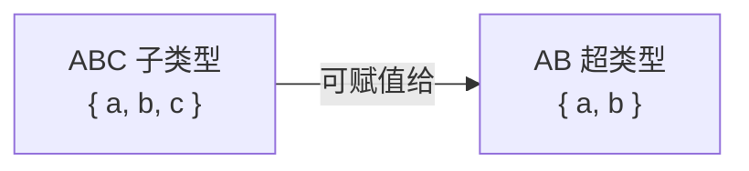

# 协变、逆变与父子类型

本文档说明 TypeScript 中的**协变 / 逆变**以及**父子类型（结构子类型）**，便于理解函数类型兼容与类型体操（如 [UnionToIntersection](./类型体操.md#uniontointersection)）中的参数逆变。

---

## 一、协变 vs 逆变（通俗版）

**结论**：类型兼容的方向决定协变/逆变——子类型 → 父类型为**协变**，父类型 → 子类型为**逆变**（出现在函数参数位置）。函数类型兼容规则：**参数逆变、返回值协变**。



若函数 `A` 要赋值给函数 `B`，则：

1. `A` 的**参数类型**必须是 `B` 的参数类型的**超类型**（逆变）；
2. `A` 的**返回值类型**必须是 `B` 的返回值类型的**子类型**（协变）。

---

## 二、父子类型（结构子类型）

**结论**：TypeScript 按**结构**判断子类型，不看 `extends` 语法。能**完全替换**类型 `T` 的类型 `S`（即 `S` 拥有 `T` 的所有属性且可有更多）才是 `T` 的**子类型**；`T` 是 `S` 的**超类型**。属性多 = 更具体 = 子类型，属性少 = 更抽象 = 超类型。



```typescript
type AB = { a: number; b: number };
type ABC = { a: number; b: number; c: number };

// ✅ ABC 是 AB 的子类型：可赋值给 AB（子 → 父）
let ab: AB = { a: 1, b: 2, c: 3 };

// ❌ AB 不是 ABC 的子类型：缺少 c
let abc: ABC = { a: 1, b: 2 }; // 报错：缺少属性 c
```

即使使用 `interface ABC extends AB { c: number }`，TS 仍按结构判断：ABC 仍是 AB 的子类型，与「属性更多 = 子类型」一致。

---

## 三、为什么参数是逆变（安全性）

**结论**：逆变保证「实际传入的参数 ≥ 函数使用的参数」，即函数只使用更少/更宽的类型，调用时传入更具体类型不会访问到不存在的属性，因此安全。

```typescript
type AB = { a: number; b: number };
type ABC = { a: number; b: number; c: number };

const fnExpectsABC: (arg: ABC) => void = (arg) => {
  console.log(arg.a);
};

const fnAcceptsAB: (arg: AB) => void = (arg) => {
  console.log(arg.a);
};

// ✅ 允许：fnAcceptsAB（参数 AB，超类型）赋给 参数为 ABC 的变量
let fn: (arg: ABC) => void = fnAcceptsAB;
fn({ a: 1, b: 2, c: 3 }); // 安全：实际传 ABC，函数只用 a/b
```

反过来说，若允许「参数协变」（把要求 ABC 的函数赋给要求 AB 的变量），就会不安全：

```typescript
// ❌ TS 禁止：fnExpectsABC 赋给 (arg: AB) => void
let fn2: (arg: AB) => void = fnExpectsABC;
fn2({ a: 1, b: 2 }); // 若允许：函数内部可能访问 arg.c，但实参没有 c
```

因此：**函数参数要“收得更紧”（只使用更少属性），返回值要“放得更宽”（返回更具体类型），才是安全的**。

---

## 四、直接传参与函数赋值的区别

**结论**：直接传参时，TS 禁止把超类型（如 AB）传给要求子类型（如 ABC）的函数。逆变讨论的是**函数赋值**时的兼容性，与「直接传参的类型检查」是两回事。

```typescript
const fnRequiresABC = (arg: ABC) => console.log(arg.c);
// ❌ TS 报错：类型 AB 缺少属性 c
fnRequiresABC({ a: 1, b: 2 });
```

你担心的「只有 AB 属性的对象传入要求 ABC 的函数」正是直接传参场景，TS 会直接报错；逆变规则只影响「把一个函数赋给另一个函数类型变量」时的安全性。

---

## 五、常见误区

**误区**：「属性多的是父类型」。

**正确**：属性少的是**超类型（父类型）**，属性多的是**子类型**。子类型 = 更具体、能替换父类型；超类型 = 更抽象、被替换的一方。

用结构类比：**需求方**只要求「有 a、b」；**提供方**给出「a、b、c」。能提供更多属性的（ABC）可以替换「只要求 a、b」的上下文（AB），所以 ABC 是 AB 的子类型。不要用「类 + extends」来记——TS 看的是结构能否替换，不是继承语法。

---

## 六、总结

- **子类型** = 更具体（属性多），**超类型** = 更抽象（属性少）；结构子类型下「能替换父类型的是子类型」。
- **函数参数逆变**：「抽象 → 具体」——赋值的函数参数是超类型，保证调用时传入的子类型参数足够，不会缺属性。
- **返回值协变**：子类型返回值可以赋给父类型，与直觉一致。
- 与类型体操的衔接：UnionToIntersection 等工具类型在**函数参数位置**用 `infer` 时，会利用参数逆变把联合推断成交叉，详见 [类型体操 · UnionToIntersection](./类型体操.md#uniontointersection)。
