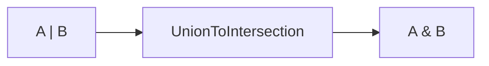

# 类型体操

本文档说明基于**递归、条件类型、infer、联合/交叉转换**的几种工具类型实现。基础版 Partial / Pick / Omit 见 [ts omit、patrial 怎么实现的.md](./ts%20omit、patrial%20怎么实现的.md)。

---

## DeepPartial

**结论**：递归将对象所有层级的属性变为可选，与内置 `Partial` 只做一层可选不同。


```typescript
// 递归：若属性值为对象则继续 DeepPartial，否则保留原类型
type DeepPartial<T> = {
  [P in keyof T]?: T[P] extends object ? DeepPartial<T[P]> : T[P];
};

interface Config {
  db: { host: string; port: number };
  cache: { ttl: number };
}

type PartialConfig = DeepPartial<Config>;
// { db?: { host?: string; port?: number }; cache?: { ttl?: number }; }
```

`T[P] extends object` 会包含数组、函数等；若需排除函数，可先判 `T[P] extends Function ? T[P] : ...` 再递归。

---

## UnionToIntersection

**结论**：把联合类型变成交叉类型，例如 `A | B` → `A & B`。利用条件类型在联合上的**分布式**与函数参数位置的**逆变**实现。

### 分步推导

整体可以拆成两步：先得到「多个函数类型的联合」，再在**参数位置**用 `infer` 把联合变成交叉。

**第一步：分布式条件类型，把 `A | B` 变成「函数的联合」**

当 `U = A | B` 时，条件类型 `U extends any ? (k: U) => void : never` 会**按联合的每一项分别做一次**（分布式）：

- 对 `A`：得到 `(k: A) => void`
- 对 `B`：得到 `(k: B) => void`
- 合起来就是：`((k: A) => void) | ((k: B) => void)`

也就是说，左边整体是一个「参数为 A 或 B 的函数」的联合类型。

**第二步：用 `infer` 在参数位置「反推」类型**

右边是：`(k: infer I) => void`。这里 **`infer I` 表示：从「参数类型」这个位置推断出一个类型，并命名为 `I`**。

- 左边是「多个函数类型的联合」：`(k: A) => void | (k: B) => void`
- 要能和 `(k: infer I) => void` 匹配，就要找一个类型 `I`，使得「左边每个函数都可以看成 `(k: I) => void」。
- 在 TypeScript 里，**函数参数类型是逆变的**：能同时接受 `A` 和 `B` 的参数类型，只能是「既满足 A 又满足 B」的类型，即 `A & B`。
- 所以 TS 推断出的 `I` 就是 `A & B`。

**什么是逆变（contravariance）**：在子类型关系里，**返回值**是协变（子类型可以赋给父类型），**参数**是逆变（方向相反）。意思是：若 `(x: A) => R` 能安全替代 `(x: B) => R`，则要求「能传进 B 的也一定能传进 A」，即 A 是 B 的**父类型**（更宽）。换句话说，参数类型「越宽越安全」——接受更宽类型的函数，可以当作接受更具体类型的函数来用。回到本题：我们要找的 `I` 是「一个参数类型」，使得左边联合里的每一个函数 `(k: A) => void`、`(k: B) => void` 都可以被视作 `(k: I) => void`；也就是说，**同一次传入的 `k` 必须既能满足 A 又能满足 B**，所以 `k` 的类型就是「同时满足 A 和 B 的结构」，即 `A & B`。逆变体现在：多个函数参数类型的联合，在 infer 时会被推断成它们的交叉。更完整的协变/逆变与父子类型说明见 [协变逆变与父子类型.md](./协变逆变与父子类型.md)。

因此最终 `UnionToIntersection<A | B>` 得到 `A & B`。

### `infer` 在这里的作用

- **`infer`** 只能在**条件类型**的 `extends` 右侧使用，用来声明一个「待推断的类型变量」。
- 写法：`T extends SomePattern<infer X> ? X : never`，表示：若 `T` 能匹配 `SomePattern<...>`，就从匹配到的那个位置推断出类型，赋给 `X`。
- 在 UnionToIntersection 里，我们用的模式是 **`(k: infer I) => void`**，也就是「一个参数类型待推断的函数」。匹配时，TS 会从**参数类型**这个位置推断出 `I`；因为左边是多个函数联合，参数位在逆变下会变成交叉，所以 `I` 就是联合变交叉的结果。

### 为何要用函数包装？

因为**只有函数/构造函数的参数位置才有逆变**。如果直接写 `U extends infer I ? I : never`，推断出的还是 `U` 本身，不会变成交叉。把 `U` 放进「函数参数」里，再对这个参数做 `infer`，才能利用逆变得到交叉类型。



```typescript
type UnionToIntersection<U> = (U extends any ? (k: U) => void : never) extends (
  k: infer I
) => void
  ? I
  : never;

type A = { a: 1 };
type B = { b: 2 };
type Union = A | B;
type Intersection = UnionToIntersection<Union>; // { a: 1 } & { b: 2 }
```

---

## ReturnType 与 Parameters

**结论**：用条件类型 + `infer` 从函数类型中提取返回类型或参数元组。TS 内置了同名工具类型，手写用于理解原理。

```typescript
// 提取函数返回类型
type CustomReturnType<T extends (...args: any[]) => any> = T extends (
  ...args: any[]
) => infer R
  ? R
  : never;

// 提取函数参数元组
type CustomParameters<T extends (...args: any[]) => any> = T extends (
  ...args: infer P
) => any
  ? P
  : never;

declare function fn(a: string, b: number): boolean;
type R = CustomReturnType<typeof fn>;   // boolean
type P = CustomParameters<typeof fn>;   // [a: string, b: number]
```

---

## ConstructorParameters 与 InstanceType

**结论**：对构造函数类型做“参数”与“实例类型”的提取，写法与 ReturnType / Parameters 对称，仅把调用签名换成构造签名。

```typescript
type CustomConstructorParameters<T extends new (...args: any[]) => any> =
  T extends new (...args: infer P) => any ? P : never;

type CustomInstanceType<T extends new (...args: any[]) => any> =
  T extends new (...args: any[]) => infer R ? R : never;

class C {
  constructor(x: string, y: number) {}
}
type CP = CustomConstructorParameters<typeof C>; // [x: string, y: number]
type IT = CustomInstanceType<typeof C>;          // C
```

---

## 小结

| 类型 | 作用 |
|------|------|
| DeepPartial | 递归全属性可选 |
| UnionToIntersection | 联合 → 交叉（分布式 + 逆变 infer） |
| ReturnType / Parameters | 函数返回类型 / 参数元组 |
| ConstructorParameters / InstanceType | 构造函数的参数元组 / 实例类型 |

基础映射类型 Partial、Pick、Omit、Exclude 见 [ts omit、patrial 怎么实现的.md](./ts%20omit、patrial%20怎么实现的.md)。
