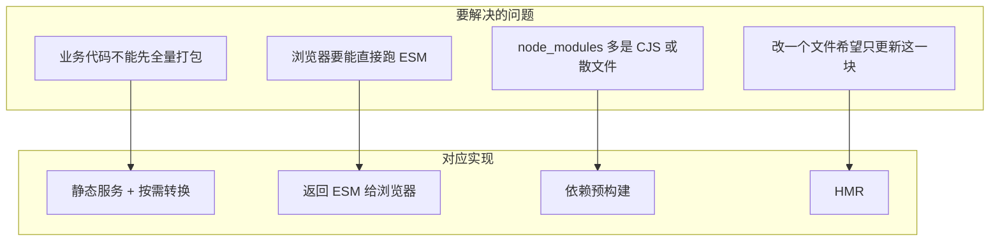
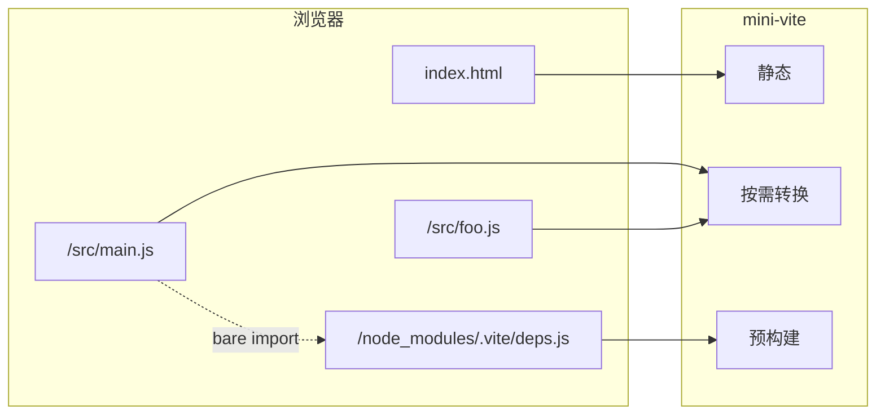

# mini-vite

极简版 Vite 开发服务器，用于理解 **Vite 开发态** 的构建原理：静态服务 + ESM 按需转换 + 依赖预构建 + HMR。

## 一句话结论

Vite 开发态 = **静态服务** + **按需编译** + **依赖预构建** + **HMR**；不打包业务代码，浏览器通过原生 ESM 按 URL 请求模块，服务器按需转换并改写 bare import 到预构建产物。

## Vite 构建原理（说清「是什么、为什么」）

### 开发态 vs 生产态

| 阶段 | 做法 | 目的 |
|------|------|------|
| **开发** | 不打包业务代码，用原生 ESM：入口是 `index.html`，`<script type="module" src="/src/main.js">`，浏览器按 URL 逐个请求模块；服务器只对「当前请求到的文件」做转换。 | 启动快（无需先建整棵依赖图）、热更新快（只重算改动的单文件）。 |
| **生产** | 用 Rollup 打包：构建依赖图、代码分割、压缩、输出静态资源。 | 请求数少、缓存友好、兼容旧浏览器。 |

mini-vite 只实现**开发态**，便于把「为何快」和「预构建 / HMR 做什么」对应到代码。

### 开发态四块在解决什么问题



1. **静态服务、以 index.html 为入口**  
   和传统前端一致：根路径返回 `index.html`，其它 URL 在项目根目录下按路径找文件。Vite 不做「单入口 JS 打包」，所以入口必须是 HTML，由 HTML 再引 ESM 入口。

2. **按需编译（transform on demand）**  
   只有被浏览器请求到的 URL（如 `/src/main.js`）才会被服务器读文件、做一次转换（如 TS→JS、import 重写），再返回。不请求就不编译，所以冷启动快。

3. **依赖预构建（Pre-Bundling）**  
   - 浏览器不能直接跑 `import 'lodash-es'`（bare specifier，且 node_modules 里可能是 CJS 或成百上千个小文件）。  
   - 做法：启动前从入口扫描出所有 bare import，用 **esbuild** 打成少量 ESM（如一个 `deps.js`），放到 `node_modules/.vite/`。  
   - 业务代码里的 `import 'lodash-es'` 在转换阶段被重写成 `import '/node_modules/.vite/deps.js'`，浏览器只请求预构建产物。  
   - 效果：CJS→ESM、合并请求、后续请求走缓存。

4. **HMR（热模块替换）**  
   文件变更 → 服务器用 WebSocket 通知浏览器「哪个 URL 变了」→ 浏览器对该模块重新发请求（或整页刷新）。因为开发态本来就是「按 URL 取模块」，只需重新请求该 URL 即可拿到新内容，无需像 Webpack 那样先增量编译再推 chunk。

### 为何开发态比 Webpack 快（简要）

- **启动**：Webpack 要先从入口建整棵依赖图并打包；Vite 只起静态服务 + 跑一次预构建（仅 node_modules），业务代码按请求再算。  
- **热更新**：Webpack 改一个文件可能触发一串模块重算和 chunk 更新；Vite 只重算改动的单文件，再让浏览器重新请求该模块 URL。

## 请求流（与本仓库 mini-vite 对应）



1. 浏览器请求 `/` → 返回 `index.html`（内联 HMR client）。
2. 浏览器解析 `<script type="module" src="/src/main.js">`，请求 `/src/main.js`。
3. mini-vite 拦截 `/src/*`，读文件 → esbuild.transform → 将 `import 'lodash-es'` 改写为 `import '/node_modules/.vite/deps.js?t=...'`，返回 JS。
4. 浏览器再请求相对路径 `/src/foo.js` 和预构建 URL `/node_modules/.vite/deps.js`；前者再次走转换，后者直接读磁盘上的预构建文件。

上面四步就是「开发态不打包、按 URL 按需转换 + bare import 指向预构建」的完整路径；下面表格把每条逻辑对应到本仓库里的具体文件。

## 如何运行

```bash
# 在 interview/vite 目录
pnpm install
cd demo && pnpm install && cd ..

# 启动开发服务器（默认 http://localhost:5174）
pnpm dev
```

若 `pnpm dev` 在部分环境报 tsx 的 EPERM，可改用：

```bash
node --import tsx src/server.ts
```

打开浏览器访问控制台 Network，确认 `main.js`、`foo.js`、`deps.js` 均为 ESM 请求；修改 `demo/src/foo.js` 保存后应触发 HMR 更新或刷新。

## 代码与原理对照

| 原理 | 对应文件 | 说明 |
|------|----------|------|
| 静态服务、以 index.html 为入口 | [src/static.ts](src/static.ts) | `getRootDir()` 指向 demo，`trySendFile()` 按路径在 demo 下读文件并设置 Content-Type。 |
| 路由与入口 | [src/server.ts](src/server.ts) | 先跑预构建，再处理 `/`（返回注入 HMR 的 HTML）、`/src/*`（转交 transform）、其余走静态。 |
| 按需编译与 import 重写 | [src/transform.ts](src/transform.ts) | `transformRequest()` 读 `/src/*` 文件，`esbuild.transform` 转 TS/JSX，`rewriteBareImports()` 将 bare specifier 改为 `/node_modules/.vite/deps.js`。 |
| 依赖预构建 | [src/prebundle.ts](src/prebundle.ts) | `collectBareImports()` 从入口递归扫描 `import 'xxx'`，生成虚拟 entry（`export * from 'pkg'`），`esbuild.build` 打包为 `demo/node_modules/.vite/deps.js`。 |
| HMR | [src/hmr.ts](src/hmr.ts) | `injectHMRClient()` 在 HTML 中注入 WebSocket 脚本；`createHMRServer()` 起 WS 并监听 `demo/src`，文件变更时推送 `update`，客户端重新请求对应模块或 full-reload。 |

