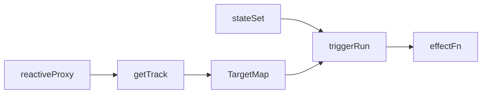
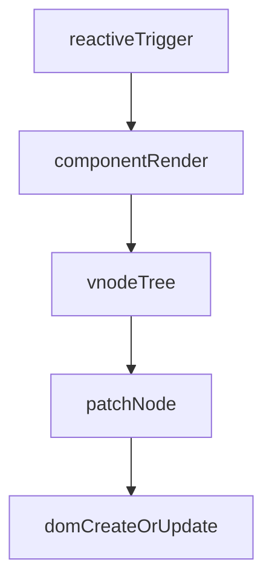
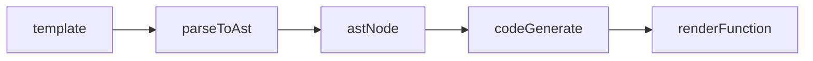
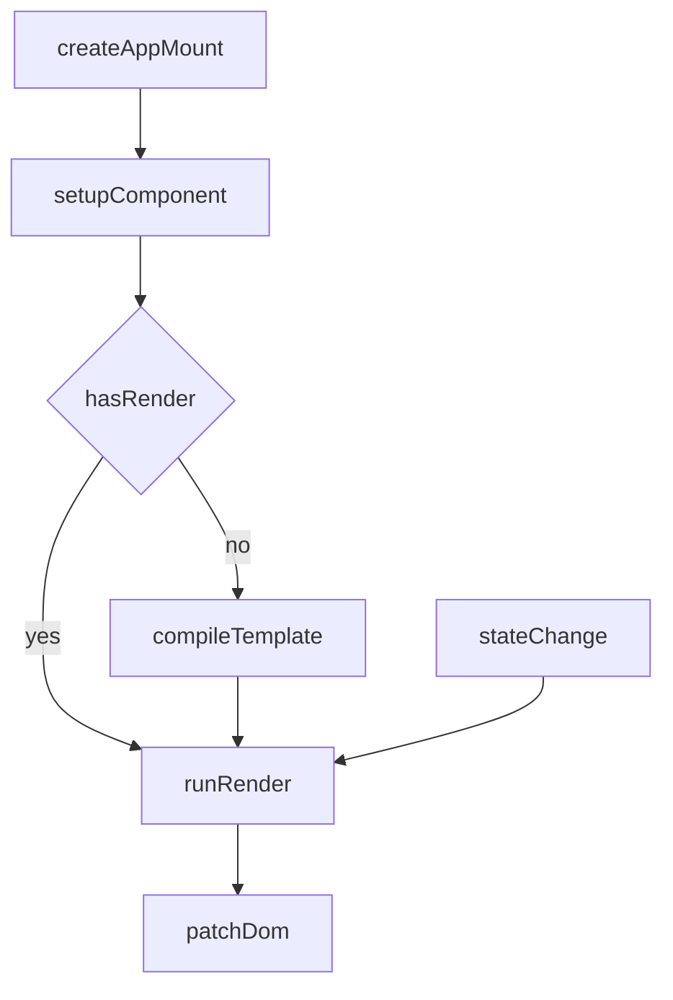

# Min-Vue

一个最小可运行的 Vue3 原理实现，覆盖「运行时 + 编译器基础」完整链路，目标是让你在 1-2 小时内快速建立整体心智模型。

## 你将掌握什么

- 响应式：`reactive`、`effect`、`track/trigger`
- 运行时：VNode、组件实例、`mount + patch`
- 编译器：`template -> AST -> render`
- 串联：`createApp` 如何把编译产物接到渲染更新链路

## 项目结构

```text
min-vue/
├── src/
│   ├── reactivity/
│   │   ├── effect.ts
│   │   └── reactive.ts
│   ├── runtime-core/
│   │   ├── component.ts
│   │   ├── h.ts
│   │   ├── renderer.ts
│   │   └── vnode.ts
│   ├── runtime-dom/
│   │   └── index.ts
│   ├── compiler-core/
│   │   ├── ast.ts
│   │   ├── parse.ts
│   │   ├── codegen.ts
│   │   └── compile.ts
│   └── index.ts
├── examples/
│   ├── basic.html
│   └── basic.ts
└── tests/
    └── reactivity.spec.ts
```

## 阶段 1：响应式闭环

一句话结论：读取数据时收集依赖，修改数据时触发依赖重新执行。



最小示例：

```ts
const state = reactive({ count: 0 });
let view = "";

effect(() => {
  view = `count=${state.count}`;
});

state.count += 1;
// view => "count=1"
```

## 阶段 2：运行时渲染闭环

一句话结论：组件 render 返回 VNode，renderer 负责把 VNode 同步到真实 DOM。



最小示例：

```ts
const App = {
  render(ctx) {
    return h("div", null, `count: ${ctx.count}`);
  },
  setup() {
    return { count: 0 };
  }
};
```

## 阶段 3：编译器基础闭环

一句话结论：把模板字符串解析成 AST，再生成可执行 render 函数。



最小示例：

```ts
const render = compile("<div>count: {{count}}</div>");
const vnode = render({ count: 1 });
```

## 阶段 4：运行时 + 编译器串联

一句话结论：`createApp` 挂载组件时，若组件无 render 则先编译 template，再进入响应式更新循环。



## 运行与验证

```bash
cd interview/vue/min-vue
pnpm config set registry https://registry.npmmirror.com
pnpm install
pnpm dev
```

打开 `http://localhost:5173/examples/basic.html`，你会看到页面里的 `count` 每秒 +1。

测试：

```bash
pnpm test
```

## 当前实现限制

- 仅支持单根模板节点。
- 仅支持基础元素、文本、`{{变量}}` 插值。
- children diff 是简化版（按索引更新），未实现 keyed diff。
- 未实现 `computed`、`watch`、scheduler、异步队列。

## 下一步扩展建议

1. 增加 scheduler，把多次 `trigger` 合并到微任务。
2. 增加 `computed/watch`，完善响应式家族能力。
3. 实现 keyed diff，补齐列表更新优化。
