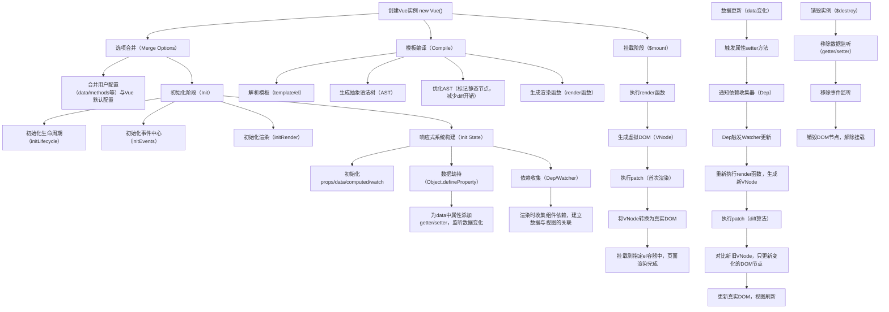
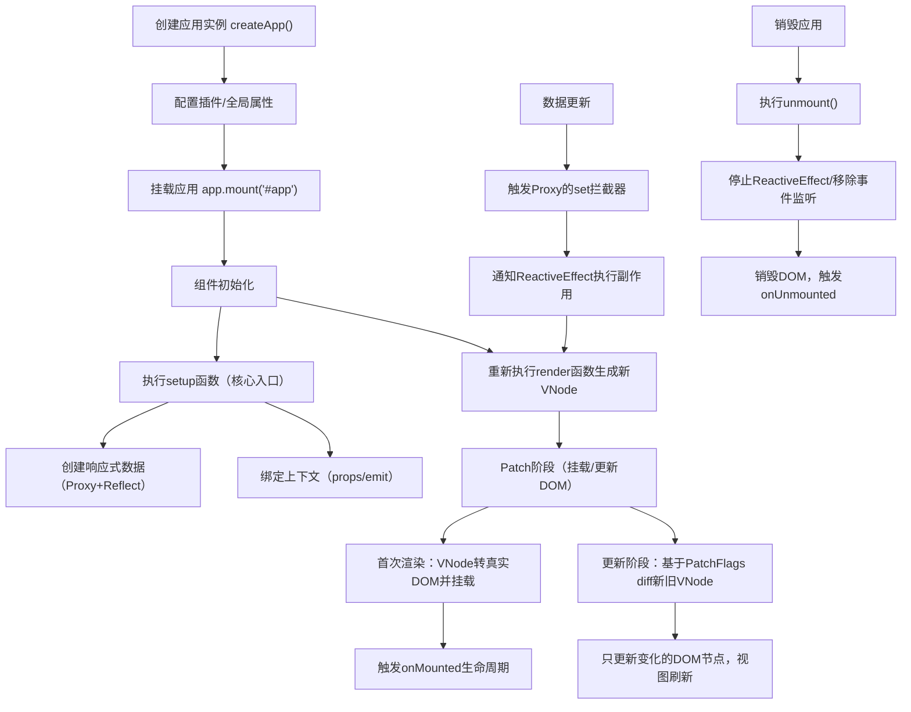

### 一、Vue 应用运行流程（以 Vue 3 为例）

Vue 3 的入口核心是 `createApp` 方法，整个运行流程可以分为 **初始化阶段**、**挂载阶段**、**渲染阶段** 和 **响应式更新阶段** 四个核心环节，下面结合代码和步骤详细说明：

#### 1. 初始化阶段：创建应用实例（入口起点）

Vue 应用的入口通常是项目根目录的 `main.js`（或 `main.ts`），这是整个应用的“启动开关”。

```javascript
// main.js（Vue 3 入口文件）
import { createApp } from 'vue'; // 1. 导入核心创建方法
import App from './App.vue'; // 2. 导入根组件
import router from './router'; // 可选：路由
import store from './store'; // 可选：状态管理

// 3. 创建应用实例（核心步骤）
const app = createApp(App);

// 4. 配置全局能力（可选）
app.use(router); // 安装路由插件
app.use(store); // 安装状态管理插件
app.config.globalProperties.$api = axios; // 挂载全局属性

// 5. 挂载应用到 DOM（进入下一阶段）
app.mount('#app');
```

**核心解释**：

-   `createApp(App)`：创建一个 Vue 应用实例（App Instance），接收根组件 `App.vue` 作为参数，此时会初始化应用的全局配置（如全局组件、指令、属性），但还未渲染到页面。
-   `app.mount('#app')`：触发应用的挂载流程，`#app` 是 `index.html` 中预留的 DOM 容器（`<div id="app"></div>`），这是从“初始化”到“挂载渲染”的关键触发点。

#### 2. 挂载阶段：解析组件 & 构建 VNode

当执行 `app.mount()` 后，Vue 会进入挂载流程：

1. **解析根组件**：读取 `App.vue` 的模板（`<template>`）、脚本（`<script>`）、样式（`<style>`），解析模板中的指令（如 `v-if`、`v-for`）、插值（`{{}}`）、组件标签等。
2. **创建虚拟 DOM（VNode）**：Vue 不会直接操作真实 DOM，而是将模板转换成 **虚拟节点（VNode）** —— 一个描述 DOM 结构的 JavaScript 对象（包含标签名、属性、子节点、组件类型等）。
   示例 VNode 结构：
    ```javascript
    const vnode = {
        type: 'div', // 节点类型（标签/组件）
        props: { id: 'app' }, // 属性
        children: [
            /* 子VNode */
        ],
        component: null, // 组件实例（如果是组件）
        el: null, // 对应的真实DOM节点
    };
    ```
3. **初始化组件实例**：如果 VNode 是组件类型（如 `App`），会创建组件实例（`component instance`），初始化 props、emit、生命周期钩子等。

#### 3. 渲染阶段：VNode 转真实 DOM

这一步是 Vue 把 VNode 渲染到页面的核心过程，由 **渲染器（Renderer）** 完成：

1. **创建真实 DOM**：根据 VNode 的 `type` 创建对应的真实 DOM 元素（如 `document.createElement('div')`）。
2. **设置 DOM 属性**：将 VNode 的 `props` 绑定到真实 DOM 上（如 `el.id = 'app'`、`el.onclick = 事件处理函数`）。
3. **递归渲染子节点**：对 VNode 的 `children` 重复上述步骤，直到所有子 VNode 都转换成真实 DOM，并挂载到父节点上。
4. **挂载到容器**：将最终生成的真实 DOM 插入到 `#app` 容器中，此时页面上就能看到渲染后的内容。
5. **触发生命周期**：依次触发组件的 `beforeMount` → `mounted` 钩子，`mounted` 钩子执行时，DOM 已完全渲染到页面，可在此操作真实 DOM。

#### 4. 响应式更新阶段（运行时核心）

应用挂载后，当数据变化时，Vue 会触发响应式更新，流程如下：

1. **数据劫持**：Vue 3 通过 `Proxy` 劫持组件的 `data`、`ref`、`reactive` 等响应式数据，当数据修改时，会触发“依赖收集”中记录的更新函数。
2. **生成新 VNode**：根据修改后的数据，重新生成组件的 VNode（新 VNode）。
3. **Diff 算法对比**：渲染器对比新旧 VNode 的差异（如节点类型、属性、子节点顺序等），只更新差异部分（而非重新渲染整个组件）。
4. **更新真实 DOM**：根据 Diff 结果，只修改需要更新的真实 DOM 节点（如修改文本内容、替换某个子节点、更新属性），而非全量替换，保证性能。
5. **触发生命周期**：依次触发 `beforeUpdate` → `updated` 钩子，`updated` 执行时，DOM 已完成更新。

### 二、Vue 2 vs Vue 3 入口差异（补充）

如果你接触过 Vue 2，其入口流程略有不同，但核心逻辑一致：

```javascript
// Vue 2 入口文件
import Vue from 'vue';
import App from './App.vue';

new Vue({
    el: '#app', // 等价于 Vue 3 的 mount('#app')
    router,
    store,
    render: (h) => h(App), // 手动渲染根组件（Vue 3 已简化）
});
```

-   Vue 2 核心是 `new Vue()` 创建实例，通过 `Object.defineProperty` 实现数据劫持；
-   Vue 3 用 `createApp` 实现“无全局污染”的实例创建，性能和扩展性更好。

### 三、整体流程图

#### vue2



核心步骤解释

1. 实例创建与选项合并：new Vue () 后，Vue 会先把你写的配置（如 data、methods）和框架默认配置合并，保证配置的完整性。
2. 初始化阶段：初始化生命周期、事件、渲染相关的基础能力，为后续运行做准备。
3. 响应式构建：核心是 Object.defineProperty，给 data 里的每个属性加 getter/setter——getter 用于收集依赖，setter 用于触发更新。
4. 模板编译（分两种时机）：

    - 主流场景（生产环境）：编译在打包阶段完成（vue-loader 处理 .vue 文件），将 `<template>` 转成 AST 并优化，最终生成 render 函数写入打包后的 JS 文件；
    - 特殊场景（运行时编译）：仅当直接在 new Vue() 中写 template/el 选项（未打包）时，才会在浏览器中执行编译，生成 render 函数（需使用 runtime-compiler 版本的 Vue）

5. 挂载渲染：执行 render 生成 VNode（虚拟 DOM，内存中的 DOM 描述），再通过 patch 转成真实 DOM 挂载到页面。
6. 数据更新：数据变化触发 setter，通过 Dep/Watcher 通知视图更新，再通过 diff 算法只更新变化的 DOM，提升性能。
7. 实例销毁：解除数据监听、事件绑定，销毁 DOM，释放资源。

#### vue3



### 总结

面试官问 Vue 的运行流程，可以这样简洁地回答：

Vue 运行流程分三步：

1. **初始化**：通过 createApp 或 new Vue 创建实例，配置好 data、methods 等，然后挂载到页面上。
2. **渲染**：打包阶段模板已经被编译成 render 函数，运行时直接通过 render 生成虚拟 DOM（VNode），再渲染为真实 DOM。
3. **响应式更新**：当数据变化时，Vue 的响应式系统检测到变化，自动触发视图更新，只会对比和更新有变化的部分 DOM 节点。

总结：Vue 的核心就是“响应式+虚拟 DOM”，初始化配置，渲染虚拟 DOM，数据变了自动高效更新视图。
