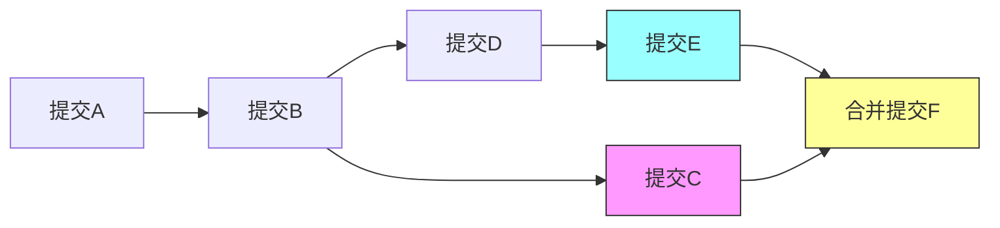

## git merge and rebase 区别

### git merge

-   关键特点：
    -   会生成一个合并提交（merge commit）（如上的 F），记录 “这次合并” 的操作；
    -   保留 feature 和 main 分支的完整提交历史，历史是 “分叉但完整” 的；
    -   处理冲突时只需要解决一次，解决后提交即可完成合并。

### git rebase

rebase 的核心是将当前分支的所有提交重新应用到目标分支的最新节点上，不会生成合并提交，最终让历史变成线性。

-   关键特点：
    -   无合并提交，提交历史线性、干净；
    -   基于要 rebase 的分支重新提交，改写了提交历史（哈希值变化），如果分支已推送到远程，可能导致协作混乱；
    -   处理冲突时需要逐个提交解决，解决完一个提交的冲突后，需执行 git add . && git rebase --continue，直到所有冲突处理完毕。

**总结**

1. merge 是 “保留历史的合并”，安全但会产生合并提交，适合公共分支整合；
2. rebase 是 “重写历史的移植”，整洁但有协作风险，仅适合个人 / 未推送的分支；
3. 核心原则：公共分支用 merge，个人分支整理用 rebase，避免改写公共提交历史。
