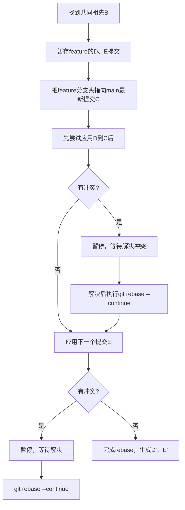

## 为什么 git rebase 需要处理多次冲突

流程：

-   变基前：main（A→B→C）、feature（B→D→E）
-   变基后：A→B→C（main 最新）→ D'（feature）→ E'（feature）

相当于先处理 D 的冲突，再处理 E 的冲突



## 怎么减少？

1. 交互式变基合并冗余提交

在 rebase 前，先对 feature 分支执行 git rebase -i HEAD~n（n 是要整理的提交数），把多个小提交合并成一个，再执行 git rebase main，只需解决一次冲突。

```bash
git checkout feature
# 整理最近2个提交（D、E）
git rebase -i HEAD~2
# 在弹出的编辑器中，把E提交的pick改成squash（合并），保存退出
# 合并后只剩一个提交，再rebase main就只需解决一次冲突
git rebase main
```

2. 及时同步主分支代码

在开发 feature 分支的过程中，频繁（比如每天）执行 git rebase main，每次只解决少量冲突，避免最后一次性堆积大量冲突。
