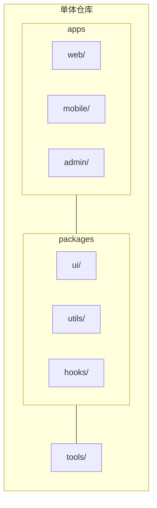
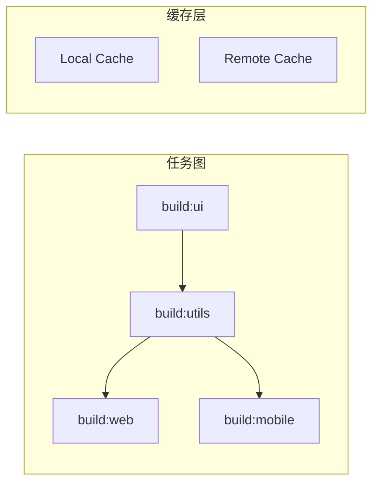
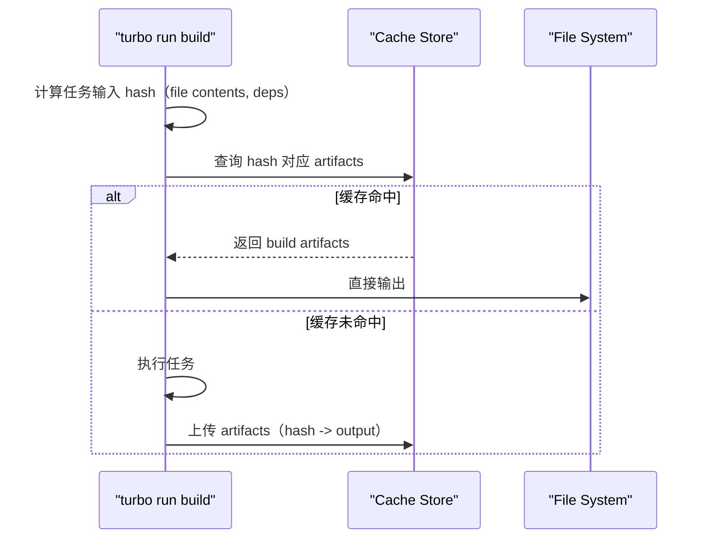
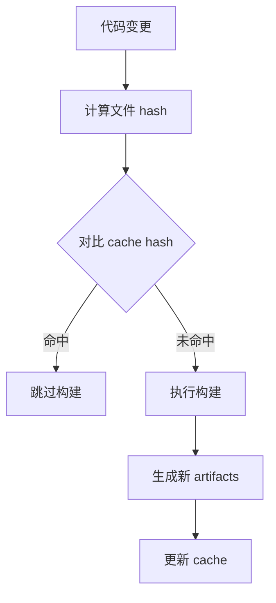
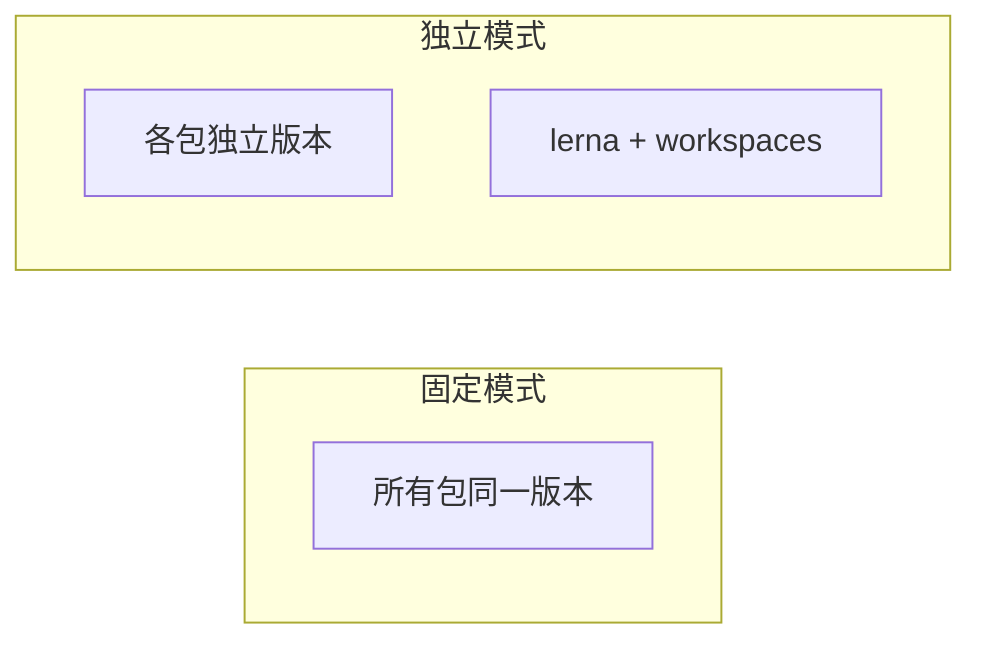

# Monorepo 技术原理

## 一、Monorepo 核心概念

**Monorepo（单体仓库）** 是将多个相关项目（应用、包）放在同一个代码仓库中管理的架构模式。



### Monorepo vs Polyrepo

| 特性 | Monorepo | Polyrepo |
|------|----------|----------|
| 代码共享 | 天然共享，通过 workspace 直接引用 | 需要单独发包 |
| 依赖管理 | 统一管理，减少重复 | 各仓库独立管理 |
| CI/CD | 一次构建，多个项目受益 | 各仓库独立流程 |
| 权限管理 | 统一权限粒度粗 | 按仓库细分 |
| 仓库体积 | 大（历史全量） | 小（按需克隆） |

---

## 二、依赖管理原理

### 2.1 pnpm workspace 软硬链接机制

> 详见 [pnpm设计原理](./pnpm/pnpm设计原理.md)

**核心结论**：`.pnpm` 用硬链接复用全局存储，`node_modules` 用软连接指向 `.pnpm`，实现依赖隔离 + 复用兼得。

```plaintext
my-monorepo/
├── node_modules/
│   ├── react → ../.pnpm/react@18.2.0/node_modules/react  # 软链
│   └── utils → ../.pnpm/utils@1.0.0/node_modules/utils   # 软链
│
└── .pnpm/
    ├── react@18.2.0/
    │   └── node_modules/react/index.js 🔗 ~/.pnpm-store/... # 硬链
    └── utils@1.0.0/
        └── node_modules/utils/index.js 🔗 ~/.pnpm-store/...
```

**为什么能解决幽灵依赖**：根目录 `node_modules` 只有显式声明的依赖，子依赖通过软链按需访问。

### 2.2 yarn/npm workspaces 扁平化

**核心**：将所有依赖「提升」（hoist）到根目录 `node_modules`，形成扁平化结构。

#### 结构对比

```plaintext
# 不使用 workspaces（嵌套结构）
project/
└── node_modules/
    └── react/
        └── node_modules/
            └── loose-envify/   # react 的子依赖，嵌套在深处
```

```plaintext
# 使用 workspaces（扁平化结构）
project/
└── node_modules/
    ├── react/          # react 提升到顶层
    ├── react-dom/      # react-dom 提升到顶层
    └── loose-envify/  # react-dom 的子依赖，也提升到顶层
```

#### 产生的问题

**问题一：幽灵依赖**

可以直接 import 未声明的依赖，版本不受控制：

```typescript
// package.json 中只声明了 react
{
  "dependencies": {
    "react": "^18.0.0"
  }
}

// 但可以直接使用（因为 loose-envify 被提升到顶层）
import looseEnvify from 'loose-envify';  // 不报错！但版本不受控
```

**问题二：依赖遮蔽**

多层依赖同名包时，路径不确定：

```plaintext
# 假设：
# - react-dom 依赖 loose-envify@1.3.0
# - my-utils 依赖 loose-envify@1.4.0

# 最终 node_modules 只有一个 loose-envify
# 哪个版本会被使用？取决于 hoisting 顺序，不确定性高
```

#### 对比总结

| 特性 | pnpm workspace | yarn/npm workspaces |
|------|---------------|---------------------|
| 目录结构 | 嵌套（.pnpm store） | 扁平（全部提升） |
| 幽灵依赖 | 不存在 | 存在 |
| 依赖遮蔽 | 不存在 | 存在 |
| 磁盘占用 | 低（硬链复用） | 高（重复安装） |

### 2.3 workspace 协议

#### pnpm-workspace.yaml 作用

声明哪些目录属于 workspace：

```yaml
# pnpm-workspace.yaml
packages:
  - 'packages/*'      # packages 目录下所有包
  - 'apps/*'         # apps 目录下所有包
  - 'packages/ui/*'  # 支持 glob 匹配
  - '!'              # 排除某些包（否定）
```

#### workspace:* / ^ / ~ 区别

```json
// packages/pkg-a/package.json
{
  "dependencies": {
    "utils": "workspace:*",        // 始终指向当前 workspace 最新版本
    "ui": "workspace:^1.0.0",      // 匹配大版本相同（^1.2.3 → 1.x.x）
    "config": "workspace:~1.0.0"  // 匹配小版本相同（~1.2.3 → 1.2.x）
  }
}
```

**实际效果**：

| 协议 | workspace 中版本 | 发布后替换为 |
|------|------------------|--------------|
| `workspace:*` | `1.0.0` | `1.0.0` |
| `workspace:^1.0.0` | `1.2.0` | `^1.2.0` |
| `workspace:~1.0.0` | `1.0.5` | `~1.0.5` |

#### 特殊语法

```yaml
# pnpm-workspace.yaml
packages:
  - 'packages/*'
  - '!'              # 排除某些模式
  - 'packages/old-legacy/!**'  # 排除目录下的所有内容
```

```bash
# 强制使用 workspace 协议版本（不使用发布到远程的版本）
pnpm install --prefer-workspace-packages
```

---

## 三、任务编排原理

### 3.1 Turbo 任务图 + 缓存机制

**核心**：基于有向无环图（DAG）分析任务依赖，自动拓扑排序执行，结合内容哈希实现增量构建。



**缓存命中流程**：



**turbo.json 配置示例**：

```json
{
  "$schema": "https://turbo.build/schema.json",
  "pipeline": {
    "build": {
      "dependsOn": ["^build"],
      "outputs": ["dist/**", ".next/**"]
    },
    "test": {
      "dependsOn": ["build"],
      "outputs": []
    },
    "lint": {}
  }
}
```

### 3.2 Nx 计算图 + 任务演算

**核心**：基于任务拓扑的增量执行，内置 `Nx Cloud` 支持分布式缓存。

```typescript
// nx.json
{
  "targetDefaults": {
    "build": {
      "dependsOn": ["^build"],
      "cache": true
    }
  }
}
```

**关键特性**：
- **Project Graph**：自动分析项目间依赖关系
- **Affected**：只对变更影响范围内的项目执行任务
- **Distributed Task Execution**：支持分布式任务执行

---

## 四、变更检测原理

### 基于内容哈希的增量构建



**Turbo hash 计算**：
1. 收集任务的所有输入文件内容
2. 对每个文件计算 SHA256
3. 合并所有哈希生成任务哈希

---

## 五、发布流程（lerna）

### 版本管理模式



### lerna publish 流程

```bash
# 检测变更
lerna changed

# 生成 changelog
lerna version --conventional-commits

# 发布到 npm
lerna publish from-package
```

---

## 六、实战：搭建最小 Monorepo

### 目录结构

```plaintext
my-monorepo/
├── pnpm-workspace.yaml
├── turbo.json
├── package.json
├── packages/
│   ├── utils/
│   │   ├── package.json
│   │   └── src/index.ts
│   └── ui/
│       ├── package.json
│       └── src/Button.tsx
└── apps/
    └── web/
        ├── package.json
        ├── vite.config.ts
        └── src/main.tsx
```

### pnpm-workspace.yaml

```yaml
packages:
  - 'packages/*'
  - 'apps/*'
```

### turbo.json

```json
{
  "pipeline": {
    "build": {
      "dependsOn": ["^build"],
      "outputs": ["dist/**", ".next/**"]
    },
    "dev": {
      "cache": false,
      "persistent": true
    }
  }
}
```

### packages/utils/package.json

```json
{
  "name": "@my-org/utils",
  "version": "1.0.0",
  "main": "./dist/index.js",
  "types": "./dist/index.d.ts",
  "scripts": {
    "build": "tsc",
    "dev": "tsc --watch"
  }
}
```

### apps/web/package.json

```json
{
  "name": "@my-org/web",
  "dependencies": {
    "@my-org/utils": "workspace:*",
    "@my-org/ui": "workspace:*"
  },
  "scripts": {
    "dev": "vite",
    "build": "turbo run build"
  }
}
```

---

## 总结

| 维度 | 核心要点 |
|------|----------|
| **依赖管理** | pnpm workspace 软硬链接解决幽灵依赖 |
| **任务编排** | Turbo 基于 DAG + hash 缓存实现增量构建 |
| **变更检测** | 依赖拓扑排序 + 内容哈希 |
| **发布流程** | lerna 统一版本管理 + conventional-commits |
