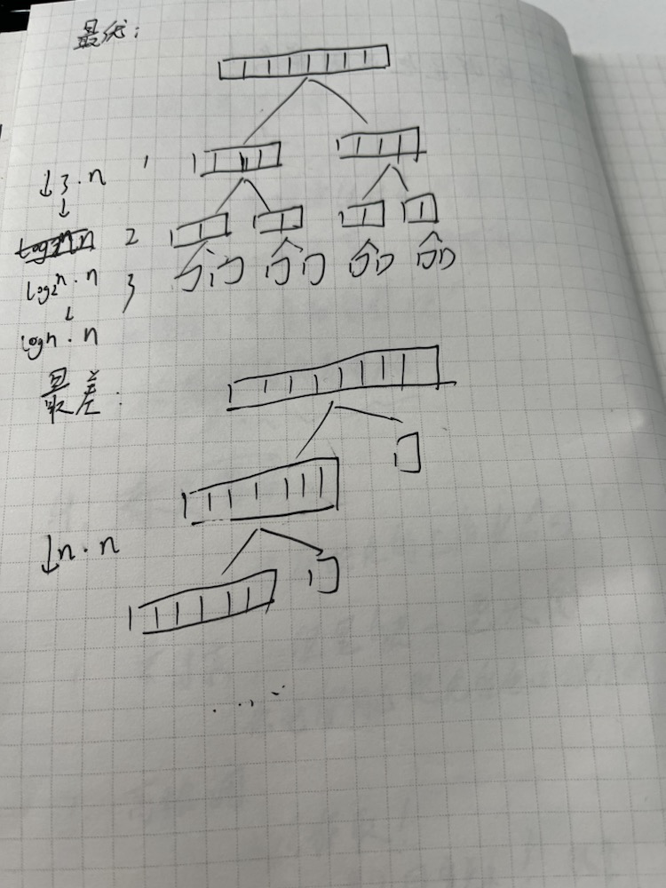

## 代码

[代码](<https://github.com/cyxofgithub/front-end-self-study/blob/master/06_%E6%95%B0%E6%8D%AE%E7%BB%93%E6%9E%84%E4%B8%8E%E7%AE%97%E6%B3%95/%E5%B7%A6%E7%A8%8B%E4%BA%91%E7%AE%97%E6%B3%95%E8%AF%BE/02%E8%AE%A4%E8%AF%86O(NlogN)%20%E6%8E%92%E5%BA%8F/06.%E5%BF%AB%E9%80%9F%E6%8E%92%E5%BA%8F.js>)

## 什么时候最糟糕、最优？

最优情况：
当快速排序的划分过程能够将待排序数组均匀地分成两部分时，快速排序的性能最优。具体来说，最优情况发生在每次划分时，都能够选择一个理想的基准元素，使得划分后的两个子数组的大小基本相等。这样，快速排序的递归深度较小，每次划分的时间复杂度为 O(n)，整个排序过程的时间复杂度为 O(nlogn)。

最糟糕情况：
当快速排序的划分过程无法将待排序数组均匀地分成两部分时，快速排序的性能最糟糕。具体来说，最糟糕情况发生在每次划分时，基准元素都选择为最大或最小的元素，或者待排序数组已经有序。这样，划分后的两个子数组的大小差距很大，快速排序的递归深度较大，每次划分的时间复杂度为 O(n)，整个排序过程的时间复杂度为 O(n^2)。

需要注意的是，最糟糕情况的发生是由于基准元素的选择不当或待排序数组的初始状态不理想所导致的。为了避免最糟糕情况的发生，可以采用一些优化策略，如随机选择基准元素、三数取中法选择基准元素等，以增加划分的均匀性，提高快速排序的性能。此外，当待排序数组的规模较小时，可以切换到其他排序算法，如插入排序，以减少递归深度和提高性能。

最优最好的情况如图所示：


## 获取第 k 小的数，如何优化算法？

```javascript
const arr = [2, 6, 4, 2, 3, 2, 1, 34, 1];

function quickSort(arr, left, right, k) {
    // 让数组分成两部分，左边的值比右边的值小
    const partition = (left, right, arr) => {
        let pivotIndex = Math.floor(left + Math.random() * (right - left + 1)); // 随机法避免o(n²)的时间复杂度

        swap(arr, pivotIndex, right); // 把随机数即基准值先放到最后的位置，然后比它小的数就可以很简单的放在它的前面
        let index = left;
        for (let i = index; i < right; i++) {
            if (arr[i] < arr[right]) {
                swap(arr, i, index); // 让值和基准值的未来位置交换，值都贴靠者中间值
                index++;
            }
        }
        swap(arr, index, right); // 基准值当前位置和交换过的最后一个数位置交换就是它应该有的位置
        return index;
    };

    if (left < right) {
        const pivotIndex = partition(left, right, arr);
        if (pivotIndex === k - 1) {
            return arr[pivotIndex];
        } else if (pivotIndex < k - 1) {
            return quickSort(arr, pivotIndex + 1, right, k);
        } else {
            return quickSort(arr, left, pivotIndex - 1, k);
        }
    }

    return arr[k - 1];
}

function swap(arr, i, j) {
    var temp = arr[i];
    arr[i] = arr[j];
    arr[j] = temp;
}

console.log(quickSort(arr, 0, arr.length - 1, 9));
```
