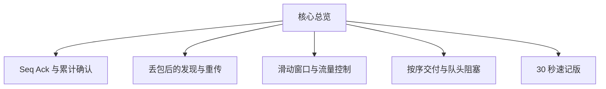
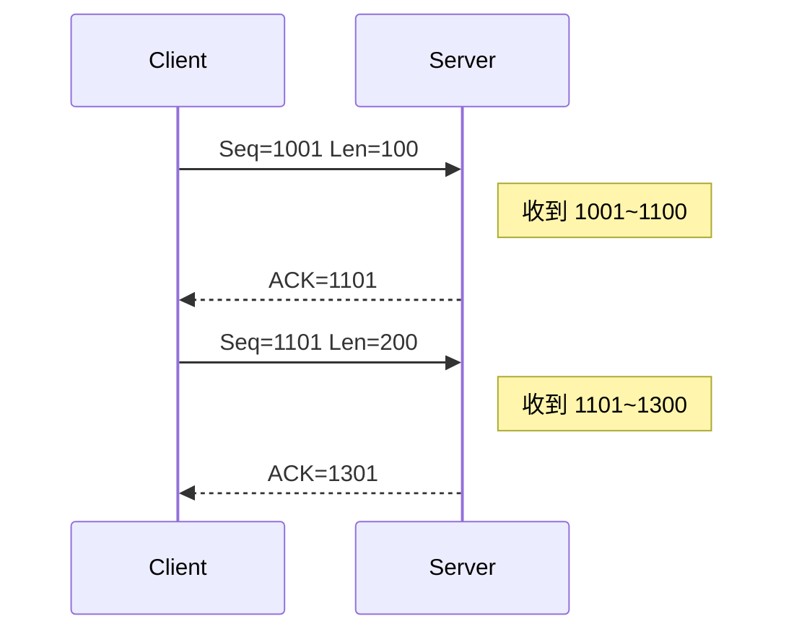
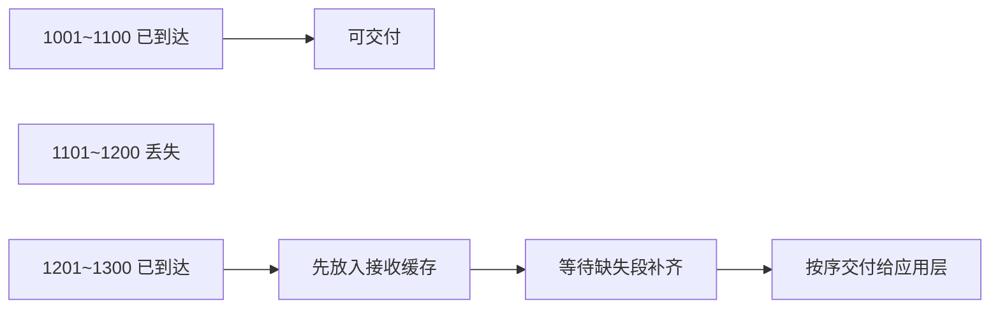

## TCP 可靠性原理

一句话结论：TCP 的可靠性本质上是“字节编号 + 确认应答 + 校验和 + 重传机制 + 窗口控制 + 按序交付”。



### 1. 核心总览

| 机制 | 作用 | 关键报文细节 |
| --- | --- | --- |
| 序列号 | 给数据按字节编号 | `Sequence Number` |
| 确认应答 | 告诉对方已收到哪里 | `Acknowledgment Number`、`ACK` |
| 校验和 | 发现报文是否损坏 | `Checksum` |
| 重传机制 | 丢了就补发 | 超时重传、快速重传、`SACK` |
| 滑动窗口 | 控制发送速度 | `Window Size`、`rwnd`、`cwnd` |
| 按序交付 | 保证上层看到连续字节流 | 乱序缓存、累计确认 |

和可靠性最相关的 TCP 首部字段只需要记这几个：

| 字段 | 记忆点 |
| --- | --- |
| `Sequence Number` | 当前报文段第一个字节的序号 |
| `Acknowledgment Number` | 下一个期望收到的字节序号 |
| `Flags` | `SYN/ACK/FIN/RST` 等控制语义 |
| `Window Size` | 接收方当前还能接多少数据 |
| `Checksum` | 首部和数据是否损坏 |
| `Options` | 常见是 `MSS`、`Window Scale`、`SACK`、`Timestamp` |

### 2. Seq、Ack 和累计确认

一句话结论：`Seq` 说的是“我这次从哪个字节开始发”，`Ack` 说的是“我下一个想收哪个字节”。



最小示例：

| 报文 | 含义 |
| --- | --- |
| `Seq=1001 Len=100` | 本次发送 `1001~1100` |
| `Ack=1101` | 说明 `1001~1100` 已连续收到，下一个要 `1101` |
| `Ack=1301` | 说明 `1~1300` 这段都已经连续收到 |

核心点只记两句：

- TCP 是按字节编号，不是按报文编号。
- TCP 默认是累计确认，所以 `Ack` 确认的是“连续区间之后的下一个字节”。

### 3. 丢包后 TCP 怎么发现并修复

一句话结论：TCP 发现丢包主要靠两种信号，没等到确认就超时重传，连续收到重复 ACK 就快速重传；`SACK` 则让重传更精准。

#### 超时重传

- 发送方发出数据后，会等待 ACK。
- 如果在 `RTO` 内没等到，就认为这段可能丢了，重新发送。
- 这种方式稳，但慢，因为必须先等超时。

#### 快速重传

- 如果接收方一直回同一个 `Ack`，说明前面有缺口。
- 发送方连续收到 3 次重复 ACK，通常就会立即重传缺失段。
- 这比等超时更快。

#### `SACK` 为什么更高效

结合真实报文最容易理解。假设发送方连续发了 4 段：

| 报文 | 内容 |
| --- | --- |
| 包1 | `Seq=1001 Len=100`，覆盖 `1001~1100` |
| 包2 | `Seq=1101 Len=100`，覆盖 `1101~1200` |
| 包3 | `Seq=1201 Len=100`，覆盖 `1201~1300` |
| 包4 | `Seq=1301 Len=100`，覆盖 `1301~1400` |

现在包2 丢了，但包3、包4 到了。

不带 `SACK` 时，接收方只能反复回：

```text
ACK=1101
```

这只说明“按序只收到 `1100`”，发送方并不知道 `1201~1400` 是否已经到达。

带 `SACK` 时，确认报文可以近似理解成：

```text
ACK=1101
SACK=[1201-1301][1301-1401]
```

这表示：

- 连续区间只到 `1100`
- 但 `1201~1400` 其实已经收到，只是还不能按序交付

所以发送方就能只重传真正缺失的：

```text
Seq=1101 Len=100
```

对比记忆：

| 场景 | 发送方知道什么 | 发送方怎么做 |
| --- | --- | --- |
| 无 `SACK` | 只知道连续确认停在 `1101` | 先补缺口，后续块是否已到并不清楚 |
| 有 `SACK` | 还知道后续哪些乱序块已经到了 | 只重传真正缺失的数据 |

### 4. 滑动窗口与流量控制

一句话结论：即使不丢包，发送方也不能无限发，因为接收方缓存有限，窗口字段会告诉发送方“你还能再发多少”。

| 字段 | 值 | 含义 |
| --- | --- | --- |
| `Ack` | `5001` | 对方下一个想收 `5001` |
| `Window` | `300` | 对方当前还能接收 300 字节 |
| 可发送范围 | `5001~5300` | 超过这段先别发 |

只记两点：

- `rwnd` 是接收窗口，体现接收方处理能力。
- 实际发送量通常受 `min(rwnd, cwnd)` 限制，`cwnd` 体现网络拥塞情况。

### 5. 按序交付与 TCP 队头阻塞

一句话结论：TCP 承诺的是“可靠且按序”的字节流，所以后到的数据即使先到了，也只能先缓存，不能跳过缺口直接交给应用层。



最小示例：

- 已收到：`1001~1100`
- 丢失：`1101~1200`
- 后到：`1201~1300`

这时接收方会先回 `ACK=1101`，把 `1201~1300` 缓存起来，等缺失段补齐后再统一交给应用层。

这也是 HTTP/2 仍然会受到 TCP 队头阻塞影响的原因。HTTP/2 虽然能把多个流的帧交错发送，但底层仍然共用同一个 TCP 字节流。只要这个字节流中间缺了一段，后面的所有帧都得等缺口补齐后才能按序交付。

### 6. 高频易错点

| 易错点 | 正确理解 |
| --- | --- |
| `ACK=1` vs `Ack=1001` | 前者是控制位，后者是确认号具体值 |
| `SYN/FIN` 为什么也消耗序号 | 因为它们也是需要确认的控制信息 |
| TCP 为什么是面向字节流 | 应用层看到的是连续字节，不会感知第几个 TCP 包 |

### 7. 30 秒速记版

速记结论：

- TCP 可靠性的核心是：`Seq` 编号、`Ack` 确认、`Checksum` 校验、重传修复丢包、窗口控制发送速度、乱序缓存后按序交付。
- `Ack` 确认的是“下一个期望字节”，所以 TCP 默认是累计确认。
- 丢包后有两种典型恢复方式：等超时重传，或靠 3 次重复 ACK 触发快速重传。
- `SACK` 不改变累计确认规则，只是额外告诉发送方“后面哪些乱序块已经到了”，从而减少无效重传。
- HTTP/2 的多路复用解决的是帧并发，不是 TCP 的按序交付，所以底层仍然会有 TCP 队头阻塞。

面试口述版：

> TCP 的可靠性本质上是“字节编号 + 确认应答 + 校验和 + 重传机制 + 窗口控制 + 按序交付”。发送方通过 `Seq` 给字节编号，接收方通过 `Ack` 告诉发送进度；如果报文丢失，可以通过超时重传或快速重传恢复，`SACK` 还能进一步告诉发送方后面哪些乱序块已经到达，从而减少无效重传。同时 TCP 还用滑动窗口控制发送节奏，并要求数据必须按序交付给应用层，所以它最终实现的是可靠、有序、面向字节流的传输。
