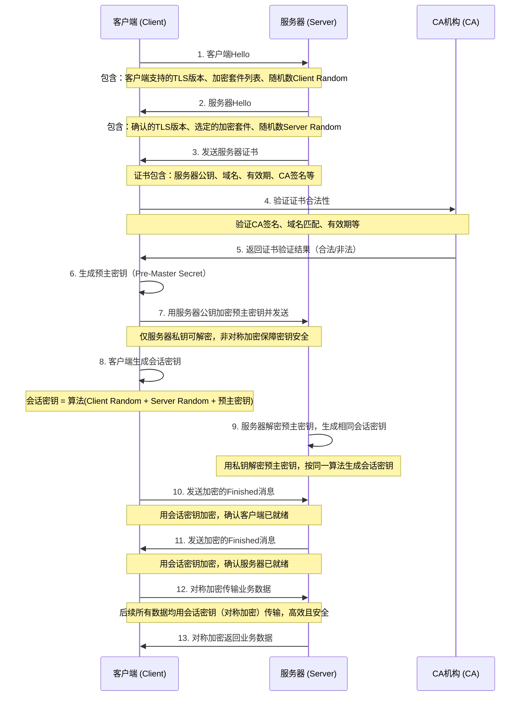

## HTTPS

其实 HTTPS 就是披着 SSL 外壳的 HTTP，在采用了 SSL 后，HTTP 就拥有了加密、证书和完整性保护这些功能。

**怎么加密？**

使用对称和非对称加密结合的方式。为什么？

-   对称密钥密码算法处理迅速，但是需要共享密钥，这往往需要耗费巨大的代价
-   公开密钥无需共享密钥，但是算法处理速度慢

所以就采用非对称加密去共享密钥，后续就采用对称加密的方式。

**完整保护**

在现代密码学中有一个叫散列函数的，也就是哈希函数，它可以将内容转换成一系列的 hash，如果内容发生了变化它的 hash 也会变，利用它我们就可以完成完整性保护。

**CA 证书有什么用？**

它主要是为了确保服务器公钥的合法性，因为公钥很有可能通过第三方伪造。CA 机构会用自己的私钥在证书上完成数字签名，用户通过它的公钥能成功解密就说明这个证书是它所颁发的，因为私钥是它独有的。

### https 加密过程



**流程关键步骤解释**

1. 客户端 / 服务器 Hello：双方先交换基础信息（支持的加密规则、随机数），为后续协商做准备，这一步是明文传输，无安全风险。
2. 证书验证：核心是客户端确认服务器身份，避免 “中间人攻击”——CA 是可信第三方，只有它签名的证书才被认可，确保客户端连接的是真实服务器。
3. 预主密钥协商：客户端生成的预主密钥用服务器公钥加密后发送，只有服务器能用私钥解密，这一步用非对称加密保障密钥本身的安全。
4. 会话密钥生成：客户端和服务器基于 Client Random、Server Random、预主密钥，用同一算法生成完全相同的对称加密会话密钥（非对称加密效率低，仅用于协商密钥）。
5. 对称加密传输：握手完成后，所有业务数据都用会话密钥做对称加密，兼顾安全性和传输效率。

**总结**

1. HTTPS 加密分两大阶段：先用非对称加密完成身份验证和密钥协商，再用对称加密传输实际数据。
2. 证书是防中间人攻击的核心，CA 签名确保服务器身份真实，预主密钥的非对称加密确保密钥不泄露。
3. 会话密钥是双方共享的对称密钥，既保证加密强度，又解决了非对称加密效率低的问题，是 HTTPS 高效安全的关键

### 部署

将服务请求从 HTTP 转变为 HTTPS 是一个重要的安全措施，可以确保数据在传输过程中被加密，防止被窃听和篡改。以下是将服务请求转变为 HTTPS 的步骤和示例代码：

#### 步骤

1. **获取 SSL/TLS 证书**：

    - 你需要从受信任的证书颁发机构（CA）获取一个 SSL/TLS 证书。常见的 CA 包括 Let's Encrypt、DigiCert、GlobalSign 等。
    - 你也可以使用自签名证书进行测试，但自签名证书不会被浏览器信任。

2. **配置服务器**：

    - 将获取到的证书和私钥配置到你的服务器上。不同的服务器有不同的配置方法，以下是一些常见服务器的配置示例。

3. **重定向 HTTP 到 HTTPS**：
    - 配置服务器将所有的 HTTP 请求重定向到 HTTPS，以确保所有流量都通过安全的 HTTPS 传输。

#### 示例代码

以下是一些常见服务器的 HTTPS 配置示例：

##### Node.js (使用 Express)

如果你使用 Node.js 和 Express 框架，可以按照以下步骤配置 HTTPS：

1. **安装 `https` 模块**：

    - `https` 模块是 Node.js 内置模块，无需额外安装。

2. **创建 HTTPS 服务器**：

```javascript
const fs = require('fs');
const https = require('https');
const express = require('express');

const app = express();

// 读取 SSL/TLS 证书和私钥
const options = {
    key: fs.readFileSync('path/to/your/private.key'),
    cert: fs.readFileSync('path/to/your/certificate.crt'),
};

// 配置中间件和路由
app.get('/', (req, res) => {
    res.send('Hello, HTTPS!');
});

// 创建 HTTPS 服务器
https.createServer(options, app).listen(443, () => {
    console.log('HTTPS server is running on port 443');
});

// 可选：重定向 HTTP 到 HTTPS
const http = require('http');
http.createServer((req, res) => {
    res.writeHead(301, { Location: 'https://' + req.headers['host'] + req.url });
    res.end();
}).listen(80);
```

##### Nginx

如果你使用 Nginx 作为反向代理服务器，可以按照以下步骤配置 HTTPS：

1. **安装 Nginx**：

    - 在大多数 Linux 发行版上，可以使用包管理器安装 Nginx，例如 `apt-get` 或 `yum`。

2. **配置 Nginx**：

```nginx
server {
    listen 80;
    server_name yourdomain.com;
    return 301 https://$host$request_uri;  # 重定向 HTTP 到 HTTPS
}

server {
    listen 443 ssl;
    server_name yourdomain.com;

    ssl_certificate /path/to/your/certificate.crt;
    ssl_certificate_key /path/to/your/private.key;

    location / {
        proxy_pass http://localhost:3000;  # 代理到你的应用服务器
        proxy_set_header Host $host;
        proxy_set_header X-Real-IP $remote_addr;
        proxy_set_header X-Forwarded-For $proxy_add_x_forwarded_for;
        proxy_set_header X-Forwarded-Proto $scheme;
    }
}
```

#### 总结

将服务请求从 HTTP 转变为 HTTPS 需要获取 SSL/TLS 证书，并将其配置到你的服务器上。不同的服务器有不同的配置方法，但基本步骤都是相似的：获取证书、配置服务器、重定向 HTTP 到 HTTPS。

通过上述步骤，你可以确保你的服务请求通过 HTTPS 进行安全传输。如果你有任何进一步的问题或需要更多示例，欢迎随时提问！😊
