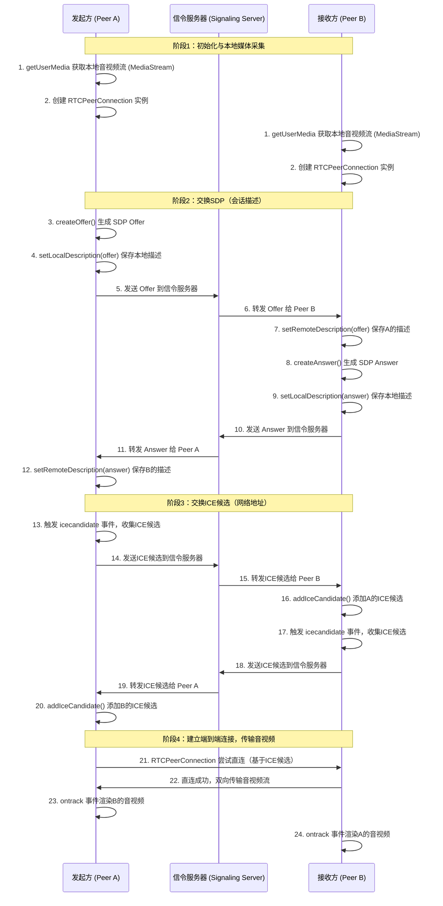
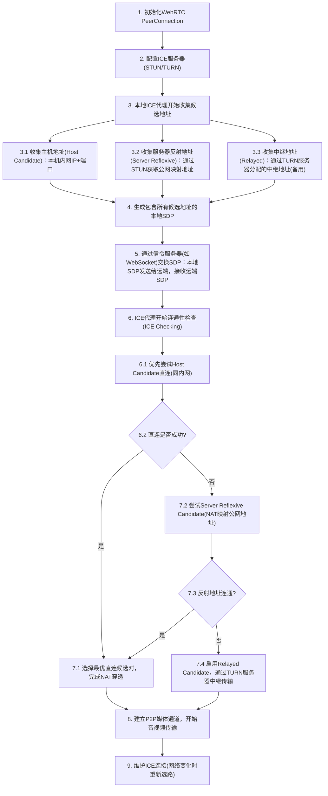
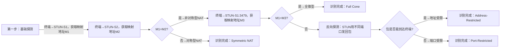

## WebRTC 核心原理（面试高频）

### 整体流程

### 各个流程的作用

| 阶段序号 | 阶段名称                  | 核心目标                                                               | 解决的核心问题       | 关键操作/API                                                                                                                                          | 涉及核心组件/服务                                         | 阶段核心价值                                                                                    |
| -------- | ------------------------- | ---------------------------------------------------------------------- | -------------------- | ----------------------------------------------------------------------------------------------------------------------------------------------------- | --------------------------------------------------------- | ----------------------------------------------------------------------------------------------- |
| 1        | 初始化与本地媒体采集      | 准备本地音视频数据源，创建端到端连接的核心处理载体，为后续连接打基础   | 有什么可传、用什么传 | 1. `getUserMedia` 获取 MediaStream 2. 创建 RTCPeerConnection 实例（配置 STUN/TURN） 3. `addTrack` 将媒体流添加到连接实例                        | MediaStream、RTCPeerConnection、STUN/TURN 服务器          | 完成通话的基础资源准备，确定音视频数据源和全流程的传输处理总控中心                              |
| 2        | 交换 SDP（会话描述）      | 让通话双方交换媒体能力配置，达成**通信格式共识**                       | 按什么格式传         | 发起方：`createOffer`、`setLocalDescription` 接收方：`setRemoteDescription`、`createAnswer`、`setLocalDescription` 双方：通过信令服务器转发 SDP | RTCPeerConnection、信令服务器、SDP 协议                   | 统一音视频编码/传输标准，避免“格式不兼容导致数据无法解码”，实现通信的“语言共识”                 |
| 3        | 交换 ICE 候选（网络地址） | 让双方获取彼此可用网络地址，完成 NAT 穿透，找到最优端到端连接路径      | 往哪个地址传         | 1. 触发`icecandidate`事件收集 ICE 候选 2. 信令服务器转发 ICE 候选 3. `addIceCandidate` 添加对方候选地址                                         | RTCPeerConnection、信令服务器、ICE 协议、STUN/TURN 服务器 | 解决内网 NAT 遮挡问题，获取彼此“可达网络门牌号”，为端到端直连提供地址基础，优先直连、失败则中继 |
| 4        | 建立端到端连接+音视频传输 | 完成最终连接建立，实现音视频数据**双向实时端到端传输**，渲染远端音视频 | 怎么实时传音视频     | 1. RTCPeerConnection 自动尝试 ICE 候选地址配对直连 2. 触发`ontrack`事件获取远端流 3. 绑定流到 video/audio 标签渲染                              | RTCPeerConnection、RTCDataChannel（可选，传非音视频数据） | 落地真正的实时音视频通话，前三个阶段的所有准备工作最终服务于该阶段；支持拓展非音视频数据传输    |

### candidate 收集流程

**候选地址收集：**

-   Host Candidate：本机内网 IP + 端口（优先尝试，同内网可直连）；
-   Server Reflexive：STUN 服务器返回的 NAT 公网映射地址（跨 NAT 时尝试）；
-   Relayed：TURN 服务器分配的中继地址（前两种失败时兜底）

### stun 识别 nat 类型机制

### 不同 NAT 类型的差异

| **NAT 类型**                       | 核心映射规则（内网 → 公网）                              | 核心过滤规则（公网 → 内网）                                        | STUN 地址提取 | 映射地址复用性 | WebRTC STUN 穿透可行性 | 适用场景            | 关键特点                      |
| ---------------------------------- | -------------------------------------------------------- | ------------------------------------------------------------------ | ------------- | -------------- | ---------------------- | ------------------- | ----------------------------- |
| 全锥型（Full Cone）                | 访问**任意公网目标**，复用**同一个固定公网映射端口**     | 任意公网 IP:端口向映射端口发包，均转发至内网终端                   | ✅ 有效       | ✅ 永久复用    | ✅ 完全可行            | 早期路由器/小众场景 | 最宽松，穿透无任何限制        |
| 地址受限锥型（Address-Restricted） | 访问**任意公网目标**，复用**同一个固定公网映射端口**     | 仅**终端曾访问过的公网 IP**（不限端口）发包，才转发至内网终端      | ✅ 有效       | ✅ 永久复用    | ✅ 可行（需先建联）    | 部分企业路由器      | 仅限制 IP，端口无约束         |
| 端口受限锥型（Port-Restricted）    | 访问**任意公网目标**，复用**同一个固定公网映射端口**     | 仅**终端曾访问过的公网 IP:端口**发包，才转发至内网终端             | ✅ 有效       | ✅ 永久复用    | ✅ 可行（需先建联）    | **家用路由器主流**  | IP+端口双限制，最常见         |
| 对称型（Symmetric）                | 访问**不同公网 IP:端口**，分配**不同的专属公网映射端口** | 仅**终端曾访问过的公网 IP:端口**，向**对应专属映射端口**发包才转发 | ✅ 有效       | ❌ 无复用性    | ❌ 完全不可行          | **运营商/企业主流** | 最严格，STUN 仅能识别无法穿透 |
