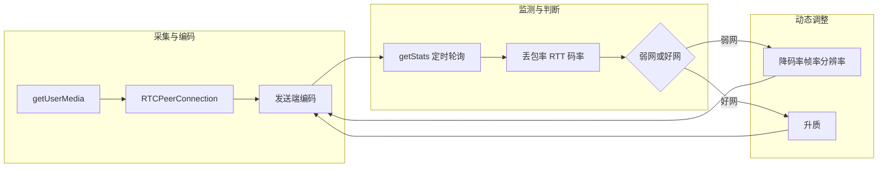
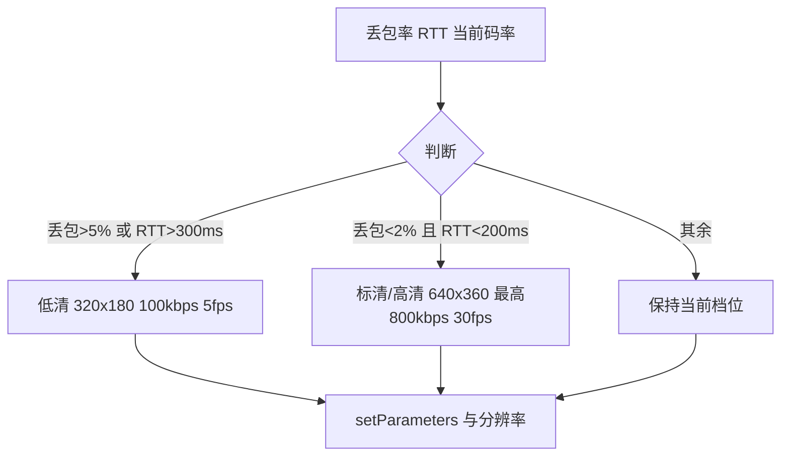
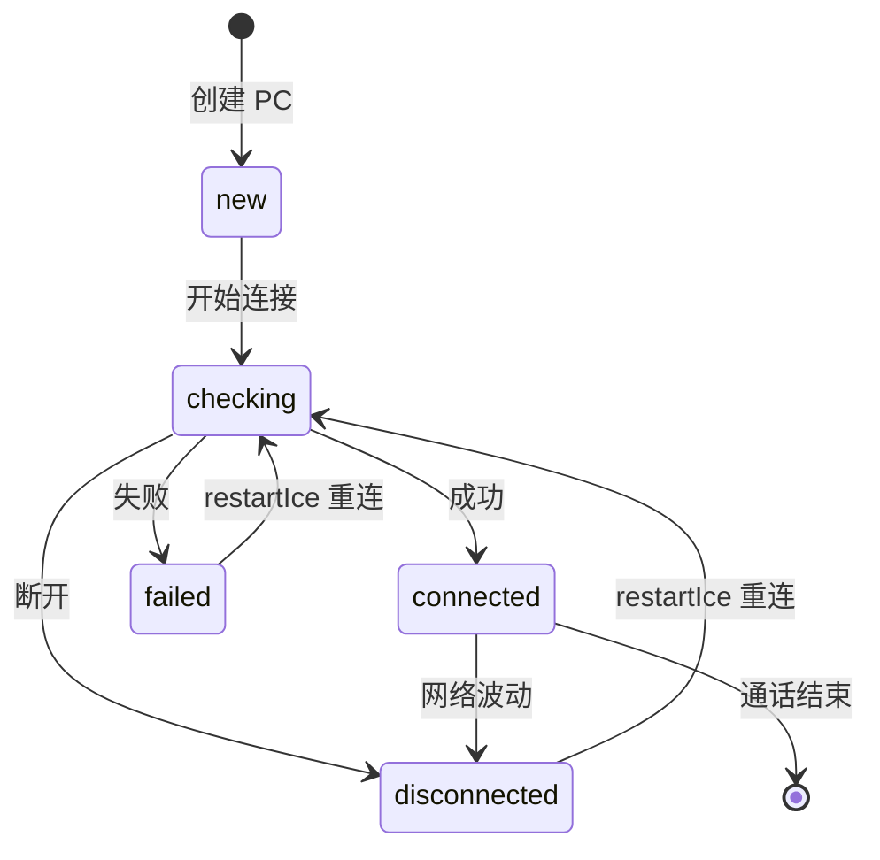
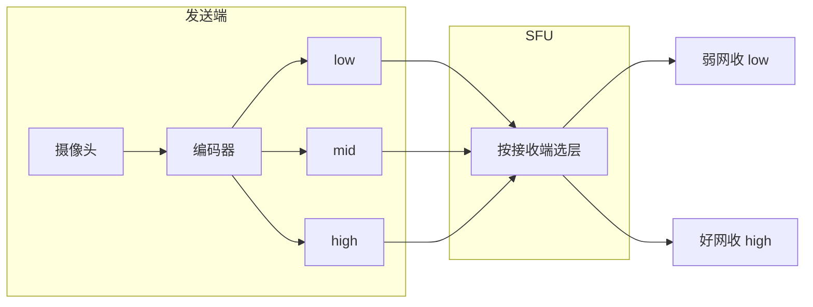
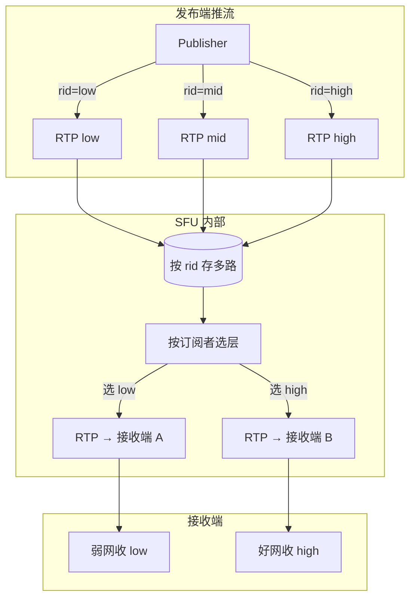

## 一、基础：媒体流参数精细化配置（从源头控质量）

前端可在初始化音视频轨道时，优先配置适配实时场景的参数，避免「大码率/高帧率」导致弱网卡顿，同时开启音频增强能力。

### 核心目标

-   音频优先：保证通话可听性，开启回声消除、噪声抑制等增强能力
-   视频适配：初始码率/帧率/分辨率适配通用场景，避免资源浪费

### 代码实现

```javascript
// 1. 获取音视频轨道（核心入口）
async function getMediaStream() {
    try {
        // 音频配置：开启WebRTC内置的质量增强能力
        const constraints = {
            audio: {
                echoCancellation: true,
                noiseSuppression: true,
                autoGainControl: true,
                sampleRate: 48000,
                channelCount: 1,
            },
            video: {
                width: { ideal: 640, max: 1280 },
                height: { ideal: 360, max: 720 },
                frameRate: { ideal: 15, max: 30 },
            },
        };

        const stream = await navigator.mediaDevices.getUserMedia(constraints);
        return stream;
    } catch (err) {
        console.error('获取媒体流失败：', err);
        throw err;
    }
}

// 2. RTCPeerConnection 初始化：配置编码与传输参数
function createPeerConnection(config) {
    const pc = new RTCPeerConnection(config);

    // 配置视频编码参数（优先H.264/VP8，适配兼容性与带宽）
    pc.addTransceiver('video', {
        direction: 'sendrecv',
        sendEncodings: [
            {
                maxBitrate: 500000, // 初始最大码率
                maxFramerate: 15,
                rid: 'low', // 分层标识（用于Simulcast）
            },
        ],
    });

    // 配置音频编码（优先OPUS，WebRTC默认最优）
    pc.addTransceiver('audio', {
        direction: 'sendrecv',
        sendEncodings: [{ maxBitrate: 32000 }], // 音频码率32kbps（足够清晰）
    });

    return pc;
}
```

**要点**：AEC/ANS/AGC 开启；video 用 ideal/max 控分辨率与帧率；addTransceiver 控码率上限。

## 二、核心：网络状态监测 & 动态适配（弱网自适应）

通过 getStats 定时取丢包/RTT/码率，按阈值判断弱网或好网，用 setParameters 与分辨率调整实现闭环。



**阈值小结**：弱网 丢包>5% 或 RTT>300ms → 降质；好网 丢包<2% 且 RTT<200ms → 升质；极端 丢包>10% 或 RTT>500ms → 见第四节关视频保音频。

| 场景     | 条件                  | 动作                |
| -------- | --------------------- | ------------------- |
| 弱网     | 丢包>5% 或 RTT>300ms  | 降码率/帧率/分辨率  |
| 好网     | 丢包<2% 且 RTT<200ms  | 升质                |
| 极端弱网 | 丢包>10% 或 RTT>500ms | 提示 + 关视频保音频 |



企业级注意：getStats 的 packetLossRatio/bitrate 部分浏览器无，需用 packetsLost/packetsSent 与两次 bytesSent 差值做兼容计算（Chrome/Edge 较好，Safari/Firefox 需兼容）。

### 代码实现

```javascript
// 1. 实时监听RTCP统计信息（丢包、RTT、码率）
function monitorNetworkQuality(pc, videoElement) {
    // 每2秒检测一次网络状态
    const monitorInterval = setInterval(async () => {
        try {
            // 获取RTCP统计数据（浏览器原生API）
            const stats = await pc.getStats();
            let outboundStats = null;
            let transportStats = null;

            // 遍历统计项，筛选关键指标
            stats.forEach((stat) => {
                // 视频发送流统计（丢包、码率）
                if (stat.type === 'outbound-rtp' && stat.kind === 'video') {
                    outboundStats = stat;
                }
                // 传输层统计（RTT、总丢包）
                if (stat.type === 'transport') {
                    transportStats = stat;
                }
            });

            if (!outboundStats || !transportStats) return;

            // 提取核心指标（兼容：部分浏览器无 packetLossRatio/bitrate，用 packetsLost/packetsSent、两次 bytesSent 差值估算）
            const packetsSent = outboundStats.packetsSent ?? 0;
            const packetsLost = outboundStats.packetsLost ?? 0;
            const packetLossRate = packetsSent > 0 ? packetsLost / packetsSent : outboundStats.packetLossRatio ?? 0;
            const rtt = transportStats.roundTripTime ?? 0;
            let currentBitrate = outboundStats.bitrate ?? 0;
            if (!currentBitrate && outboundStats.bytesSent != null) {
                // 无 bitrate 时需结合上次 bytesSent 与时间差估算，此处简化
                currentBitrate = 0;
            }

            console.log('网络质量：', {
                丢包率: (packetLossRate * 100).toFixed(2) + '%',
                RTT: (rtt * 1000).toFixed(0) + 'ms',
                当前码率: (currentBitrate / 1000).toFixed(0) + 'kbps',
            });

            adjustVideoQuality(pc, packetLossRate, rtt, currentBitrate);
        } catch (err) {
            console.error('监测网络质量失败：', err);
        }
    }, 2000);

    // 停止监测的方法
    return () => clearInterval(monitorInterval);
}

// 2. 动态调整视频码率/帧率/分辨率
function adjustVideoQuality(pc, packetLossRate, rtt, currentBitrate) {
    const senders = pc.getSenders();
    const videoSender = senders.find((sender) => sender.track?.kind === 'video');

    if (!videoSender) return;

    // 弱网阈值：丢包>5% 或 RTT>300ms → 降质
    const isWeakNetwork = packetLossRate > 0.05 || rtt > 0.3;
    // 网络恢复阈值：丢包<2% 且 RTT<200ms → 升质
    const isGoodNetwork = packetLossRate < 0.02 && rtt < 0.2;

    const params = videoSender.getParameters();
    const encoding = params.encodings[0];

    if (isWeakNetwork) {
        encoding.maxBitrate = Math.max(100000, currentBitrate - 100000);
        encoding.maxFramerate = Math.max(5, encoding.maxFramerate - 5);
        updateVideoTrackResolution(pc, videoSender.track, 320, 180);
        console.log('弱网降质：', encoding.maxBitrate / 1000, 'kbps,', encoding.maxFramerate, 'fps');
    } else if (isGoodNetwork && currentBitrate < 800000) {
        encoding.maxBitrate = Math.min(800000, currentBitrate + 100000);
        encoding.maxFramerate = Math.min(30, encoding.maxFramerate + 5);
        updateVideoTrackResolution(pc, videoSender.track, 640, 360);
        console.log('网络恢复升质：', encoding.maxBitrate / 1000, 'kbps,', encoding.maxFramerate, 'fps');
    }

    videoSender.setParameters(params).catch((err) => {
        console.error('调整视频参数失败：', err);
    });
}

// 更新视频轨道分辨率（需传入 pc，因 track 上无 peerConnections 引用）
function updateVideoTrackResolution(pc, track, width, height) {
    if (!track || !pc) return;
    const sender = pc.getSenders().find((s) => s.track === track);
    if (!sender) return;
    track.stop();
    navigator.mediaDevices.getUserMedia({ video: { width, height, frameRate: { ideal: 15 } } }).then((newStream) => {
        const newTrack = newStream.getVideoTracks()[0];
        sender.replaceTrack(newTrack);
    });
}
```

**要点**：getStats 取丢包率、RTT、码率；按阈值判断调档位；setParameters 实时生效、无需重建连接。

## 三、连接稳定性：ICE 状态监控 & 重连机制

监听 ICE 状态，在 failed/disconnected 且未达重连上限时调用 restartIce 重连。



### 代码实现

```javascript
// 监听ICE连接状态 + 自动重连
function monitorICEStatus(pc, restartCallback) {
    let reconnectAttempts = 0;
    const MAX_RECONNECT = 3; // 最大重连次数

    pc.addEventListener('iceconnectionstatechange', () => {
        const state = pc.iceConnectionState;
        console.log('ICE状态：', state);

        // 连接失败/断开 → 触发重连
        if (['failed', 'disconnected'].includes(state) && reconnectAttempts < MAX_RECONNECT) {
            reconnectAttempts++;
            console.log(`开始第${reconnectAttempts}次重连...`);
            // 重启ICE（核心重连手段）
            pc.restartIce()
                .then(restartCallback)
                .catch((err) => {
                    console.error('重连失败：', err);
                });
        } else if (state === 'connected') {
            // 连接成功，重置重连次数
            reconnectAttempts = 0;
            console.log('ICE连接成功');
        }
    });

    // 监听ICE候选收集完成（确保连接完整性）
    pc.addEventListener('icegatheringstatechange', () => {
        if (pc.iceGatheringState === 'complete') {
            console.log('ICE候选收集完成');
        }
    });
}
```

**要点**：监听 iceconnectionstatechange；restartIce 重连并限制次数，无需重建 PeerConnection。

## 四、体验优化：弱网提示 & 音频优先策略

极端弱网（丢包>10% 或 RTT>500ms）时展示提示并关闭视频轨道、仅保留音频；恢复后可根据是否用户手动关过视频再恢复。

### 代码实现

```javascript
// 弱网提示 + 音频优先策略
function handleWeakNetworkUI(packetLossRate, rtt, videoElement) {
    const weakNetworkTip = document.getElementById('weak-network-tip');
    const videoToggleBtn = document.getElementById('video-toggle-btn');

    // 极端弱网：丢包>10% 或 RTT>500ms → 提示+自动关视频
    const isExtremeWeak = packetLossRate > 0.1 || rtt > 0.5;

    if (isExtremeWeak) {
        weakNetworkTip.style.display = 'block';
        weakNetworkTip.innerText = '当前网络较差，已自动关闭视频，仅保留语音';
        // 关闭视频轨道，保留音频
        if (videoElement.srcObject) {
            const videoTracks = videoElement.srcObject.getVideoTracks();
            videoTracks.forEach((track) => (track.enabled = false));
        }
        videoToggleBtn.disabled = true;
    } else {
        weakNetworkTip.style.display = 'none';
        videoToggleBtn.disabled = false;
        // 恢复视频（如果用户未手动关闭）
        if (videoElement.srcObject && !videoToggleBtn.dataset.manualClosed) {
            const videoTracks = videoElement.srcObject.getVideoTracks();
            videoTracks.forEach((track) => (track.enabled = true));
        }
    }
}
```

**要点**：弱网提示 + 用 track.enabled 关视频保音频，可快速恢复。

## 五、进阶：Simulcast 分层发送（前端配置）

### 什么是 SFU

**SFU**（Selective Forwarding Unit，选择性转发单元）是多人实时音视频里常用的**服务端架构**之一。

-   **做什么**：服务端只做「转发」，不解码、不混流。每个参与者把音视频流推给 SFU，SFU 再按需把各路流转给其他参与者。
-   **和 MCU 的区别**：MCU（Multipoint Control Unit）会在服务端解码、混流再编码，延迟和服务器压力都更大；SFU 不编解码，延迟低、扩展性好，但每人要收多路流，端侧解码压力会大一些。
-   **在本节中的作用**：发送端用 Simulcast 推低/中/高三层，SFU 根据**每个接收端**的网络状况，只转发其中一层（或子集），实现「一人推多档，每人收一档」，弱网收低层、好网收高层。

前端发低/中/高三层流，SFU 按接收端网络选层转发，提升弱网抗性。



**发送端弱网时怎么办？**  
上图是「发送端上行正常」的典型用法。若**发送端**上行差，再发三层会占满甚至拖垮上行，所以需要**发送端侧自适应**：

-   **按上行带宽减层**：用 `getStats` / 带宽估计（如 GCC）得到本端上行能力，上行不足时只开 1 ～ 2 层（例如只发 low，或 low+mid），而不是固定三层。
-   **或降每层码率**：保持层数但把各层 `maxBitrate`/`maxFramerate` 调低，使总码率不超过上行。
-   这样 SFU 仍然可以按接收端选层，只是可选范围受发送端实际上行限制。

### SFU 如何按接收端选层

发送端用 **rid**（如 `low` / `mid` / `high`）把同一路视频拆成多路 RTP 流推到 SFU，SFU 对**每个订阅者**单独选一层再转发，实现「同一发布流，每人收到不同档位」。

**常见两种做法：**

1. **接收端主动要层**：前端根据本端 `getStats` 估出带宽或弱网程度，通过信令告诉 SFU「给我 low / mid / high」；SFU 只把对应 rid 的 RTP 转给该接收端。
2. **SFU 根据下行质量自适应**：SFU 把某层转给接收端后，通过该路连接的 RTCP（丢包、抖动等）判断下行是否撑得住，自动在 low/mid/high 之间切换。

下面用一张「SFU 内部选层」示意图 + 一段服务端伪代码说明「按订阅者选层转发」的逻辑。



**服务端选层与转发（伪代码）**：按「订阅者带宽或偏好」决定转发哪一层，只转发该层 RTP。

```javascript
// ========== 服务端（Node 伪代码，仅表达逻辑）==========
// 假设 SFU 已收到发布流，按 rid 拆成多路 RTP 源
const layerByRid = new Map([
    ['low', rtpStreamLow],
    ['mid', rtpStreamMid],
    ['high', rtpStreamHigh],
]);

// 每个订阅者：当前选中的层 + 可选依据（带宽或信令）
const subscriberLayer = new Map(); // subscriberId -> 'low' | 'mid' | 'high'

function setSubscriberLayer(subscriberId, layer) {
    const rid = layer; // 'low' | 'mid' | 'high'
    if (!layerByRid.has(rid)) return;
    subscriberLayer.set(subscriberId, rid);
}

// 转发：只把该订阅者选中层的数据发给对应下行
function forwardToSubscriber(subscriberId, rtpPacket) {
    const rid = rtpPacket.getRid(); // 从 RTP 扩展或 Simulcast 约定取 rid
    const chosen = subscriberLayer.get(subscriberId);
    if (chosen && rid === chosen) {
        sendTo(subscriberId, rtpPacket); // 只转发这一层
    }
}
```

**前端：通过信令请求/切换层**（接收端主动要层时用）。

```javascript
// 前端：根据本端网络选层，通过信令通知 SFU
async function requestLayer(layer) {
    // layer: 'low' | 'mid' | 'high'
    await signalingChannel.send({
        type: 'subscribe-layer',
        publisherId: currentPublisherId,
        layer,
    });
}

// 弱网时主动要低层
statsCollector.on('weak', () => requestLayer('low'));
statsCollector.on('recovered', () => requestLayer('high'));
```

**要点**：SFU 侧按 `rid` 区分层，对每个订阅者只转发其「选中层」的 RTP；选层依据可以是接收端信令，也可以是 SFU 根据 RTCP 的自适应。

### 代码实现

```javascript
// 配置Simulcast（发送低/中/高三层流）
function configureSimulcast(pc) {
    const videoSender = pc.getSenders().find((sender) => sender.track?.kind === 'video');
    if (!videoSender) return;

    const params = videoSender.getParameters();
    // 配置三层编码：低（100kbps）、中（300kbps）、高（600kbps）
    params.encodings = [
        { rid: 'low', maxBitrate: 100000, maxFramerate: 10 }, // 基础层
        { rid: 'mid', maxBitrate: 300000, maxFramerate: 15 }, // 中层
        { rid: 'high', maxBitrate: 600000, maxFramerate: 30 }, // 增强层
    ];

    videoSender
        .setParameters(params)
        .then(() => {
            console.log('Simulcast配置完成');
        })
        .catch((err) => {
            console.error('Simulcast配置失败：', err);
        });
}
```

**要点**：前端配三层 encodings（rid + maxBitrate/maxFramerate），需 SFU 配合转发。

---

### 总结

1. **参数初始化**：AEC/ANS/AGC + 初始视频码率/帧率/分辨率，从源头控质量。
2. **动态适配**：getStats 监听丢包/RTT，setParameters 实时调视频参数；阈值与档位建议外置配置，重连设上限。
3. **稳定性与体验**：ICE 状态监听 + restartIce 重连；弱网提示与 track.enabled 音频优先。

**前置与兼容**：基于浏览器原生 WebRTC API；Simulcast 需 SFU 支持；getStats 指标在 Chrome/Edge 较好，Safari/Firefox 需兼容计算。
