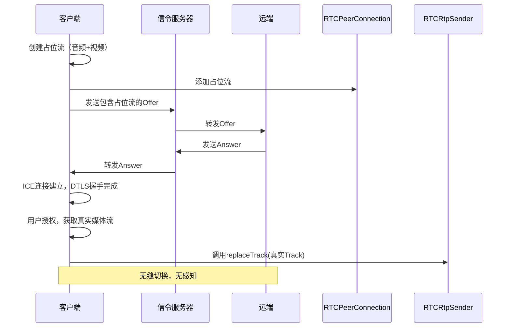

# WebRTC 占位流（Dummy Stream/Placeholder Stream）详解

WebRTC 占位流（也常被称为 dummy stream 或 dummy track）是一种**预先建立的虚拟媒体流**，用于在 WebRTC 连接初始化阶段占位，后续可通过`replaceTrack` API 无缝替换为真实媒体流（如摄像头、麦克风采集的流）。它不是 WebRTC 标准中的官方术语，而是开发者社区广泛使用的实践方案，核心价值在于**避免频繁 SDP 协商**，提升用户体验和连接稳定性。

---

### 一、核心定义与用途

#### 1. 定义

占位流是由虚拟数据源（如静默音频、静态图像）生成的`MediaStreamTrack`，它具有与真实媒体流相同的`kind`（音频或视频）属性，可被添加到`RTCPeerConnection`中参与初始 SDP 协商。

#### 2. 核心应用场景

| 场景             | 价值                                                                   |
| ---------------- | ---------------------------------------------------------------------- |
| **预建立连接**   | 先建立 ICE/DTLS 连接，用户授权媒体设备后无缝切换，减少等待时间         |
| **延迟授权**     | 避免页面加载时立即请求摄像头/麦克风权限，提升用户信任度                |
| **动态媒体切换** | 摄像头/麦克风、屏幕共享、虚拟背景等场景间快速切换，无需重新协商        |
| **多轨道管理**   | 提前预留轨道位置，确保接收端能正确识别不同类型媒体（如主视频、辅视频） |
| **容错处理**     | 媒体设备故障时，用占位流保持连接，防止会话中断                         |

---

### 二、实现方法：创建占位流

#### 1. 音频占位流（Dummy Audio Track）

常用两种方式创建：

-   **白噪音/静默音频**（兼容性好）：
    ```javascript
    // 使用AudioContext生成静默音频
    const createSilentAudioTrack = () => {
        const ctx = new AudioContext();
        const oscillator = ctx.createOscillator();
        const dst = oscillator.connect(ctx.createMediaStreamDestination());
        oscillator.start();
        const track = dst.stream.getAudioTracks()[0];
        return track;
    };
    ```
-   **空音频源**（更轻量）：
    ```javascript
    // 使用MediaStreamTrackGenerator（现代浏览器支持）
    const createEmptyAudioTrack = () => {
        const track = new MediaStreamTrackGenerator({ kind: 'audio' });
        return track;
    };
    ```

#### 2. 视频占位流（Dummy Video Track）

主要通过 Canvas 生成静态图像流：

```javascript
const createPlaceholderVideoTrack = () => {
    // 创建Canvas并绘制静态内容（如占位图、纯色背景）
    const canvas = document.createElement('canvas');
    canvas.width = 640;
    canvas.height = 480;
    const ctx = canvas.getContext('2d');
    ctx.fillStyle = '#f0f0f0';
    ctx.fillRect(0, 0, canvas.width, canvas.height);
    ctx.fillStyle = '#333';
    ctx.fillText('等待视频...', 240, 240);

    // 捕获Canvas流作为占位视频
    const stream = canvas.captureStream();
    const track = stream.getVideoTracks()[0];
    return track;
};
```

---

### 三、占位流与 replaceTrack 的配合使用

#### 1. 完整工作流程



#### 2. 关键代码示例

```javascript
// 1. 初始化连接并添加占位流
const pc = new RTCPeerConnection();
const dummyAudio = createSilentAudioTrack();
const dummyVideo = createPlaceholderVideoTrack();
const audioSender = pc.addTrack(dummyAudio);
const videoSender = pc.addTrack(dummyVideo);

// 2. 完成初始协商（ICE/DTLS）
// ... 信令交换和连接建立逻辑 ...

// 3. 用户授权后切换到真实流
async function switchToRealMedia() {
    const realStream = await navigator.mediaDevices.getUserMedia({
        audio: true,
        video: true,
    });
    const realAudio = realStream.getAudioTracks()[0];
    const realVideo = realStream.getVideoTracks()[0];

    // 无缝替换
    await audioSender.replaceTrack(realAudio);
    await videoSender.replaceTrack(realVideo);

    // 停止占位流
    dummyAudio.stop();
    dummyVideo.stop();
}
```

---

### 四、技术优势与注意事项

#### 1. 核心优势

-   **无重新协商**：替换轨道无需生成新 SDP，减少网络开销和延迟
-   **用户体验提升**：连接建立与媒体授权分离，避免"黑屏等待"
-   **连接稳定性**：保持媒体通道活跃，防止 NAT 超时或连接中断
-   **灵活扩展**：支持动态添加/移除媒体类型，适应复杂场景

#### 2. 注意事项

-   **权限问题**：占位流无需用户授权，但真实流仍需请求权限
-   **轨道兼容性**：替换的轨道必须与占位流`kind`一致（音频 ↔ 音频，视频 ↔ 视频）
-   **资源管理**：及时停止占位流轨道，释放系统资源
-   **浏览器兼容性**：`MediaStreamTrackGenerator`等新 API 存在兼容性差异，建议提供降级方案

---

### 五、与其他方案对比

| 方案           | 占位流+replaceTrack  | 动态添加轨道（addTrack）     |
| -------------- | -------------------- | ---------------------------- |
| **SDP 协商**   | 初始一次，后续无协商 | 每次添加需重新协商           |
| **切换延迟**   | 毫秒级，无感知       | 秒级，可能出现黑屏/卡顿      |
| **连接稳定性** | 高，保持通道活跃     | 中，频繁协商可能导致连接波动 |
| **权限体验**   | 好，可延迟请求权限   | 一般，添加时需立即请求权限   |
| **适用场景**   | 大多数实时音视频应用 | 简单场景，媒体类型固定       |

---

### 六、最佳实践

1. **提前规划轨道**：根据应用需求，初始化时预留所有可能需要的轨道位置
2. **轻量占位**：音频用静默流，视频用低分辨率静态图像，减少带宽占用
3. **状态管理**：维护占位流与真实流的状态映射，确保切换时的一致性
4. **错误处理**：替换失败时，回退到占位流并给出友好提示
5. **兼容性适配**：对不支持`replaceTrack`的旧浏览器，提供降级方案（如重新协商）

占位流技术是 WebRTC 开发中的重要优化手段，尤其适用于视频会议、直播、远程协作等对用户体验和连接稳定性要求较高的场景。通过合理运用，可显著提升应用的响应速度和可靠性。
