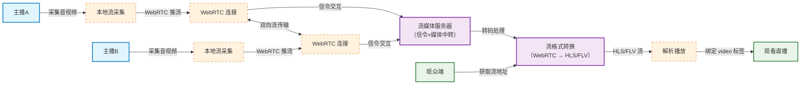

## 直播整体架构

```mermaid
flowchart LR
    %% 定义节点样式（可选，增强可读性）
    classDef anchor fill:#e1f5fe,stroke:#0277bd,stroke-width:2px
    classDef server fill:#f3e5f5,stroke:#7b1fa2,stroke-width:2px
    classDef viewer fill:#e8f5e8,stroke:#2e7d32,stroke-width:2px
    classDef protocol fill:#fff3e0,stroke:#ef6c00,stroke-width:1px,stroke-dasharray: 5 5

    %% 1. 主播端：连麦需 WebRTC 双向推流
    A1[主播A]:::anchor -->|采集音视频| A2[本地流采集]:::protocol
    A2 -->|WebRTC 推流| A3[WebRTC 连接]:::protocol
    A3 -->|信令交互| S1[流媒体服务器<br/>（信令+媒体中转）]:::server

    B1[主播B]:::anchor -->|采集音视频| B2[本地流采集]:::protocol
    B2 -->|WebRTC 推流| B3[WebRTC 连接]:::protocol
    B3 -->|信令交互| S1

    %% 2. 连麦核心：主播间双向 WebRTC 连接
    A3 <-->|双向流传输| B3:::protocol

    %% 3. 服务器：转码分发（WebRTC 转 HLS/FLV）
    S1 -->|转码处理| S2[流格式转换<br/>（WebRTC → HLS/FLV）]:::server

    %% 4. 观众端：无需 WebRTC，仅需 HLS/FLV 拉流
    V1[观众端]:::viewer -->|获取流地址| S2
    S2 -->|HLS/FLV 流| V2[解析播放]:::protocol
    V2 -->|绑定 video 标签| V3[观看直播]:::viewer

    %% 样式说明：
    %% - anchor：主播节点
    %% - server：服务器节点
    %% - viewer：观众节点
    %% - protocol：协议/传输层节点
```

总结：

-   主播：webRTC 双向通信支持主播间连麦
-   服务端：将 webRTC 流 -> hls/flv
-   观众：基于 hls/flv 拉流观看

## 弹幕模块

-   就是用 websocket 实现，观众和主播都在同一个房间即可
