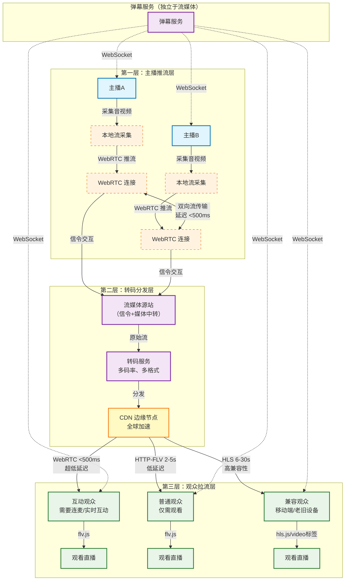
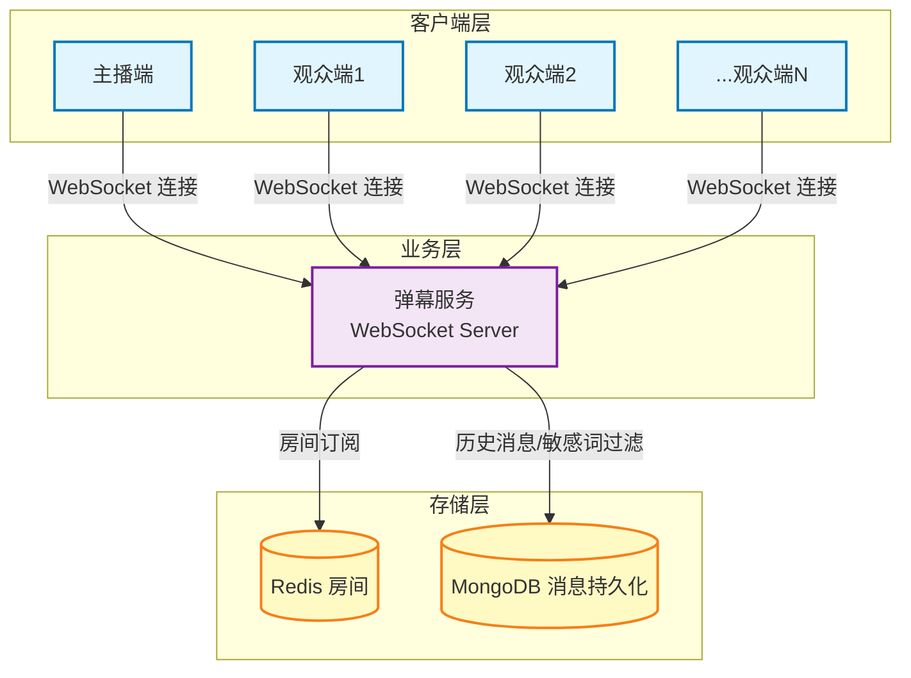

## 直播整体架构

### 生产级方案：基于 CDN 的分层架构



### 架构分层说明

#### **1. 主播推流层**

-   使用 **WebRTC** 推流到源站
-   主播间通过 **WebRTC 双向连接**实现连麦（延迟 <500ms）
-   支持多路主播连麦（N-way WebRTC MCU/SFU 架构）

#### **2. 转码分发层（核心优化点）**

-   **转码服务**：
    -   将 WebRTC 流转码成多种格式（WebRTC/FLV/HLS）
    -   生成多码率（1080p/720p/480p/360p）自适应
    -   截图、录制、鉴权等处理
-   **CDN 分发**：
    -   全球边缘节点加速
    -   就近接入，降低延迟
    -   节省源站带宽成本

#### **3. 观众拉流层（按需选择）**

| 场景     | 协议     | 延迟   | 技术方案            | 适用场景           |
| -------- | -------- | ------ | ------------------- | ------------------ |
| 超低延迟 | WebRTC   | <500ms | WebRTC API          | 连麦、实时互动     |
| 低延迟   | HTTP-FLV | 2-5s   | flv.js              | 普通观看（PC）     |
| 高兼容性 | HLS      | 6-30s  | hls.js / video 标签 | 移动端、兼容性要求 |

**选择策略**：

```javascript
// 观众端协议选择
if (user.needInteract) {
    // 需要连麦或实时互动
    useProtocol = 'WebRTC';
} else if (isPC && browserSupportFLV) {
    // PC 端低延迟观看
    useProtocol = 'HTTP-FLV';
} else {
    // 移动端或兼容性优先
    useProtocol = 'HLS';
}
```

### 与原方案对比

| 维度       | 原方案             | 生产级方案             |
| ---------- | ------------------ | ---------------------- |
| **延迟**   | 固定 HLS 6-30s     | 按需选择 <500ms ~ 30s  |
| **成本**   | 源站转码压力大     | CDN 分担，成本可控     |
| **扩展性** | 单源站，受限于带宽 | CDN 全球节点，无限扩展 |
| **可靠性** | 源站故障全网不可用 | CDN 多节点容灾         |
| **灵活性** | 所有观众统一协议   | 按场景选择最优协议     |

### 核心优化点

1. **延迟优化**：

    - 连麦场景：WebRTC 直连，不经过转码
    - 互动场景：WebRTC 拉流，超低延迟
    - 普通场景：HTTP-FLV，2-5s 延迟

2. **成本优化**：

    - CDN 边缘节点分担源站压力
    - 按需转码，观众看什么码率转什么码率
    - 静态资源（封面、回放）走 CDN

3. **性能优化**：
    - 全球就近接入
    - 码率自适应（根据网络自动切换清晰度）
    - 断线重连、追帧优化

## 弹幕模块

### 架构设计

弹幕服务**独立于流媒体服务**，通过 WebSocket 实现实时推送：



### 核心实现

#### **1. 房间管理**

```javascript
// 观众进入直播间
观众端 → WebSocket 连接 → 加入房间（roomId）
→ 订阅房间消息 → 接收实时弹幕

// 发送弹幕
观众端 → 发送消息 → 弹幕服务校验
→ 敏感词过滤 → 推送给房间内所有人
→ 异步持久化到 MongoDB
```

#### **2. 消息分发优化**

```javascript
// 小房间（<1000人）：直接广播
websocket.broadcast(roomId, message);

// 大房间（>1000人）：分层推送
// 方案一：消息队列 + 分片推送
// 方案二：只推送给在线用户（Redis 维护在线列表）
// 方案三：按需拉取（用户自己请求最新弹幕）
```

#### **3. 高并发优化**

| 问题           | 解决方案                                   |
| -------------- | ------------------------------------------ |
| **大量连接**   | WebSocket 集群，水平扩展                   |
| **消息风暴**   | 限流、降级、聚合推送                       |
| **历史消息**   | Redis 缓存最近 100 条，超出的去 MongoDB 查 |
| **分布式同步** | Redis Pub/Sub 同步不同 WebSocket 服务器    |

### 生产级优化

1. **独立部署**：

    - 弹幕服务独立于流媒体服务
    - 弹幕服务故障不影响观看

2. **弹性伸缩**：

    - 根据直播间热度动态扩缩容
    - 小直播间单机，大直播集群

3. **用户体验**：
    - 弹幕去重
    - 敏感词过滤
    - 弹幕等级权限（是否允许发送）
    - 弹幕上墙优先级（VIP、礼物等）

### 完整流程示例

```javascript
// 前端连接
const ws = new WebSocket(`wss://danmu.example.com/room/${roomId}`);

// 进房
ws.send(
    JSON.stringify({
        type: 'join',
        userId: 'user123',
        token: 'xxx',
    })
);

// 发送弹幕
ws.send(
    JSON.stringify({
        type: 'message',
        content: '主播好帅！',
        color: '#ff0000',
    })
);

// 接收弹幕
ws.onmessage = (event) => {
    const { type, data } = JSON.parse(event.data);
    if (type === 'message') {
        renderDanmu(data); // 渲染弹幕到页面
    }
};
```
