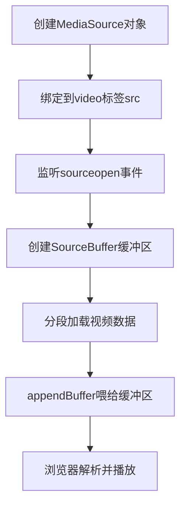

# 流媒体播放核心技术（直播/点播）全解析

## 一、核心底层：MSE (Media Source Extensions)

### 1. 定义与核心价值

MSE 是浏览器提供的 **JavaScript API**，是网页端实现流媒体播放（直播/点播）的底层基石。

-   原生 `<video>` 标签仅能播放完整的视频文件（如 MP4），而 MSE 突破了这一限制，允许将视频/音频数据**分段、分块**喂给浏览器；
-   支持动态切换码率（适配不同网络环境）、解析非原生流媒体格式（如 FLV、HLS 切片），是“边下载边播放”的核心实现方式。

### 2. MSE 核心工作流程



核心操作：

-   `MediaSource`：作为视频数据的“中转站”，连接 JS 与浏览器播放引擎；
-   `SourceBuffer`：数据缓冲区，负责接收分段的二进制视频数据；
-   `appendBuffer()`：将分段数据喂给缓冲区，是 MSE 最核心的方法。

## 二、主流流媒体协议与对应 JS 库

MSE 是底层能力，实际开发中需结合具体流媒体协议，通过封装库快速实现播放，无需从零编写 MSE 逻辑。

| 协议/类型                                   | 核心特点                                                                                   | 对应核心库         | 适用场景                              |
| ------------------------------------------- | ------------------------------------------------------------------------------------------ | ------------------ | ------------------------------------- |
| HLS (HTTP Live Streaming)                   | 苹果推出，将视频切为 TS 小文件（10s/段），通过 m3u8 索引管理；兼容性最优（移动端/PC 通用） | hls.js             | 直播、点播（跨端优先选择）            |
| DASH (Dynamic Adaptive Streaming over HTTP) | 国际标准，海外业务多用，灵活性更高，支持 MP4/TS 切片、多编码格式；自适应码率能力强         | dash.js            | 高端点播、4K 视频、精细化码率适配场景 |
| FLV                                         | 字节流格式，延迟极低（1-3 秒），数据传输效率高                                             | flv.js             | 低延迟直播（电商直播、游戏直播）      |
| 通用播放器                                  | 封装 HLS/FLV/DASH 等协议，提供统一的播放控制 API、UI 组件、异常处理                        | video.js、xgplayer | 业务系统快速集成（无需关注底层协议）  |

### 各库核心优势对比

-   **hls.js**：轻量、专注 HLS 协议，体积小、性能优，适合仅需 HLS 播放的场景；
-   **flv.js**：低延迟核心，专为 FLV 协议优化，直播实时性要求高时首选；
-   **video.js**：生态成熟，插件丰富（弹幕、广告、清晰度切换），通用场景开箱即用；
-   **xgplayer**：字节跳动出品，对移动端适配、直播互动（连麦、点赞）支持更友好。

## 三、典型应用示例

### 1. 原生 MSE 极简示例（理解底层）

```html
<!DOCTYPE html>
<html>
    <head>
        <meta charset="UTF-8" />
        <title>原生 MSE 播放示例</title>
    </head>
    <body>
        <video id="mse-video" width="800" controls></video>
        <script>
            const video = document.getElementById('mse-video');
            // 测试分段 MP4 地址（初始化段+数据段）
            const segments = [
                'https://storage.googleapis.com/shaka-demo-assets/angel-one/init.mp4',
                'https://storage.googleapis.com/shaka-demo-assets/angel-one/seg-1.m4s',
            ];

            // 初始化 MSE
            if (window.MediaSource) {
                const mediaSource = new MediaSource();
                video.src = URL.createObjectURL(mediaSource);

                mediaSource.addEventListener('sourceopen', async () => {
                    // 创建缓冲区（指定编码格式）
                    const sourceBuffer = mediaSource.addSourceBuffer('video/mp4; codecs="avc1.42E01E, mp4a.40.2"');
                    // 分段加载并追加数据
                    for (const url of segments) {
                        const res = await fetch(url);
                        const buffer = await res.arrayBuffer();
                        sourceBuffer.appendBuffer(buffer);
                        // 等待当前段追加完成
                        await new Promise((resolve) =>
                            sourceBuffer.addEventListener('updateend', resolve, { once: true })
                        );
                    }
                    video.play();
                });
            } else {
                alert('浏览器不支持 MSE！');
            }
        </script>
    </body>
</html>
```

### 2. hls.js 直播播放示例（实战常用）

```html
<!DOCTYPE html>
<html>
    <head>
        <meta charset="UTF-8" />
        <title>HLS 直播播放</title>
        <script src="https://cdn.jsdelivr.net/npm/hls.js@latest"></script>
    </head>
    <body>
        <video id="hls-video" width="800" controls autoplay muted></video>
        <script>
            const video = document.getElementById('hls-video');
            const hlsUrl = 'https://test-streams.mux.dev/x36xhzz/x36xhzz.m3u8'; // 测试 HLS 流

            if (Hls.isSupported()) {
                const hls = new Hls();
                hls.loadSource(hlsUrl);
                hls.attachMedia(video);
                // 加载完成后播放
                hls.on(Hls.Events.MANIFEST_PARSED, () => video.play());
                // 错误处理
                hls.on(Hls.Events.ERROR, (e, data) => console.error('播放错误:', data));
            } else if (video.canPlayType('application/vnd.apple.mpegurl')) {
                // Safari 原生支持 HLS
                video.src = hlsUrl;
                video.play();
            }
        </script>
    </body>
</html>
```

### 3. video.js 通用播放示例（一站式解决方案）

```html
<!DOCTYPE html>
<html>
    <head>
        <meta charset="UTF-8" />
        <title>video.js 通用播放</title>
        <link href="https://vjs.zencdn.net/8.6.1/video-js.css" rel="stylesheet" />
        <script src="https://vjs.zencdn.net/8.6.1/video.min.js"></script>
        <script src="https://cdn.jsdelivr.net/npm/videojs-contrib-hls@5.15.0/dist/videojs-contrib-hls.min.js"></script>
    </head>
    <body>
        <video id="vjs-player" class="video-js vjs-big-play-centered" controls width="800">
            <source src="https://test-streams.mux.dev/x36xhzz/x36xhzz.m3u8" type="application/x-mpegURL" />
        </video>
        <script>
            // 初始化播放器
            const player = videojs('vjs-player', {
                autoplay: true,
                muted: true,
                language: 'zh-CN',
            });
            // 错误监听
            player.on('error', () => console.error('播放错误:', player.error()));
        </script>
    </body>
</html>
```

## 四、技术选型建议

1. 优先选封装库（hls.js/flv.js/video.js），避免重复造轮子，仅需深度定制时才操作原生 MSE；
2. 跨端兼容优先选 HLS + hls.js，低延迟直播优先选 FLV + flv.js；
3. 业务系统快速落地优先选 video.js/xgplayer，减少自定义开发成本。

### 总结

1. **MSE 是底层核心**：所有网页端流媒体播放均基于 MSE 实现“分段流”播放，核心是 `MediaSource` + `SourceBuffer` 喂数据；
2. **协议选库有侧重**：HLS 兼容广、FLV 延迟低、DASH 更灵活，通用场景直接用 video.js/xgplayer；
3. **开发原则**：优先用封装库，仅需深度定制时才操作原生 MSE，重点关注错误处理和兼容性。
