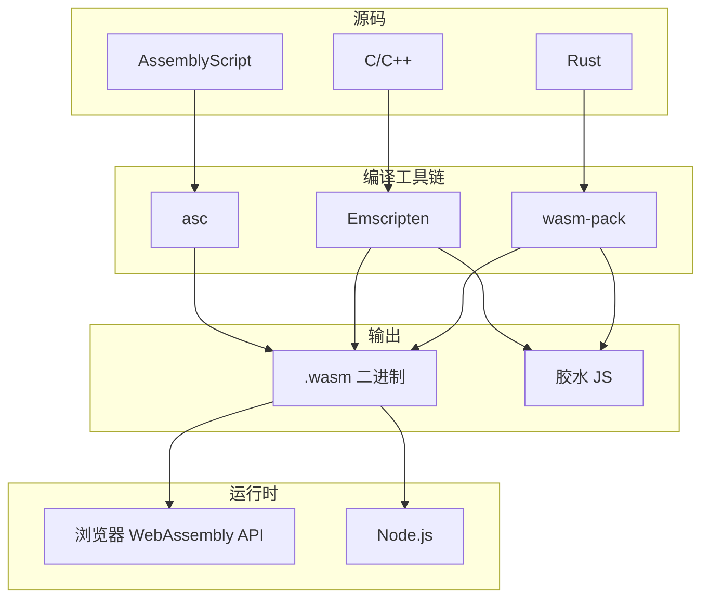

# WebAssembly 全貌与原理

## 一、核心概念

### 1.1 是什么

| 维度           | 说明                                                      |
| -------------- | --------------------------------------------------------- |
| **本质**       | 二进制指令格式（.wasm），不是编程语言，是**编译目标**     |
| **运行环境**   | 栈式虚拟机，在浏览器/Node.js 中以接近原生速度执行         |
| **与 JS 关系** | 互补而非替代：DOM、事件、网络仍用 JS；CPU 密集计算用 WASM |
| **典型场景**   | 图像/视频处理、游戏引擎、加密、音视频编解码、科学计算     |

### 1.2 为什么需要 WebAssembly

-   **性能**：计算密集型操作比 JavaScript 快 10-20 倍
-   **跨平台**：支持所有主流浏览器，一次编译到处运行
-   **沙箱安全**：内存隔离、类型安全、无隐式类型转换
-   **复用生态**：可将 C/C++/Rust 等语言编写的库编译到 Web

---

## 二、架构与数据流

---

## 三、关键知识点

### 3.1 栈式执行模型

-   指令通过**入栈/出栈**工作，无寄存器
-   例如 `i32.add`：从栈顶弹出两个 i32，相加后压回栈

### 3.2 类型系统

-   仅四种数值类型：`i32`、`i64`、`f32`、`f64`
-   无字符串、对象等复杂类型，字符串需通过线性内存传递

### 3.3 线性内存

-   单一连续内存空间
-   与 JS 通过 `ArrayBuffer` 共享，可读写内存

### 3.4 导入/导出

-   `import`：WASM 可导入 JS 函数（如 `console.log`）
-   `export`：WASM 可导出函数供 JS 调用

### 3.5 WASI

-   WebAssembly System Interface
-   用于非浏览器环境（Node、边缘计算、云函数）

---

## 四、工具链与生态

| 工具               | 用途                                           |
| ------------------ | ---------------------------------------------- |
| **wabt**           | WAT ↔ WASM 转换，查看/编辑文本格式             |
| **wasm-pack**      | Rust → WASM，生成 npm 包，与 Webpack/Vite 集成 |
| **Emscripten**     | C/C++ → WASM，生成胶水 JS                      |
| **AssemblyScript** | TypeScript 子集 → WASM，语法友好               |

---

## 五、何时使用 WASM（决策参考）

### 建议使用

| 场景                | 说明                             |
| ------------------- | -------------------------------- |
| CPU 密集计算 > 50ms | 且 JS 优化后仍慢                 |
| 复用现有库          | 如 FFmpeg、OpenCV、Crypto 库     |
| 跨平台一致性        | 浏览器、Node、边缘计算需相同性能 |
| 客户端媒体处理      | 图像/视频/音频编解码、滤镜       |

### 不建议使用

-   简单 DOM 操作
-   轻量逻辑（未做性能分析）
-   盲目跟风

---

## 六、与现有知识衔接

-   **ffmpeg.wasm**：`ffmpeg.load()`、`ffmpeg.run()`、`ffmpeg.FS()` 背后都是 WASM 模块的加载与内存访问
-   **性能对比**：原生 API（WebCodecs）> WASM > 纯 JS，三者是不同层次的性能选择
