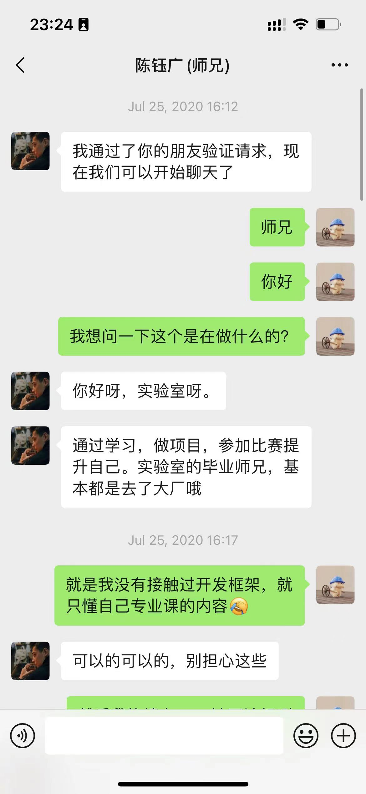
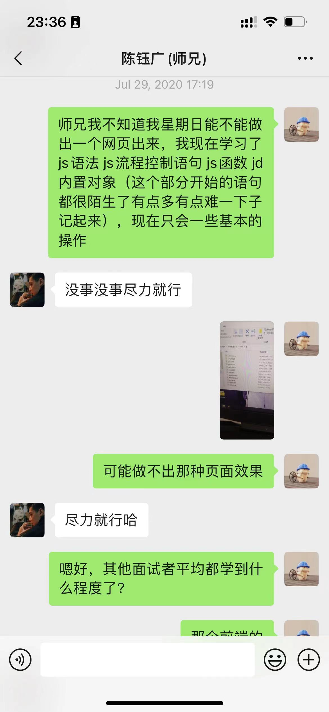
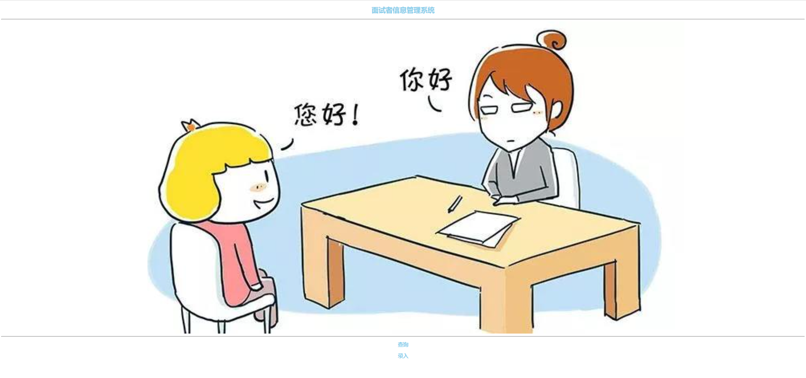
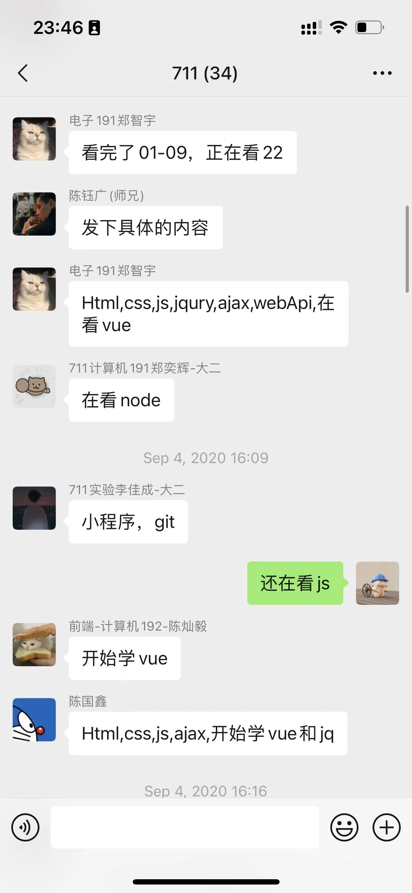
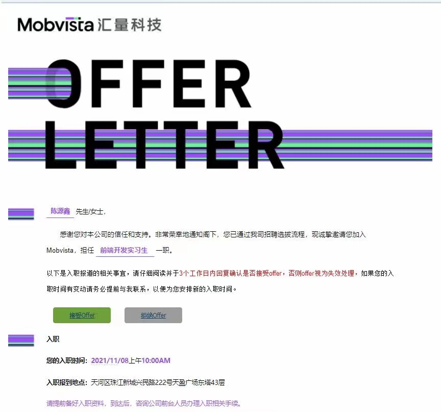
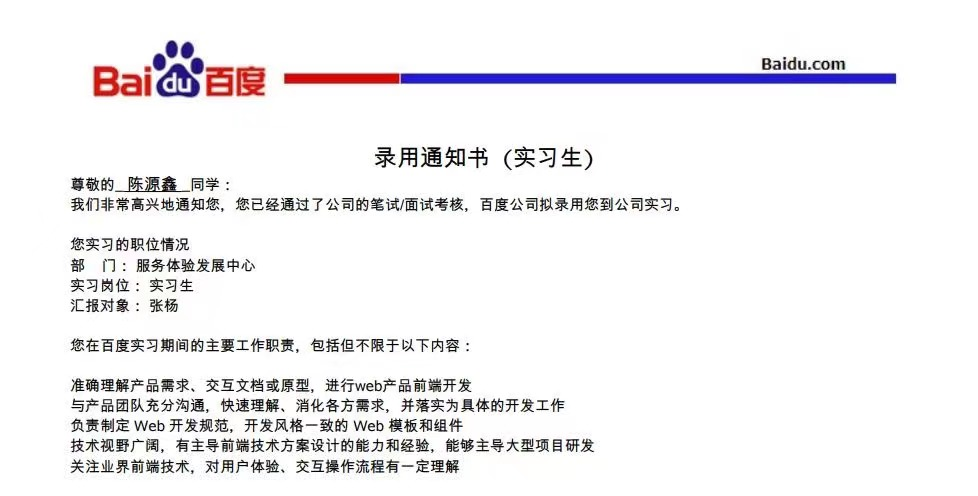
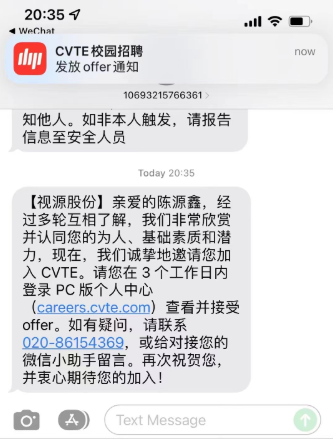

非常荣幸能收到钰广师兄的邀请做这篇分享，下面就简单给大家介绍一下我的成长经历，希望对大家有所帮助！

**加入实验室**

大一的时候我一直很迷茫，不知道自己未来的方向在哪里，专业课感觉啥都没学到，这种焦虑感一直支配着我。2020.7.25 我收到了实验室招新的群通知，抱着试一试的态度我报名参加了实验室前端开发岗的面试。

那时我们的考核内容是一个星期的时间做出一个页面，内容不限，现在看起来很简单，但是对于0基础的我来说真的是想哭！虽然师兄说尽力就好，但是那时真的太渴望加入实验室了，感觉这是能让我进入大厂的契机。那7天，除了睡觉吃饭时间，基本都在看前端课程，最绝望的事情是我那个课程路线竟然是从 js 学起，学了几天我都不知道一个静态页面怎么写！

给大家看个笑话，我最后提交的作业。你们可能会怀疑我是找关系进的实验室吧？现在的实验室要求好像不低噢？可能是那时711实验室刚装修完, 位置比较多吧，师兄就给了个机会，自带欧皇体质，各位不要羡慕了。

**大二**

初入实验室的时候压力真的非常大，每次汇报进度的时候我都是排在最后的。做一个吊车尾不好受，但我更害怕自己被这个团队淘汰，也害怕让给我机会的师兄失望。我只能不断给自己打气，不断地一点一点去让自己更靠近他们。

后来实验室因为一些原因，很多大佬退出实验室，无人可用，菜如我也开始去负责一个项目。也是从那时开始，我身上多了一份责任，那就是把这个项目搞好，像师兄一样给实验室的师弟师妹们做一个好榜样。我变得更投入了，我很少去在乎外界的东西，也放下了那时初入实验室那种“吊车尾”的负担，就是**每天让自己进步一点就够了**！

**大三**

大三上学期，抱着试试的态度，和宇哥一起开始尝试性的投起了实习简历。2021.11.03 投递后，很幸运隔天我就收到了面试通知，2021.11.05 这一天我收获了人生当中第一份实习 offer。走入公司的第一天，如丑小鸭走进天堂的感觉，富丽堂皇的办公楼震撼着我，44楼的珠江夜景。我从没有想过自己这么快能进入这样的公司，这一切仿佛像一个梦。

我想执行力也算是我为数不多的优点吧，不管是加入实验室的时候还是找实习的时候，**当机会出现，即便没有准备或者准备不够充足，一个字就是冲，因为机会很少会在你准备好的时候出现，我的理解是即便失败了我也能从中找到自己的不足。** 

到了下学期，我开始准备去找一段大厂实习，为后面的秋招做准备。可能因为有一段实习缘故，拿到了几个还不错的 offer，在再三思索下，去到了一个从没有想过的城市（上海）实习。

在那里见到了偶像钰广师兄，在遭遇三个月居家隔离后，灰溜溜的跑回家。不仅错过女朋友的毕业典礼，也差点因为没法参加期末考试毕不了业，好在最后老师给我单独安排了考试。这三个月可能在大家看来挺惨的，但也让我有很多独自思考的时间。**过去的大学生活里，我很无趣，我只知道一路前进，却不懂如何给自己按一个暂停键，忽视了很多美好的东西**。希望各位累了要休息，懒了要前进。

**秋招**

大三暑假的时候，我开始了秋招投递，只能说从**信心满满到怀疑人生**，投不完的简历，写不完的笔试，寥寥无几的面试。还算幸运，历经两个多月，在 9 月份收获了一份 offer。有遗憾也有喜悦，总之，**不抱怨，提升自己才是捷径**。

**总结**

最后，名人名言：**努力了不一定有机会，但不努力一定没机会**与大家共勉。

