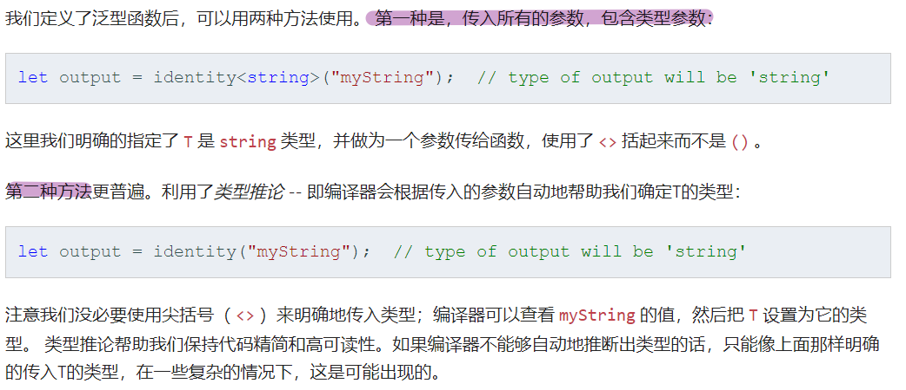
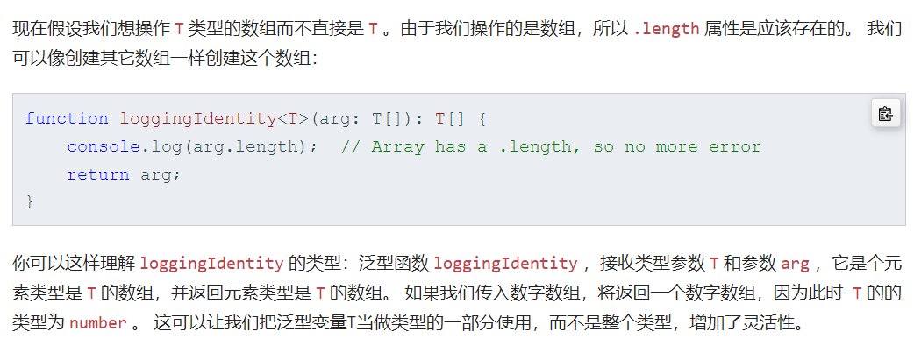

# 基础类型

## Null 和 Undefined

<!-- 图片已省略（原为本机 Typora 路径） -->

## Never

<!-- 图片已省略（原为本机 Typora 路径） -->

## 类型断言

<!-- 图片已省略（原为本机 Typora 路径） -->

# 泛型

## 定义

<!-- 图片已省略（原为本机 Typora 路径） -->

如果知道传入和返回的确切类型也可以不使用泛型，例如

<!-- 图片已省略（原为本机 Typora 路径） -->

对比使用 any

<!-- 图片已省略（原为本机 Typora 路径） -->

看起来好像是传 number 返回 number，实际传 number 也可以返回 string，因为 any 类型实际就是不进行类型检查的意思

## 使用

## 定义 T 类型数组

