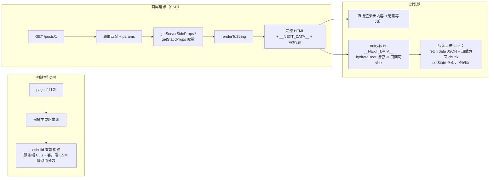
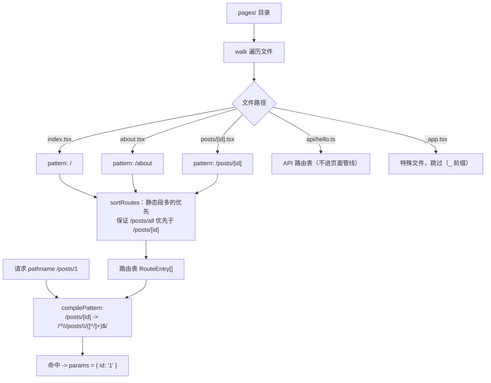
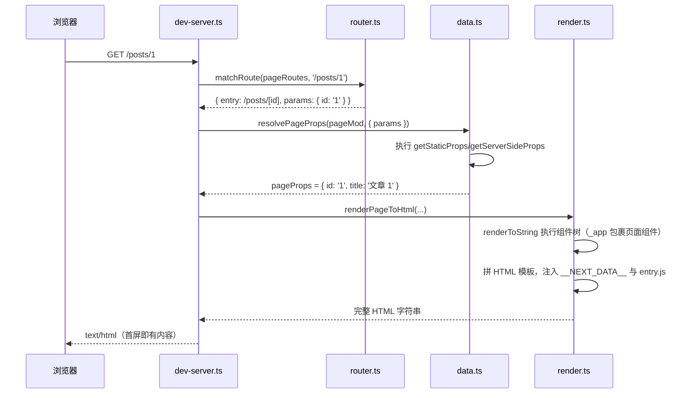
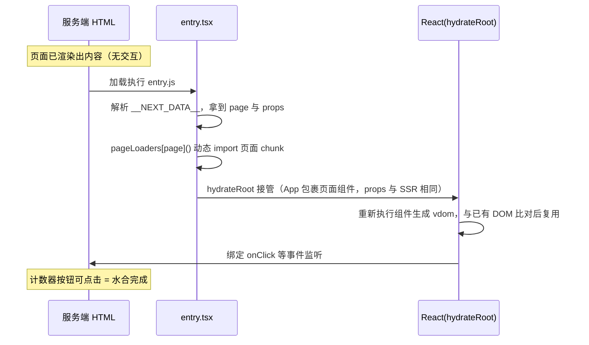
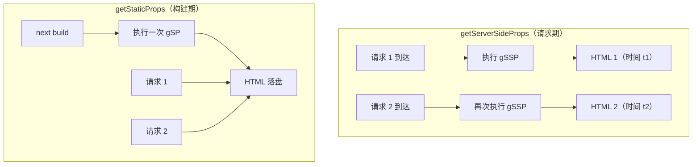
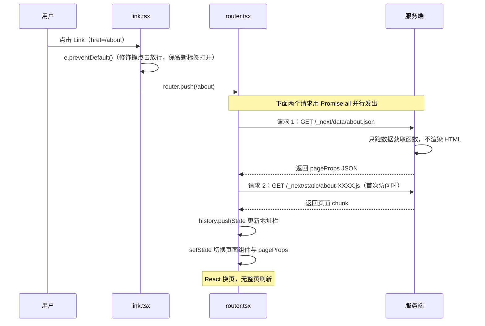

# Mini-Next

一个精简的 Next.js（Pages Router 模型）实现，用于理解 **文件系统路由 + SSR + 水合 + 客户端导航接管** 的完整链路。渲染层使用真实 react / react-dom，构建用 esbuild——把注意力集中在 Next.js 自身的原理上。

## 你将掌握什么

- 文件系统路由：`pages/about.tsx` 如何变成 `/about`，`[id].tsx` 动态段如何匹配
- SSR 闭环：请求 → 执行数据获取函数 → `renderToString` → 注入 `__NEXT_DATA__` → 完整 HTML
- 水合（hydration）：浏览器如何用「同一组件 + 同一数据」接管服务端渲染的静态 HTML
- 数据获取：`getServerSideProps`（请求期）与 `getStaticProps`（构建期）的本质区别
- 客户端导航：`<Link>` 点击后为什么不刷新页面（data JSON + 按路由分包 + setState 换页）
- API Routes：`pages/api/*` 如何变成服务端接口

## 项目结构

```text
mini-next/
├── pages/                        # 示例应用（「用户代码」，对应 Next.js 项目的 pages/）
│   ├── _app.tsx                  # 全局外壳，对应 pages/_app
│   ├── index.tsx                 # getStaticProps + useState 计数器（验证水合）
│   ├── about.tsx                 # 纯静态页面
│   ├── ssr.tsx                   # getServerSideProps
│   ├── posts/[id].tsx            # 动态路由 + getStaticPaths + getStaticProps
│   └── api/hello.ts              # API Route
└── src/                          # 框架本体
    ├── shared/
    │   ├── route-match.ts        # pattern -> 正则、pathname -> 命中 + params（双端共用）
    │   ├── types.ts              # PageModule / NextData 等约定类型
    │   └── constants.ts          # __NEXT_DATA__、/_next/static 等约定
    ├── server/
    │   ├── router.ts             # 扫描 pages/ 生成路由表
    │   ├── page-loader.ts        # 按路由加载服务端构建产物
    │   ├── data.ts               # 执行 getServerSideProps / getStaticProps
    │   ├── render.ts             # renderToString + HTML 模板 + __NEXT_DATA__ 注入
    │   ├── dev-server.ts         # 开发服务器（对应 next dev）
    │   ├── export.ts             # 静态导出（对应 next build 的 SSG 部分）
    │   └── static-server.ts      # 静态伺服（对应 SSG 站点的 next start）
    ├── client/
    │   ├── entry.tsx             # 水合入口：读 __NEXT_DATA__ -> hydrateRoot
    │   ├── router.tsx            # 客户端路由：pushState + data JSON + 动态 import 换页
    │   └── link.tsx              # <Link>：拦截点击走客户端导航
    └── build/
        └── bundle.ts             # esbuild 双端构建 + 生成客户端路由清单
```

## 运行与验证

```bash
cd 前端框架/next/mini-next
pnpm install
pnpm dev          # 开发模式（SSR，改代码自动重建，刷新生效）
pnpm build        # 静态导出：所有页面预渲染为 HTML 落盘到 .mini-next/export/
pnpm start        # 纯静态伺服 export 目录（无任何服务端渲染）
```

打开 http://localhost:3000 后建议按这个顺序观察：

1. **查看网页源码**：首页的 `message`、文章页的标题直接出现在 HTML 里 —— 服务端渲染的证据
2. **点计数器按钮**：数字会涨 —— 水合成功的证据（静态 HTML 本身没有交互能力）
3. **点导航栏链接**：页面切换但 Network 里没有 HTML 文档请求，只有 `/_next/data/xxx.json` 和一个 JS chunk —— 客户端导航的证据
4. **连续刷新 /ssr**：时间戳每次都变（请求期渲染）；而 `pnpm start` 下的 /ssr 时间戳固定为构建时刻（构建期渲染）
5. `curl localhost:3000/api/hello?x=1` 返回 JSON —— API Route

## 阶段 0：心智模型

一句话结论：**Next.js = 文件系统路由 + 服务端渲染（SSR）+ 客户端水合（hydration）+ 客户端接管后续导航**。



四个环节各自解决一个问题：

| 环节 | 解决的问题 |
|------|-----------|
| 文件系统路由 | 路由不用手写配置，目录结构即路由表 |
| SSR | 首屏直接拿到有内容的 HTML（快、SEO 友好），不用等 JS 下载执行完 |
| 水合 | 静态 HTML 没有事件监听；用同构组件在客户端「激活」它，且不用重绘 DOM |
| 客户端导航 | 首屏之后的跳转不再整页刷新，体验等同 SPA |

## 阶段 1：文件系统路由

一句话结论：启动时扫描 `pages/` 目录，把文件路径映射成路由 pattern 表；请求来了用 pattern 编译出的正则逐个匹配。



对应代码：`src/server/router.ts`（扫描）+ `src/shared/route-match.ts`（编译与匹配，双端共用——客户端导航也要用同一张表判断该加载哪个页面 chunk）。

## 阶段 2：SSR 闭环

一句话结论：命中的页面组件在服务端执行一次 `renderToString`，连同数据一起塞进 HTML 模板返回。



HTML 模板里的三样东西各有用途（`src/server/render.ts`）：

```html
<div id="__next">...renderToString 的产物...</div>
<script id="__NEXT_DATA__" type="application/json">{"props":{"pageProps":{...}},"page":"/posts/[id]"}</script>
<script src="/_next/static/entry.js" type="module"></script>
```

- `__next` 容器：水合时 `hydrateRoot` 的挂载点
- `__NEXT_DATA__`：把服务端用过的 pageProps 原样带给浏览器——**两端必须用同一份数据，否则渲染结果不一致，水合失败**
- `entry.js`：客户端运行时入口

> 细节：`__NEXT_DATA__` 序列化时把 `<` 转义为 `<`，防止数据里出现 `</script>` 提前闭合标签。

## 阶段 3：水合与同构

一句话结论：浏览器拿到静态 HTML 后，用「同一个组件 + 同一份 props」执行 `hydrateRoot`，React 复用已有 DOM、只补事件监听，页面从「能看」变成「能点」。



**同构（isomorphic）的含义**：`pages/index.tsx` 这份组件代码既在服务端被执行（renderToString 产 HTML），又在客户端被执行（hydrateRoot 接管）。所以组件里不能直接依赖 `window`/`document` 做渲染逻辑（SSR 时没有它们），副作用要放到 `useEffect` 里——`useEffect` 只在客户端执行。

**为什么不能直接 `innerHTML` 改完事 / 重新 `createRoot` 渲染？** 前者没有事件绑定；后者会把服务端渲染好的 DOM 全部推倒重建，闪烁且浪费。hydrateRoot 的价值就是「复用」。

## 阶段 4：数据获取 —— getServerSideProps vs getStaticProps

一句话结论：两个 API 形状几乎一样，本质区别在**执行时机**——一个在请求期、一个在构建期。



| | getServerSideProps | getStaticProps |
|---|---|---|
| 执行时机 | 每个请求 | 构建期一次（dev 下退化为每请求） |
| 能拿到 | params、query、（真实 Next 还有 req/cookie） | 只有 params |
| 产物 | 每次现渲染的 HTML | 可落盘、可 CDN 缓存的静态 HTML |
| 适用 | 强实时、个性化数据 | 内容稳定、可枚举的页面 |
| 验证方式 | `pnpm dev` 连续刷新 /ssr，时间戳变化 | `pnpm build && pnpm start`，/ssr 时间固定为构建时刻 |

动态路由配套的 `getStaticPaths`：构建期声明「`/posts/[id]` 要预渲染哪些具体路径」，`export.ts` 逐个展开执行 `getStaticProps` 并落盘。

## 阶段 5：客户端导航接管

一句话结论：首屏之后的跳转由 JS 接管——拦截 `<a>` 点击，改发「数据 JSON + 页面 chunk」两个小请求，然后 setState 换掉当前页面组件，全程不刷新。



关键实现点（`src/client/router.tsx`）：

1. **页面 chunk 从哪来**：构建期生成 `pages-manifest`（路由 pattern → `() => import('../../pages/xxx')`），esbuild code splitting 让每个动态 import 成为独立 chunk——这就是「按路由分包」，访问过的页面才会被下载
2. **数据从哪来**：`/_next/data/<path>.json`，服务端只执行数据获取函数返回 JSON，不重复渲染 HTML
3. **前进后退**：监听 `popstate`，用 `location.pathname` 重新走一遍导航流程（`push: false`）
4. **未命中路由表**：退化为 `location.href = href` 整页跳转

`useRouter()` 通过 React Context 暴露 `{ pathname, push, back }`；服务端渲染时 Context 为 null，`Link` 退化为普通 `<a>`。

## 阶段 6：API Routes

一句话结论：`pages/api/` 下的文件不进 React 渲染管线，默认导出的 `(req, res) => void` 直接被服务器调用。

```ts
// pages/api/hello.ts
export default function handler(req, res) {
  res.json({ message: 'hello' });  // res.json 是 dev-server 包的一层语法糖
}
```

`dev-server.ts` 的请求分发顺序：先匹配 API 路由表，再匹配页面路由表——同一个 `pages/` 目录，两套管线。

## 与 Next.js 的对应关系

| Mini-Next | Next.js |
|---|---|
| `src/server/router.ts` 扫描 pages/ | Next 构建期的 pages 目录收集（`next build` 输出的路由清单） |
| `src/shared/route-match.ts` | `next/dist/shared/lib/router/utils/route-matcher` |
| `render.ts` 的 `__NEXT_DATA__` | 同名约定，真实 HTML 里就能看到 |
| `render.ts` 的 `<div id="__next">` | 同名挂载点 |
| `client/entry.tsx` hydrateRoot | `next/dist/client/index.tsx` 的 hydrate 入口 |
| `client/router.tsx` + `link.tsx` | `next/router` + `next/link` |
| `/_next/data/*.json` | 真实 Next 客户端导航同样请求 `/_next/data/<buildId>/<path>.json` |
| `/_next/static/*` | 同名静态产物目录 |
| esbuild 按路由分包 | webpack/turbopack 的 per-page bundle + 共享 chunk |
| `export.ts` 静态导出 | `next build` 的 SSG / `next export` |
| `_app.tsx` | `pages/_app` |

## 当前实现限制（有意为之）

- 无 HMR：dev 下改代码自动重建，但需手动刷新页面
- 无 query string 解析的客户端导航（`Link href` 只支持纯路径）
- 无 ISR（增量静态再生）、无中间件、无 `next/head`、`next/image`
- 无 SSR 流式渲染（`renderToString` 是一次性字符串，真实 Next 18+ 用 `renderToPipeableStream`）
- Pages Router 模型，不含 App Router / React Server Components

## 下一步扩展建议

1. 给 `<Link>` 加 `prefetch`（hover 时预取 data JSON 与 chunk），体会 Next 的「导航加速」
2. 实现 `next/head`：服务端收集页面里声明的 `<title>` 等标签合并进 HTML 模板
3. 给 `getStaticProps` 加 `revalidate`，实现最小 ISR：过期后后台重新渲染落盘
4. 把 `renderToString` 换成 `renderToPipeableStream`，观察 TTFB 变化
5. 进阶：调研 RSC 的序列化协议（react-server-dom-webpack），理解 App Router 与 Pages Router 的本质差异
