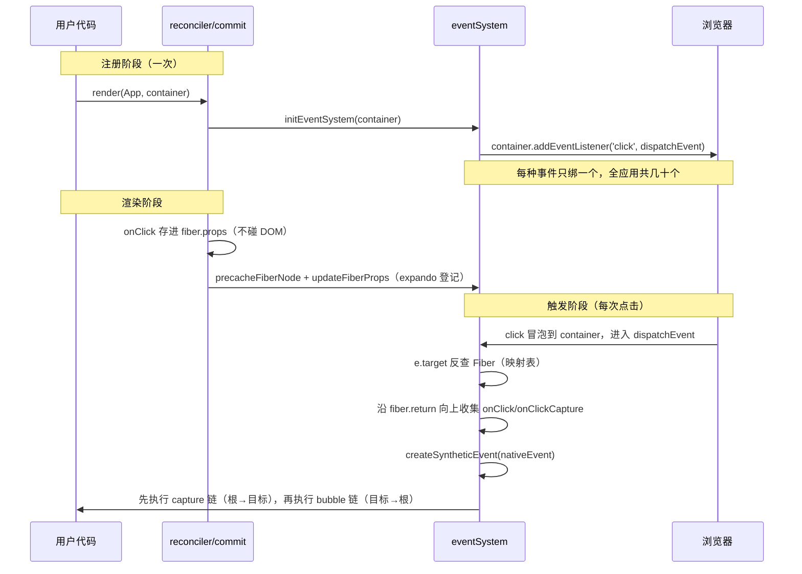

# 事件系统（事件委托的实现）

对应 React 源码的 `DOMPluginEventSystem.js` / `SyntheticEvent.js`。

> 一句话：`onClick` 只是 Fiber `props` 上的普通属性，真实 DOM 上**一个监听器都没有**；监听器统一注册在**根容器**上，事件冒泡到根后由派发器沿 Fiber 树收集 handler 执行。

## 整体流程



## 三个关键设计

**1. handler 存 Fiber，不存 DOM —— 换 handler 不需要重绑**

```javascript
// 每次渲染都是新箭头函数，DOM 上没有任何监听器要增删：
function Counter() {
    const [count, setCount] = useState(0);
    return createElement('button', { onClick: () => setCount(count + 1) }, count);
    // 派发时从 fiber.props 实时读取 → 永远拿到最新闭包
}
```

**2. expando 属性登记 —— 派发的入口（对应源码 ReactDOMComponentTree.js）**

Fiber 指针和最新 props 作为内部属性直接挂在 DOM 节点上（key 带 `$` 后缀，React 用随机后缀做多版本隔离）：

```javascript
// eventSystem.js —— 与源码同名的三个函数
precacheFiberNode(fiber, dom);   // dom['__reactFiber$mini'] = fiber，createDOMNode 时一次
updateFiberProps(dom, props);    // dom['__reactProps$mini'] = props，创建 + commitUpdate 时刷新
const targetFiber = getFiberFromDOM(e.target);  // 派发时直接读属性反查
```

两个登记时机（与源码一致）：

| 时机 | 操作 | 说明 |
| --- | --- | --- |
| `createDOMNode`（≈ createInstance） | `precacheFiberNode` + `updateFiberProps` | 每节点生命周期一次 |
| `commitUpdate` | `updateFiberProps`（先于改 DOM） | 保证派发读到已提交的最新 handler |
| `appendChild`（插入） | 无 | 纯 DOM 操作，零登记 |

派发时 handler 从 `node[internalPropsKey]` 读取而非 `fiber.props`——双缓冲下 DOM 上挂的 Fiber 可能仍指向上棵树，而 props expando 在 commitUpdate 里必然刷新，永远是已提交值。

DevTools 可验证：控制台 `document.querySelector('button').__reactFiber$mini` 取到 Fiber、`__reactProps$mini` 取到最新 props。

**3. 双路径收集 —— 捕获与冒泡都在派发阶段模拟**

```javascript
// dispatchEvent 内部（简化）
while (fiber) {
    fiber.props?.onClick && bubblingPath.push(...);   // 目标 → 根
    fiber.props?.onClickCapture && capturingPath.push(...);
    fiber = fiber.return;                             // 沿父指针上溯
}
// 执行：capturingPath 逆序（根 → 目标），再顺序执行 bubblingPath
// e.stopPropagation() 置 propagationStopped = true，循环检测后中断
```

## 验证方式

打开 `examples/event-example.html`，观察：

- 捕获/冒泡执行顺序（`outer onClickCapture → inner onClick → outer onClick`）
- `e.stopPropagation()` 阻断后，外层 handler 不再执行
- Counter 连续点击，闭包始终读到最新 count（委托方案的直接收益）
- DevTools → Elements → button 节点的 Event Listeners 面板为空，`#root` 上才有监听器

## 与 React 真实实现的差异

| 维度 | mini-react | React |
| --- | --- | --- |
| DOM→Fiber 登记 | expando 属性（`__reactFiber$mini`，固定后缀） | expando 属性（`__reactFiber$` + 随机后缀，多版本隔离） |
| 事件池 | 无（按 React 17+ 行为） | ≤16 复用对象需 `e.persist()`，17 起移除 |
| 捕获事件 | 派发阶段模拟（bubble 注册 + 逆序执行） | `container.addEventListener(..., true)` 原生捕获注册 |
| 优先级 | 无 | `dispatchDiscreteEvent`/`Continuous` 分离散/连续两档，关联 Scheduler |
| 事件种类 | 6 种演示用 | 全量 + `onChange` 合成（input/change 归一化） |

[← 返回主文档](../README.md)
