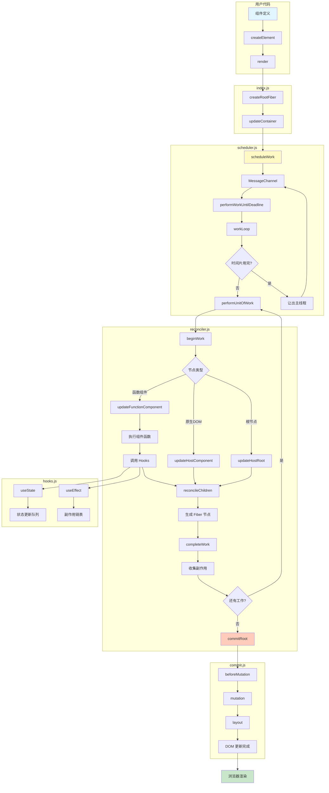
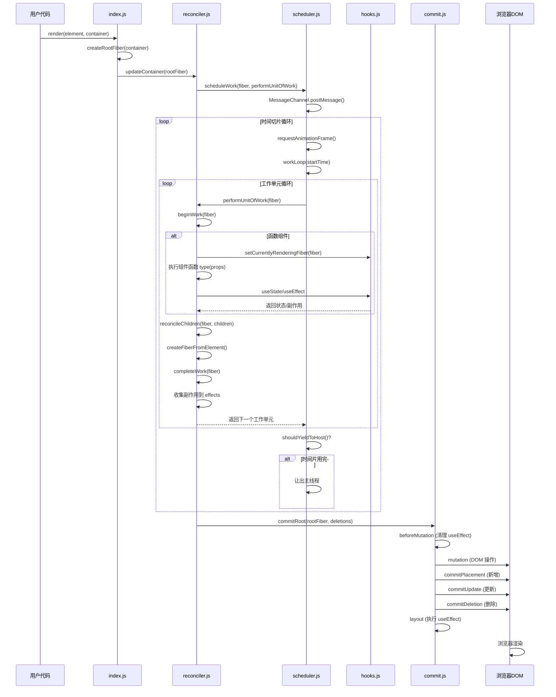
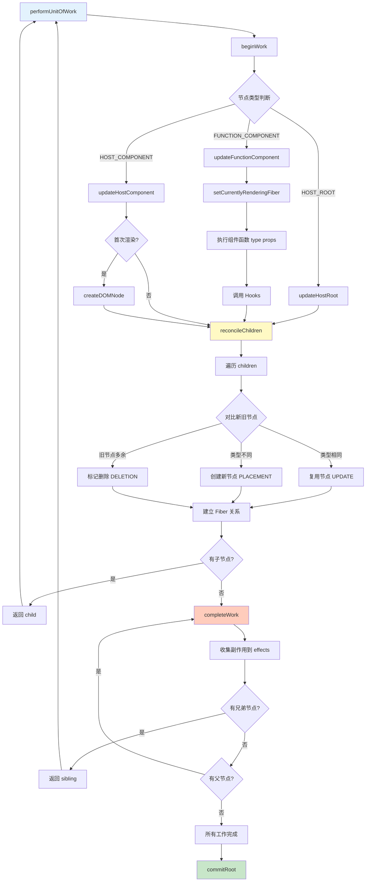
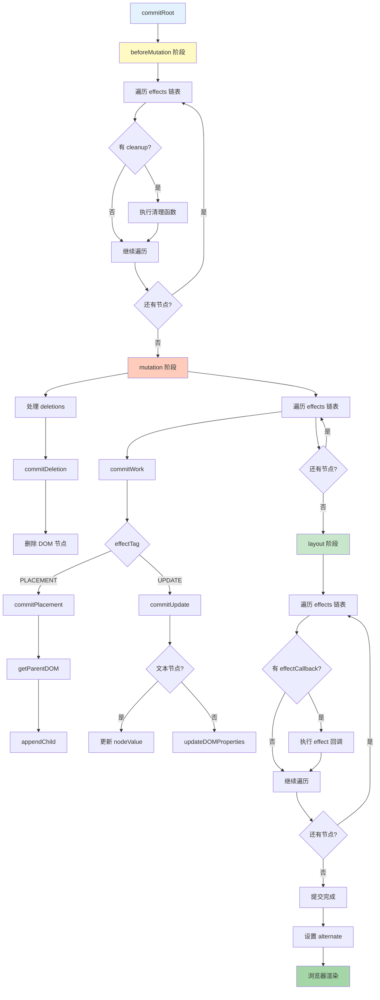
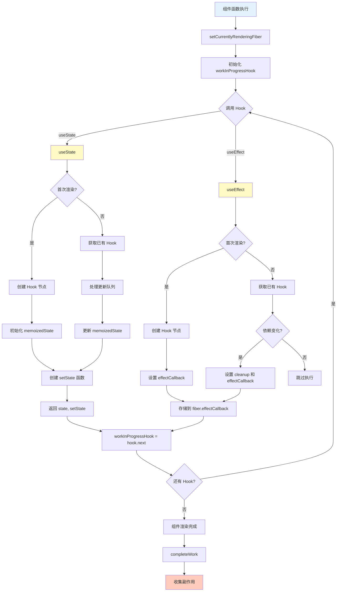
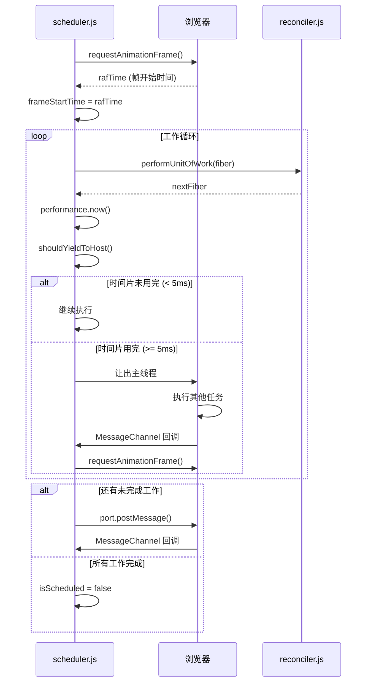

# 模块交互流程图

mini-react 从用户代码到浏览器渲染的完整链路，按视角分为 6 张图。

## 1. 整体架构图

```mermaid
graph TB
    subgraph "用户代码"
        A[组件定义] --> B[createElement]
        B --> C[render]
    end

    subgraph "index.js"
        C --> D[createRootFiber]
        D --> E[updateContainer]
    end

    subgraph "scheduler.js"
        E --> F[scheduleWork]
        F --> G[MessageChannel]
        G --> H[performWorkUntilDeadline]
        H --> I[workLoop]
        I --> J{时间片用完?}
        J -->|否| K[performUnitOfWork]
        J -->|是| L[让出主线程]
        L --> G
    end

    subgraph "reconciler.js"
        K --> M[beginWork]
        M --> N{节点类型}
        N -->|函数组件| O[updateFunctionComponent]
        N -->|原生DOM| P[updateHostComponent]
        N -->|根节点| Q[updateHostRoot]
        O --> R[执行组件函数]
        R --> S[调用 Hooks]
        S --> T[reconcileChildren]
        P --> T
        Q --> T
        T --> U[生成 Fiber 节点]
        U --> V[completeWork]
        V --> W[收集副作用]
        W --> X{还有工作?}
        X -->|是| K
        X -->|否| Y[commitRoot]
    end

    subgraph "commit.js"
        Y --> Z[beforeMutation]
        Z --> AA[mutation]
        AA --> AB[layout]
        AB --> AC[DOM 更新完成]
    end

    subgraph "hooks.js"
        S --> AD[useState]
        S --> AE[useEffect]
        AD --> AF[状态更新队列]
        AE --> AG[副作用链表]
    end

    AC --> AH[浏览器渲染]

    style A fill:#e1f5ff
    style AH fill:#c8e6c9
    style F fill:#fff9c4
    style Y fill:#ffccbc
```

## 2. 完整渲染流程时序图

```mermaid
sequenceDiagram
    participant User as 用户代码
    participant Index as index.js
    participant Reconciler as reconciler.js
    participant Scheduler as scheduler.js
    participant Hooks as hooks.js
    participant Commit as commit.js
    participant DOM as 浏览器DOM

    User->>Index: render(element, container)
    Index->>Index: createRootFiber(container)
    Index->>Reconciler: updateContainer(rootFiber)

    Reconciler->>Scheduler: scheduleWork(fiber, performUnitOfWork)
    Scheduler->>Scheduler: MessageChannel.postMessage()

    loop 时间切片循环
        Scheduler->>Scheduler: requestAnimationFrame()
        Scheduler->>Scheduler: workLoop(startTime)

        loop 工作单元循环
            Scheduler->>Reconciler: performUnitOfWork(fiber)
            Reconciler->>Reconciler: beginWork(fiber)

            alt 函数组件
                Reconciler->>Hooks: setCurrentlyRenderingFiber(fiber)
                Reconciler->>Reconciler: 执行组件函数 type(props)
                Reconciler->>Hooks: useState/useEffect
                Hooks-->>Reconciler: 返回状态/副作用
            end

            Reconciler->>Reconciler: reconcileChildren(fiber, children)
            Reconciler->>Reconciler: createFiberFromElement()
            Reconciler->>Reconciler: completeWork(fiber)
            Reconciler->>Reconciler: 收集副作用到 effects
            Reconciler-->>Scheduler: 返回下一个工作单元
        end

        Scheduler->>Scheduler: shouldYieldToHost()?
        alt 时间片用完
            Scheduler->>Scheduler: 让出主线程
        end
    end

    Reconciler->>Commit: commitRoot(rootFiber, deletions)

    Commit->>Commit: beforeMutation (清理 useEffect)
    Commit->>DOM: mutation (DOM 操作)
    Commit->>DOM: commitPlacement (新增)
    Commit->>DOM: commitUpdate (更新)
    Commit->>DOM: commitDeletion (删除)
    Commit->>Commit: layout (执行 useEffect)

    DOM->>DOM: 浏览器渲染
```

## 3. 协调阶段详细流程

```mermaid
flowchart TD
    A[performUnitOfWork] --> B[beginWork]
    B --> C{节点类型判断}

    C -->|HOST_ROOT| D[updateHostRoot]
    C -->|FUNCTION_COMPONENT| E[updateFunctionComponent]
    C -->|HOST_COMPONENT| F[updateHostComponent]

    D --> G[reconcileChildren]
    E --> H[setCurrentlyRenderingFiber]
    H --> I[执行组件函数 type props]
    I --> J[调用 Hooks]
    J --> G
    F --> K{首次渲染?}
    K -->|是| L[createDOMNode]
    K -->|否| G
    L --> G

    G --> M[遍历 children]
    M --> N{对比新旧节点}
    N -->|类型相同| O[复用节点 UPDATE]
    N -->|类型不同| P[创建新节点 PLACEMENT]
    N -->|旧节点多余| Q[标记删除 DELETION]

    O --> R[建立 Fiber 关系]
    P --> R
    Q --> R

    R --> S{有子节点?}
    S -->|是| T[返回 child]
    S -->|否| U[completeWork]

    T --> A
    U --> V[收集副作用到 effects]
    V --> W{有兄弟节点?}
    W -->|是| X[返回 sibling]
    W -->|否| Y{有父节点?}
    Y -->|是| U
    Y -->|否| Z[所有工作完成]

    X --> A
    Z --> AA[commitRoot]

    style A fill:#e3f2fd
    style G fill:#fff9c4
    style U fill:#ffccbc
    style AA fill:#c8e6c9
```

## 4. 提交阶段详细流程

```mermaid
flowchart TD
    A[commitRoot] --> B[beforeMutation 阶段]
    B --> C[遍历 effects 链表]
    C --> D{有 cleanup?}
    D -->|是| E[执行清理函数]
    D -->|否| F[继续遍历]
    E --> F
    F --> G{还有节点?}
    G -->|是| C
    G -->|否| H[mutation 阶段]

    H --> I[处理 deletions]
    I --> J[commitDeletion]
    J --> K[删除 DOM 节点]

    H --> L[遍历 effects 链表]
    L --> M[commitWork]
    M --> N{effectTag}
    N -->|PLACEMENT| O[commitPlacement]
    N -->|UPDATE| P[commitUpdate]

    O --> Q[getParentDOM]
    Q --> R[appendChild]

    P --> S{文本节点?}
    S -->|是| T[更新 nodeValue]
    S -->|否| U[updateDOMProperties]

    L --> V{还有节点?}
    V -->|是| L
    V -->|否| W[layout 阶段]

    W --> X[遍历 effects 链表]
    X --> Y{有 effectCallback?}
    Y -->|是| Z[执行 effect 回调]
    Y -->|否| AA[继续遍历]
    Z --> AA
    AA --> AB{还有节点?}
    AB -->|是| X
    AB -->|否| AC[提交完成]

    AC --> AD[设置 alternate]
    AD --> AE[浏览器渲染]

    style A fill:#e3f2fd
    style B fill:#fff9c4
    style H fill:#ffccbc
    style W fill:#c8e6c9
    style AE fill:#a5d6a7
```

## 5. Hooks 工作流程

```mermaid
flowchart TD
    A[组件函数执行] --> B[setCurrentlyRenderingFiber]
    B --> C[初始化 workInProgressHook]

    C --> D{调用 Hook}
    D -->|useState| E[useState]
    D -->|useEffect| F[useEffect]

    E --> G{首次渲染?}
    G -->|是| H[创建 Hook 节点]
    G -->|否| I[获取已有 Hook]
    H --> J[初始化 memoizedState]
    I --> K[处理更新队列]
    K --> L[更新 memoizedState]
    J --> M[创建 setState 函数]
    L --> M
    M --> N[返回 state, setState]

    F --> O{首次渲染?}
    O -->|是| P[创建 Hook 节点]
    O -->|否| Q[获取已有 Hook]
    P --> R[设置 effectCallback]
    Q --> S{依赖变化?}
    S -->|是| T[设置 cleanup 和 effectCallback]
    S -->|否| U[跳过执行]
    R --> V[存储到 fiber.effectCallback]
    T --> V

    N --> W[workInProgressHook = hook.next]
    V --> W
    W --> X{还有 Hook?}
    X -->|是| D
    X -->|否| Y[组件渲染完成]

    Y --> Z[completeWork]
    Z --> AA[收集副作用]

    style A fill:#e3f2fd
    style E fill:#fff9c4
    style F fill:#fff9c4
    style AA fill:#ffccbc
```

## 6. 时间切片机制

```mermaid
sequenceDiagram
    participant Scheduler as scheduler.js
    participant Browser as 浏览器
    participant Reconciler as reconciler.js

    Scheduler->>Browser: requestAnimationFrame()
    Browser-->>Scheduler: rafTime (帧开始时间)

    Scheduler->>Scheduler: frameStartTime = rafTime

    loop 工作循环
        Scheduler->>Reconciler: performUnitOfWork(fiber)
        Reconciler-->>Scheduler: nextFiber

        Scheduler->>Scheduler: performance.now()
        Scheduler->>Scheduler: shouldYieldToHost()

        alt 时间片未用完 (< 5ms)
            Scheduler->>Scheduler: 继续执行
        else 时间片用完 (>= 5ms)
            Scheduler->>Browser: 让出主线程
            Browser->>Browser: 执行其他任务
            Browser->>Scheduler: MessageChannel 回调
            Scheduler->>Browser: requestAnimationFrame()
        end
    end

    alt 还有未完成工作
        Scheduler->>Browser: port.postMessage()
        Browser->>Scheduler: MessageChannel 回调
    else 所有工作完成
        Scheduler->>Scheduler: isScheduled = false
    end
```

[← 返回主文档](../README.md)
