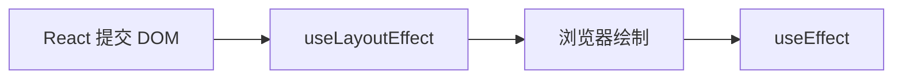

# React 卸载全局事件除了 useEffect 还有什么方式

> 一句话结论：函数组件里可以用 `useLayoutEffect`，它和 `useEffect` 一样能返回清理函数，依赖变化或组件卸载时 React 都会执行 cleanup；类组件则使用 `componentWillUnmount`。

## `useLayoutEffect` 清理全局事件

```tsx
import { useLayoutEffect } from 'react';

export function EscapeListener() {
  useLayoutEffect(() => {
    const handleKeyDown = (event: KeyboardEvent): void => {
      if (event.key === 'Escape') {
        console.info('close panel');
      }
    };

    window.addEventListener('keydown', handleKeyDown);

    return () => {
      window.removeEventListener('keydown', handleKeyDown);
    };
  }, []);

  return <section>Press Escape</section>;
}
```

添加和移除必须使用同一个函数引用。传入空依赖数组时监听器只注册一次，并在组件卸载时移除。

## 与 `useEffect` 的区别



| 对比项 | `useEffect` | `useLayoutEffect` |
| --- | --- | --- |
| 是否支持 cleanup | 支持 | 支持 |
| 卸载时能否移除事件 | 能 | 能 |
| 执行时机 | 通常在浏览器绘制后异步执行 | DOM 更新后、浏览器绘制前同步执行 |
| 是否阻塞绘制 | 不阻塞 | 会阻塞 |
| 推荐场景 | 全局事件、请求、普通订阅 | 同步读取或修改布局、防止页面闪烁 |

所以 `useLayoutEffect` **可以**清理全局事件，但普通 `window`、`document` 监听没有绘制前同步执行的要求，生产代码仍优先使用 `useEffect`。面试官问“除了 `useEffect` 还有什么”，直接回答 `useLayoutEffect` 即可，再补充它的执行时机区别。

## 类组件写法

```tsx
import { Component } from 'react';

export class EscapeListener extends Component {
  private readonly handleKeyDown = (): void => {
    console.info('keydown');
  };

  componentDidMount(): void {
    window.addEventListener('keydown', this.handleKeyDown);
  }

  componentWillUnmount(): void {
    window.removeEventListener('keydown', this.handleKeyDown);
  }

  render() {
    return <section>Press any key</section>;
  }
}
```

## 面试回答

> 函数组件除了 `useEffect`，还可以用 `useLayoutEffect` 返回 cleanup，组件卸载时 React 同样会执行它来移除全局事件。区别是 `useLayoutEffect` 在 DOM 更新后、浏览器绘制前同步执行，会阻塞绘制；`useEffect` 通常在绘制后异步执行。因此普通事件监听仍优先用 `useEffect`，只有事件绑定或清理必须和布局读写同步时才用 `useLayoutEffect`。如果是类组件，则在 `componentWillUnmount` 中清理。

## 补充边界

- JSX 的 `onClick` 等合成事件由 React 管理，组件卸载时不需要手动移除。
- `useRef`、`useMemo`、`useCallback` 本身没有卸载 cleanup 能力。
- `AbortController` 只能帮助批量移除原生监听器，不能感知 React 组件卸载，不是生命周期替代方案。

## 相关资料

- [useLayoutEffect 与 useEffect 的区别及底层原理](./useLayoutEffect、useEffetct区别及底层原理.md)
- [React `useLayoutEffect`](https://react.dev/reference/react/useLayoutEffect)
- [React `componentWillUnmount`](https://react.dev/reference/react/Component#componentwillunmount)
