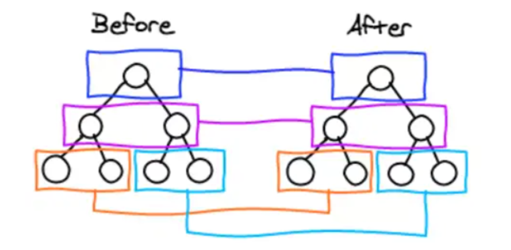

## react diff 原理

其实就是新旧虚拟 dom 的比对过程：

本质就是树的比对过程：
1、会插入、移动、删除这几个操作
2、然后在比对的过程如果有 key 的话可以减少删除、创建节点的开销，因为会用相同 key 去判别是否两者为同个元素

从树的层级看它不会跨层级比对

注：结合实际的场景看，如果父级的节点不一样了，说明这都不是一个组件了，跨层级让父级和子级去比对也就没有了意义

### 核心策略

-   同层比较，不跨层级对比：React 只会对比虚拟 DOM 树中「同一层级」的节点，不会跨层级移动节点（比如不会把父节点的子节点和子节点的子节点对比）。这种策略将 Diff 复杂度从 O (n³) 降低到 O (n)，保证了效率。
-   节点类型相同：复用节点，只更新属性：如果两个节点的 type 相同（比如都是 `
` 或同一个自定义组件），React 会复用该节点的真实 DOM，只对比并更新两者的 props 差异（比如 className、style 变化）。
-   节点类型不同：销毁旧节点，创建新节点：如果两个节点 type 不同（比如 `
` 变成 ``），React 会直接销毁旧节点对应的真实 DOM，创建并挂载新节点，不会做后续对比。

### 列表渲染为什么必须加 key？key 的作用是什么？

-   key 的作用：key 是列表项的「唯一标识」，帮助 React Diff 算法快速识别「哪些列表项是新增的、哪些是删除的、哪些是移动的」，从而复用已有节点，减少 DOM 操作，提升性能。

### 能不能用 index 作为 key？

-   不推荐（大部分场景，比如列表有增删、排序、筛选）：当列表发生增删、排序时，index 会重新分配（比如删除第一个项，后面所有项的 index 都会减 1），导致 key 与列表项的对应关系错乱。React 会误判为「节点属性更新」而非「节点移动 / 删除 / 新增」，进而导致：节点复用错误、组件状态错乱、不必要的 DOM 操作，性能变差。
-   可以用（特殊场景）：列表仅用于「展示」，不会有增删、排序、筛选操作，index 相对稳定，此时用 index 作为 key 无负面影响（比如静态列表）。
