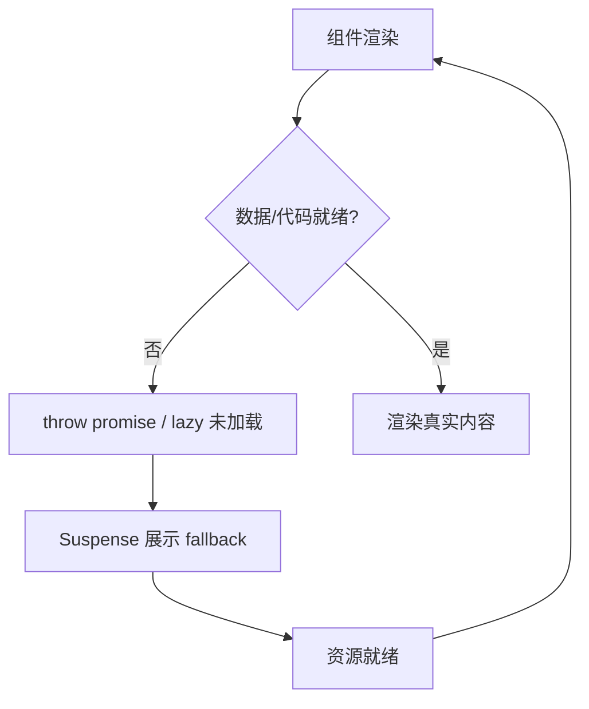

## React 18 核心新特性

### 并发模式

渲染任务可中断、可优先级调度，不会阻塞主线程，是 React 18 的底层基础。

### Suspense

**一句话结论**：声明式处理异步——组件/数据未就绪时自动展示 fallback，就绪后自动切换。

**使用场景**：

- 代码分割：配合 `React.lazy` 按需加载，首屏只加载必要代码。
- 异步数据获取：配合支持 Suspense 的库（SWR / React Query / Relay），加载中展示骨架屏。
- 局部骨架屏：嵌套多个 `Suspense`，让页面不同区域独立加载、互不阻塞。

**流程**：



**最小示例**：

```jsx
// 1. 代码分割：懒加载组件
const Detail = React.lazy(() => import('./Detail'));

function App() {
  return (
    <Suspense fallback={<Skeleton />}>
      <Detail />
    </Suspense>
  );
}
```

```jsx
// 2. 数据获取：组件读取未就绪数据时 throw promise，Suspense 捕获后展示 fallback
function wrapPromise(promise) {
  let status = 'pending';
  let result;
  const suspender = promise.then(
    (r) => { status = 'success'; result = r; },
    (e) => { status = 'error'; result = e; },
  );
  return {
    read() {
      if (status === 'pending') throw suspender; // 未就绪 → 抛给 Suspense
      if (status === 'error') throw result;
      return result;
    },
  };
}

function Profile() {
  const user = wrapPromise(fetch('/api/user').then((r) => r.json())).read();
  return <div>{user.name}</div>;
}

function App() {
  return (
    <Suspense fallback={<Skeleton />}>
      <Profile />
    </Suspense>
  );
}
```

**补充**：React 18 官方开箱即用的是代码分割（`React.lazy`）；数据获取式 Suspense 需配合第三方库或手动 `throw promise`。

### useTransition

**一句话结论**：把"非紧急更新"标记为低优先级，让输入等紧急更新不被卡住；返回 `[isPending, startTransition]`。

**使用场景**：

- 搜索框实时联想：输入是紧急更新，结果列表是过渡更新。
- Tab / 路由切换：内容渲染慢时，让切换动作先响应。
- 大列表过滤 / 排序：计算量大，用过渡避免 UI 卡顿。

**最小示例**：

```jsx
function Search() {
  const [query, setQuery] = useState('');
  const [result, setResult] = useState([]);
  const [isPending, startTransition] = useTransition();

  function onChange(e) {
    setQuery(e.target.value);                // 紧急：输入框立即响应
    startTransition(() => {
      setResult(filterList(e.target.value)); // 非紧急：可被打断、延迟
    });
  }

  return (
    <>
      <input value={query} onChange={onChange} />
      {isPending ? <Spinner /> : <ResultList data={result} />}
    </>
  );
}
```

**补充**：`isPending` 为 `true` 表示过渡更新尚未完成，可用它展示加载态。

### useDeferredValue

**一句话结论**：返回一个值的"延迟版本"——原值高优先级、延迟值低优先级，延迟值的更新被推迟到紧急更新之后。

**使用场景**：

- 搜索联想、长列表过滤：输入框立即响应，列表延迟渲染。
- 拿不到 `setState` 控制权的场景：子组件 / 第三方库内部自己管理状态，你只能在父级传值。

**最小示例**：

```jsx
function Search() {
  const [query, setQuery] = useState('');
  const deferredQuery = useDeferredValue(query);

  return (
    <>
      <input value={query} onChange={(e) => setQuery(e.target.value)} />
      {/* 用延迟值过滤，输入时列表可稍后渲染，不阻塞输入框 */}
      <SlowList text={deferredQuery} />
    </>
  );
}
```

**补充**：`useDeferredValue` 不返回 `isPending`；需要判断"延迟值是否落后于原值"时可比较 `deferredQuery !== query`。

### 核心区别：useTransition vs useDeferredValue

| 维度 | useTransition | useDeferredValue |
|---|---|---|
| 控制对象 | 更新动作（哪个 setState 低优先级） | 值本身（哪个值的更新延迟） |
| 用法 | `startTransition(() => setState(...))` | `const d = useDeferredValue(value)` |
| 是否返回 isPending | 是 | 否 |
| 适用场景 | 你能控制 `setState` 的地方 | 拿不到更新控制权（第三方库 / 子组件） |

**一句话区分**：`useTransition` 控制的是**更新动作**的优先级，`useDeferredValue` 控制的是**值本身**的更新时机。能用 `useTransition` 就用它（还能拿到 `isPending`）；只有拿不到 `setState` 控制权时才用 `useDeferredValue`。
