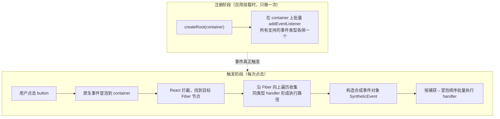
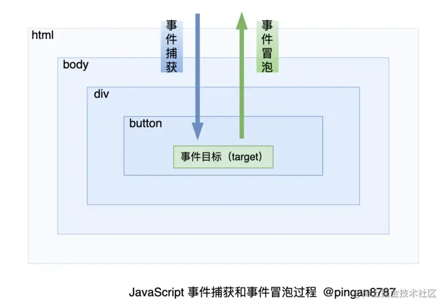
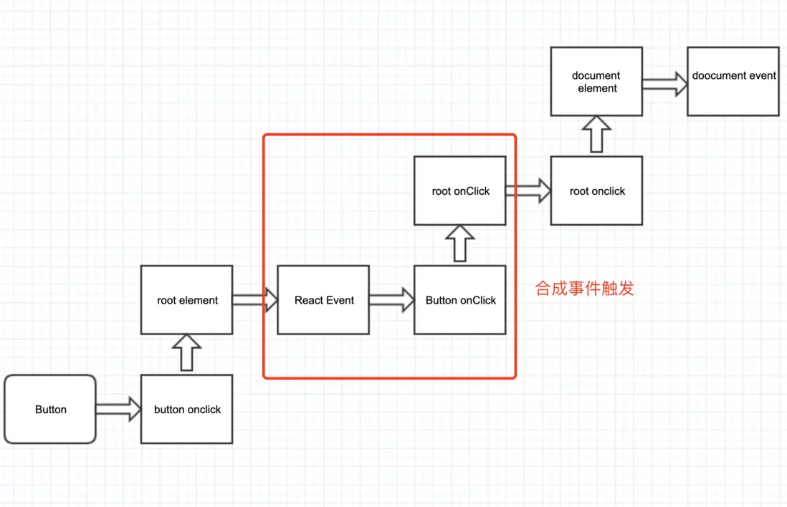

## react 事件机制

> 一句话结论：React 事件 = **合成事件（SyntheticEvent）+ 事件委托**。JSX 里写的 `onClick` 并不绑定在真实 DOM 上，而是统一委托到根容器节点；触发时 React 沿虚拟 DOM 树收集同类型 handler 并依次执行，从而抹平浏览器差异、减少内存占用。



### 原生的事件流



1. 事件捕获
   当某个元素触发某个事件（如  onclick ），顶层对象  document  就会发出一个事件流，随着 DOM 树的节点向目标元素节点流去，直到到达事件真正发生的目标元素。在这个过程中，事件相应的监听函数是不会被触发的。
2. 事件目标
   当到达目标元素之后，执行目标元素该事件相应的处理函数。如果没有绑定监听函数，那就不执行。
3. 事件冒泡
   从目标元素开始，往顶层元素传播。途中如果有节点绑定了相应的事件处理函数，这些函数都会被触发一次。如果想阻止事件起泡，可以使用  e.stopPropagation()  或者  e.cancelBubble=true（IE）来阻止事件的冒泡传播。

总结：捕获 -> 执行 -> 冒泡

### react 事件流

1、事件委托
简单理解就是将一个响应事件委托到另一个元素。
当子节点被点击时，click 事件向上冒泡，父节点捕获到事件后，我们判断是否为所需的节点，然后进行处理。其优点在于减少内存消耗和动态绑定事件。

2、执行顺序


3、代码示例

```javascript
import React from "react";

class App extends React.Component<any, any> {
    parentRef: any;
    childRef: any;
    constructor(props: any) {
        super(props);
        this.parentRef = React.createRef();
    }
    componentDidMount() {
        this.parentRef.current?.addEventListener("click", (e) => {
            console.log("阻止原生事件冒泡~");
            e.stopPropagation();
        });
        document.addEventListener("click", () => {
            console.log("原生事件：document DOM 事件监听！");
        });
    }
    parentClickFun = (e: any) => {
        console.log("阻止合成事件冒泡~");
    };
    render() {
        return (
            <div ref={this.parentRef} onClick={this.parentClickFun}>
                点击测试“合成事件和原生事件是否可以混用”
            </div>
        );
    }
}
export { App };
// 结果： 阻止原生事件冒泡~
```

```javascript
import React from "react";

class App extends React.Component<any, any> {
    parentRef: any;
    childRef: any;
    constructor(props: any) {
        super(props);
        this.parentRef = React.createRef();
    }
    componentDidMount() {
        this.parentRef.current?.addEventListener("click", (e) => {
            console.log("阻止原生事件冒泡~");
        });
        document.addEventListener("click", () => {
            console.log("原生事件：document DOM 事件监听！");
        });
    }
    parentClickFun = (e: any) => {
        e.stopPropagation();
        console.log("阻止合成事件冒泡~");
    };
    render() {
        return (
            <div ref={this.parentRef} onClick={this.parentClickFun}>
                点击测试“合成事件和原生事件是否可以混用”
            </div>
        );
    }
}
export { App };
/**
 * 结果：
 * 阻止原生事件冒泡~
 * 阻止合成事件冒泡~
 * 原生事件：document DOM 事件监听！
 * */
```

总结: react 的事件都会被绑定在 document(react16)/根节点(react17) 上，在冒泡阶段触发

### 合成事件与原生事件的区别

| 维度 | 原生 DOM 事件 | React 合成事件 |
| --- | --- | --- |
| 绑定位置 | 每个真实 DOM 节点各自 `addEventListener` | 统一委托在根节点（`#root`）上 |
| 事件对象 | 浏览器原生 `Event`，各浏览器实现有差异 | `SyntheticEvent` 包装原生事件，**跨浏览器 API 统一** |
| 事件对象生命周期 | 常驻，可异步访问 | 默认用后回收（React 17 前有事件池复用），异步读取需 `e.persist()` 或取 `e.nativeEvent` |
| 阻止默认行为 | `e.preventDefault()` | 相同，但必须显式调用，`return false` 无效 |
| 与渲染的关系 | 手动绑定/解绑，易漏 | handler 存在 Fiber 的 props 上，组件卸载随 Fiber 一起销毁，**天然防止内存泄漏** |
| 命名 | 全小写 `onclick` | 驼峰 `onClick` |

> React 17 之后移除了事件池机制（合成事件对象不再被回收复用），`e.persist()` 变成了空操作。

### 事件委托的实现细节

1. `onClick` 等 props 只是普通属性，保存在 Fiber 节点的 `memoizedProps` 上，**真实 DOM 上没有任何监听器**（`capture` 类事件除外，会绑到真实节点）。
2. `createRoot(container)` 挂载时，React 在 `container` 上为每种支持的事件调用一次原生 `addEventListener` —— 整个应用只有这几十个监听器。
3. 事件触发时，原生事件冒泡到根节点，React 通过 `e.target` 找到目标 Fiber，再沿 `return` 指针向上收集所有同名 handler，形成一条执行路径。
4. 按路径顺序（先捕获后冒泡）依次调用，并把原生事件包装成 SyntheticEvent 传入 —— 所以 `e.stopPropagation()` 能同时阻断合成与原生的继续传播。

```jsx
// 验证：真实 DOM 上没有 onClick 监听器，监听器在 #root 上
function App() {
  return <button onClick={() => console.log("clicked")}>click</button>;
}
// DevTools → Elements → button：Event Listeners 面板为空
// #root 上：click 监听器（由 React 注册）
```

为什么委托到根节点而不是 document？

- React 16 绑在 `document` 上，多个 React 应用共存（如微前端、弹窗挂 body 下）会互相干扰，且 `document` 上难以正确区分捕获/冒泡语义。
- React 17 起改为绑在各自渲染容器的根节点，实现应用间事件隔离，这也是 17 的 breaking change 之一。

> 想看这套机制的可运行实现，见 [mini-react 事件系统](../../mini-react/docs/events.md)：根容器注册派发器 + DOM→Fiber 映射表 + 沿 `return` 指针收集捕获/冒泡双路径，附可打开验证的示例页。

### 想要阻止冒泡同时阻止绑定在同个元素后面的事件继续执行

1、调用 e.nativEvent.stopImmediatePropagation();

2、代码示例

```javascript
<!DOCTYPE html>
<html>
    <head>
        <style>
            p {
                height: 30px;
                width: 150px;
                background-color: #ccf;
            }
            div {
                height: 30px;
                width: 150px;
                background-color: #cfc;
            }
        </style>
    </head>
    <body>
        <div>
            <p>paragraph</p>
        </div>
        <script>
            const p = document.querySelector("p");
            p.addEventListener(
                "click",
                (event) => {
                    alert("我是 p 元素上被绑定的第一个监听函数");
                },
                false
            );

            p.addEventListener(
                "click",
                (event) => {
                    alert("我是 p 元素上被绑定的第二个监听函数");
                    event.stopImmediatePropagation();
                    // 执行 stopImmediatePropagation 方法，阻止 click 事件冒泡，并且阻止 p 元素上绑定的其他 click 事件的事件监听函数的执行。
                },
                false
            );

            p.addEventListener(
                "click",
                (event) => {
                    alert("我是 p 元素上被绑定的第三个监听函数");
                    // 该监听函数排在上个函数后面，该函数不会被执行
                },
                false
            );

            document.querySelector("div").addEventListener(
                "click",
                (event) => {
                    alert("我是 div 元素，我是 p 元素的上层元素");
                    // p 元素的 click 事件没有向上冒泡，该函数不会被执行
                },
                false
            );
        </script>
    </body>
</html>

```

### 为什么能减少内存消耗

React 的事件机制可以减少内存消耗的主要原因有以下几点：

1、事件委托：React 使用了事件委托的机制，将事件监听器绑定在父级元素上而不是每个子元素上。这样一来，只需要绑定一次事件监听器，就可以处理多个子元素上的事件。这减少了事件监听器的数量，从而减少了内存消耗。

2、合成事件：React 的合成事件是对原生事件的封装，它提供了一种高效的事件处理方式。合成事件是基于事件池的概念，每次触发事件时，React 会从事件池中复用事件对象，而不是每次都创建新的事件对象。这样可以减少内存分配和垃圾回收的开销。

3、事件回收：React 会在组件卸载时自动回收事件监听器和合成事件对象，防止内存泄漏。当组件被销毁时，React 会自动清理事件监听器和合成事件对象，释放相关的内存资源。

综上所述，React 的事件机制通过事件委托、合成事件和事件回收等方式，有效地减少了内存消耗。它通过复用事件对象、减少事件监听器的数量，并及时清理不再需要的事件对象和监听器，提高了性能和内存利用率
