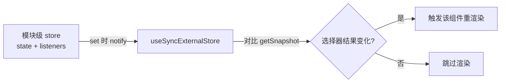
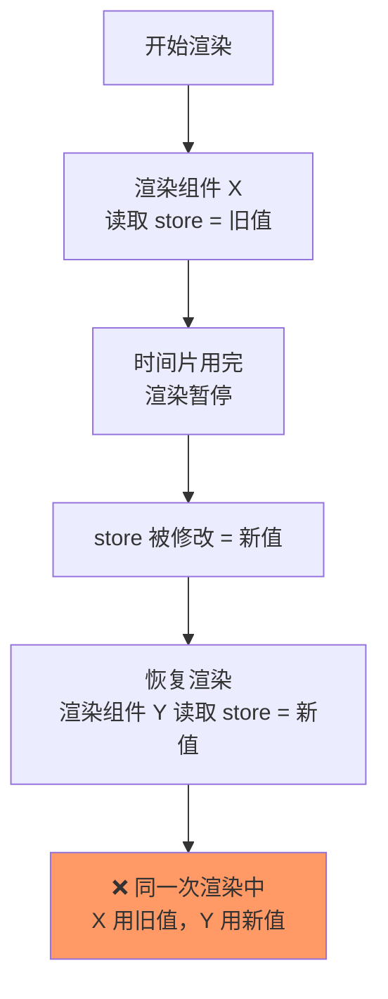
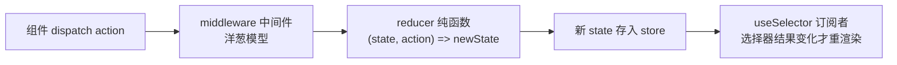
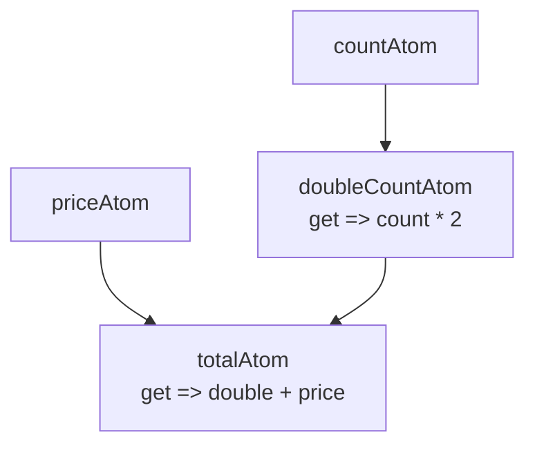
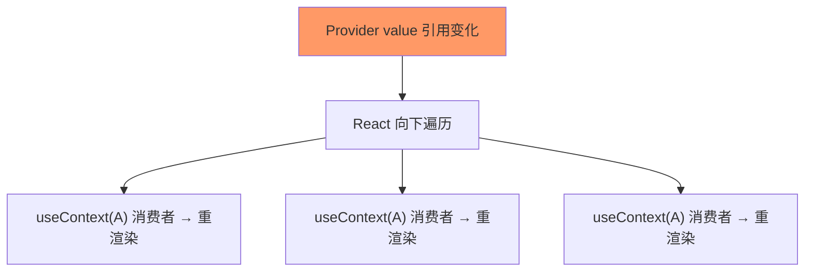

# 常见状态管理方案对比？Context 的缺陷是什么？

## 主流方案对比

- **Redux**：单向数据流、可预测、中间件生态丰富，适合超大型、状态逻辑复杂的项目，缺点是样板代码多、上手成本高；
- **Zustand / Jotai**：轻量 Hooks 友好，无 Provider 嵌套地狱，API 简洁，适合中小型项目，开发效率高；
- **React Context**：原生 API，无需引入第三方库，适合低频更新的全局状态（如主题、语言）。

**选型决策表**：

| 场景 | 推荐 | 理由 |
|---|---|---|
| 主题、语言、当前登录用户（低频） | Context | 零依赖，原生够用 |
| 中小项目通用状态、快速原型 | Zustand | 样板最少，选择器细粒度订阅 |
| 状态之间大量派生关系（表单联动、画布节点） | Jotai | atom 依赖图自动追踪 |
| 超大团队、强规范、时间旅行调试 | Redux Toolkit | 单向数据流可预测，DevTools 生态 |
| 服务端数据的缓存与请求 | React Query / SWR / RTK Query | 服务端状态 ≠ 客户端状态，不该塞进全局 store |

## 共通原理：useSyncExternalStore

**一句话结论**：Redux / Zustand / Jotai 本质都是"React 外部的 store + 订阅机制"，与 React 的桥接全靠 React 18 的 `useSyncExternalStore`。

```js
const value = useSyncExternalStore(subscribe, getSnapshot);
//                                    ↑注册回调    ↑读取当前值
```



### 它解决什么问题："撕裂"（tearing）

React 18 的并发渲染是**可暂停**的：渲染到一半可以让出主线程，之后再继续。问题就出在这个"暂停"上——



类比：一张照片从中间撕开，上半身是去年的你、下半身是今年的你——**同一次渲染里前后不一致**，这就是"撕裂"。

- React 内部的状态（useState）不会撕裂：同一次渲染里 state 是快照，React 自己管。
- **外部 store**（Zustand/Redux 的变量在 React 外面）React 管不到，并发模式下就可能撕裂。
- React 18 之前，库只能自己 hack（渲染中途检测到变化就强制重渲），React 18 把这个 hack 官方化成了 `useSyncExternalStore`。

**防撕裂机制（源码层面一句话）**：渲染结束后，React 会再调一次 `getSnapshot` 对比——如果渲染中途 store 变了（快照和渲染时不一致），就废弃这次渲染、从头重渲，保证同一次渲染里所有组件读到的值来自同一时刻。

### 最小使用示例：手写一个全局计数器

```jsx
import { useSyncExternalStore } from 'react';

// ① 一个 React 外部的 store：就是一个模块级变量 + 订阅者列表
let count = 0;
const listeners = new Set();

function increment() {
  count += 1;
  listeners.forEach((l) => l());   // 通知所有订阅者
}

// ② 用 useSyncExternalStore 把它接进 React
function useCount() {
  return useSyncExternalStore(
    (callback) => {              // subscribe：怎么订阅
      listeners.add(callback);
      return () => listeners.delete(callback);  // 返回取消订阅
    },
    () => count,                 // getSnapshot：怎么读当前值
  );
}

// ③ 正常使用
function Counter() {
  const count = useCount();
  return <button onClick={increment}>{count}</button>;
}
```

**三个参数的职责**：

| 参数 | 职责 | 注意点 |
|---|---|---|
| `subscribe` | 注册"store 变化时通知我"的回调 | 返回取消订阅函数 |
| `getSnapshot` | 返回当前值 | **必须返回缓存值**，每次返回新对象会死循环 |
| `getServerSnapshot` | SSR 时读值用的 | 可选 |

**实用例子——订阅浏览器数据源**：

```jsx
function useOnline() {
  return useSyncExternalStore(
    (cb) => {
      window.addEventListener('online', cb);
      window.addEventListener('offline', cb);
      return () => {
        window.removeEventListener('online', cb);
        window.removeEventListener('offline', cb);
      };
    },
    () => navigator.onLine,   // 当前是否联网
  );
}
```

**什么时候直接用它**：日常业务几乎不用手写（选 Zustand/Redux 已封装好）。直接用的场景：面试考点；封装自己的外部状态（订阅 `window.innerWidth`、WebSocket、localStorage）；读状态库源码。这也是为什么这些库都不用 Context 传递 store。

## Redux

### 原理

**一句话结论**：单一 store 集中存状态，`dispatch(action)` → reducer 纯函数 → 新 state → 通知订阅者，全程不可变、可回放。



**中间件原理**：`dispatch` 被中间件层层包裹，形成洋葱模型：

```js
// applyMiddleware 简化实现：中间件从后往前包裹 dispatch
const applyMiddleware = (...middlewares) => (createStore) => (reducer) => {
  const store = createStore(reducer);
  let dispatch = store.dispatch;
  middlewares.slice().reverse().forEach((mw) => {
    dispatch = mw(store)(dispatch); // thunk 就是在这里拦截函数型 action
  });
  return { ...store, dispatch };
};
```

**订阅原理**：`useSelector` 内部基于 `useSyncExternalStore`，只对"选择器计算结果"做引用比较——`state.counter.value` 没变，该组件就不渲染。

### 使用场景

- 超大型项目、多人团队需要强规范：所有变更必经 action，可审计、可回放。
- 需要时间旅行调试、Action 日志、持久化回放。
- 已有生态依赖：RTK Query（服务端数据）、 redux-saga（复杂异步流）。

### 示例（Toolkit 写法）

```js
// store/counterSlice.js —— 一个功能一个 slice
import { createSlice } from '@reduxjs/toolkit';

const counterSlice = createSlice({
  name: 'counter',
  initialState: { value: 0 },
  reducers: {
    incremented: (state) => { state.value += 1; },  // 内置 Immer，可直接改
    amountAdded: (state, action) => { state.value += action.payload; },
  },
});

export const { incremented, amountAdded } = counterSlice.actions;
export default counterSlice.reducer;
```

```jsx
// main.jsx —— 根组件必须包 Provider
import { Provider } from 'react-redux';

<Provider store={store}>
  <App />
</Provider>
```

```jsx
// 组件中使用
import { useSelector, useDispatch } from 'react-redux';
import { incremented, amountAdded } from './store/counterSlice';

function Counter() {
  const count = useSelector((state) => state.counter.value); // 选择器订阅
  const dispatch = useDispatch();
  return (
    <>
      <button onClick={() => dispatch(incremented())}>+1</button>
      <button onClick={() => dispatch(amountAdded(10))}>+10</button>
      <p>{count}</p>
    </>
  );
}
```

## Zustand

### 原理

**一句话结论**：`create` 返回一个 hook，状态存在**模块级闭包**里（所以天然全局单例、不需要 Provider），组件通过选择器订阅 state 的某个切片。

**20 行手写 mini-zustand**：

```js
import { useSyncExternalStore } from 'react';

function create(createState) {
  let state;                    // 模块级闭包存状态 → 天然单例
  const listeners = new Set();  // 订阅者集合

  const setState = (partial) => {
    state = { ...state, ...partial };
    listeners.forEach((l) => l());       // 通知所有订阅者
  };

  state = createState(setState, () => state);

  const useStore = (selector = (s) => s) =>
    useSyncExternalStore(
      (cb) => { listeners.add(cb); return () => listeners.delete(cb); },
      () => selector(state),   // 选择器：只订阅切片，结果不变就不渲染
    );

  return useStore;
}
```

**关键点**：因为没有 Provider，`useCounterStore.getState()` 可以在组件外（事件回调、工具函数）直接读写状态——这是 Context 做不到的。

### 使用场景

- 中小型项目、快速迭代：想要全局状态但不想写 action/reducer。
- 需要在 React 组件外访问状态（路由守卫、WebSocket 回调里更新）。
- 替代"层层传 props"，且希望按字段细粒度订阅。

### 示例

```js
// store/useCounterStore.js —— 全部代码就这些
import { create } from 'zustand';

const useCounterStore = create((set, get) => ({
  count: 0,
  increment: () => set((s) => ({ count: s.count + 1 })),
  add: (amount) => set((s) => ({ count: s.count + amount })),
}));

export default useCounterStore;
```

```jsx
// 组件中使用 —— 无需 Provider 包裹
import useCounterStore from './store/useCounterStore';

function Counter() {
  const count = useCounterStore((s) => s.count);       // 只有 count 变才渲染
  const increment = useCounterStore((s) => s.increment); // 函数引用稳定
  return <button onClick={increment}>{count}</button>;
}
```

## Jotai

### 原理

**一句话结论**：atom 只是"状态声明"（一个配置对象），真正的值存在全局 Store 的 Map 里；派生 atom 之间形成**依赖图**，某个 atom 变化时只通知依赖它的下游。



```js
// atom 原理示意：本身不存值
const countAtom = atom(0);
// countAtom ≈ { init: 0, read: ..., write: ... }
// 值存在 Store: Map(atom → value)，useAtom 内部用 useSyncExternalStore 订阅该 atom
```

**与 Zustand 的心智差异**：Zustand 是"集中式大 store"（一次定义所有字段，类似 Redux）；Jotai 是"原子化分散"（每个状态独立声明，自由组合派生）。

### 使用场景

- 状态之间有大量派生/联动关系：如表单字段校验、画布节点连线。
- 细粒度状态很多、逐个建模比建一个大 store 更自然。
- 想要"组件内私有 atom"再按需提升为全局（atom 可写在组件里）。

### 示例

```js
// atoms.js
import { atom } from 'jotai';

export const countAtom = atom(0);                          // 基础 atom
export const doubleCountAtom = atom((get) => get(countAtom) * 2); // 派生 atom
```

```jsx
import { useAtom, useAtomValue } from 'jotai';
import { countAtom, doubleCountAtom } from './atoms';

function Counter() {
  const [count, setCount] = useAtom(countAtom);
  const double = useAtomValue(doubleCountAtom);
  return (
    <>
      <button onClick={() => setCount((c) => c + 1)}>{count}</button>
      <p>双倍：{double}</p>
    </>
  );
}
```

## React Context

### 原理

**一句话结论**：Context 走的是 React 自身渲染机制——Provider 的 `value` 引用变化时，React 从该节点向下渲染，**所有消费组件无差别重渲染**，没有订阅、没有选择器。



**对比**：Zustand 是"变了通知订阅了这个字段的组件"；Context 是"变了把整个子树里所有消费者拉出来渲染一遍"。粒度差异的根源就在这——一个有订阅机制，一个靠 React 树遍历。

### 使用场景

- 低频全局状态：主题、语言、当前用户信息。
- 依赖注入：把实例/配置传给深层组件（如路由、主题引擎对象，引用稳定不变化）。
- 库开发中提供配置（AntD 的 ConfigProvider）。

### 示例

```jsx
import { createContext, useContext, useState } from 'react';

const ThemeContext = createContext();

function App() {
  const [theme, setTheme] = useState('dark');
  return (
    <ThemeContext.Provider value={{ theme, setTheme }}>
      <Page />
    </ThemeContext.Provider>
  );
}

// 任意深层组件直接取，不用逐层传 props
function Button() {
  const { theme, setTheme } = useContext(ThemeContext);
  return <button className={theme} onClick={() => setTheme('light')}>切换</button>;
}
```

## Context 的缺陷

- **粒度粗**：Provider 的 value 变化时，所有消费该 Context 的组件都会强制重渲染，无法只订阅部分状态；
- **不适合高频更新**：比如全局实时数据流（鼠标位置、滚动位置、实时行情），会引发大面积重渲染，性能差；
- **深层传递麻烦**：跨多层组件传递需要逐层嵌套 Provider，多 Context 时会出现嵌套地狱；
- **组件外无法访问**：必须通过 `useContext` 在组件里读，工具函数、事件回调外拿不到。

**粒度粗的反例与缓解**：

```jsx
const ValueContext = createContext();
const DispatchContext = createContext();

// ❌ value 是内联对象，每次 App 渲染都是新引用 → 所有消费者全部重渲染
<ValueContext.Provider value={{ count, user, cart }}>
  <Page />
</ValueContext.Provider>

// ✅ 拆分：只用到 dispatch 的组件不因 value 变化重渲染
<ValueContext.Provider value={count}>
  <DispatchContext.Provider value={setCount}>
    <Page />
  </DispatchContext.Provider>
</ValueContext.Provider>

// ✅ 缓解不了的场景：count 高频变化 + 消费者多 → 换 Zustand 等订阅式方案
```

## 选择建议

低频全局状态用 Context；中小项目用 Zustand；状态有大量派生关系用 Jotai；超大团队要强规范和生态用 Redux Toolkit；服务端数据优先 React Query / SWR，不要塞进全局 store。
