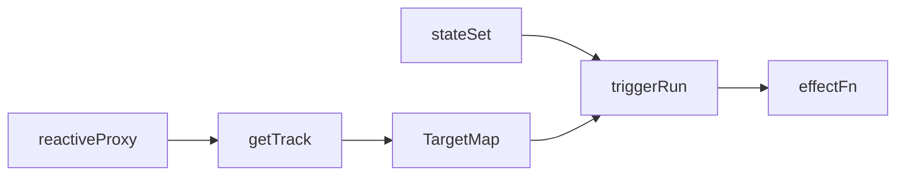
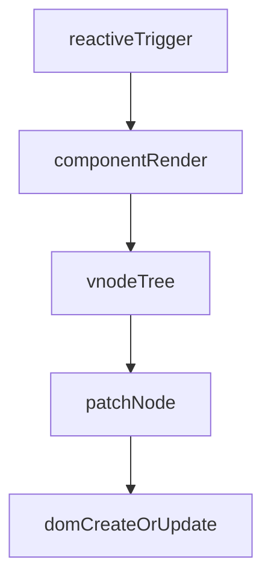
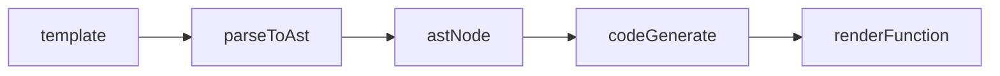
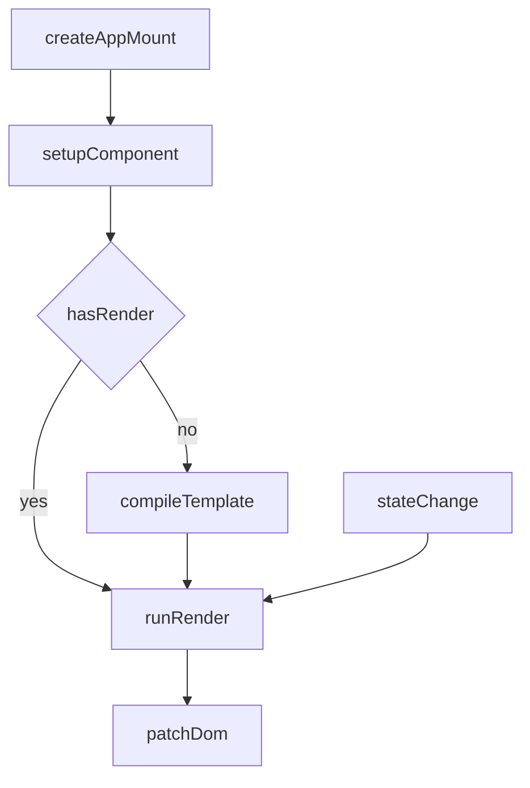
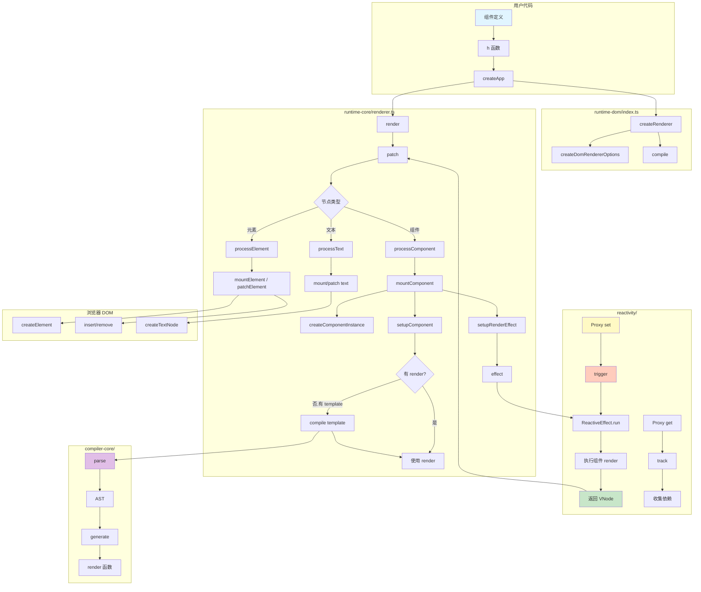
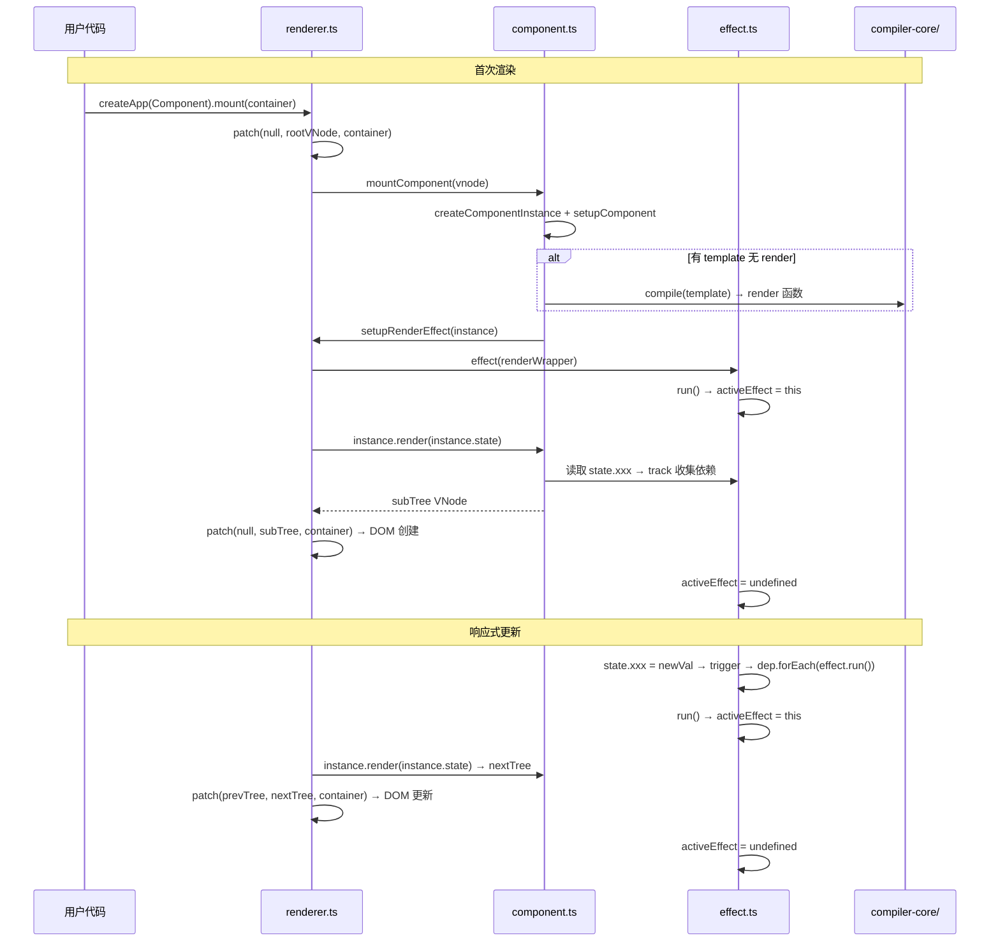
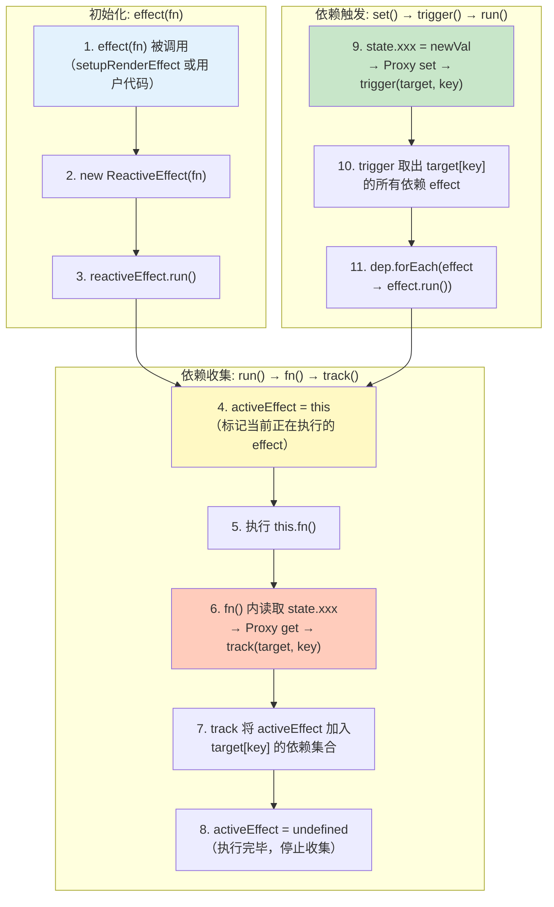
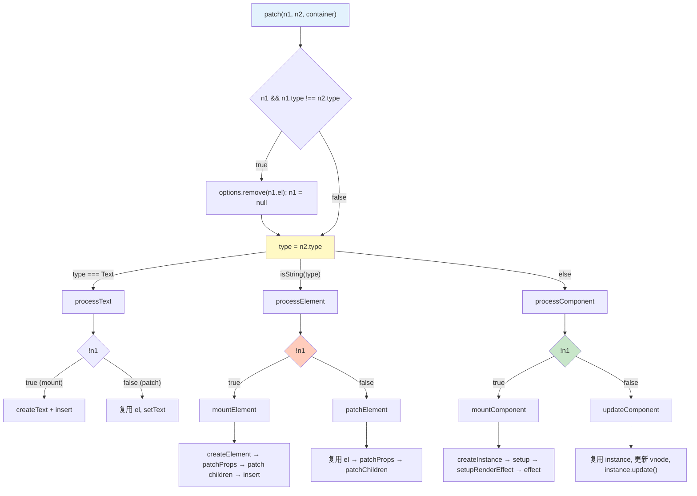
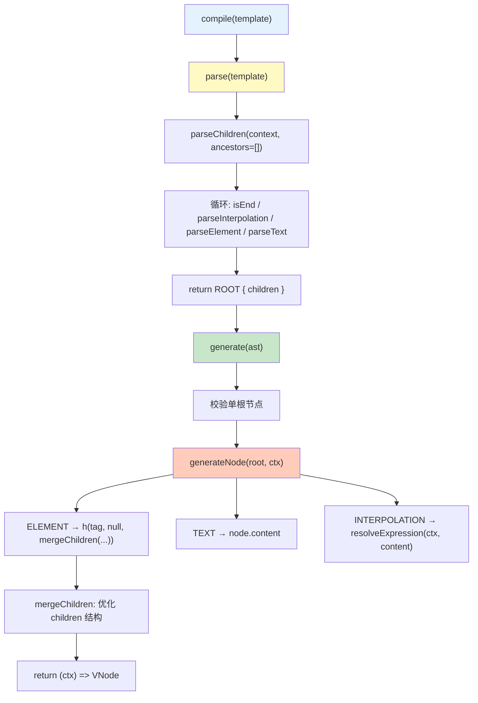
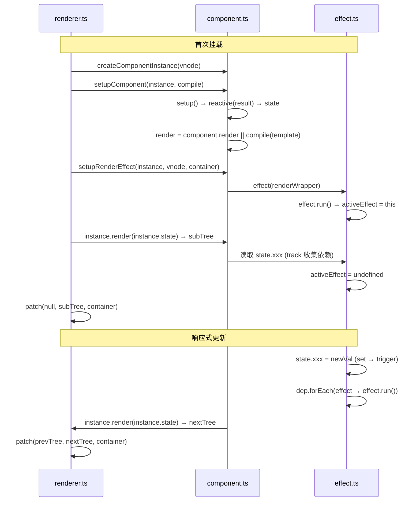

# Min-Vue

一个最小可运行的 Vue3 原理实现，覆盖「运行时 + 编译器基础」完整链路，目标是让你在 1-2 小时内快速建立整体心智模型。

## 你将掌握什么

- 响应式：`reactive`、`effect`、`track/trigger`
- 运行时：VNode、组件实例、`mount + patch`
- 编译器：`template -> AST -> render`
- 串联：`createApp` 如何把编译产物接到渲染更新链路

## 项目结构

```text
min-vue/
├── src/
│   ├── reactivity/
│   │   ├── effect.ts
│   │   └── reactive.ts
│   ├── runtime-core/
│   │   ├── component.ts
│   │   ├── h.ts
│   │   ├── renderer.ts
│   │   └── vnode.ts
│   ├── runtime-dom/
│   │   └── index.ts
│   ├── compiler-core/
│   │   ├── ast.ts
│   │   ├── parse.ts
│   │   ├── codegen.ts
│   │   └── compile.ts
│   └── index.ts
├── examples/
│   ├── basic.html
│   └── basic.ts
└── tests/
    └── reactivity.spec.ts
```

## 阶段 1：响应式闭环

一句话结论：读取数据时收集依赖，修改数据时触发依赖重新执行。



最小示例：

```ts
const state = reactive({ count: 0 });
let view = "";

effect(() => {
  view = `count=${state.count}`;
});

state.count += 1;
// view => "count=1"
```

## 阶段 2：运行时渲染闭环

一句话结论：组件 render 返回 VNode，renderer 负责把 VNode 同步到真实 DOM。



最小示例：

```ts
const App = {
  render(ctx) {
    return h("div", null, `count: ${ctx.count}`);
  },
  setup() {
    return { count: 0 };
  }
};
```

## 阶段 3：编译器基础闭环

一句话结论：把模板字符串解析成 AST，再生成可执行 render 函数。



最小示例：

```ts
const render = compile("<div>count: {count}</div>");
const vnode = render({ count: 1 });
```

## 阶段 4：运行时 + 编译器串联

一句话结论：`createApp` 挂载组件时，若组件无 render 则先编译 template，再进入响应式更新循环。



## 运行与验证

```bash
cd interview/vue/min-vue
pnpm config set registry https://registry.npmmirror.com
pnpm install
pnpm dev
```

打开 `http://localhost:5173/examples/basic.html`，你会看到页面里的 `count` 每秒 +1。

测试：

```bash
pnpm test
```

## 调用链路详解

### 0. 模块速览

| 目录 | 核心文件 | 职责 |
|------|----------|------|
| `reactivity/` | `effect.ts`, `reactive.ts` | 响应式系统：Proxy 代理 + 依赖收集/触发 |
| `runtime-core/` | `vnode.ts`, `h.ts`, `component.ts`, `renderer.ts` | 平台无关运行时：VNode 定义、组件实例、patch 渲染 |
| `runtime-dom/` | `index.ts` | 浏览器 DOM 操作 + createApp 入口 |
| `compiler-core/` | `parse.ts`, `ast.ts`, `codegen.ts`, `compile.ts` | 模板编译器：template → AST → render 函数 |

### 1. 整体架构图



### 2. 完整渲染流程时序图



### 3. 响应式系统详细流程

#### 四个核心函数

| 函数 | 位置 | 作用 |
|------|------|------|
| `reactive(target)` | `reactive.ts` | 创建 Proxy 代理对象，拦截 get/set |
| `effect(fn)` | `effect.ts` | 创建 ReactiveEffect 并立即执行 fn，返回 stop 函数 |
| `track(target, key)` | `effect.ts` | 依赖收集：把当前 activeEffect 注册到 target[key] 的依赖集合中 |
| `trigger(target, key)` | `effect.ts` | 依赖触发：遍历 target[key] 的依赖集合并重新执行每个 effect |

**关键桥梁变量**：`let activeEffect: ReactiveEffect | undefined` — 模块级全局变量，由 `ReactiveEffect.run()` 在执行 fn 前设置 `activeEffect = this`，fn 执行后设为 `undefined`。**只有在 effect 回调内读取响应式数据时，track 才会收集依赖**。

#### 主流程图



#### 依赖收集数据结构

```
// effect.ts 模块级变量
let activeEffect: ReactiveEffect | undefined;  // 当前正在执行的 effect

// 依赖存储
targetMap: WeakMap<object, KeyToDepMap>
    └── depsMap: Map<PropertyKey, Dep>
        └── dep: Set<ReactiveEffect>

// 示例
state = reactive({ count: 0, name: 'vue' })

targetMap.get(state) → Map {
  'count' → Set { effect1, effect2 },   // effect1 和 effect2 都依赖 state.count
  'name'  → Set { effect1 }             // 只有 effect1 依赖 state.name
}
```

### 4. Patch 详细流程

#### 核心函数一览（renderer.ts）

| 函数 | 作用 |
|------|------|
| `patch(n1, n2, container)` | 入口：类型变了则销毁旧的，否则按 n2.type 分发到 processText / processElement / processComponent |
| `processText` | 处理文本 VNode：无 n1 则 createTextNode + insert，有 n1 则复用 el 并 setText |
| `processElement` | 处理元素 VNode：无 n1 → mountElement，有 n1 → patchElement |
| `mountElement(vnode, container)` | 首次挂载元素：createElement → patchProp → 递归 patch children → insert |
| `patchElement(n1, n2, container)` | 更新元素：复用 el → patchProps → patchChildren |
| `patchProps(el, old, new)` | 对比新旧 props：新增/更新属性，移除不存在的属性 |
| `patchChildren(n1, n2, el, container)` | 对比新旧 children：按 string / Array / null 三种情况处理，Array 时按索引逐个 patch |
| `processComponent` | 处理组件 VNode：无 n1 → mountComponent，有 n1 → updateComponent |
| `mountComponent(vnode, container)` | 首次挂载组件：createComponentInstance → setupComponent → setupRenderEffect → effect |
| `updateComponent(n1, n2)` | 更新组件：复用 instance，更新 vnode 引用，调用 instance.update() 重新执行 effect |

> `patch` 函数有两层 `!n1` 判断，各司其职：
> - **第一层**：`n1 && n1.type !== n2.type` — 类型变了，销毁旧 DOM 并当作全新挂载
> - **第二层**：每个 handler 内的 `!n1` — 判断是 mount 还是 update

#### 主流程图



### 5. 编译器流水线详细流程

#### 核心函数一览

| 文件 | 函数 | 作用 |
|------|------|------|
| `compile.ts` | `compile(template)` | 入口：parse → generate，返回 `(ctx) => VNode` 渲染函数 |
| `parse.ts` | `parse(template)` | 创建 ParserContext，调用 parseChildren，返回 ROOT AST |
| `parse.ts` | `parseChildren(context, ancestors)` | 递归下降解析：循环调用 isEnd 判断终止，否则按前缀分发到 parseInterpolation / parseElement / parseText |
| `parse.ts` | `parseElement(context, ancestors)` | 解析 `<tag>children</tag>`：正则匹配开始标签 → advanceBy → 递归 parseChildren → 匹配结束标签 → advanceBy |
| `parse.ts` | `parseInterpolation(context)` | 解析 `&#123;&#123; expression &#125;&#125;`：找到 `&#125;&#125;` → advanceBy → 返回 INTERPOLATION 节点 |
| `parse.ts` | `parseText(context)` | 解析纯文本：找到最近的 `<` 或 `&#123;&#123;` 位置 → advanceBy → 返回 TEXT 节点 |
| `parse.ts` | `isEnd(context, ancestors)` | 判断是否终止：source 为空 或 遇到祖先的结束标签 |
| `parse.ts` | `advanceBy(context, n)` | 消费 source 的前 n 个字符：`context.source = source.slice(n)` |
| `codegen.ts` | `generate(ast)` | 校验单根节点 → 调用 generateNode → 返回 `(ctx) => VNode` |
| `codegen.ts` | `generateNode(node, ctx)` | 按 node.type 分发：ELEMENT → h() 调用，TEXT → node.content，INTERPOLATION → resolveExpression |
| `codegen.ts` | `mergeChildren(children)` | 优化 children：全 string 则 join 为纯文本，否则纯 string 用 `h('span')` 包裹 |
| `codegen.ts` | `resolveExpression(ctx, expr)` | 从 ctx 中取插值变量的值，不存在则抛错 |

#### 主流程图



#### AST 结构示例

```text
template: "<div><p>count: {count}</p></div>"

AST:
{
  type: "ROOT",
  children: [
    { type: "ELEMENT", tag: "div", children: [
      { type: "ELEMENT", tag: "p", children: [
        { type: "TEXT", content: "count: " },
        { type: "INTERPOLATION", content: "count" }
      ]}
    ]}
  ]
}

生成的 render 函数:
(ctx) => h("div", null, h("p", null, "count: " + String(ctx.count)))
```

### 6. 组件挂载与更新流程

#### 核心函数一览（component.ts）

| 函数 | 作用 |
|------|------|
| `createComponentInstance(vnode)` | 创建组件实例：初始化 state、render、subTree、isMounted、update 等字段 |
| `setupComponent(instance, compile)` | 执行 component.setup()，将返回值用 reactive 包装为 instance.state，有 render 直接用，有 template 则先 compile |
| `setupRenderEffect(instance, vnode, container)` | 创建 `instance.update = () => effect(...)` 并立即调用：首次渲染时 patch subTree，更新时 patch 新旧 subTree |

#### 主流程时序图



### 7. 时间线对比：mini-react vs min-vue

| 维度 | mini-react | min-vue |
|------|-----------|---------|
| 响应式 | 手动 setState 触发调度 | Proxy 自动 track/trigger |
| 更新粒度 | 整个 Fiber 树协调 | 组件级 effect 自动重新渲染 |
| 渲染调度 | 时间切片 + 可中断 | 同步 patch（无调度器） |
| 模板 | 无（createElement） | template → compile → render |
| 组件状态 | useState Hook | setup() + reactive state |
| DOM 操作 | 一次性 commit | 立即 patch |
| 双缓冲 | 有（alternate Fiber） | 无（直接原地 patch） |

## 当前实现限制

- 仅支持单根模板节点。
- 仅支持基础元素、文本、`&#123;&#123;变量&#125;&#125;` 插值。
- children diff 是简化版（按索引更新），未实现 keyed diff。
- 未实现 `computed`、`watch`、scheduler、异步队列。

## 下一步扩展建议

1. 增加 scheduler，把多次 `trigger` 合并到微任务。
2. 增加 `computed/watch`，完善响应式家族能力。
3. 实现 keyed diff，补齐列表更新优化。
