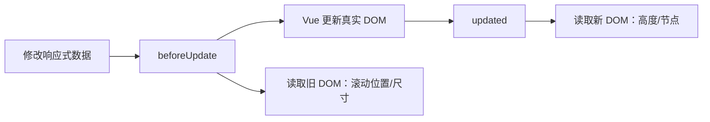

## vue2与vue3生命周期差异、使用场景

| Vue2 选项式 API      | Vue3 选项式 API   | Vue3 组合式 API（setup 中） | 核心阶段          | 主要使用场景                                                                                   |
|----------------------|-------------------|----------------------------|-------------------|---------------------------------------------------------------------------------------------|
| beforeCreate         | beforeCreate      | 无（setup 替代）           | 实例创建前        | 几乎无实用场景；极少用于全局配置前置如原型扩展                                                    |
| created              | created           | 无（setup 替代）           | 实例创建完成      | 非 DOM 相关初始化：如数据赋值、发起异步请求、全局事件绑定、初始化与 DOM 无关的逻辑               |
| beforeMount          | beforeMount       | onBeforeMount              | DOM 挂载前        | 一般很少用；极个别场景下需提前获取虚拟 DOM                                                      |
| mounted              | mounted           | onMounted                  | DOM 挂载完成      | DOM 操作入口：如三方库初始化、获取 DOM 尺寸/位置信息、根据异步请求渲染 DOM                        |
| beforeUpdate         | beforeUpdate      | onBeforeUpdate             | DOM 更新前        | 响应式数据变化后、真实 DOM 修改前读取旧 DOM 状态；如记录滚动位置、旧尺寸                  |
| updated              | updated           | onUpdated                  | DOM 更新完成      | 真实 DOM 修改后读取新状态或同步三方 DOM 插件；⚠️不要在此直接修改触发本组件更新的数据，避免更新循环 |
| beforeDestroy        | beforeUnmount     | onBeforeUnmount            | 实例卸载前        | 副作用清理：如清除定时器/事件监听、销毁三方库、终止未完成异步请求                                 |
| destroyed            | unmounted         | onUnmounted                | 实例卸载完成      | 通常只用于确认卸载完毕（如日志打点），几乎无主流实用场景                                            |
| activated            | activated         | onActivated                | 缓存组件激活      |  <keep-alive> 标签 专用恢复缓存组件状态：如定时器重启、恢复滚动/视频、重新拉取数据                                        |
| deactivated          | deactivated       | onDeactivated              | 缓存组件失活      |  <keep-alive> 标签专用暂停缓存组件状态：如定时器暂停、暂停视频播放、清除临时数据、终止未完成异步                          |

## beforeUpdate 和 updated 到底解决什么问题？

一句话：当数据变化会让 DOM 发生变化，而你又需要在更新前后分别读取 DOM 时，才考虑这两个钩子。



### 例子：加载更早消息后保持滚动位置

假设聊天窗口向顶部加载更早的消息，列表会重新渲染。更新前先记住旧高度，更新后用高度差补偿滚动位置，避免用户正在阅读的位置跳动：

```js
export default {
  data() {
    return {
      messages: [],
      oldScrollHeight: 0
    }
  },

  beforeUpdate() {
    // 此时 messages 可能已经变了，但 DOM 还是旧列表
    const box = this.$refs.messageBox
    if (box) this.oldScrollHeight = box.scrollHeight
  },

  updated() {
    // 此时 DOM 已经是新列表，可以读取新高度
    const box = this.$refs.messageBox
    if (box) {
      box.scrollTop += box.scrollHeight - this.oldScrollHeight
    }
  }
}
```

这里的重点不是“数据变化后都要操作 DOM”，而是利用两个时间点的差异：`beforeUpdate` 执行时 Vue 管理的 DOM 仍是旧状态，`updated` 执行时才是新状态。

### Vue 3 组合式 API 写法

```js
import { onBeforeUpdate, onUpdated, ref } from 'vue'

const messageBox = ref(null)
let oldScrollHeight = 0

onBeforeUpdate(() => {
  if (messageBox.value) oldScrollHeight = messageBox.value.scrollHeight
})

onUpdated(() => {
  if (messageBox.value) {
    messageBox.value.scrollTop += messageBox.value.scrollHeight - oldScrollHeight
  }
})
```

### 什么时候不要用它们？

- 只是想在某个数据变化后执行逻辑：用 `watch`。
- 只是想等本次 DOM 更新完成后执行一次：用 `nextTick`。
- 初始化第三方组件：通常用 `mounted` / `onMounted`。
- 清理定时器、事件监听器或第三方组件：用 `beforeUnmount` / `onBeforeUnmount`。

`updated` 中再次修改会触发更新的数据，可能形成循环。例如不要在其中直接执行 `this.messages = ...`；如果确实需要调整数据，应先比较新旧值，并确保调整后不会再次触发同一逻辑。
