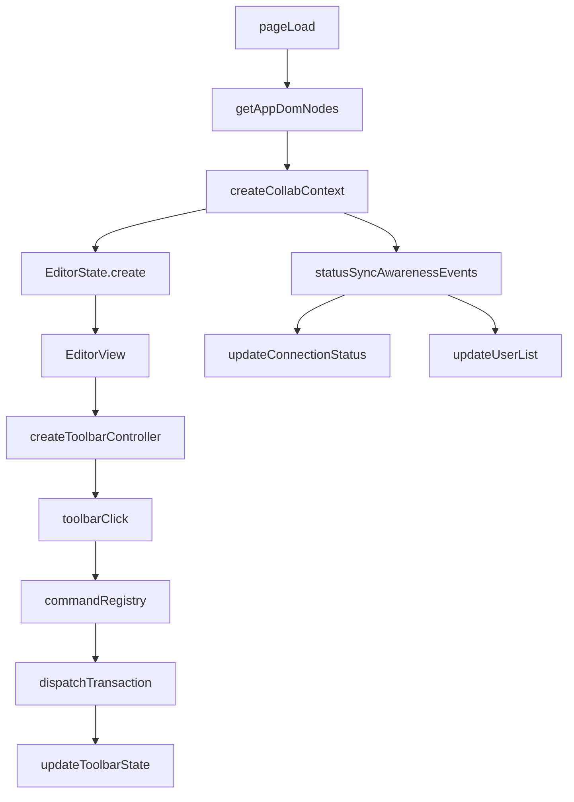

# Client（ProseMirror + Yjs）

客户端已迁移为 **ProseMirror + y-prosemirror**，保留 Yjs 实时协作能力（`y-websocket`）。

## 当前能力

-   基础富文本：粗体、斜体、下划线、删除线
-   基础表格：插入表格、增加行/列、删除行/列
-   协同能力：远端光标、在线用户 awareness、协同撤销/重做

## 快速开始

### 1. 安装依赖

```bash
cd client
pnpm install
```

### 2. 启动开发模式（推荐）

```bash
pnpm dev
```

默认访问地址：`http://localhost:5173`。

### 3. 可选：类型检查 + 构建

```bash
pnpm build
```

## 连接配置

默认 WebSocket 地址：`ws://localhost:3000`。  
可通过 URL 参数覆盖：

```text
http://localhost:5173?ws=ws://localhost:3000&doc=demo
```

-   `ws`：WebSocket 服务地址
-   `doc`：房间/文档名（同名文档会同步）

## 关键流程说明

一句话结论：页面启动后会先初始化协同上下文和编辑器状态，再通过事件与命令把“本地操作”和“远端同步”统一到同一条事务链路里。



### 1) 启动与初始化流程

1. `getAppDomNodes()` 获取编辑器、状态区、用户列表、工具栏等必要 DOM。
2. `createCollabContext()` 创建 `Y.Doc`、`yXmlFragment`、`WebsocketProvider`，并设置本地 awareness 用户信息。
3. `initProseMirrorDoc(...)` 从 Yjs 片段恢复 ProseMirror 文档，随后 `EditorState.create(...)` 装配同步、光标、撤销、表格和快捷键插件。
4. `new EditorView(...)` 挂载编辑器，后续所有变更都进入 `dispatchTransaction`，并在每次事务后刷新工具栏状态。

### 2) 协同同步流程

1. `wsProvider.on('status')`：连接状态变化时更新 UI 文案与指示灯。
2. `wsProvider.on('sync')`：首次同步且文档为空时注入引导文案，避免空白页面无反馈。
3. `wsProvider.awareness.on('change')`：在线用户变化时重绘用户列表，展示当前协同成员。

### 3) 工具栏命令流程

1. 点击工具栏按钮后，按 `data-command` 从 `commandRegistry` 找到对应命令。
2. 命令以 `(state, dispatch) => boolean` 形式执行；返回值表示命令是否成功执行。
3. 执行后编辑器重新聚焦，并调用 `updateToolbarState()` 回刷按钮可用性与 active 样式。

### 4) 表格如何插入（最小示例）

`insertTable` 命令会先构建 `table -> table_row -> table_cell -> paragraph` 节点树，再替换当前选区：

```ts
function createInsertTableCommand(rows = 3, cols = 3): EditorCommand {
    return (state, dispatch) => {
        const tableType = state.schema.nodes.table;
        const tableRowType = state.schema.nodes.table_row;
        const tableCellType = state.schema.nodes.table_cell;
        const paragraphType = state.schema.nodes.paragraph;

        const rowNodes = Array.from({ length: rows }, () => {
            const cellNodes = Array.from({ length: cols }, () =>
                tableCellType.createChecked(null, paragraphType.createChecked())
            );
            return tableRowType.createChecked(null, cellNodes);
        });

        const table = tableType.createChecked(null, rowNodes);
        dispatch?.(state.tr.replaceSelectionWith(table).scrollIntoView());
        return true;
    };
}
```

## 联调验证

1. 启动 y-websocket 服务端（默认 `ws://localhost:3000`）。
2. 启动客户端：`pnpm dev`。
3. 打开同一地址的两个标签页（`doc` 参数相同）。
4. 在任一标签页输入内容，并点击工具栏“粗体/斜体/下划线/删除线”，确认另一端实时同步格式。
5. 点击“插入表格”，在单元格中输入内容，然后执行“增加行/增加列/删除行/删除列”，确认另一端实时同步结构变化。
6. 在任意一端执行 `Cmd/Ctrl + Z` 与 `Cmd/Ctrl + Shift + Z`，确认撤销/重做在协同场景下可用。
7. 关闭网络后继续编辑，恢复网络后确认自动同步。

## 建议观察点

-   打开 `http://localhost:5173?doc=demo`，聚焦“输入 -> 远端同步 -> 工具栏状态变化”是否一致。
-   点击“插入表格”后，观察光标位置、单元格可编辑性、行列操作是否都作用在当前表格。
-   多开两个标签页，确认一个页面增删行列后另一页面表格结构同步更新。
-   如需查看内部事件链路，可使用 `?debug=1` 打开浏览器控制台日志（前缀为 `[collab-debug]`）。
