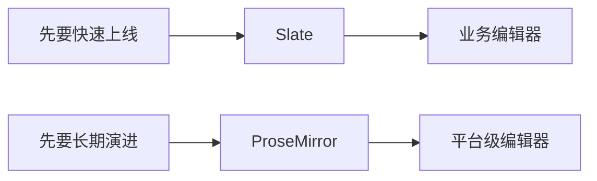
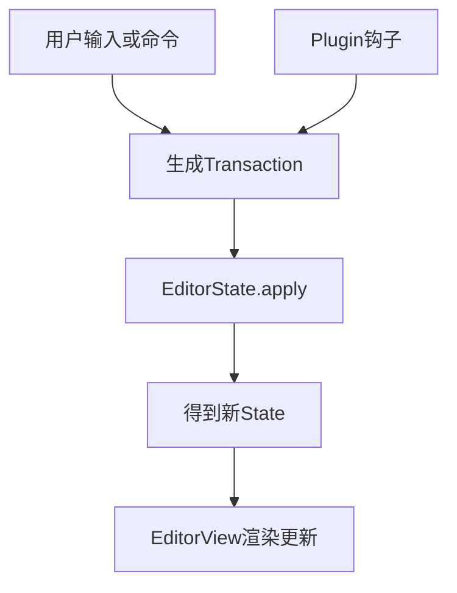
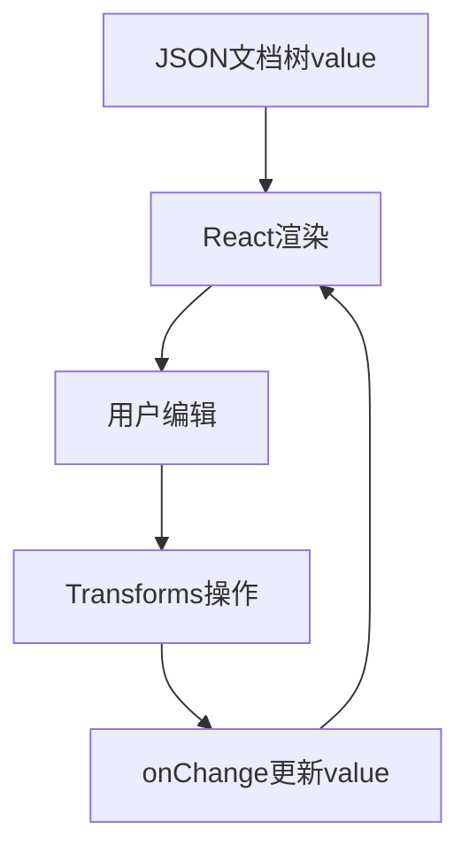

# 编辑器框架：ProseMirror / Slate 快速掌握

## 先看结论

-   ProseMirror：更像“编辑器内核”，强约束、强扩展，适合长期平台化。
-   Slate：更像“React 友好的编辑器状态层”，上手快，适合业务快速交付。
-   不想从底层搭起：优先考虑基于 ProseMirror 的 `Tiptap`。



## ProseMirror 是什么

一句话：**基于 Schema 的文档编辑引擎**，核心是“状态不可变 + 事务驱动 + 插件扩展”。

### 你要记住的 4 个词

-   `Schema`：定义文档合法结构（有哪些节点、节点可包含什么）。
-   `EditorState`：当前文档和选区等状态快照。
-   `Transaction`：一次编辑变更（插入文本、设置 mark、替换节点）。
-   `Plugin`：把键盘、输入规则、粘贴、历史记录等能力挂进去。

### 最小心智模型



### 最小示例（概念级）

```ts
import { EditorState } from 'prosemirror-state';
import { EditorView } from 'prosemirror-view';
import { schema } from 'prosemirror-schema-basic';

const state = EditorState.create({ schema });
const view = new EditorView(document.querySelector('#editor'), { state });

// 任何编辑行为，最终都是 transaction -> apply -> 新 state
const tr = view.state.tr.insertText('Hello ProseMirror');
view.dispatch(tr);
```

## Slate 是什么

一句话：**用 JSON 节点树描述富文本，并通过 React 渲染与操作**。

### 你要记住的 4 个词

-   `Editor`：编辑器实例，承载操作能力。
-   `Node`：文档树节点（段落、文本、列表等）。
-   `Transforms`：对节点树做变换（插入、删除、包裹、拆分）。
-   `renderElement/renderLeaf`：把结构和样式渲染成 React UI。

### 最小心智模型



### 最小示例（概念级）

```tsx
import { createEditor } from 'slate';
import { Slate, Editable, withReact } from 'slate-react';
import { useMemo, useState } from 'react';

const initialValue = [
    { type: 'paragraph', children: [{ text: 'Hello Slate' }] },
];

export default function Demo() {
    const editor = useMemo(() => withReact(createEditor()), []);
    const [value, setValue] = useState(initialValue);

    return (
        <Slate editor={editor} initialValue={value} onChange={setValue}>
            <Editable placeholder="Type here..." />
        </Slate>
    );
}
```

## 核心对比（面试/选型高频）

| 维度     | ProseMirror                              | Slate                          |
| -------- | ---------------------------------------- | ------------------------------ |
| 学习曲线 | 偏陡，需要理解 schema/transaction/plugin | 偏平滑，React 团队更容易上手   |
| 文档约束 | 强约束，结构一致性高                     | 约束可做但更多靠工程规范       |
| 扩展方式 | 插件体系成熟，内核扩展能力强             | 自定义灵活，复杂能力需自行沉淀 |
| 协同编辑 | 社区与实践更成熟（常见于平台级）         | 可做，但集成和约束要更细致     |
| 适合场景 | 飞书/Notion 类长期演进编辑器             | 业务后台富文本、配置化编辑     |

## 怎么选（直接决策）

-   你要做“长期可演进”的编辑器平台：选 ProseMirror（或 Tiptap）。
-   你要在 React 项目里快速做出可用富文本：优先 Slate。
-   团队编辑器经验偏少，又想稳妥落地：先 Tiptap，再按需求下探 ProseMirror。
