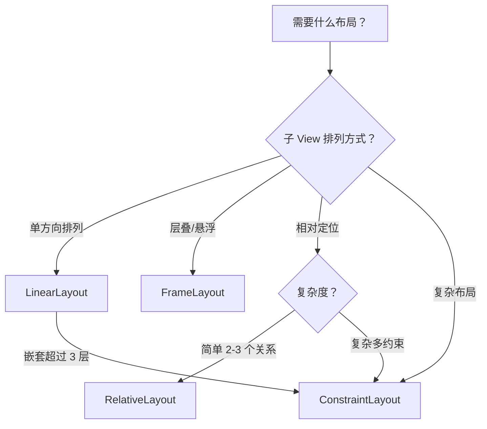

# 1.17 布局系统

> Android 用 XML 布局容器（ViewGroup）组织 UI，不同容器有不同的排列策略。

---

## 一、布局容器总览

```
┌─────────────────────────────────────────────────┐
│                   ViewGroup                      │
│                                                  │
│  ┌─────────────┐ ┌──────────────┐ ┌──────────┐ │
│  │LinearLayout │ │FrameLayout   │ │Relative  │ │
│  │  线性排列    │ │ 层叠 / 帧     │ │Layout    │ │
│  │  ↓ 或 →     │ │  后来居上     │ │ 相对定位  │ │
│  └─────────────┘ └──────────────┘ └──────────┘ │
│                                                  │
│  ┌──────────────────────────────────────────┐   │
│  │ConstraintLayout（现代首选，取代前三者）     │   │
│  └──────────────────────────────────────────┘   │
└─────────────────────────────────────────────────┘
```

### 前端类比

| Android 布局 | CSS 类比 |
|-------------|----------|
| LinearLayout (vertical) | `flex-direction: column` |
| LinearLayout (horizontal) | `flex-direction: row` |
| FrameLayout | `position: relative` 父 + 子 `position: absolute` |
| RelativeLayout | 手写 `position: relative/absolute` + 偏移 |
| ConstraintLayout | CSS Grid / Flexbox（最灵活） |

---

## 二、LinearLayout — 线性布局

子 View 沿**单一方向**（水平或垂直）依次排列，不会重叠。

### 核心属性

| 属性 | 作用 |
|------|------|
| `android:orientation` | `vertical`（竖排）或 `horizontal`（横排） |
| `android:gravity` | 控制**所有子 View** 在容器内的整体对齐 |
| `android:layout_weight` | 按比例分配剩余空间 |

### 示例：垂直排列 + weight 分配

```xml
<LinearLayout
    android:layout_width="match_parent"
    android:layout_height="match_parent"
    android:orientation="vertical">

    <!-- 顶部标题栏，固定高度 -->
    <TextView
        android:layout_width="match_parent"
        android:layout_height="48dp"
        android:gravity="center"
        android:text="标题" />

    <!-- 中间内容区，占满剩余空间 -->
    <FrameLayout
        android:layout_width="match_parent"
        android:layout_height="0dp"
        android:layout_weight="1" />
        <!-- height=0dp + weight=1 → 占满剩余空间 -->

    <!-- 底部导航栏，固定高度 -->
    <LinearLayout
        android:layout_width="match_parent"
        android:layout_height="56dp"
        android:orientation="horizontal">

        <Button
            android:layout_width="0dp"
            android:layout_height="match_parent"
            android:layout_weight="1"
            android:text="首页" />

        <Button
            android:layout_width="0dp"
            android:layout_height="match_parent"
            android:layout_weight="1"
            android:text="我的" />
    </LinearLayout>
</LinearLayout>
```

### weight 原理

```
总空间 = 父容器剩余空间
每个子 View 分得 = 剩余空间 × (自身 weight / 所有 weight 之和)
```

> **前端类比**：`layout_weight` ≈ `flex: 1`（按比例瓜分空间）。

---

## 三、FrameLayout — 帧布局

所有子 View **层叠**在同一位置，后添加的在上层。最简单的布局容器。

### 特点

- 子 View 默认放在**左上角**
- 每个子 View 通过 `layout_gravity` 独立定位
- 适合：悬浮按钮、加载遮罩、Fragment 容器

### 示例：图片 + 悬浮标签

```xml
<FrameLayout
    android:layout_width="match_parent"
    android:layout_height="200dp">

    <!-- 底层：图片铺满 -->
    <ImageView
        android:layout_width="match_parent"
        android:layout_height="match_parent"
        android:scaleType="centerCrop"
        android:src="@drawable/cover" />

    <!-- 上层：右上角标签 -->
    <TextView
        android:layout_width="wrap_content"
        android:layout_height="wrap_content"
        android:layout_gravity="top|end"
        android:layout_margin="8dp"
        android:background="@color/primary"
        android:padding="4dp"
        android:text="NEW"
        android:textColor="#FFFFFF" />

    <!-- 上层：底部渐变遮罩 -->
    <View
        android:layout_width="match_parent"
        android:layout_height="60dp"
        android:layout_gravity="bottom"
        android:background="@drawable/gradient_black_bottom" />
</FrameLayout>
```

### 前端类比

```html
<!-- 等价的 CSS 实现 -->
<div style="position: relative; width: 100%; height: 200px;">
  
  <span style="position: absolute; top: 8px; right: 8px;">NEW</span>
  <div style="position: absolute; bottom: 0; width: 100%; height: 60px;" />
</div>
```

---

## 四、RelativeLayout — 相对布局

子 View 通过**相对关系**定位：相对于父容器边界，或相对于兄弟 View。

### 核心定位属性

| 属性 | 作用 |
|------|------|
| `layout_alignParentTop/Bottom/Start/End` | 贴父容器的某条边 |
| `layout_centerInParent` | 在父容器中居中 |
| `layout_centerHorizontal/Vertical` | 水平/垂直居中 |
| `layout_toStartOf / layout_toEndOf` | 在某兄弟 View 的左/右侧 |
| `layout_above / layout_below` | 在某兄弟 View 的上/下方 |
| `layout_alignTop / layout_alignBaseline` | 与某兄弟对齐 |

### 示例：搜索栏 + 按钮

```xml
<RelativeLayout
    android:layout_width="match_parent"
    android:layout_height="48dp"
    android:padding="8dp">

    <!-- 右侧按钮，贴右 -->
    <Button
        android:id="@+id/btn_search"
        android:layout_width="wrap_content"
        android:layout_height="match_parent"
        android:layout_alignParentEnd="true"
        android:text="搜索" />

    <!-- 输入框，填满按钮左边的空间 -->
    <EditText
        android:layout_width="match_parent"
        android:layout_height="match_parent"
        android:layout_toStartOf="@id/btn_search"
        android:layout_marginEnd="8dp"
        android:hint="请输入关键词" />
</RelativeLayout>
```

### 注意事项

- 不能**循环引用**：A 依赖 B 的位置，B 又依赖 A → 布局崩溃
- 性能比 LinearLayout 差一些（需要两次 measure），现代项目推荐用 ConstraintLayout 替代

---

## 五、gravity 与 layout_gravity

这两个属性名字相似，但控制方向完全相反，是布局中最容易混淆的概念。

### 一句话区分

| 属性 | 作用对象 | 含义 |
|------|----------|------|
| `android:gravity` | **内容**（子元素 / 文字） | 控制「我的内容」在我内部如何对齐 |
| `android:layout_gravity` | **自身** | 控制「我自己」在父容器中如何对齐 |

> 记忆口诀：**有 `layout_` 前缀 → 管自己在父容器中的位置；没有前缀 → 管自己内部内容的位置。**

### 前端类比

```
Android                        CSS
──────                         ───
gravity="center"           ≈   text-align: center + vertical-align（控制内容）
layout_gravity="center"    ≈   align-self: center / margin: 0 auto（控制自己在父中的位置）
```

### 图示

```
┌──── 父容器 (LinearLayout vertical) ────────────┐
│                                                 │
│   ┌── 子 View A ──────────────────────┐        │
│   │  layout_gravity="start"           │        │ ← layout_gravity 控制 A 在父中靠左
│   │  gravity="center"                 │        │
│   │         [文字居中显示]              │        │ ← gravity 控制 A 内部文字居中
│   └───────────────────────────────────┘        │
│                                                 │
│            ┌── 子 View B ──┐                    │
│            │ layout_gravity │                   │ ← layout_gravity="center" 让 B 居中
│            │  ="center"     │                   │
│            └────────────────┘                   │
│                                                 │
│                         ┌── 子 View C ──┐      │
│                         │ layout_gravity │      │ ← layout_gravity="end" 让 C 靠右
│                         │   ="end"       │      │
│                         └────────────────┘      │
└─────────────────────────────────────────────────┘
```

### 代码示例

```xml
<!-- 示例 1：gravity 控制内容对齐 -->
<LinearLayout
    android:layout_width="match_parent"
    android:layout_height="100dp"
    android:gravity="center">   <!-- 所有子 View 居中显示 -->

    <TextView android:text="我被父容器的 gravity 居中了" />
</LinearLayout>

<!-- 示例 2：layout_gravity 控制自身位置 -->
<LinearLayout
    android:layout_width="match_parent"
    android:layout_height="match_parent"
    android:orientation="vertical">

    <Button
        android:layout_width="wrap_content"
        android:layout_height="wrap_content"
        android:layout_gravity="end"
        android:text="我靠右" />

    <Button
        android:layout_width="wrap_content"
        android:layout_height="wrap_content"
        android:layout_gravity="center_horizontal"
        android:text="我水平居中" />
</LinearLayout>

<!-- 示例 3：两者同时使用 -->
<TextView
    android:layout_width="200dp"
    android:layout_height="100dp"
    android:layout_gravity="center"
    android:gravity="bottom|end"
    android:text="文字在右下角" />
    <!-- layout_gravity="center" → TextView 在父容器中居中 -->
    <!-- gravity="bottom|end"   → 文字在 TextView 内部右下角 -->
```

### 在不同布局中的适用性

| 布局容器 | gravity | layout_gravity |
|----------|---------|----------------|
| **LinearLayout** | ✅ 控制所有子 View 的整体对齐 | ✅ 仅**交叉轴方向**生效 |
| **FrameLayout** | ✅ 控制所有子 View 的默认位置 | ✅ 每个子 View 独立定位 |
| **RelativeLayout** | ✅ 控制内部文字 | ❌ 无效（用 `layout_alignParent*`） |
| **ConstraintLayout** | ✅ 控制内部文字 | ❌ 无效（用约束） |

### 注意事项

- `layout_gravity` 在 LinearLayout 中只在**交叉轴方向**生效：竖直排列时只能控制水平对齐，反之同理
- 父容器 `gravity` 和子 View `layout_gravity` 冲突时，**`layout_gravity` 优先**
- 可以用 `|` 组合值：`android:gravity="bottom|center_horizontal"`

### 常用取值

| 值 | 效果 |
|----|------|
| `top` / `bottom` / `start` / `end` | 靠上 / 下 / 左 / 右 |
| `center` | 水平 + 垂直居中 |
| `center_horizontal` | 仅水平居中 |
| `center_vertical` | 仅垂直居中 |

---

## 六、ConstraintLayout（简介）

现代 Android 开发首选布局，用**约束**描述 View 之间的关系，可以实现扁平化的复杂布局。

```xml
<androidx.constraintlayout.widget.ConstraintLayout
    android:layout_width="match_parent"
    android:layout_height="match_parent">

    <TextView
        android:id="@+id/title"
        android:layout_width="0dp"
        android:layout_height="wrap_content"
        android:text="标题"
        app:layout_constraintTop_toTopOf="parent"
        app:layout_constraintStart_toStartOf="parent"
        app:layout_constraintEnd_toEndOf="parent" />

    <Button
        android:layout_width="wrap_content"
        android:layout_height="wrap_content"
        android:text="确认"
        app:layout_constraintTop_toBottomOf="@id/title"
        app:layout_constraintEnd_toEndOf="parent"
        android:layout_marginTop="16dp"
        android:layout_marginEnd="16dp" />
</androidx.constraintlayout.widget.ConstraintLayout>
```

> 优势：无论多复杂的布局都只需**一层**容器，避免 LinearLayout/RelativeLayout 多层嵌套导致的性能问题。

---

## 七、如何选择布局容器



| 场景 | 推荐 |
|------|------|
| 简单列表/表单（垂直排列） | LinearLayout |
| 等分按钮栏（水平排列 + weight） | LinearLayout |
| Fragment 容器、加载遮罩 | FrameLayout |
| 复杂页面、扁平化要求 | ConstraintLayout |
| 需要兼容老项目 | RelativeLayout |

---

## 八、常用布局属性速查

| 属性 | 适用布局 | 说明 |
|------|----------|------|
| `layout_width` / `layout_height` | 所有 | `match_parent` / `wrap_content` / 具体值 |
| `layout_margin` | 所有 | 外边距（View 与兄弟/父容器的间距） |
| `padding` | 所有 | 内边距（View 内容与自身边框的间距） |
| `layout_weight` | LinearLayout | 按比例分配剩余空间 |
| `layout_gravity` | Linear / Frame | 自身在父容器中的对齐方式 |
| `gravity` | 所有 | 内容在自身内部的对齐方式 |
| `layout_alignParent*` | RelativeLayout | 贴父容器某边 |
| `layout_constraint*` | ConstraintLayout | 约束关系 |

---

## 九、常用 UI 控件：TextView

布局容器负责排列子 View，而子 View 就是具体的 UI 控件。`TextView` 是 Android 中**最基础、使用频率最高**的控件，用于显示文本。

### 前端类比

```
Android 控件              前端标签
────────────              ────────
TextView              ≈   <span> / <p>（纯文本展示）
EditText              ≈   <input type="text"> / <textarea>
Button                ≈   <button>（Button 其实是 TextView 的子类）
ImageView             ≈   
```

> **注意**：Android 的 `Button` 继承自 `TextView`，所以 Button 也拥有下文所有文本相关属性。

### 核心属性

| 属性 | 作用 | 示例 |
|------|------|------|
| `android:text` | 显示的文本内容 | `"Hello World"` |
| `android:textSize` | 字体大小（**必须用 sp**） | `"16sp"` |
| `android:textColor` | 字体颜色 | `"#FF000000"` 或 `"@color/text_primary"` |
| `android:textStyle` | 字体风格 | `"bold"` / `"italic"` / `"bold\|italic"` |
| `android:fontFamily` | 字体族 | `"sans-serif"` / `"sans-serif-medium"` / `"monospace"` |
| `android:gravity` | 文本在控件内的对齐方式 | `"center"` / `"start\|center_vertical"` |
| `android:maxLines` | 最大行数 | `"1"` 单行 / `"2"` 最多两行 |
| `android:singleLine` | 是否单行（已废弃，用 maxLines） | `"true"` |
| `android:ellipsize` | 文本超出时的省略方式 | `"end"` 末尾省略号 |
| `android:lineSpacingExtra` | 额外行间距 | `"4dp"` |
| `android:letterSpacing` | 字母/字间距 | `"0.1"` |
| `android:autoLink` | 自动识别链接类型 | `"web"` / `"phone"` / `"email"` / `"all"` |
| `android:drawableStart` | 文本左侧图标 | `"@drawable/ic_star"` |
| `android:drawableEnd` | 文本右侧图标 | `"@drawable/ic_arrow"` |
| `android:drawablePadding` | 图标与文本间距 | `"8dp"` |
| `android:includeFontPadding` | 是否包含字体上下留白 | `"false"` 去除多余上下间距 |

### 基础用法

```xml
<!-- 普通文本 -->
<TextView
    android:layout_width="wrap_content"
    android:layout_height="wrap_content"
    android:text="Hello World"
    android:textSize="16sp"
    android:textColor="@color/text_primary" />

<!-- 居中大标题 -->
<TextView
    android:layout_width="match_parent"
    android:layout_height="48dp"
    android:gravity="center"
    android:text="设置"
    android:textSize="20sp"
    android:textStyle="bold"
    android:fontFamily="sans-serif-medium" />

<!-- 单行文本，超出末尾省略 -->
<TextView
    android:layout_width="200dp"
    android:layout_height="wrap_content"
    android:text="这是一段很长的文本内容，超出宽度会显示省略号"
    android:maxLines="1"
    android:ellipsize="end" />

<!-- 带图标的文本 -->
<TextView
    android:layout_width="wrap_content"
    android:layout_height="wrap_content"
    android:text="收藏"
    android:drawableStart="@drawable/ic_star"
    android:drawablePadding="4dp" />
```

### 代码中操作 TextView

```kotlin
// 设置文本
textView.text = "新的文本内容"

// 获取文本
val content = textView.text.toString()

// 设置颜色
textView.setTextColor(ContextCompat.getColor(this, R.color.primary))

// 设置字体大小（单位：sp）
textView.textSize = 16f

// 设置最大行数和省略
textView.maxLines = 2
textView.ellipsize = TextUtils.TruncateAt.END

// 设置可见性
textView.visibility = View.VISIBLE       // 可见
textView.visibility = View.INVISIBLE     // 不可见但占位
textView.visibility = View.GONE          // 不可见且不占位

// 前端类比：View.GONE ≈ display: none; View.INVISIBLE ≈ visibility: hidden
```

### 常见场景

#### 多行截断

```xml
<TextView
    android:layout_width="match_parent"
    android:layout_height="wrap_content"
    android:maxLines="3"
    android:ellipsize="end"
    android:lineSpacingExtra="4dp"
    android:text="这是一段很长的描述文本..." />
```

#### 金额/价格样式

```xml
<TextView
    android:layout_width="wrap_content"
    android:layout_height="wrap_content"
    android:text="¥99.00"
    android:textSize="24sp"
    android:textColor="#FFFF4444"
    android:textStyle="bold" />
```

#### 自动识别链接

```xml
<TextView
    android:layout_width="wrap_content"
    android:layout_height="wrap_content"
    android:autoLink="web|email"
    android:text="访问 https://www.example.com 或发邮件到 test@example.com" />
```

> **提示**：`autoLink` 会让匹配到的文本变成可点击的蓝色链接。如果需要自定义链接样式和点击行为，应该用 `SpannableString`。

---

## 练习

1. 用 LinearLayout 实现一个经典的「顶部标题 + 中间内容 + 底部Tab栏」三段式布局
2. 用 FrameLayout 实现一个图片上叠加半透明文字说明的卡片
3. 用 RelativeLayout 实现「左边头像 + 右边昵称在上/签名在下」的列表项布局
4. 对比：分别用 LinearLayout 嵌套和 ConstraintLayout 实现同一个登录页面，观察 XML 层级区别
5. 用 TextView 实现一个列表项：左侧带图标、中间标题+副标题（各一行）、右侧带箭头
