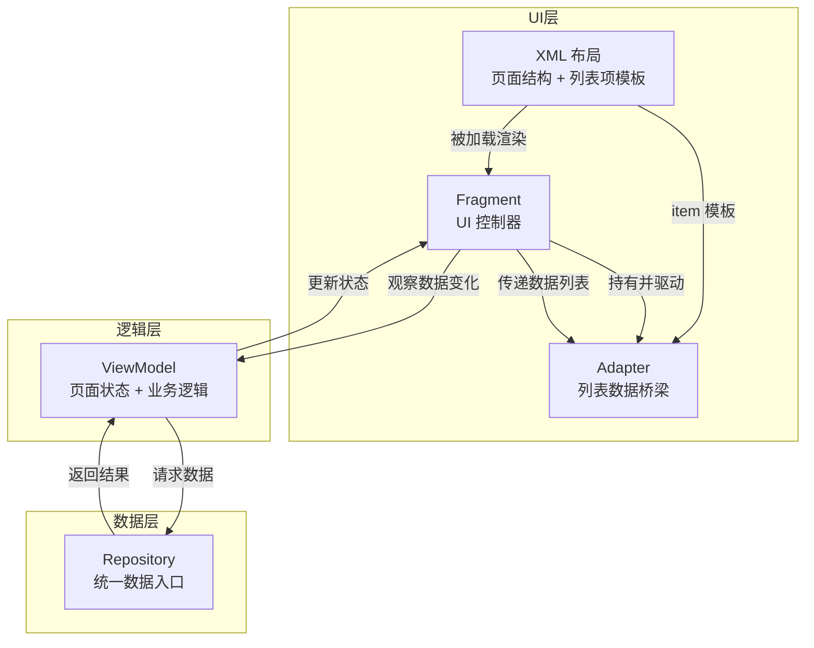
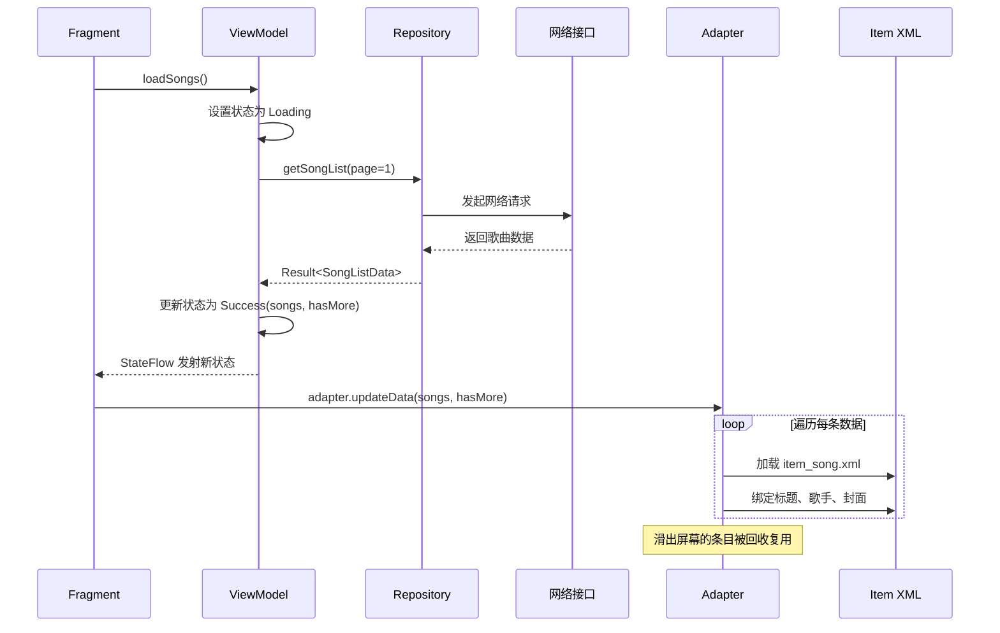

# 5.1 业务实战指南

> 从修改已有功能到独立开发页面，走完完整的 Android 开发流程。

---

## 一、从修改已有功能入手

### 第一步：跑通项目

```
1. 克隆主仓库
2. 用 Android Studio 打开
3. 等待 Gradle Sync 完成
4. 选择正确的 Build Variant
5. 连接真机 / 模拟器
6. 点击 Run
```

### 第二步：定位要修改的代码

```
方法 1：CodeLocator
  点击屏幕上的元素 → 自动跳到对应代码

方法 2：Layout Inspector
  Tools → Layout Inspector → 点击目标 View → 查看 ID
  全局搜索 ID：Cmd + Shift + O → 输入 "R.id.xxx"

方法 3：搜索文本
  在 strings.xml 中搜索页面上显示的文字
  然后找到引用该 string 的布局文件
```

### 第三步：理解代码逻辑

```
1. 找到 Activity/Fragment → 看布局绑定
2. 找到 ViewModel → 看数据流
3. 找到 Repository → 看数据来源
4. 用 Debugger 单步执行，理解调用流程
```

### 第四步：修改并测试

```
1. 修改代码
2. 运行到真机验证
3. 检查是否有副作用（其他页面是否受影响）
4. 提交代码，发起 Code Review
```

---

## 二、独立开发一个完整页面

### 需求：开发一个"歌曲列表"页面

#### Step 1：定义数据模型

```kotlin
// model/Song.kt
data class Song(
    val id: String,
    val title: String,
    val artist: String,
    val coverUrl: String,
    val duration: Int,
    val playCount: Long
)
```

#### Step 2：定义接口

```kotlin
// api/SongApi.kt
data class SongListResponse(
    val code: Int,
    val data: SongListData?
)

data class SongListData(
    val list: List<Song>,
    val hasMore: Boolean,
    val page: Int
)

interface SongApi {
    suspend fun getSongList(page: Int, size: Int = 20): SongListResponse
}
```

#### Step 3：创建 Repository

```kotlin
// repository/SongRepository.kt
class SongRepository(private val api: SongApi) {

    suspend fun getSongList(page: Int): Result<SongListData> {
        return try {
            val response = api.getSongList(page)
            if (response.code == 0 && response.data != null) {
                Result.success(response.data)
            } else {
                Result.failure(Exception("获取歌曲列表失败"))
            }
        } catch (e: Exception) {
            Result.failure(e)
        }
    }
}
```

#### Step 4：创建 ViewModel

```kotlin
// viewmodel/SongListViewModel.kt
sealed class SongListUiState {
    object Loading : SongListUiState()
    data class Success(
        val songs: List<Song>,
        val hasMore: Boolean
    ) : SongListUiState()
    data class Error(val message: String) : SongListUiState()
}

class SongListViewModel(private val repository: SongRepository) : ViewModel() {

    private val _uiState = MutableStateFlow<SongListUiState>(SongListUiState.Loading)
    val uiState: StateFlow<SongListUiState> = _uiState.asStateFlow()

    private var currentPage = 1
    private val allSongs = mutableListOf<Song>()

    fun loadSongs() {
        viewModelScope.launch {
            _uiState.value = SongListUiState.Loading
            repository.getSongList(page = 1)
                .onSuccess { data ->
                    allSongs.clear()
                    allSongs.addAll(data.list)
                    currentPage = data.page
                    _uiState.value = SongListUiState.Success(
                        songs = allSongs.toList(),
                        hasMore = data.hasMore
                    )
                }
                .onFailure { e ->
                    _uiState.value = SongListUiState.Error(e.message ?: "加载失败")
                }
        }
    }

    fun loadMore() {
        val currentState = _uiState.value
        if (currentState !is SongListUiState.Success || !currentState.hasMore) return

        viewModelScope.launch {
            repository.getSongList(page = currentPage + 1)
                .onSuccess { data ->
                    allSongs.addAll(data.list)
                    currentPage = data.page
                    _uiState.value = SongListUiState.Success(
                        songs = allSongs.toList(),
                        hasMore = data.hasMore
                    )
                }
                .onFailure { e ->
                    // 加载更多失败，保持当前数据
                    _uiState.value = SongListUiState.Error(e.message ?: "加载更多失败")
                }
        }
    }

    fun refresh() {
        allSongs.clear()
        currentPage = 1
        loadSongs()
    }
}
```

#### Step 5：创建布局

```xml
<!-- layout/fragment_song_list.xml -->
<androidx.constraintlayout.widget.ConstraintLayout
    xmlns:android="http://schemas.android.com/apk/res/android"
    android:layout_width="match_parent"
    android:layout_height="match_parent">

    <androidx.swiperefreshlayout.widget.SwipeRefreshLayout
        android:id="@+id/swipeRefresh"
        android:layout_width="match_parent"
        android:layout_height="match_parent">

        <androidx.recyclerview.widget.RecyclerView
            android:id="@+id/recyclerView"
            android:layout_width="match_parent"
            android:layout_height="match_parent"
            android:clipToPadding="false"
            android:padding="8dp" />

    </androidx.swiperefreshlayout.widget.SwipeRefreshLayout>

    <ProgressBar
        android:id="@+id/progressBar"
        android:layout_width="wrap_content"
        android:layout_height="wrap_content"
        android:visibility="gone" />

    <TextView
        android:id="@+id/errorText"
        android:layout_width="wrap_content"
        android:layout_height="wrap_content"
        android:text="加载失败"
        android:visibility="gone" />

</androidx.constraintlayout.widget.ConstraintLayout>
```

```xml
<!-- layout/item_song.xml -->
<androidx.constraintlayout.widget.ConstraintLayout
    android:layout_width="match_parent"
    android:layout_height="wrap_content"
    android:padding="12dp">

    <ImageView
        android:id="@+id/coverImage"
        android:layout_width="48dp"
        android:layout_height="48dp" />

    <TextView
        android:id="@+id/titleText"
        android:layout_width="0dp"
        android:layout_height="wrap_content"
        android:textSize="16sp"
        android:maxLines="1"
        android:ellipsize="end"
        app:layout_constraintStart_toEndOf="@id/coverImage"
        app:layout_constraintEnd_toEndOf="parent"
        app:layout_constraintTop_toTopOf="@id/coverImage" />

    <TextView
        android:id="@+id/artistText"
        android:layout_width="0dp"
        android:layout_height="wrap_content"
        android:textSize="14sp"
        android:textColor="@color/text_secondary"
        app:layout_constraintStart_toStartOf="@id/titleText"
        app:layout_constraintEnd_toEndOf="parent"
        app:layout_constraintTop_toBottomOf="@id/titleText" />

</androidx.constraintlayout.widget.ConstraintLayout>
```

#### Step 6：创建 Adapter

```kotlin
// ui/adapter/SongAdapter.kt
class SongAdapter(
    private val onItemClick: (Song) -> Unit,
    private val onLoadMore: () -> Unit
) : RecyclerView.Adapter<SongViewHolder>() {

    private var songs: List<Song> = emptyList()
    private var hasMore = false

    fun updateData(newSongs: List<Song>, hasMore: Boolean) {
        songs = newSongs
        this.hasMore = hasMore
        notifyDataSetChanged()
    }

    override fun onCreateViewHolder(parent: ViewGroup, viewType: Int): SongViewHolder {
        val view = LayoutInflater.from(parent.context)
            .inflate(R.layout.item_song, parent, false)
        return SongViewHolder(view)
    }

    override fun onBindViewHolder(holder: SongViewHolder, position: Int) {
        holder.bind(songs[position], onItemClick)

        // 接近底部时触发加载更多
        if (position >= songs.size - 3 && hasMore) {
            onLoadMore()
        }
    }

    override fun getItemCount() = songs.size
}

class SongViewHolder(view: View) : RecyclerView.ViewHolder(view) {
    private val coverImage: ImageView = view.findViewById(R.id.coverImage)
    private val titleText: TextView = view.findViewById(R.id.titleText)
    private val artistText: TextView = view.findViewById(R.id.artistText)

    fun bind(song: Song, onClick: (Song) -> Unit) {
        titleText.text = song.title
        artistText.text = song.artist
        Glide.with(itemView.context)
            .load(song.coverUrl)
            .into(coverImage)
        itemView.setOnClickListener { onClick(song) }
    }
}
```

#### Step 7：创建 Fragment

```kotlin
// ui/SongListFragment.kt
class SongListFragment : Fragment() {

    private val viewModel: SongListViewModel by viewModels {
        SongListViewModelFactory(SongRepository(SongApi.create()))
    }
    private lateinit var adapter: SongAdapter

    override fun onCreateView(inflater: LayoutInflater, container: ViewGroup?, savedInstanceState: Bundle?): View {
        return inflater.inflate(R.layout.fragment_song_list, container, false)
    }

    override fun onViewCreated(view: View, savedInstanceState: Bundle?) {
        super.onViewCreated(view, savedInstanceState)

        adapter = SongAdapter(
            onItemClick = { song -> openSongDetail(song.id) },
            onLoadMore = { viewModel.loadMore() }
        )

        recyclerView.layoutManager = LinearLayoutManager(requireContext())
        recyclerView.adapter = adapter

        swipeRefreshLayout.setOnRefreshListener {
            viewModel.refresh()
        }

        observeState()
        viewModel.loadSongs()
    }

    private fun observeState() {
        viewLifecycleOwner.lifecycleScope.launch {
            viewModel.uiState.collect { state ->
                swipeRefreshLayout.isRefreshing = false
                when (state) {
                    is SongListUiState.Loading -> {
                        progressBar.isVisible = true
                        errorText.isVisible = false
                    }
                    is SongListUiState.Success -> {
                        progressBar.isVisible = false
                        errorText.isVisible = false
                        adapter.updateData(state.songs, state.hasMore)
                    }
                    is SongListUiState.Error -> {
                        progressBar.isVisible = false
                        errorText.text = state.message
                        errorText.isVisible = true
                    }
                }
            }
        }
    }

    private fun openSongDetail(songId: String) {
        val intent = Intent(requireContext(), SongDetailActivity::class.java)
        intent.putExtra("songId", songId)
        startActivity(intent)
    }
}
```

---

## 三、列表页面组件关系详解

> 以上面的"歌曲列表"为例，拆解 XML、Fragment、Adapter、ViewModel、Repository 各自的职责和协作方式。

### 3.1 整体架构层级



### 3.2 各组件职责速查

| 组件 | 职责 | 不做的事 |
|---|---|---|
| **XML 布局** | 定义页面结构和列表项样式 | 不写任何逻辑 |
| **Fragment** | 加载 XML、初始化 Adapter、监听 ViewModel 状态变化 | 不直接请求网络 / 操作数据库 |
| **Adapter** | 把数据逐条绑定到列表项 XML，管理视图复用 | 不持有 ViewModel、不访问 Repository |
| **ViewModel** | 存储页面状态、处理业务逻辑、调用 Repository | 不持有任何 UI 引用 |
| **Repository** | 整合网络接口和本地数据库，对外统一提供数据 | 不接触任何 UI 组件 |

### 3.3 列表加载的完整数据流

以"打开歌曲列表页面"为例，数据从请求到渲染的完整路径：



### 3.4 单向数据流总结

```
用户操作（打开页面 / 下拉刷新 / 滑动加载更多）
    ↓
Fragment 发出指令给 ViewModel
    ↓
ViewModel 调用 Repository 获取数据
    ↓
Repository 返回结果给 ViewModel
    ↓
ViewModel 更新内部状态（StateFlow / LiveData）
    ↓
Fragment 监听到状态变化，把数据传给 Adapter
    ↓
Adapter 逐条绑定数据到列表项 XML，RecyclerView 完成渲染
```

### 3.5 为什么要这样分层

**Fragment 不直接拿数据**：Fragment 生命周期短（屏幕旋转就重建），直接拿数据会丢失。ViewModel 生命周期独立，屏幕旋转后数据还在。

**Adapter 单独存在**：RecyclerView 本身只会"摆放条目"，不知道每条长什么样、数据怎么填。Adapter 专职做三件事：
1. **创建条目**：加载 item XML 布局
2. **绑定数据**：把第 N 条数据设置到对应控件
3. **视图复用**：滑出屏幕的条目回收，滑入的复用，保证列表流畅

**Repository 统一入口**：ViewModel 不关心数据来自网络还是本地缓存，都由 Repository 屏蔽差异。

### 3.6 前端类比（如果你熟悉 React）

| Android | React | 说明 |
|---|---|---|
| XML 布局 | JSX | 描述 UI 结构 |
| Fragment | 函数组件 | UI 控制器，处理交互 |
| Adapter | `list.map(item => <Item/>)` | 列表渲染 + 复用 |
| ViewModel | `useState` / 自定义 Hook | 状态管理 + 业务逻辑 |
| Repository | 接口封装函数 / 数据层 | 统一数据来源 |

---

## 四、开发流程检查清单

### 编码前

- [ ] 理解需求，确认交互细节
- [ ] 找到参考页面或类似功能的代码
- [ ] 确认接口是否已定义

### 编码中

- [ ] 遵循项目 MVVM 架构
- [ ] 数据类和接口定义放在 protocol 模块
- [ ] 使用 Kotlin 空安全，避免 `!!`
- [ ] 网络请求在协程/子线程执行
- [ ] UI 更新在主线程

### 编码后

- [ ] 自测：正常流程 + 异常情况
- [ ] 横竖屏切换不崩溃
- [ ] 弱网环境正常处理
- [ ] 内存泄漏检查
- [ ] 代码格式化（Cmd + Option + L）
- [ ] 提交代码，发起 Code Review

---

## 五、持续提升

### 学习路径

```
1. 修改已有功能 → 熟悉代码结构和提交流程
2. 开发简单页面 → 掌握完整开发流程
3. 开发复杂功能 → 涉及多模块协作、状态管理
4. 性能优化 → 内存、卡顿、包体积
5. 架构优化 → 模块化、组件化
```

### 推荐资源

- **官方文档**：https://developer.android.com
- **Kotlin 官方文档**：https://kotlinlang.org/docs
- **团队 Wiki**：项目架构、组件使用、开发规范
- **代码阅读**：阅读项目中优秀模块的代码，学习设计模式

### 良好习惯

1. **先读懂再改**：改代码前先理解现有逻辑
2. **小步提交**：每完成一个小功能就提交，方便回滚
3. **写可读代码**：好的命名比注释更重要
4. **善用 Debugger**：遇到问题先打断点定位，而不是靠猜
5. **关注 Code Review**：从同事的反馈中学习
