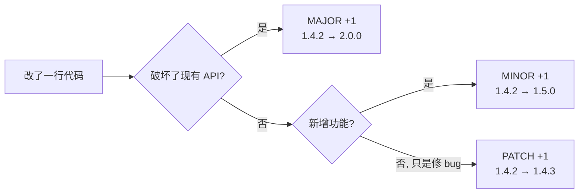
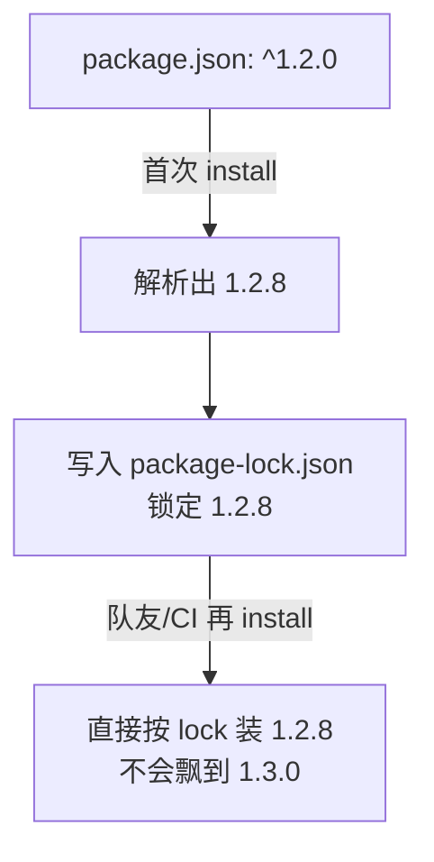
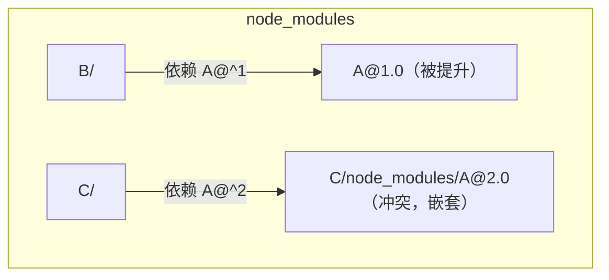

# npm 版本号规则与依赖管理（面试高频）

> 一句话结论：npm 包版本遵循 **SemVer 语义化版本规范**（`主.次.修订`），`package.json` 里用 `^`/`~` 声明**范围**，`package-lock.json` 负责**锁定**实际安装的精确版本。

权威出处：
- SemVer 规范（中文）：https://semver.org/lang/zh-CN/
- npm 官方文档：https://docs.npmjs.com/cli/v10/configuring-npm/package-json#dependencies
- 在线范围计算器：https://semver.npmjs.com

---

## 1. SemVer 三段版本号

格式：`MAJOR.MINOR.PATCH`（如 `1.4.2`）

| 位 | 名称 | 何时 +1 | 例子 |
|---|---|---|---|
| MAJOR | 主版本 | 做了**不兼容**的修改（breaking change） | `1.x.x` → `2.0.0` |
| MINOR | 次版本 | 新增**向下兼容**的功能 | `1.4.x` → `1.5.0` |
| PATCH | 修订号 | **向下兼容**的 bug 修复 | `1.4.2` → `1.4.3` |



补充规则（面试加分项）：

- **`0.x.y` 是不稳定期**：任何东西都可能变，不保证兼容。`0.2.0` → `0.3.0` 就可能 breaking。
- **先行版本**：`1.0.0-alpha` < `1.0.0-alpha.1` < `1.0.0-beta` < `1.0.0`，优先级**低于**正式版。
- **构建元数据**：`1.0.0+build.007`，`+` 后的内容**不参与**版本比较。

---

## 2. `^` 和 `~` 的区别（最高频）

```json
{
  "dependencies": {
    "exact":  "1.2.3",          // 精确锁定，只装 1.2.3
    "caret":  "^1.2.3",         // >=1.2.3 <2.0.0  主版本不变
    "tilde":  "~1.2.3",         // >=1.2.3 <1.3.0  次版本不变
    "xrange": "1.2.x",          // 等价于 ~1.2.0
    "any":    "*",              // 任意版本
    "tag":    "latest"          // dist-tag，不是范围
  }
}
```

记忆口诀：**`^` 锁定左起第一个非零位，`~` 只放行 PATCH**。

### ⚠️ 坑：`^` 对 `0.x` 的特殊行为

| 声明 | 实际范围 | 原因 |
|---|---|---|
| `^1.2.3` | `>=1.2.3 <2.0.0` | 锁定 MAJOR |
| `^0.2.3` | `>=0.2.3 <0.3.0` | 0.x 不稳定，退化为锁定 MINOR |
| `^0.0.3` | `>=0.0.3 <0.0.4` | 退化为锁定 PATCH |

一句话：**`^` 永远锁定"左起第一个非零数字"**，所以 `0.x` 包升级要格外小心。

---

## 3. 版本优先级怎么比较

从左到右逐位数值比较；带先行版本的**低于**同号正式版。

```bash
# 用 npx 本地验证
npx semver 1.0.0-alpha 1.0.0 --range ">=1.0.0-alpha"
# => 1.0.0   （正式版满足，alpha 自身也满足）

npx semver --help   # 支持 gt/lt/satisfies 等
```

排序示例（由低到高）：

```
1.0.0-alpha < 1.0.0-alpha.1 < 1.0.0-alpha.beta < 1.0.0-beta
< 1.0.0-beta.2 < 1.0.0-beta.11 < 1.0.0-rc.1 < 1.0.0
```

---

## 4. package.json vs package-lock.json（高频）

| | package.json | package-lock.json |
|---|---|---|
| 内容 | 版本**范围**（`^1.2.3`） | 实际安装的**精确版本**（`1.2.8`）+ 完整依赖树 + 下载地址 + integrity 哈希 |
| 谁写 | 人 | npm 自动生成，不要手改 |
| 是否提交 git | 是 | **必须提交** |
| 作用 | 声明意图 | 保证团队/CI 装出**一模一样**的依赖树 |



**面试追问**：没有 lock 会怎样？—— 不同时间 `npm install` 会装到范围内最新版，`"在我机器上是好的"` 的经典根源。

---

## 5. npm install vs npm ci（CI 高频题）

| | `npm install` | `npm ci` |
|---|---|---|
| 依据 | package.json + lock，**可能更新 lock** | **严格按 lock**，不一致直接报错 |
| node_modules | 增量安装 | **先整个删掉**再全新安装 |
| 速度 | 慢 | 快（跳过很多解析） |
| 场景 | 本地开发、新增依赖 | **CI/CD 流水线** |

---

## 6. 依赖类型（dependencies / devDependencies / peerDependencies）

| 字段 | 装到哪 | 典型内容 |
|---|---|---|
| `dependencies` | 运行时必需，会被下游安装 | lodash、react |
| `devDependencies` | 仅本项目开发用，下游**不装** | webpack、eslint、jest |
| `peerDependencies` | 声明"我依赖宿主提供"，npm **不自动装**（npm 7+ 会尝试装并校验冲突） | 组件库声明 react |
| `optionalDependencies` | 装不上也不报错 | fsevents（仅 mac） |
| `bundledDependencies` | 发布时打包进 tgz | 极少用 |

**经典题**：写一个 React 组件库，react 放哪？—— `peerDependencies`（避免用户项目里出现两份 React 导致 hooks 报错）+ `devDependencies`（本地开发用）。

---

## 7. node_modules 的嵌套与扁平化（幽灵依赖/依赖分身）

npm 3+ 把依赖**扁平提升**到顶层 node_modules，装不下（版本冲突）才嵌套。



由此产生两大问题（pnpm 面试题的引子）：

- **幽灵依赖（幻影依赖）**：代码里 `require('A')` 能跑，因为 A 被提升了，但它不在你 package.json 里——一旦依赖树变动就崩。
- **依赖分身（doppelgangers）**：同名包的不同版本在树里存在多份，浪费体积、可能导致 instanceof 失效。

👉 pnpm 用**硬链接 + 符号链接**的非扁平结构解决，详见 [pnpm 设计原理](../pnpm/pnpm设计原理.md)。

---

## 8. 发包时的版本操作

```bash
npm version patch   # 1.4.2 → 1.4.3，自动改 package.json + 打 git tag
npm version minor   # 1.4.3 → 1.5.0
npm version major   # 1.5.0 → 2.0.0
npm version prerelease --preid=beta   # 2.0.0 → 2.0.1-beta.0

npm publish --tag beta   # 发到 beta dist-tag，不影响 latest
npm dist-tag ls          # 查看 tag
```

**dist-tag**：`latest` 是默认 tag；`npm install pkg` 装的就是 `latest` 指向的版本。beta 版本发 `beta` tag，用户要 `npm i pkg@beta` 才会装到。

---

## 9. 速查：面试问答一句话版

| 问题 | 一句话答案 |
|---|---|
| SemVer 是什么 | 主.次.修订，分别对应不兼容改动 / 兼容新功能 / 兼容修复 |
| `^` 和 `~` 区别 | `^` 锁左起第一个非零位；`~` 只放行 patch |
| `^0.2.3` 范围 | `>=0.2.3 <0.3.0`，0.x 特殊退化 |
| lock 文件作用 | 锁定精确版本和整棵依赖树，保证可复现安装，必须提交 |
| npm ci vs install | ci 严格按 lock、删光重装、快，用于 CI |
| 幽灵依赖 | 用到未声明但被扁平提升的包；pnpm 的非扁平结构可根治 |
| 组件库 react 放哪 | peerDependencies，防止两份 React |
| 1.0.0-alpha 和 1.0.0 谁大 | 正式版大，先行版本优先级更低 |
| 如何锁死某个依赖 | 写精确版本（去掉 `^`）或用 overrides（npm）/ resolutions（yarn） |
