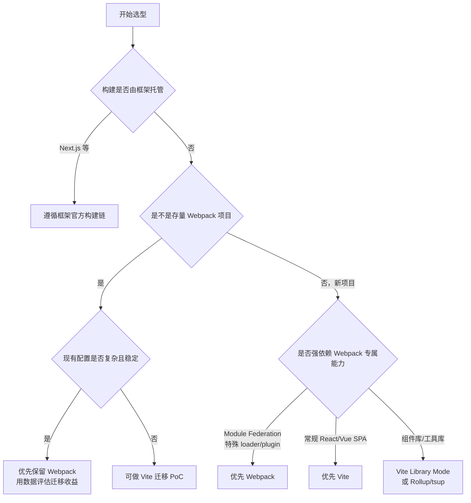

# Vite 和 Webpack 技术选型

> 一句话结论：现代 React/Vue 新项目通常优先 Vite；已有成熟 Webpack 配置、依赖原生 Module Federation 或大量定制 loader/plugin 的项目，通常继续使用 Webpack。最终应以框架约束、迁移成本和真实构建指标决定，而不是简单认为“Vite 快所以一定选 Vite”。

## 先看项目类型



## 核心差异

| 维度 | Vite | Webpack |
| --- | --- | --- |
| 开发模式 | 基于浏览器原生 ESM，业务模块按需转换 | 从入口构建依赖图并生成 bundle，再提供给浏览器 |
| 冷启动与 HMR | 通常更快，项目变大后优势更明显 | 默认链路较重，可通过持久化缓存、SWC 等优化 |
| 生产构建 | 仍然会打包、分包和压缩；具体引擎取决于 Vite 版本 | Webpack 自身完成构建，开发与生产模型更统一 |
| 配置体验 | 约定较强，常规项目配置少 | 配置粒度细，复杂需求可控性强 |
| 生态 | React/Vue、现代 ESM 项目成熟 | loader/plugin 历史生态更广，遗留兼容经验丰富 |
| 模块联邦 | 通常依赖社区插件，需验证版本兼容性 | Webpack 5 原生提供 `ModuleFederationPlugin` |
| 旧模块和特殊资源 | CJS、非标准资源可能需要额外适配 | 对 CJS、AMD、特殊 loader 链兼容更成熟 |
| 迁移成本 | 新项目低；Webpack 存量项目需重写配置和插件 | 存量项目无需迁移，团队已有经验可复用 |

Vite 的主要优势集中在**开发体验**，不代表生产包一定更小或运行时一定更快。生产产物要比较 chunk、缓存命中、首屏资源和业务运行性能，而不是只比较构建工具名称。

## 什么场景选 Vite

- 新建 React、Vue、Svelte 等现代 ESM 项目，没有历史构建包袱。
- 项目模块多，Webpack 冷启动和 HMR 已明显影响研发效率。
- 团队希望减少配置维护，使用框架官方插件和标准 CSS/静态资源方案。
- Monorepo 中有多个前端应用，希望统一轻量开发脚手架；仍需验证软链接、文件监听和依赖预构建。
- 组件库可以使用 Vite Library Mode，但要明确 external、CSS 输出、类型声明和 CJS/ESM 产物要求。

## 什么场景选或保留 Webpack

- 现有项目运行稳定，已经沉淀大量 loader、plugin、构建平台和发布逻辑。
- 微前端强依赖 Webpack 5 原生 Module Federation，且远程模块、共享依赖和运行时治理已经成熟。
- 需要处理大量旧版 CommonJS/AMD 模块、非标准资源或高度定制的编译链。
- 团队有严格的构建生命周期扩展需求，需要控制依赖图、chunk 和插件执行阶段。
- 迁移只能改善少量启动时间，却会引入较高回归测试、浏览器兼容和 CI 改造成本。

“老项目用 Webpack”不是绝对规则。如果 Webpack 已成为持续交付瓶颈，并且专属能力很少，仍然值得用一个代表性页面做 Vite 迁移 PoC。

## 不应直接比较的场景

Next.js、Nuxt 等元框架已经对编译、SSR、路由和部署做了整体设计。此时应优先使用框架支持的构建链，不要为了单独选择 Vite 或 Webpack 而绕开框架约束。

纯 TypeScript/JavaScript 工具库也不一定要在二者中二选一，可以根据产物要求选择 Rollup、tsup 等更聚焦的工具。

## 用数据完成选型

对候选方案搭建同一业务页面的 PoC，并记录：

| 指标 | 怎么测 |
| --- | --- |
| 冷启动 | 清缓存后，从启动命令到页面可交互的时间 |
| 热更新 | 保存典型组件后，到浏览器完成更新的时间 |
| 生产构建 | CI 环境完整 build 的耗时和峰值内存 |
| 产物质量 | 首屏 JS/CSS、chunk 数量、重复依赖、长期缓存命中率 |
| 兼容性 | 目标浏览器、CJS 依赖、Web Worker、WASM、CSS 预处理等回归结果 |
| 工程成本 | 配置代码量、专属插件替代率、CI 和部署改造工作量 |

可以使用简单的加权决策，避免只凭个人偏好：

```text
总分 = 开发效率 × 30%
     + 能力匹配 × 30%
     + 迁移成本 × 20%
     + 生产指标 × 10%
     + 团队熟悉度 × 10%
```

对存量项目，迁移前还要设定收益门槛，例如“冷启动降低 60%、HMR P95 小于 500ms，且关键插件全部有稳定替代”，达不到就不应仅为了技术更新而迁移。

## 常见误区

- **Vite 不等于生产环境不打包**：no-bundle 主要描述开发态，生产仍会优化并输出 bundle。
- **Vite 不等于任何规模都更快**：依赖预构建、深层路由请求瀑布和插件转换也有成本，需要实测。
- **Webpack 不等于一定很慢**：持久化缓存、缩小 loader 范围、并行编译和更快的转换器都能改善速度。
- **大项目不等于必须 Webpack**：项目大小只是指标之一，真正关键的是专属能力、模块形态和迁移风险。
- **不要只比较 build 时间**：研发阶段的启动/HMR、生产产物、CI 稳定性和维护成本都要纳入。

## 面试回答

> 我不会只根据“Vite 比 Webpack 快”做选型。新建的 React/Vue 常规项目，我通常优先 Vite，因为开发态按需转换和原生 ESM 能带来更快的启动、HMR，以及更低的配置成本。如果是成熟的 Webpack 存量项目，已经有复杂 loader/plugin、原生 Module Federation 或旧模块兼容要求，我会优先保留 Webpack，因为迁移风险可能大于收益。Next.js 这类框架托管构建的项目则遵循框架方案。最终我会选一个代表性页面做 PoC，比较冷启动、HMR P95、CI 构建、产物体积、插件替代率和迁移成本，再用数据决策。Vite 的优势主要是开发体验，不代表生产包一定更小。

## 相关资料

- [Vite 与 Webpack 核心区别](./vite与webpack核心区别.md)
- [Webpack 打包原理](../../webpack/面试题/webpack打包原理.md)
- [Webpack 构建优化](../../webpack/面试题/讲讲webpack优化.md)
- [Vite 官方：Why Vite](https://vite.dev/guide/why)
- [Webpack 官方：Module Federation](https://webpack.js.org/concepts/module-federation/)
