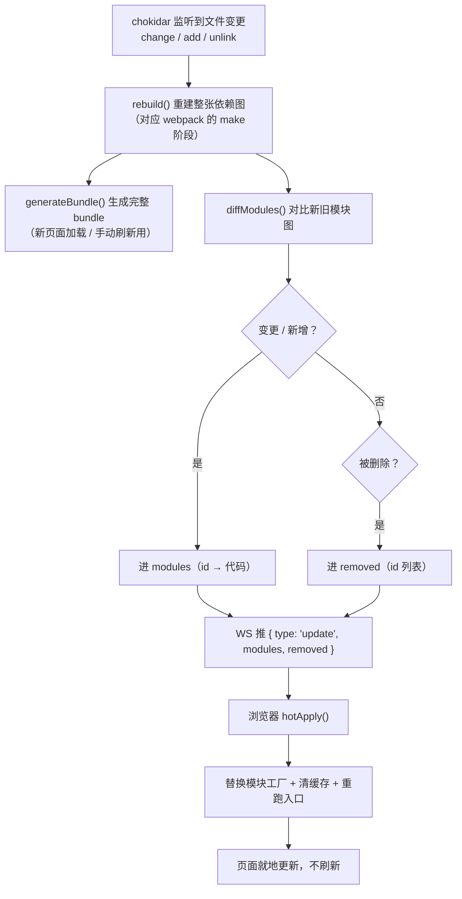
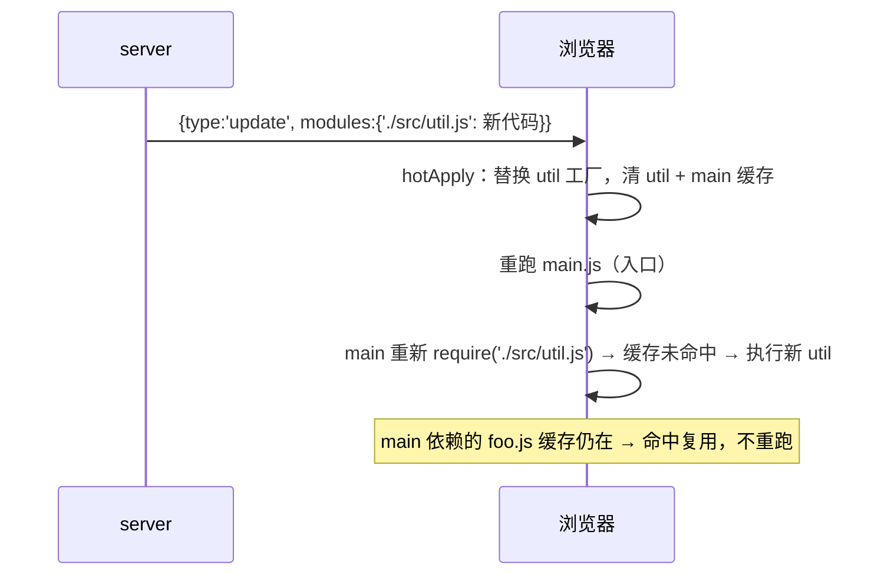

# mini-webpack HMR 增量原理

> 一句话结论：**webpack 的 HMR 不是「重新加载页面」，而是「只把变更模块的代码推给浏览器，运行时替换模块工厂并重跑入口」**。本文拆解 mini-webpack 从「整包重取 + reload」改成「增量替换」后，每一步做了什么、为什么能成立。
>
> 高层原理见 [webpack 热更新](../../webpack/面试题/webpack%20热更新.md)；与 Vite 的 HMR 对比见 [vite 与 webpack 核心区别](../../vite/面试题/vite与webpack核心区别.md)。

## 一、整体流程



注意 `B` 这一步**仍是全量重建依赖图**——这是 webpack 慢的根因，与 HMR「下发增量」是两件事：

- 服务端**重建整张图**（`buildModuleGraph` 每次从 entry 递归跑一遍）
- 但**下发给浏览器的只是 diff 出的变更模块**（增量在「推多少」这一侧）

## 二、之前 vs 现在

| | 之前（整包重取） | 现在（增量替换） |
| --- | --- | --- |
| 服务端推什么 | `{ type: 'invalid' }`，什么都不带 | `{ type: 'update', modules, removed }`，只带变更模块 |
| 浏览器怎么更新 | `location.reload()` 重新拉整个 bundle | `hotApply` 替换工厂 + 重跑入口 |
| 未变模块 | 全部重新执行 | 命中缓存，直接复用 |
| 页面状态 | 丢失（整页刷新） | 保留（就地更新） |

## 三、最小示例

### 1. 服务端：diff 出新旧图的差异

```ts
// server.ts —— 对比上一次的模块图 cachedGraph 与刚重建的 graph
function diffModules(prev: ModuleGraph, next: ModuleGraph) {
  const modules: Record<string, string> = {}; // 变更 + 新增
  const removed: string[] = [];               // 删除

  for (const [id, mod] of next) {
    const old = prev.get(id);
    if (!old || old.code !== mod.code) modules[id] = mod.code;
  }
  for (const id of prev.keys()) {
    if (!next.has(id)) removed.push(id);
  }
  return { modules, removed };
}
```

变更与新增都进 `modules`，因为应用时都走「替换工厂」同一条路径。真实 webpack 把它们拆进 `hot-update.json` 的 `c` / `r` / `m` 三个字段，这里合并成一个对象。

### 2. 传输：一条 WS 消息

```json
{
  "type": "update",
  "modules": {
    "./src/util.js": "exports.format = function format(s) { ... }"
  },
  "removed": []
}
```

### 3. 浏览器：hotApply 增量替换

```js
// bundle.ts 里的 runtime（省略号处为真实代码）
__webpack_require__.m = __webpack_modules__;   // 模块工厂表
__webpack_require__.c = __webpack_module_cache__; // 模块缓存表
__webpack_require__.entry = "./src/main.js";

__webpack_require__.hotApply = function (moreModules, removed) {
  // ① 删除已移除的模块
  for (var i = 0; i < removed.length; i++) {
    delete __webpack_require__.m[removed[i]];
    delete __webpack_require__.c[removed[i]];
  }
  // ② 把变更模块的代码重新包成工厂，替换进模块表
  for (var moduleId in moreModules) {
    __webpack_require__.m[moduleId] = new Function(
      'module', 'exports', '__webpack_require__', moreModules[moduleId]
    );
    delete __webpack_require__.c[moduleId];
  }
  // ③ 清掉入口缓存，重跑入口
  delete __webpack_require__.c[__webpack_require__.entry];
  __webpack_require__(__webpack_require__.entry);
};
```

### 4. 一次编辑走查：改 `util.js`



关键在最后一行：**入口重跑时，只有被变更的模块（及其依赖链）会重新执行，未变的 `foo.js` 命中缓存直接复用**。这就是「增量」的运行时体现。

## 四、必要补充

### 1. 与真实 webpack 的映射

| 真实 webpack | mini-webpack |
| --- | --- |
| `hot-update.json` 的 `c`/`r`/`m` 字段 | `diffModules` 返回的 `modules` / `removed` |
| `hot-update.js` 里的 `webpackHotUpdate(chunkId, moreModules)` | `__webpack_require__.hotApply(moreModules, removed)` |
| 沿依赖链向上找 `module.hot.accept` 边界，找不到才整页刷新 | 省略边界判断，统一「替换 + 重跑入口」 |
| HMR client 打进 bundle，与 runtime 同作用域 | client 独立注入，靠 `self` 全局桥接 |

### 2. 关键坑：两个 `<script>` 作用域隔离

`__webpack_require__` 定义在 bundle 的 IIFE 里，HMR client 是注入在 HTML 里的**另一个 `<script>`**，两者作用域互相看不见。所以 runtime 末尾要暴露一个全局入口：

```js
// bundle.ts
self.__miniWebpackRequire__ = __webpack_require__;

// server.ts 的 HMR client
self.__miniWebpackRequire__.hotApply(msg.modules, msg.removed);
```

真实 webpack 是把 HMR client 打进 bundle 共享作用域，这里为了保持「客户端脚本单独注入」的结构（对齐 webpack-dev-server），改用 global 桥接。

### 3. 与 mini-vite 的对比

| | mini-webpack（增量） | mini-vite |
| --- | --- | --- |
| 推什么 | 变更模块的**工厂代码**（`modules` 对象） | 变更文件的 **URL**（`{ type:'update', path }`） |
| 谁执行模块 | 自己的 `__webpack_require__` | 浏览器原生 `import()` 重新请求单文件 |
| 替换粒度 | 模块工厂 + 重跑入口 | 单个 ESM 文件重新 import |
