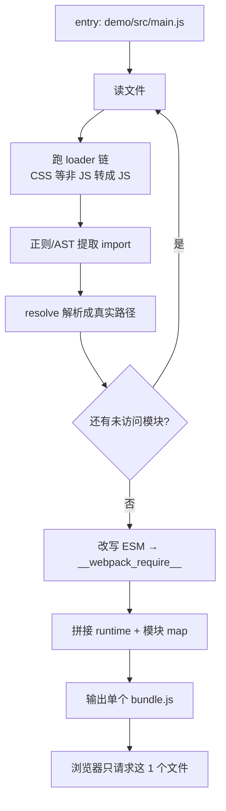

# mini-webpack

极简 webpack 实现，用于理解 **bundle 范式**：依赖图构建 + loader 链 + runtime 生成 + 增量式 HMR。

配套对照实现：[mini-vite](../../vite/README.md)（no-bundle 范式）。两者 demo 结构故意保持一致，便于逐文件对比 —— 完整对比结论见 [Vite 与 Webpack 核心区别](../../vite/面试题/vite与webpack核心区别.md)。

## 一句话结论

webpack = **先把所有模块打成一个 bundle，再交给浏览器**；模块调度靠自己实现的 `__webpack_require__` runtime，浏览器只认这一个 JS 文件。

## 如何运行

```bash
pnpm install

# 1. 只跑一次打包，看产物和模块数
pnpm build      # 产物在 demo/dist/bundle.js

# 2. 起 dev server（http://localhost:5175）
pnpm dev
```

实测输出：

```
$ pnpm build
[mini-webpack] 遍历模块数: 3
[mini-webpack] 打包耗时: 1.1ms

$ pnpm dev
[mini-webpack] 启动前必须先完成全量打包...
[mini-webpack] 第 1 次构建（启动）：3 个模块，1.0ms
mini-webpack dev server at http://localhost:5175

# 修改 demo/src/util.js 后：
[mini-webpack] 第 2 次构建（util.js 变更）：3 个模块，0.6ms
                                            ↑ 服务端仍要重建全部 3 个模块（make 阶段不变）
[mini-webpack] 增量：变更 1 个模块（浏览器只替换这些模块，不整包重取）
                                            ↑ 推给浏览器的只是 util.js 这一个模块的代码
```

**第一行日志就是 webpack 慢的根因**：`模块数` 会随项目增长，而启动和每次热更新都要在服务端重跑一遍依赖图。
**第二行是 HMR 的增量**：虽然服务端重建了整张图，但下发给浏览器的是 diff 出的变更模块，浏览器在运行时替换模块工厂并重跑入口，不再整包重取、不刷新页面。

## 核心流程



关键点：**第 F 步的循环必须跑完，浏览器才能拿到任何东西**。这是 bundle 范式的本质约束。

## 产物结构（实际生成，非示意）

```javascript
(function () {
var __webpack_modules__ = {
  "./src/main.js": function (module, exports, __webpack_require__) {
    const { add } = __webpack_require__("./src/foo.js");
    const { format } = __webpack_require__("./src/util.js");
    const app = document.getElementById('app');
    app.innerHTML = `<p>foo.add(1,2) = ${add(1, 2)}</p><p>${format('hello')}</p>`;
  },
  "./src/foo.js": function (module, exports, __webpack_require__) {
    exports.add = function add(a, b) { return a + b; }
  },
  "./src/util.js": function (module, exports, __webpack_require__) {
    exports.format = function format(s) { return 'mini-webpack: ' + s.toUpperCase(); }
  }
};
var __webpack_module_cache__ = {};

function __webpack_require__(moduleId) {
  var cached = __webpack_module_cache__[moduleId];
  if (cached !== undefined) return cached.exports;   // 模块缓存：同一模块只执行一次
  var module = (__webpack_module_cache__[moduleId] = { id: moduleId, exports: {} });
  __webpack_modules__[moduleId](module, module.exports, __webpack_require__);
  return module.exports;
}

// —— HMR 增量：把工厂表/缓存表/入口挂到 require 上，运行时才能替换 ——
__webpack_require__.m = __webpack_modules__;    // 对应 webpack 的 __webpack_require__.m
__webpack_require__.c = __webpack_module_cache__; // 对应 __webpack_require__.c
__webpack_require__.entry = "./src/main.js";

__webpack_require__.hotApply = function (moreModules, removed) {
  // 1. 删除已移除模块；2. 替换变更模块工厂（new Function 重建）；3. 重跑入口
  // 入口重新 require 变更模块，未变模块命中缓存复用 —— 这就是「不刷新页面」的增量替换
};

__webpack_require__(__webpack_require__.entry);   // 从入口启动
})();
```

四个要点：

1. **模块被包成函数**存在 map 里，key 是模块 ID —— 所以 webpack 能支持 CJS/ESM/AMD 混用，都统一成函数签名 `(module, exports, __webpack_require__)`
2. **`__webpack_require__` 是自己实现的模块系统**，不依赖浏览器 —— 这是 webpack 能兼容 IE 的原因
3. **模块缓存**保证循环依赖不会无限递归、同一模块只执行一次
4. **`__webpack_require__.m` / `.c` 暴露了模块工厂表与缓存表** —— HMR 增量替换的抓手：改一个文件，服务端只推那个模块的新代码，运行时替换工厂、清掉缓存、重跑入口，其余模块照旧复用

## 代码与原理对照

| 原理 | 对应文件 | 说明 |
| --- | --- | --- |
| 模块解析 | [src/resolve.ts](src/resolve.ts) | `resolveModule()` 补全扩展名、目录 index；`resolveBare()` 沿目录向上找 node_modules，读 `package.json` 的 module/main 字段 |
| loader 链 | [src/loader.ts](src/loader.ts) | `rules` 对应 `module.rules`；`runLoaders()` 用 `reduceRight` 实现**从右到左**执行，与 webpack 语义一致 |
| **依赖图构建（核心）** | [src/graph.ts](src/graph.ts) | `buildModuleGraph()` 从 entry 广度优先遍历全部模块；`transformToRuntime()` 把 `import/export` 改写成 `__webpack_require__`/`exports.x` |
| bundle 生成 | [src/bundle.ts](src/bundle.ts) | `RUNTIME` 常量是 `__webpack_require__` 的最小实现；`generateBundle()` 把模块包成函数塞进 map |
| 构建入口 | [src/build.ts](src/build.ts) | 打印模块数与耗时，用于和 mini-vite 对比 |
| dev server + HMR | [src/server.ts](src/server.ts) | `rebuild()` 在启动和每次文件变更时都跑完整构建；`diffModules()` 对比新旧图，WS 只推变更模块的增量（深入拆解见 [HMR 增量原理](HMR增量原理.md)） |

## 与 mini-vite 的关键代码差异

| 行为 | mini-webpack | mini-vite |
| --- | --- | --- |
| 启动时做什么 | `server.ts` 先 `rebuild()` 遍历全部模块 | `server.ts` 只 `ensurePrebundle()` 处理 node_modules |
| 浏览器请求什么 | `demo/index.html` → `<script src="/bundle.js">` 单个文件 | `<script type="module" src="/src/main.js">` 后续按需请求 N 个 |
| 模块调度者 | 自己实现的 `__webpack_require__` | 浏览器原生 ESM |
| 处理 bare import | `resolve.ts` 构建时解析进依赖图 | `transform.ts#rewriteBareImports` 重写成预构建 URL |
| 文件变更后 | `rebuild()` 重建全图，但只推 diff 出的变更模块（`{type:'update', modules, removed}`） | 只推 `{type:'update', path}`，浏览器 import 单文件 |

## 与真实 webpack 的差距（刻意省略的部分）

- **AST**：真实 webpack 用 acorn 解析，本实现用正则改写 `import/export`，遇到复杂语法会失效
- **Tapable 钩子**：没有 Compiler/Compilation 生命周期与 plugin 机制
- **code splitting**：没有 `splitChunks`、动态 `import()` 分包
- **HMR 边界判断**：真实 webpack 推 `hot-update.json`（变更清单 c/r/m）+ `hot-update.js`（模块工厂）做增量替换，并沿依赖链向上找 `module.hot.accept` 决定是局部替换还是整页刷新；本实现把清单与代码合并成一条 WS 消息、直接 `hotApply` 重跑入口，没有 accept 边界与 JSONP 分包
- **持久缓存**：没有 `cache: { type: 'filesystem' }`
