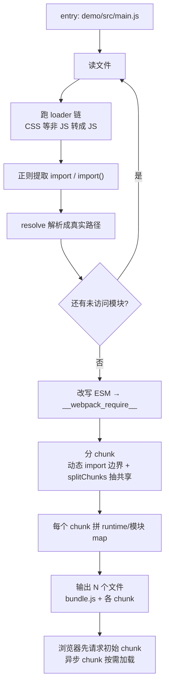

# mini-webpack

极简 webpack 实现，用于理解 **bundle 范式**：依赖图构建 + loader 链 + 分 chunk（splitChunks）+ runtime 生成 + 增量式 HMR。

配套对照实现：[mini-vite](../../vite/README.md)（no-bundle 范式）。两者 demo 结构故意保持一致，便于逐文件对比 —— 完整对比结论见 [Vite 与 Webpack 核心区别](../../vite/面试题/vite与webpack核心区别.md)。

## 一句话结论

webpack = **先把所有模块打包成 1..N 个 chunk，再交给浏览器**；模块调度靠自己实现的 `__webpack_require__` runtime，跨 chunk 的模块靠 `__webpack_require__.e` 按需加载。chunk 可以来自动态 `import()` 的边界（代码分割），也可以来自 splitChunks 把「被多个 chunk 共享的模块」抽出来单独成 chunk。

## 如何运行

```bash
pnpm install

# 1. 只跑一次打包，看产物和 chunk 数
pnpm build      # 产物在 demo/dist/ 下（bundle.js + shared.js + src_lazy.js）

# 2. 起 dev server（http://localhost:5175）
pnpm dev
```

实测输出：

```
$ pnpm build
[mini-webpack] 遍历模块数: 4
[mini-webpack] chunk 数: 3（main, src_lazy, shared）
[mini-webpack] 打包耗时: 1.2ms
[mini-webpack] 产物: bundle.js, src_lazy.js, shared.js

$ pnpm dev
[mini-webpack] 启动前必须先完成全量打包...
[mini-webpack] 第 1 次构建（启动）：4 个模块 / 3 个 chunk，1.0ms
mini-webpack dev server at http://localhost:5175

# 修改 demo/src/util.js 后：
[mini-webpack] 第 2 次构建（util.js 变更）：4 个模块 / 3 个 chunk，0.6ms
                                            ↑ 服务端仍要重建全部 4 个模块（make 阶段不变）
[mini-webpack] 增量：变更 1 个模块（浏览器只替换这些模块，不整包重取）
                                            ↑ 推给浏览器的只是 util.js 这一个模块的代码
```

**第一行日志就是 webpack 慢的根因**：`模块数` 会随项目增长，而启动和每次热更新都要在服务端重跑一遍依赖图。
**第二行是 HMR 的增量**：虽然服务端重建了整张图，但下发给浏览器的是 diff 出的变更模块，浏览器在运行时替换模块工厂并重跑入口，不再整包重取、不刷新页面。
**chunk 数 = 3 是 splitChunks 的结果**：`main`（初始）、`src_lazy`（动态 import 拆的异步 chunk）、`shared`（util.js 被 main 和 src_lazy 共用，抽出来的共享 chunk）。

## 核心流程



关键点：**第 F 步的循环必须跑完，浏览器才能拿到任何东西**。这是 bundle 范式的本质约束。第 H 步（分 chunk）是在依赖图构建完之后、代码生成之前的一次「分组」——splitChunks 的时机就在这里。

## splitChunks 原理（本实现的分包核心）

demo 现在的依赖关系：

```
main.js  ──静态──> foo.js
main.js  ──静态──> util.js        ┐
main.js  ──动态 import()──> lazy.js ──静态──> util.js ┘  ← util.js 被两个 chunk 共用
```

分 chunk 分两步（对应 `src/chunk.ts`）：

1. **代码分割（动态 import 边界）**：`import('./lazy.js')` 的边界把模块切成「初始 chunk」（main.js 沿静态依赖可达的 foo.js、util.js）和「异步 chunk」（lazy.js 及其子模块）。
2. **splitChunks（抽共享）**：util.js 被 `main` 和 `src_lazy` 两个 chunk 同时用到（minChunks ≥ 2），于是把它从两个 chunk 里抽出来，单独成一个 `shared` chunk。

最终三个文件，每个模块只出现在一个文件里：

| 文件 | chunk | 包含模块 | 何时加载 |
| --- | --- | --- | --- |
| `bundle.js` | main（初始） | main.js + foo.js + runtime | HTML 里直接引 |
| `shared.js` | shared（初始） | util.js | HTML 里先于 bundle.js 引（因为 main.js 同步 require util.js） |
| `src_lazy.js` | src_lazy（异步） | lazy.js | 首次 `import('./lazy.js')` 时按需拉 |

**splitChunks 为什么要拆**（对应面试常问的「优化手段」）：

1. **不重复打包**：util.js 只出现一次，而不是在 main 和 src_lazy 里各打一份；
2. **缓存友好**：util.js 单独成 chunk，改 main.js 不影响 util.js 的缓存，改 util.js 只让 shared chunk 失效；
3. **按需加载**：src_lazy 是异步 chunk，首屏不加载，`import('./lazy.js')` 时才拉。

真实 webpack 的 `optimization.splitChunks` 就是在做这件事，多了两个维度：`cacheGroups.defaultVendors` 把 `node_modules` 里的三方库单独抽成 vendors（逻辑同构，只是 test 条件从「被 ≥2 chunk 用」换成「来自 node_modules」）、以及 `minSize`/`maxSize` 等尺寸约束。`chunks: 'all'` vs `'async'` 的区别见 [splitChunks 中 all、async 的使用场景](../面试题/splitChunk中all、async的使用场景.md)。

## 产物结构（实际生成，非示意）

```javascript
// —— shared.js：只有 util.js（splitChunks 抽出的共享模块）——
(self.__miniWebpackChunkQueue__ = self.__miniWebpackChunkQueue__ || []).push([
  "shared",
  { "./src/util.js": function (module, exports, __webpack_require__) {
      exports.format = function format(s) { return 'mini-webpack: ' + s.toUpperCase(); }
  } }
]);

// —— src_lazy.js：异步 chunk，只有 lazy.js ——
(self.__miniWebpackChunkQueue__ = self.__miniWebpackChunkQueue__ || []).push([
  "src_lazy",
  { "./src/lazy.js": function (module, exports, __webpack_require__) {
      const { format } = __webpack_require__("./src/util.js");   // util.js 在 shared chunk，已就位
      exports.lazyRun = function lazyRun() { console.log('[lazy]', format('async loaded')); }
  } }
]);

// —— bundle.js：runtime + main chunk（main.js + foo.js）——
(function () {
var __webpack_modules__ = {
  "./src/main.js": function (module, exports, __webpack_require__) {
    const { add } = __webpack_require__("./src/foo.js");
    const { format } = __webpack_require__("./src/util.js");     // 来自 shared chunk
    __webpack_require__.e("src_lazy").then(function () {           // 动态 import → 按需拉 chunk
      return __webpack_require__("./src/lazy.js");
    }).then(({ lazyRun }) => lazyRun());
    const app = document.getElementById('app');
    app.innerHTML = `<p>foo.add(1,2) = ${add(1, 2)}</p><p>${format('hello')}</p>`;
  },
  "./src/foo.js": function (module, exports, __webpack_require__) {
    exports.add = function add(a, b) { return a + b; }
  }
};
var __webpack_module_cache__ = {};

function __webpack_require__(moduleId) {
  var cached = __webpack_module_cache__[moduleId];
  if (cached !== undefined) return cached.exports;   // 模块缓存：同一模块只执行一次
  var module = (__webpack_module_cache__[moduleId] = { id: moduleId, exports: {} });
  var fn = __webpack_modules__[moduleId];
  if (!fn) throw new Error('Module not found: ' + moduleId);
  fn(module, module.exports, __webpack_require__);
  return module.exports;
}

__webpack_require__.m = __webpack_modules__;
__webpack_require__.c = __webpack_module_cache__;
__webpack_require__.entry = "./src/main.js";

// —— chunk 加载：动态 import 按需拉 chunk，全局队列桥接跨 <script> 作用域 ——
__webpack_require__.e = function (chunkId) { /* 注入 <script src="/chunkId.js"> */ };

// —— HMR 增量 ——
__webpack_require__.hotApply = function (moreModules, removed) { /* 替换工厂 + 重跑入口 */ };

__webpack_require__(__webpack_require__.entry);   // 从入口启动
})();
```

四个要点：

1. **模块被包成函数**存在 map 里，key 是模块 ID —— 所以 webpack 能支持 CJS/ESM/AMD 混用，都统一成函数签名 `(module, exports, __webpack_require__)`
2. **`__webpack_require__` 是自己实现的模块系统**，不依赖浏览器 —— 这是 webpack 能兼容 IE 的原因
3. **模块缓存**保证循环依赖不会无限递归、同一模块只执行一次
4. **跨 chunk 靠全局队列 + `__webpack_require__.e`**：每个 chunk 文件往 `self.__miniWebpackChunkQueue__` push 自己的模块（对应 webpack 的 JSONP `self["webpackChunk_xxx"]`），runtime 接管队列的 push 完成注册；`__webpack_require__.m` / `.c` 暴露模块工厂表与缓存表 —— HMR 增量替换的抓手：改一个文件，服务端只推那个模块的新代码，运行时替换工厂、清掉缓存、重跑入口，其余模块照旧复用

## 代码与原理对照

| 原理 | 对应文件 | 说明 |
| --- | --- | --- |
| 模块解析 | [src/resolve.ts](src/resolve.ts) | `resolveModule()` 补全扩展名、目录 index；`resolveBare()` 沿目录向上找 node_modules，读 `package.json` 的 module/main 字段 |
| loader 链 | [src/loader.ts](src/loader.ts) | `rules` 对应 `module.rules`；`runLoaders()` 用 `reduceRight` 实现**从右到左**执行，与 webpack 语义一致 |
| **依赖图构建（核心）** | [src/graph.ts](src/graph.ts) | `buildModuleGraph()` 从 entry 广度优先遍历全部模块（含动态 `import()`）；`transformToRuntime()` 把 `import/export` 改写成 `__webpack_require__`/`exports.x`；`transformAsyncImports()` 在分 chunk 之后把 `import()` 改写成 `__webpack_require__.e` |
| **分 chunk / splitChunks** | [src/chunk.ts](src/chunk.ts) | `splitIntoChunks()` 按动态 import 边界切 chunk，再 `extractShared()` 把被 ≥2 个 chunk 共享的模块抽成 shared chunk |
| bundle 生成 | [src/bundle.ts](src/bundle.ts) | `RUNTIME` 常量是 `__webpack_require__` 的最小实现（含 `__webpack_require__.e` 按需加载）；`generateAssets()` 产出 bundle.js + 各 chunk 文件 |
| 构建入口 | [src/build.ts](src/build.ts) | 打印模块数、chunk 数与耗时，用于和 mini-vite 对比 |
| dev server + HMR | [src/server.ts](src/server.ts) | `rebuild()` 在启动和每次文件变更时都跑完整构建；`diffModules()` 对比新旧图，WS 只推变更模块的增量（深入拆解见 [HMR 增量原理](HMR增量原理.md)） |

## 与 mini-vite 的关键代码差异

| 行为 | mini-webpack | mini-vite |
| --- | --- | --- |
| 启动时做什么 | `server.ts` 先 `rebuild()` 遍历全部模块 | `server.ts` 只 `ensurePrebundle()` 处理 node_modules |
| 浏览器请求什么 | `demo/index.html` → 初始 chunk 的 `<script>`（shared.js + bundle.js），异步 chunk 按需拉 | `<script type="module" src="/src/main.js">` 后续按需请求 N 个 |
| 模块调度者 | 自己实现的 `__webpack_require__` | 浏览器原生 ESM |
| 处理 bare import | `resolve.ts` 构建时解析进依赖图 | `transform.ts#rewriteBareImports` 重写成预构建 URL |
| 文件变更后 | `rebuild()` 重建全图，但只推 diff 出的变更模块（`{type:'update', modules, removed}`） | 只推 `{type:'update', path}`，浏览器 import 单文件 |

## 与真实 webpack 的差距（刻意省略的部分）

- **AST**：真实 webpack 用 acorn 解析，本实现用正则改写 `import/export`/`import()`，遇到复杂语法会失效
- **Tapable 钩子**：没有 Compiler/Compilation 生命周期与 plugin 机制
- **splitChunks 完整度**：只实现了「动态 import 边界 + minChunks≥2 抽共享」两个核心规则，没有 `cacheGroups.vendors`（node_modules 单独抽）、`minSize`/`maxSize`、跨异步 chunk 之间的 chunk 依赖（本实现假设共享 chunk 是 initial，随 HTML 加载）
- **HMR 边界判断**：真实 webpack 推 `hot-update.json`（变更清单 c/r/m）+ `hot-update.js`（模块工厂）做增量替换，并沿依赖链向上找 `module.hot.accept` 决定是局部替换还是整页刷新；本实现把清单与代码合并成一条 WS 消息、直接 `hotApply` 重跑入口，没有 accept 边界
- **持久缓存**：没有 `cache: { type: 'filesystem' }`
