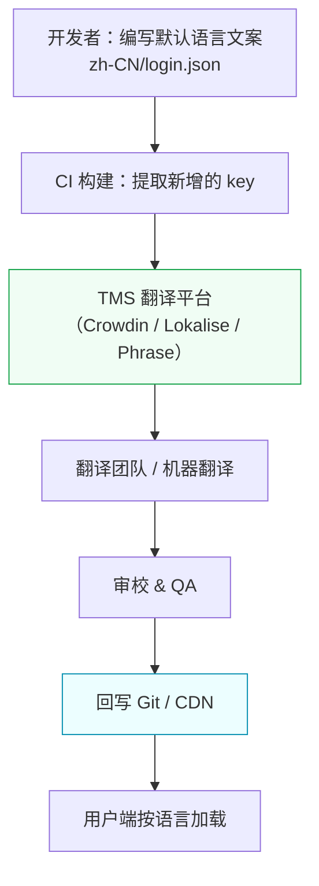

# 前端多语言（i18n）完整方案

> **一句话总结：** 前端国际化（i18n）的核心不是「翻译文本」，而是把文案从代码中解耦出来，建立一套文案→不同语言的映射管理系统，同时处理好复数、日期、货币、RTL（阿拉伯语/希伯来语）等语言差异。

---

## 一、核心概念

### 1.1 i18n / l10n / g11n 区别

| 术语 | 全称 | 含义 |
|------|------|------|
| **i18n** | Internationalization | 国际化：让软件**有能力**支持多语言（写代码时的架构设计） |
| **l10n** | Localization | 本地化：为**特定地区/语言**翻译并适配（翻译文案、调整格式） |
| **g11n** | Globalization | 全球化：i18n + l10n 的全套流程（商业概念） |

### 1.2 Locale（语言区域）

```
zh-CN    → 中文-中国大陆（简体中文）
zh-TW    → 中文-中国台湾（繁体中文）
en-US    → 英文-美国
en-GB    → 英文-英国
ja-JP    → 日文-日本
ar-SA    → 阿拉伯语-沙特阿拉伯（RTL）
```

**关键点：** Locale 不仅决定翻译文案，还决定：
- 日期格式：美国 `MM/DD/YYYY` vs 英国 `DD/MM/YYYY`
- 数字格式：`1,234.56`（en-US） vs `1 234,56`（fr-FR）
- 货币符号位置：`$100` vs `100 €`
- 文字方向：LTR 还是 RTL

### 1.3 ICU MessageFormat 标准

ICU（International Components for Unicode）定义了表达多语言文案的通用语法：

```
// 复数规则（Plural）
{count, plural, 
  =0 {No items}
  =1 {One item}
  other {# items}
}

// 性别选择
{gender, select,
  male {He}
  female {She}
  other {They}
}

// 日期/数字格式化
{price, number, ::currency/USD}
{date, date, ::yyyyMMdd}
```

---

## 二、技术方案对比

### 2.1 主流库对比

| 库 | 生态 | 体积 | 特点 |
|-----|------|------|------|
| **i18next** | React / Vue / Angular / Node | ~10KB Gzip | 最流行，插件化架构，支持 ICU、嵌套翻译、上下文翻译、命名空间懒加载 |
| **react-intl**（FormatJS） | React | ~15KB Gzip | Facebook 出品，深度拥抱 ICU MessageFormat，React 组件化 API |
| **vue-i18n** | Vue | ~8KB Gzip | Vue 官方推荐，支持 Composition API、SFC 内联翻译 |
| **next-intl** | Next.js | 轻量 | Next.js App Router 深度集成，服务器端优先 |
| **@angular/localize** | Angular | 内置 | Angular 内置方案，编译器级提取和替换 |

### 2.2 方案选型对比

```
                  i18next          react-intl         vue-i18n
翻译格式             JSON / ICU       ICU MessageFormat   JSON / ICU
命名空间              ✅               手动                ✅（Module）
懒加载               ✅               ❌ 手动              ✅
复数规则             ✅                ✅（原生）          ✅
TS 类型安全          无内置            无内置              ✅（资源 key 类型）
服务端渲染           ✅                ✅                  ✅
生态兼容性           ⭐⭐⭐⭐⭐          ⭐⭐⭐⭐            ⭐⭐⭐⭐
```

### 2.3 i18next 代码示例

```typescript
// 1. 初始化
import i18n from 'i18next';
import { initReactI18next } from 'react-i18next';
import Backend from 'i18next-http-backend';
import LanguageDetector from 'i18next-browser-languagedetector';

i18n
  .use(Backend)                   // 远程加载翻译文件
  .use(LanguageDetector)           // 检测浏览器语言
  .use(initReactI18next)           // 绑定 React
  .init({
    fallbackLng: 'zh-CN',          // 回退语言
    ns: ['common', 'login'],       // 命名空间
    defaultNS: 'common',
    interpolation: {
      escapeValue: false,          // React 已处理 XSS，关闭转义
    },
    detection: {
      order: ['querystring', 'cookie', 'localStorage', 'navigator'],
      caches: ['localStorage'],
    },
  });

// 2. 组件中使用
import { useTranslation } from 'react-i18next';

function LoginPage() {
  const { t } = useTranslation('login');

  return (
    <div>
      <h1>{t('welcome')}</h1>
      <p>{t('description', { count: 3 })}</p>
      {/* 复数示例 */}
      <span>{t('message_count', { count: 5 })}</span>
    </div>
  );
}

// 3. 翻译文件 zh-CN/login.json
{
  "welcome": "欢迎登录",
  "description": "请输入您的账号信息",
  "message_count": "您有{{count}}条新消息",
  "message_count_plural": "您有{{count}}条新消息"
}

// 复数规则更推荐用 ICU 格式：
{
  "message_count": "{count, plural, =0 {没有新消息} =1 {1条新消息} other {#条新消息}}"
}
```

---

## 三、关键实现细节

### 3.1 翻译文件组织策略

```
方案 A：按页面/功能拆分（推荐大型项目）       方案 B：按语言文件合并（适合小型项目）
public/locales/                              public/locales/
├── zh-CN/                                   ├── zh-CN.json
│   ├── common.json    // 全局通用            └── en-US.json
│   ├── login.json     // 登录页
│   ├── profile.json   // 个人中心
│   └── order.json     // 订单
└── en-US/
    ├── common.json
    ├── login.json
    ├── profile.json
    └── order.json
```

### 3.2 翻译文件懒加载

```typescript
// 按路由懒加载翻译文件
const LoginPage = lazy(() => {
  return Promise.all([
    import('./LoginPage'),
    i18n.loadNamespaces('login'),        // 加载翻译文件
  ]).then(([module]) => module);
});

// 或使用 i18next-chained-backend 分多个 bundle
i18n.use(ChainedBackend).init({
  backend: {
    backends: [
      LocalStorageBackend,            // 1. 先从本地缓存读
      HttpBackend,                    // 2. 再从 CDN 拉
    ],
  },
});
```

### 3.3 特殊场景处理

#### RTL（从右到左）排版

```css
/* 利用 CSS 逻辑属性，而非硬编码 left/right */
html[dir='rtl'] {
  direction: rtl;
  text-align: right;
}

.card {
  margin-inline-start: 16px;   /* 替代 margin-left，RTL 下自动变 margin-right */
  padding-inline-end: 8px;     /* 替代 padding-right */
  border-start-start-radius: 4px;  /* 替代 border-top-left-radius */
}
```

```typescript
// JS 中处理 RTL
const isRTL = document.documentElement.dir === 'rtl';

// 图标翻转：箭头 < 在 LTR 中指向左，在 RTL 中应指向右
<Icon className={clsx({ 'scale-x-[-1]': isRTL })} />
```

#### 动态文案（变量插入）

```json
// ❌ 错误：拼接
const text = '欢迎' + userName + '，您有' + count + '条消息';

// ✅ 正确：插值
{
  "welcome_user": "欢迎{{userName}}，您有{{count}}条新消息"
}
// 使用：t('welcome_user', { userName: '张三', count: 3 })
```

#### HTML 标签内嵌（XSS 风险）

```tsx
// ❌ 危险：dangerouslySetInnerHTML
<div dangerouslySetInnerHTML={{ __html: t('rich_text') }} />

// ✅ 安全：使用 Trans 组件（react-i18next）
<Trans i18nKey="agreement">
  我已阅读并同意<Link to="/terms">服务条款</Link>
</Trans>

// 翻译文件
{
  "agreement": "我已阅读并同意<1>服务条款</1>"  // <1> 映射到第二个子元素 Link
}
```

#### 日期与数字格式化

```typescript
// 不要用 toLocaleDateString 裸调，会受系统设置影响
new Date().toLocaleDateString();  // ❌ 可能显示中文日期

// ✅ 使用统一的 locale
import { format } from 'date-fns';
import { enUS, zhCN } from 'date-fns/locale';

const locales = { en: enUS, 'zh-CN': zhCN };
format(new Date(), 'PPP', { locale: locales[currentLang] });

// 或使用 Intl API（无需额外库）
new Intl.DateTimeFormat(currentLocale, { dateStyle: 'long' }).format(new Date());
new Intl.NumberFormat(currentLocale, { style: 'currency', currency: 'CNY' }).format(1234.5);
```

### 3.4 TypeScript 类型安全

```typescript
// vue-i18n 原生支持类型推导
// 但 i18next + react-i18next 需要手动方案：

// 方案1：使用 codegen 从 JSON 生成类型
// 方案2：自定义 t 函数包装
type TranslationKeys = keyof typeof import('../locales/zh-CN/common.json');

function typedT(key: TranslationKeys, params?: Record<string, unknown>): string {
  return i18n.t(key, params);
}
```

### 3.5 SSR / SSG 场景

```typescript
// Next.js App Router + next-intl
import { getRequestConfig } from 'next-intl/server';

export default getRequestConfig(async ({ requestLocale }) => {
  const locale = await requestLocale;
  return {
    locale,
    messages: (await import(`./messages/${locale}.json`)).default,
  };
});

// 组件中使用（服务端 + 客户端均可）
import { useTranslations } from 'next-intl';

export default function Page() {
  const t = useTranslations('HomePage');
  return <h1>{t('title')}</h1>;
}
```

---

## 四、翻译工作流

### 4.1 完整流程



### 4.2 工具链

| 工具 | 作用 |
|------|------|
| **i18n-ally**（VS Code 插件） | 在代码中实时预览翻译，内联编辑 |
| **Crowdin / Lokalise / Phrase** | TMS 翻译管理平台，自动同步 Git |
| **i18next-parser** | 扫描代码自动提取 i18n key 生成 JSON |
| **attranslate** | CLI 自动翻译，对接 Google / DeepL API |
| **babel-plugin-react-intl** | 编译时提取 react-intl 的 message descriptor |
| **@formatjs/cli** | react-intl 配套：提取、编译、AST 分析 |

---

## 五、面试常考问题

### Q1：请说一下 i18n 前端方案的架构设计

**考察点：** 是否只停留在 API 使用层面的理解，能否从架构角度思考。

**回答要点：**

1. **资源组织**：按命名空间/功能模块拆分，按需懒加载
2. **语言检测与切换**：多级 fallback 链（URL 参数 → Cookie → localStorage → `navigator.language` → 默认语言）
3. **插值引擎**：ICU MessageFormat 处理复数、性别、日期等语法变体
4. **翻译工作流**：代码提取 key → TMS 平台 → 审核 → 同步回代码/发布到 CDN
5. **性能考虑**：翻译文件懒加载、CDN 缓存、localStorage 缓存
6. **特殊处理**：RTL 排版、CSS 逻辑属性、图标翻转、SEO hreflang

---

### Q2：列举几个 Intl API 的使用场景

**考察点：** 是否了解浏览器内置的国际化 API。

```typescript
// 1. Intl.DateTimeFormat — 日期格式化
new Intl.DateTimeFormat('zh-CN', {
  year: 'numeric', month: 'long', day: 'numeric'
}).format(new Date());
// → "2026年8月4日"

// 2. Intl.NumberFormat — 数字格式化
new Intl.NumberFormat('de-DE', {
  style: 'currency', currency: 'EUR'
}).format(1234567.89);
// → "1.234.567,89 €"

// 3. Intl.RelativeTimeFormat — 相对时间
new Intl.RelativeTimeFormat('zh-CN', { numeric: 'auto' }).format(-1, 'day');
// → "昨天"

// 4. Intl.ListFormat — 列表格式
new Intl.ListFormat('en', { style: 'long', type: 'conjunction' })
  .format(['Apple', 'Banana', 'Orange']);
// → "Apple, Banana, and Orange"  // en: 牛津逗号
// → "Apple、Banana和Orange"       // zh-CN: 顿号分隔

// 5. Intl.PluralRules — 复数规则
new Intl.PluralRules('ar').select(3);
// → "few"  // 阿拉伯语 3 属于 few（英语只有 one/other）

// 6. Intl.Collator — 字符串排序
new Intl.Collator('zh').compare('啊', '吧');
// → -1  // 按拼音排序
```

---

### Q3：RTL（阿拉伯语/希伯来语）适配怎么做？

**考察点：** 是否考虑过极端国际化场景。

**回答框架：**

| 维度 | 做法 |
|------|------|
| **方向** | `<html dir="rtl">` 切换 |
| **CSS** | 用逻辑属性替代物理属性：`margin-inline-start` 替代 `margin-left` |
| **布局** | Flexbox / Grid 自动适配方向，`justify-content: flex-start` 在 RTL 下自动翻转为右侧 |
| **图标** | 有方向性的图标（箭头、返回按钮）需要镜像翻转 |
| **文本** | RTL 语言不需要把英文也翻转；混合内容用 `bdi` / `bdo` 标签包裹 |
| **滚动** | RTL 页面默认滚动方向反转 |
| **数字** | 阿拉伯语数字不翻转（`123` 仍然是 `123`，不是 `321`） |

---

### Q4：翻译文件很大怎么办？如何优化加载性能？

**考察点：** 性能优化意识。

**回答要点：**

1. **命名空间拆分**：按页面/功能模块切分，不是一份文件全加载
2. **路由级懒加载**：`React.lazy` + `i18n.loadNamespaces()` 结合
3. **CDN 分发**：翻译 JSON 走 CDN，利用浏览器缓存
4. **localStorage 持久化**：首次加载后缓存到本地，二次打开秒开
5. **差异更新**：版本号控制，变更时才重新拉取，只拉变更的 namespace
6. **按需编译 ICU**：若项目只用简单的 key-value 不用 ICU 语法，可以去掉 ICU 解析体积（i18next 可选）
7. **SSR 直出**：服务端渲染时把翻译内容内联到 HTML 中，客户端无需额外请求

---

### Q5：i18next 的 `fallbackLng` 回退机制是怎么工作的？

**考察点：** 对 i18next 源码级机制的理解。

```
用户语言链：['kr-KR', 'en-US']            ← navigator.languages
fallbackLng: 'zh-CN'                       ← 兜底语言

查找 key "delete_confirm" 的流程：
1. kr-KR/common.json → ❌ 不存在
2. en-US/common.json → ❌ 不存在
3. zh-CN/common.json → ✅ "确定删除？"

极端情况 fallbackLng: ['zh-CN', 'en-US', 'dev'] 可设置多级链
```

**进阶追问：** 如果 key 在回退语言中也不存在怎么办？

i18next 默认返回 **key 本身**作为兜底文本（`returnValue: true`），这在开发阶段很实用——看到英文 key 说明翻译缺失。生产环境可以设置 `parseMissingKeyHandler` 上报缺漏。

---

### Q6：`<Trans>` 组件和 `t()` 函数的区别？什么时候用哪个？

| 维度 | `t()` 函数 | `<Trans>` 组件 |
|------|-----------|---------------|
| 返回值 | 纯字符串 | React 组件/JSX |
| 嵌套 JSX | ❌ 不支持 | ✅ 支持嵌套 `<Link>`、`<strong>` 等 |
| 性能 | 轻量，纯函数 | 有组件实例开销 |
| 使用场景 | 纯文本、属性值、placeholder | 包含链接、加粗等富文本的文案 |
| SSR | 天然支持 | 需要客户端渲染场景 |

```tsx
// t() — 纯文本
<input placeholder={t('search_placeholder')} />

// Trans — 富文本
<Trans i18nKey="agree_terms">
  我已阅读并同意<Link to="/terms">服务条款</Link>和<Link to="/privacy">隐私政策</Link>
</Trans>
```

---

### Q7：如何避免翻译 key 和中文文案对不上导致的 bug？

**考察点：** 大型项目的治理经验。

**回答方案：**

| 方案 | 说明 |
|------|------|
| **TypeScript 类型化** | 用 codegen 从 JSON key 生成类型，关键调用处有编译时校验 |
| **ESLint 插件** | `eslint-plugin-i18next` 禁止在 JSX 中直接写中文字符串（强制使用 `t()`） |
| **提取脚本** | CI 中用 `i18next-parser` 扫描代码，查出写了但 JSON 中没有的 key，以及 JSON 中有但代码中没用到的僵尸 key |
| **i18n-ally** | VS Code 插件，在代码中 hover 时显示对应翻译文案，编辑 JSON 时显示哪些页面在用这个 key |
| **快照测试** | 对关键页面的多语言渲染结果做对齐测试 |

---

### Q8：跨组件复用文案怎么处理？

```typescript
// ❌ 反模式：在组件中拼 private key
// CompA
const text = t('compA_ok_button');   // "确定"
// CompB
const text = t('compB_ok_button');   // "确定"  ← 重复翻译！

// ✅ 方案 1：提取到 common namespace
// common.json
{ "ok": "确定", "cancel": "取消" }
// 使用
t('common:ok')

// ✅ 方案 2：语义化 key（推荐）
// common.json
{ "action.confirm": "确定", "action.cancel": "取消" }
t('action.confirm')
```

---

### Q9：服务端渲染（SSR）下 i18n 有什么坑？

**考察点：** 了解客户端与服务端 i18n 的差异。

| 坑 | 说明 | 解法 |
|----|------|------|
| **水合不匹配** | 服务端和客户端检测到的语言不一致导致水合报错 | 服务端从 URL/Cookie 获取语言，客户端用同样策略；或数据通过 props 从服务端传给客户端 |
| **NODE 无浏览器 API** | `navigator.language` / `localStorage` 在服务端不存在 | 语言检测逻辑在服务端侧使用 `Accept-Language` header，客户端侧用浏览器 API |
| **翻译文件加载** | 服务端和客户端的文件路径/模块解析方式不同 | 用 `i18next-fs-backend` 读取文件，客户端用 `i18next-http-backend` |
| **惰性加载** | `React.lazy` 路由级懒加载在 SSR 首屏不工作 | 首屏关键 namespace 服务端直出，非关键页面客户端懒加载 |

---

### Q10：你的项目中 i18n 遇到了什么坑？怎么解决的？

**考察点：** 工程经验深度。

**常见坑点及解法：**

#### 坑 1：翻译文件大了（100+ KB），页面首次切换语言卡顿
```
解法：
- 按路由 namespace 拆分
- 在切换语言时显示 loading 骨架屏
- 利用 localStorage 做一级缓存
```

#### 坑 2：样式被翻译文本撑爆
```
解法：
- CSS 做 truncate 兜底（text-overflow: ellipsis）
- 考虑德语（通常比英文长 30%）等长语言的适配
- 响应式布局 + min-width/max-width 约束
```

#### 坑 3：翻译和代码不同步
```
解法：
- CI 中增加 step，对比代码中用到的 key 和 JSON 中的 key
- 定期跑 i18next-parser 或 @formatjs/cli 提取
- 僵尸 key 报警 + 缺失 key 报警
```

#### 坑 4：时间/数字格式不一致
```
解法：
- 禁止裸用 toLocaleDateString()（会随浏览器/系统区域变化）
- 统一用 date-fns + locale 或 `new Intl.DateTimeFormat(currentLang)`
- 封装 formatDate / formatCurrency 工具函数
```

---

## 六、总结

> **前端多语言不只是 `t()` 函数的调用，而是一整套涉及资源管理、格式规范、性能优化、工作流治理的工程体系。** 面试时要能说清楚从文案提取到用户落地的完整链路，能够区分「方案选型」和「具体实现」两层，并对性能问题和极端场景（RTL、复数规则、SSR 水合）有解题能力。

---

> 本文档为个人学习笔记，部分内容基于实际项目经验整理。
