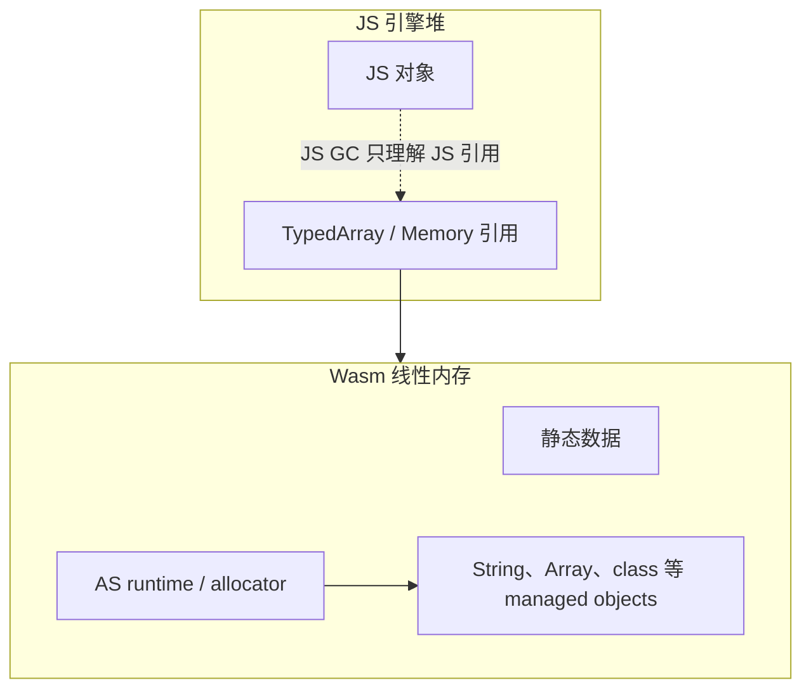
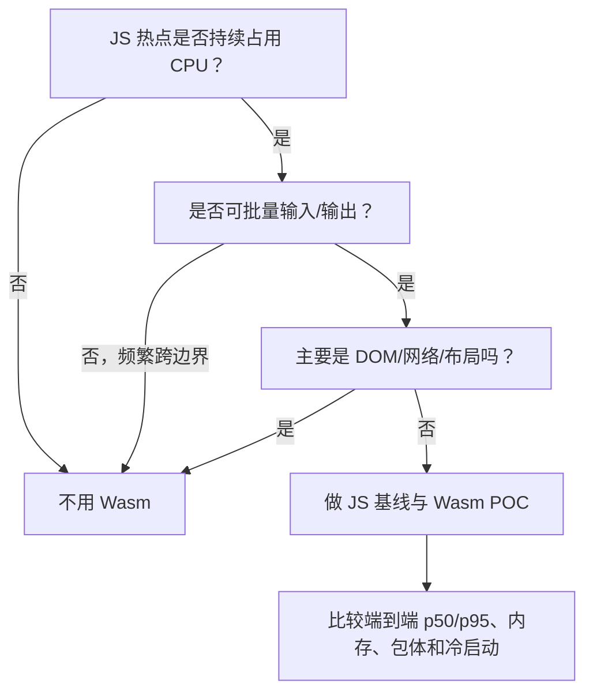
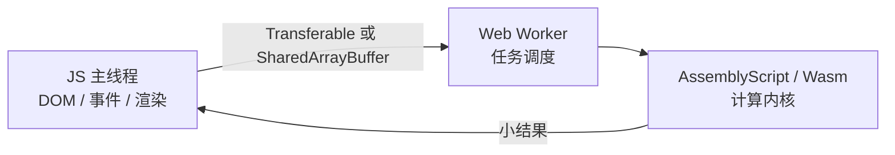

# AssemblyScript 面试题

## 1. AssemblyScript 是什么？和 TypeScript、JavaScript 有什么区别？

**一句话：AssemblyScript 是一门语法接近 TypeScript 的静态类型语言，由 `asc` 编译为 WebAssembly；它不是 TypeScript 的另一个运行时，也不能直接执行任意 TS/JS 代码。**

| 维度 | JavaScript | TypeScript | AssemblyScript |
| --- | --- | --- | --- |
| 定位 | 动态语言 | JS 的类型层 | 面向 Wasm 的静态语言 |
| 产物 | JS | 擦除类型后的 JS | `.wasm`，可选 `.wat` / source map / JS bindings |
| 类型时机 | 运行时 | 编译时检查，运行时仍是 JS | 编译到 Wasm 数值类型和内存布局 |
| 数值 | `number` 主要是 f64 | `number` 主要是 f64 | `i8/u8/i16/u16/i32/u32/i64/u64/f32/f64` 等 |
| 对象模型 | 原型链、动态属性 | 同 JS | 类和对象有固定布局，不支持 JS 的全部动态特性 |
| Web API / DOM | 直接访问 | 直接访问 | 不能直接访问，需由 JS 导入函数做桥接 |
| 内存 | JS 引擎托管堆 | 同 JS | Wasm 线性内存 + AS 运行时 |

### `.wasm` 和 `.wat` 有什么区别？

**一句话：`.wasm` 是给机器加载和执行的二进制格式，`.wat` 是与其等价、方便人阅读和调试的 WebAssembly Text Format。**

| 维度 | `.wasm` | `.wat` |
| --- | --- | --- |
| 格式 | 二进制指令 | S-expression 文本 |
| 用途 | 发布、传输、浏览器加载 | 学习、审查、debug |
| 体积/解析 | 更紧凑，宿主可直接解码 | 体积更大，需先转为 `.wasm` 才能常规加载 |
| AssemblyScript 中的作用 | `asc` 的主产物 | 可选输出，用于检查编译结果 |

例如 AS 的 `a + b` 编译后，对应的 WAT 核心结构类似：

```wat
(module
  (func $add (param $a i32) (param $b i32) (result i32)
    local.get $a
    local.get $b
    i32.add)
  (export "add" (func $add)))
```

`wat2wasm add.wat -o add.wasm` 可将 WAT 编译成 Wasm，`wasm2wat add.wasm -o add.wat` 可反向转换。二者的指令语义一致，但线上交付的是 `.wasm`，不是 `.wat`。

```ts
// AssemblyScript：写法像 TS，但 i32 会直接编译为 Wasm i32。
export function dot(a: i32, b: i32): i32 {
  return a * b;
}
```

面试时要强调：“TypeScript 语法子集”是学习体验，不是兼容承诺。`any`、原型、动态添加属性、闭包语义和大量 JS 内建 API 都不能照搬。

## 2. 为什么选 AssemblyScript 开发 Wasm？

**一句话：团队以 TS 为主、需要快速重写独立的计算内核时，AS 的迁移成本低；若要复用成熟原生库、极致控制内存或做大型系统，Rust/C++ 通常更合适。**

| 方案 | 主要优势 | 主要代价 | 更适合 |
| --- | --- | --- | --- |
| AssemblyScript | TS 开发者上手快；`asc` 工具链直接；产物可较小 | 生态、库数量和系统能力弱于 Rust/C++ | 前端团队的纯计算模块 |
| Rust + wasm-bindgen | 类型/内存安全，生态和绑定完善 | 语言、所有权和工具链学习成本高 | 长期维护、复杂数据结构、多平台核心库 |
| C/C++ + Emscripten | 能复用 FFmpeg、OpenCV 等大量原生代码 | 胶水和构建复杂，产物可能较大，内存安全风险 | 移植现有 C/C++ 库 |
| TinyGo | Go 语法与现有 Go 逻辑 | 运行时/产物和兼容性需评估 | Go 团队和跨端逻辑 |
| 手写 WAT | 控制精确，适合学习和极小函数 | 难维护，不适合业务系统 | 教学、实验、极小内核 |

选型不能只看语法。还要比较产物体积、冷启动、JS/Wasm 绑定、SIMD/线程需求、库生态和团队维护成本。

## 3. JS 和 Wasm 怎么传数据？

**一句话：单个数值（如 `i32/f64`）可跨边界直传；字符串、数组和对象通常要放入 Wasm 线性内存，边界只传“指针 + 长度”，再由一侧编解码。这种“只有一个值、不是集合”的数据就叫标量。**


可以把 `WebAssembly.Memory` 理解成 **JS 和 Wasm 都能看到的一个大型 `ArrayBuffer`**。指针不是 JS 对象，只是这块内存中的数字偏移量；例如 `4096` 表示“从第 4096 个字节开始读”。

### 边界类型限制

- Wasm MVP 核心数值类型是 `i32/i64/f32/f64`；JS 侧 `i32/f32/f64` 表现为 `number`，`i64` 使用 `BigInt`。
- `boolean`、枚举和指针通常用 `i32` 表示。
- 字符串、`ArrayBuffer`、类实例和普通 JS 对象不会自动变成 Wasm 线性内存中的对象。
- 现代 Wasm 还有引用类型，但这不等于可以零成本传递任意 JS 对象；工具链和宿主支持仍要具体评估。

### 示例一：单个数值直接传递

```ts
// assembly/index.ts（AssemblyScript）
export function add(a: i32, b: i32): i32 {
  return a + b;
}
```

```ts
// src/scalar-demo.ts（TypeScript）
import { add } from "../build/release.js";

const result = add(20, 22);
console.log(result); // 42
```

`20` 和 `22` 可直接映射到 Wasm `i32`，不需要进入线性内存；返回值也是直接跨边界返回。

### 示例二：数组通过线性内存传递

```ts
// assembly/index.ts（AssemblyScript）
// 全局引用保证 buffer 在 JS 使用期间不被 AS GC 回收。
let buffer = new Float64Array(0);

export function prepare(length: i32): usize {
  assert(length >= 0, "length must not be negative");
  buffer = new Float64Array(length);
  return buffer.dataStart;
}

export function sum(pointer: usize, length: i32): f64 {
  assert(length >= 0, "length must not be negative");

  let total = 0.0;
  for (let i = 0; i < length; i++) {
    total += load<f64>(pointer + (<usize>i << 3));
  }
  return total;
}
```

将线性内存和函数导出：

```bash
pnpm exec asc assembly/index.ts \
  --outFile build/release.wasm \
  --exportMemory \
  --optimize
```

JS 加载 Wasm，并直接写它的内存：

```ts
// src/array-demo.ts（TypeScript）
interface WasmExports extends WebAssembly.Exports {
  memory: WebAssembly.Memory;
  prepare(length: number): number;
  sum(pointer: number, length: number): number;
}

const input = new Float64Array([10, 20, 30]);
const response = await fetch("/build/release.wasm");
if (!response.ok) throw new Error(`Wasm load failed: ${response.status}`);

const bytes = await response.arrayBuffer();
const imports = {
  env: {
    abort(_message: number, _file: number, line: number, column: number): never {
      throw new Error(`AssemblyScript aborted at ${line}:${column}`);
    },
  },
};
const { instance } = await WebAssembly.instantiate(bytes, imports);
const wasm = instance.exports as unknown as WasmExports;

// 1. Wasm 分配空间，返回起始字节偏移量。
const pointer = wasm.prepare(input.length);

// 2. 这个 view 直接指向 Wasm 内存，set 将 JS 数组拷贝进去。
const wasmInput = new Float64Array(wasm.memory.buffer, pointer, input.length);
wasmInput.set(input);

// 3. 跨 JS/Wasm 函数边界的只有 pointer 和 length 两个数字。
const result = wasm.sum(pointer, input.length);
console.log(result); // 60
```

### 数据到底在哪里？

```text
Wasm memory（假设 prepare 返回 4096）

字节地址     4096         4104         4112
保存的 f64    10           20           30
                |------------ 24 字节 ------------|

JS 调用：wasm.sum(4096, 3)
Wasm 理解：从 4096 开始，连续读取 3 个 f64
```

因此，数组本身没有作为函数参数“传进去”。JS 先把数据写到两边共同可见的线性内存，再告诉 Wasm 数据的位置和数量。

字符串也是同一思路：JS 先用 `TextEncoder` 将字符串变成 UTF-8 字节并写入 memory，再传 `pointer + byteLength`。普通对象需要先序列化成字节、拆成多个连续数组，或使用 bindings 替你完成这个过程。

> 这是为了讲清 ABI 的最小示例，`prepare` 每次都会换掉全局 buffer，不适合并发请求。生产实现应该做缓冲区池/容量复用，或使用 AssemblyScript loader / ESM bindings 管理对象生命周期。

### 传参的性能损耗

| 损耗 | 产生原因 | 优化 |
| --- | --- | --- |
| 调用边界 | JS 和 Wasm 间切换、参数校验/转换 | 粗粒度 API，一次处理一批 |
| 分配与拷贝 | JS 堆和 Wasm 堆是独立的 | 复用缓冲区，传指针/长度，减少中间对象 |
| 编解码 | JS 字符串与 Wasm 内存表示不同 | 用 UTF-8/索引/二进制格式，尽量不反复转字符串 |
| GC 和生命周期 | 胶水层创建临时对象，或 AS 对象过早被回收 | 明确所有权，需要跨调用持有时 pin，用完 unpin |
| `memory.grow` | 增长后旧 JS TypedArray 视图可能失效 | 预留容量，增长后重新获取 view |

所以不要把每个字符或每个像素做一次 Wasm 调用。最好的边界是“JS 负责 UI/I/O，Wasm 一次吃进一大块连续数据并返回小结果”。

## 4. AssemblyScript 怎么管理内存？

**一句话：是，默认情况下 JS 和 AssemblyScript 都会自动回收对象；但 JS GC 管理 JS 引擎堆，AS GC 管理 Wasm 线性内存中的 AS managed objects，两套 GC 相互独立。**

关键区别是：**WebAssembly 线性内存只是一块字节空间，Wasm 标准本身不知道哪个字节已经是垃圾**。自动回收能力是 AssemblyScript runtime 额外提供的，不是所有 Wasm 模块天然都有 GC。



- `String`、`Array`、类实例等是 managed objects，由 AS runtime 跟踪。`ArrayBuffer` 等也有明确的内存布局。
- AS 的常规 runtime 提供增量 GC；具体 runtime variant 会影响体积、回收行为和可用的 runtime exports。
- JS 拿到的 AS 指针只是数字，AS GC 不知道 JS 正在持有它。需要跨调用保存的对象应通过 `__pin` 保活，完成后 `__unpin`。
- `memory.grow` 只增长线性内存，通常不会把容量自动还给 OS；GC 回收的是堆内块，供后续分配复用。

| 维度 | JS GC | AssemblyScript runtime |
| --- | --- | --- |
| 管理区域 | V8/SpiderMonkey 等引擎堆 | Wasm 线性内存中的 AS managed heap |
| 对象引用 | 引擎理解 JS 引用图 | runtime 理解 AS 对象布局，不理解 JS 持有的数字指针 |
| 策略 | 引擎自定，通常有分代、并发/增量等优化 | 由 AS runtime variant 决定，常规选项包含增量 GC |
| 交互方式 | 开发者通常不接触指针 | 跨 JS 边界时常要处理指针和保活 |

## 5. 什么业务适合 Wasm？飞书文档哪些能力可候选？

**一句话：适合 Wasm 的是“CPU 占比高、计算边界清晰、数据可批处理、几乎不操作 DOM”的热点；先 profiling，再重写最小核心。**



### 为什么用 Wasm，不是只用 Web Worker？

**一句话：Worker 解决“不阻塞主线程”，但通常不会让单次计算更快；Wasm 解决“计算内核的执行效率和稳定性”。两者是正交能力，计算又重又不能卡 UI 时，最终形态通常是 **Wasm + Worker**。**

| 方案 | 改善 UI 响应 | 缩短计算耗时 | 适用情况 |
| --- | --- | --- | --- |
| 主线程 JS | 否 | 无 | 小任务，一帧内可完成 |
| Worker + JS | 是 | 通常无，还有消息传输成本 | JS 已够快，只是不能堵住 UI |
| 主线程 Wasm | 不一定，长任务仍会卡 UI | 可能缩短 | 计算已明显变快，且耗时能稳定控制在帧预算内 |
| Worker + Wasm | 是 | 可能缩短 | 大文档 diff、索引、图像和 CRDT 批处理等重计算 |

Worker 本质上是调度和隔离手段。同一段 JS 从主线程移到 Worker，例如总计算仍需 `120ms`，只是用户在这 `120ms` 内仍能输入和滚动；再加上 `postMessage` 的序列化/拷贝和 Worker 启动，结果可能还会稍晚返回。

Wasm 则可能把该纯计算内核从 `120ms` 降到 `45ms`，但若仍在主线程同步执行，这 `45ms` 依然是 Long Task。因此更完整的方案是在 Worker 中实例化 Wasm，主线程只发送批量数据和接收结果。上述数字仅用于说明区别，实际收益要以基准测试为准。



判断顺序是：先看主线程是否被阻塞，是则考虑 Worker；再看总计算耗时是否仍过高，是则评估 Wasm。如果瓶颈是 DOM、网络或小颗粒对象交互，二者都不会从根本上解决问题。

### 飞书文档候选能力

| 优先级 | 能力 | 为什么可候选 | 主要风险 |
| --- | --- | --- | --- |
| 高 | 大文档导入/导出、Markdown/Office 格式解析 | 批量文本/二进制数据，解析算法独立 | 字符串编解码与拷贝 |
| 高 | 图片压缩、滤镜、缩略图、PDF 处理 | 连续字节/像素计算，SIMD 可发挥 | 先比较 WebCodecs/Canvas/原生 API，AS 生态未必胜过 Rust/C++ 库 |
| 中高 | CRDT update 编解码、合并、快照压缩 | 高频算法，可用紧凑二进制数据 | 数据往返和 JS 主状态的同步成本；正确性风险高 |
| 中高 | 全文索引构建、分词、模糊匹配 | 计算密集、能批量处理 | 索引常驻内存和字符串转换成本 |
| 中 | 表格公式计算、依赖图拓扑排序 | 大表格重算可形成稳定计算核心 | 小表格不值得，与 JS 函数/对象交互太多时反而更慢 |
| 中 | 语法高亮、diff/patch、文本统计 | 纯算法、边界较清晰 | 普通文档下 JS 可能已足够快 |
| 低 | 光标、选区、键盘事件、DOM 渲染 | 密集依赖浏览器 API | 桥接次数多，Wasm 无法直接操作 DOM |

不要说“用 AS 重写整个编辑器”。更可信的方案是：用 Performance/trace 确认例如大文档 diff 占了主线程 30%，把该纯函数内核改成批量 Wasm API，放入 Worker，保留 JS fallback 和灰度开关。

## 6. 怎么调试、profiling 和评估收益？

**一句话：开发构建保留 source map 和断言，用 Chrome DevTools 看 JS + Wasm 火焰图；性能评估必须包含胶水、拷贝、初始化和内存，不能只计 Wasm 函数内部。**

### 调试链路

```text
AS 单元测试 -> debug 构建 -> source map / .wat -> DevTools 断点
             -> Performance 火焰图 -> release 构建基准 -> 线上灰度 RUM
```

- 编译时保留 source map；必要时输出 `.wat` 检查导入导出、内存访问和是否产生了意外分配。
- 用 `trace`、`assert`或从 JS 导入的日志函数定位逻辑；注意日志跨边界，不要在性能测试中打高频日志。
- Chrome DevTools Sources 可在工具链/source map 支持正常时调试 Wasm 源码；Performance 面板用于看 Wasm 栈、主线程占用和边界调用。
- 数值结果要先做与 JS 实现的 differential test，特别检查整数溢出、浮点误差、Unicode 和空输入。

### 基准测试设计

```ts
// 伪代码：测“端到端一批”，而不是只测 wasmKernel 内部。
performance.mark("wasm:start");
const inputPointer = lowerToWasm(input);
const outputPointer = wasmKernel(inputPointer, input.length);
const output = liftFromWasm(outputPointer);
performance.mark("wasm:end");
performance.measure("wasm:e2e", "wasm:start", "wasm:end");
```

1. 固定设备、浏览器、数据集和 release 配置；先预热，再多轮交错执行 JS/Wasm，防止温度和任务顺序偏差。
2. 分开记录 `instantiate`、数据转换/拷贝、核心计算、结果转换，同时给出端到端数据。
3. 报告 p50/p95/p99，不只报平均值；同时看长任务、帧率、峰值/稳态内存、GC 和 `.wasm` + 胶水体积。
4. 用小/中/大三档真实数据找交叉点：小数据可能 JS 更快，只在超过阈值时走 Wasm。
5. 上线使用 feature flag，在真实用户上对比输入延迟、任务耗时、错误率和内存，并保留 JS fallback。

可用的决策指标不是“Wasm 核心快了多少”，而是：

```text
端到端收益 = JS 基线耗时
             - (Wasm 初始化摊销 + 编解码/拷贝 + 边界调用 + Wasm 计算)
```

只有收益在目标机型和真实数据上稳定覆盖包体、复杂度和内存代价，才值得上线。

## 关联阅读

- [WebAssembly 全貌与原理](./01_全貌与原理.md)
- [Wasm 为什么比 JS 快](./02_为什么比JS快.md)
- [在线文档协同示例的 Yjs Wasm 实验](../../编辑器/在线文档协同/code/README.md#yjs-wasm-协同优化实验模式)
