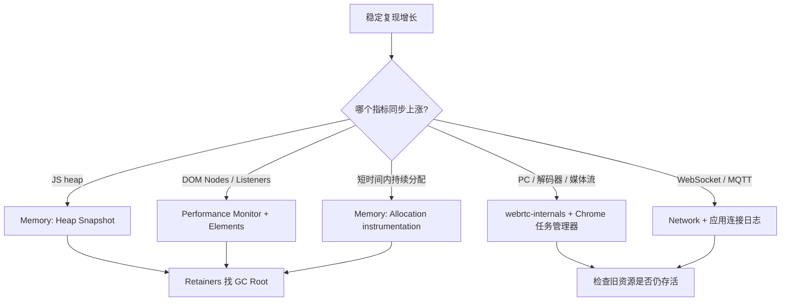
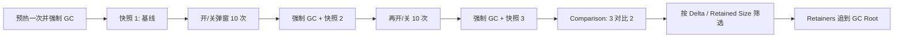

# 7×24 挂屏页面怎么治理内存泄漏

> **一句话结论：** 挂屏大屏连续跑数天，「每分钟泄漏 1MB，一天就是 1.4GB」→ 卡顿 → tab crash。治理 = **事前防**（泄漏源清单 + 卸载清理规范）+ **事后查**（Memory 三快照法定位 Retainers 链）。无人车场景的三大高危泄漏源：定时器/监听器、RTCPeerConnection 未 close、无界数组。

---

## 一、为什么普通中后台不用管、云远平台必须管

- 常规页面用户几分钟就关，泄漏来不及积累；
- 挂屏大屏连续运行数天，泄漏线性累积直到崩溃；
- 长时间运行还叠加：WebSocket/MQTT 重连多（重连路径泄漏反复触发）、视频流反复重建（PC 未释放是大对象）、轨迹数据只增不减。

---

## 二、泄漏源清单（事前防）

| 泄漏源 | 典型代码 | 排查特征 |
| --- | --- | --- |
| 定时器 / rAF | `setInterval` 心跳、看门狗、rAF 帧循环未清理 | Detached 上下文增长 |
| 事件监听 | `window`/`document`/`map.on(...)` 未 `off` | 监听器线性增长 |
| **RTCPeerConnection** | 重连时旧 PC 未 `close()` | 每次重连堆一个解码器+缓冲，几十 MB 级 |
| WebSocket / MQTT | 卸载/重连旧连接未 close | 连接数上涨 |
| 无界数组 | 轨迹点、日志、消息缓冲只 push 不截断 | JSHeapSize 线性上涨 |
| Detached DOM | `removeChild` 后 JS 变量仍持有引用 | Heap 里 Detached 节点 |
| 组件实例 | echarts/地图/播放器未 `dispose`/`destroy` | 内存阶梯式上涨 |
| 闭包持有大对象 | 长生命周期回调捕获大数据 | Retained Size 大的闭包 |

### React 卸载清理模板（防泄漏标准写法）

```typescript
function useVehicleMonitor(vehicleId: string) {
  useEffect(() => {
    const socket = new ReconnectableSocket(WS_URL, handleMessage);
    const layer = new VehicleLayer(map);
    const statsTimer = setInterval(() => sampleStats(pc), 5000);

    return () => {
      // 卸载时逆向清理：定时器 → 监听 → 媒体 → 连接 → 实例
      clearInterval(statsTimer);
      map.off('moveend', handleMoveEnd);
      layer.destroy();
      player.destroy();        // video.srcObject = null; pc.close()
      socket.destroy();
    };
  }, [vehicleId]);
}
```

**规范沉淀**：把清理顺序固化成 checklist——**定时器 → 事件 → 媒体流 → 长连接 → 图层/图表实例**，封装成 `usePlayer` / `useMqtt` / `useMapLayer` 三个 hook，业务方无法漏清理。

---

## 三、先分层：不要一上来就拍堆快照

> **结论：** 先确认增长的是 JS 堆、DOM、连接还是浏览器原生内存，再选工具。Heap Snapshot 只能解释 JS 可达对象，不能完整解释 WebRTC 解码器、显存和浏览器进程内存。



### 第一步：观察是哪一层在涨

| 工具 | 打开方式 | 重点指标 | 能回答的问题 |
| --- | --- | --- | --- |
| Chrome 任务管理器 | Chrome 菜单 → 更多工具 → 任务管理器 | Memory footprint、JavaScript memory | Tab 总内存涨，还是 JS 堆涨 |
| Performance Monitor | DevTools → `Ctrl/Cmd+Shift+P` → `Show Performance monitor` | JS heap、DOM Nodes、Event listeners | 堆、节点、监听器是否随操作线性增加 |
| Performance | DevTools → Performance，勾选 Memory 后录制 | JS Heap、Documents、Nodes、Listeners | 增长发生在哪段用户操作 |
| Memory | DevTools → Memory | 对象数量、Shallow Size、Retained Size | 哪类对象没被 GC、被谁引用 |

最小实验：静置 30 秒记录基线，执行同一动作 10 次，再静置 30 秒。只比较静置后的低水位；操作瞬间的峰值会包含正常临时分配。

```text
基线：JS heap 82 MB，Nodes 3,120，Listeners 246
开关弹窗 10 次后：JS heap 97 MB，Nodes 4,380，Listeners 266
判断：三项低水位均未回落，优先查弹窗 DOM 和事件解绑
```

DevTools 的“Collect garbage”只能用于本地对照实验。强制 GC 后仍持续增长是强证据；线上不能依赖主动 GC 解决泄漏。

## 四、Heap Snapshot：从增长对象追到具体代码

**场景**：怀疑进出「车辆详情弹窗/页面路由」后，JS 对象没有释放。



### 具体操作

1. 用生产构建复现，并开启 source map；开发模式的热更新、Strict Mode 和调试对象会制造噪声。
2. Memory → **Heap snapshot**，预热目标功能一次，点击垃圾桶图标强制 GC，拍快照 1。
3. 重复目标操作 10 次，回到初始状态，强制 GC，拍快照 2；再重复一轮，拍快照 3。
4. 选快照 3，将视图切到 **Comparison**，基准选择快照 2，先按 `# Delta`、`Size Delta` 看持续新增的类。
5. 点开可疑实例，在下方 **Retainers** 从下往上追，直到看到业务对象、回调函数、组件实例或事件注册表。

`Shallow Size` 是对象自身大小，`Retained Size` 是对象被释放后可连带释放的总大小。定位泄漏优先看后者，但不要直接认定 Retained Size 最大的对象就是根因；`Window`、`Document` 等本来就是长生命周期根对象。

### Retainers 链怎么读

下面这条链说明：DOM 虽已从页面移除，但 `window` 上的监听器仍持有闭包，闭包又捕获了组件和 DOM。

```text
Detached HTMLDivElement
← VehiclePanel.rootEl
← context of handleResize()
← EventListener
← Window
```

对应代码通常在注册点，而不是 `removeChild` 那一行：

```typescript
class VehiclePanel {
  private readonly handleResize = () => this.layout();

  mount(): void {
    window.addEventListener('resize', this.handleResize);
  }

  destroy(): void {
    window.removeEventListener('resize', this.handleResize);
    this.rootEl.remove();
  }
}
```

若 Retainers 只有 DevTools 控制台的 `$0`、`$_` 或打印结果，先清空 Console、取消 Elements 中的节点选中，再重新拍快照，排除调试工具自己持有对象。

### 常用筛选词

| 筛选/排序 | 看到什么 | 下一步 |
| --- | --- | --- |
| `Detached` | 已脱离文档树的 DOM | 展开 Retainers，找组件字段、监听器或缓存 |
| 业务类名，如 `VehiclePanel` | 实例数每轮都增加 | 查看是谁持有实例，检查 `destroy` 是否执行 |
| `Closure` / 回调函数名 | 长生命周期闭包 | 看闭包 `context` 捕获了哪些大对象 |
| `Array`，按 Retained Size 排序 | 轨迹、日志、消息数组 | 展开元素确认内容，再找数组所属对象 |
| `MediaStream` / `RTCPeerConnection` | JS 包装对象仍存活 | 沿引用链找播放器或重连管理器；再用 WebRTC 工具验证原生资源 |

## 五、Allocation 时间线：不知道是哪次操作分配时

> Heap Snapshot 适合回答“谁还活着”；Allocation instrumentation on timeline 适合回答“它在什么时候、由哪段调用栈创建”。

1. Memory → **Allocation instrumentation on timeline** → Start。
2. 执行一次“进入页面 → 建连 → 退出页面”，然后强制 GC。
3. 时间轴上蓝色柱是分配；GC 后仍为蓝色、没有变灰的对象是存活对象。
4. 框选退出页面后仍存活的区间，按调用栈/构造函数查看分配位置，点击源码位置跳回 Sources。

```text
ReconnectManager.reconnect
  → Player.createPeerConnection
    → new RTCPeerConnection   ← 每轮退出后仍存活
```

该工具开销较高，适合录制几十秒的最小复现，不适合挂屏数小时。若只想低开销抽样分配热点，可改用 **Allocation sampling**，但它不能保证显示每一个对象。

## 六、按泄漏源选择专项工具

| 泄漏源 | 首选工具和操作 | 泄漏证据 | 最终定位点 |
| --- | --- | --- | --- |
| 定时器 / rAF | Performance 录制目标操作；在回调入口临时打断点或计数 | 页面退出后回调仍周期执行；同一周期出现多份回调 | `setInterval` / `requestAnimationFrame` 的创建处和卸载逻辑 |
| 事件监听 | Performance Monitor 看 Listeners；Elements → Event Listeners；Console 执行 `getEventListeners(window)` | 每轮操作监听器数增加，旧回调仍绑定 | `addEventListener`、`map.on` 与不匹配/缺失的 `off` |
| RTCPeerConnection | 打开 `chrome://webrtc-internals`，复现重连；配合 Chrome 任务管理器 | 旧 PC 长时间未 closed，重连后 PC/解码相关内存阶梯上涨 | 重连前的 `pc.close()`、track 停止、`video.srcObject = null` |
| WebSocket / MQTT | DevTools → Network → WS，观察连接条目和 Frames；给 connect/close 加连接 ID 日志 | 每次重连产生新连接，旧连接无 Close frame/close 日志 | 重连管理器、退订和销毁路径 |
| 无界数组 | Heap Snapshot 搜业务容器类，按 Retained Size 展开 `Array` | 数组 length、Retained Size 每轮增加 | `push` 处；改环形缓冲、上限截断或落盘 |
| Detached DOM | Heap Snapshot 搜 `Detached`；Elements 的 Event Listeners 辅助核对 | 同类 Detached 节点数量每轮增加 | Retainers 中首个业务字段/闭包/缓存 |
| 组件实例 | Heap Snapshot 搜 `ECharts`、地图/播放器类名并做 Comparison | 实例计数随挂载次数增加 | 卸载钩子里的 `dispose` / `destroy`，以及保存实例的注册表 |
| 闭包持有大对象 | Heap Snapshot 查看 `Closure` 的 Retainers 和 `context` | 回调生命周期很长，context 持有大数组/响应数据 | 监听器、Promise 链、定时器回调的捕获变量 |

### 两个容易误判的专项场景

**WebRTC 内存涨，但 JS Heap 基本不涨：** 解码器缓冲、视频帧和部分网络缓冲位于浏览器原生内存。此时以 Chrome 任务管理器的 Memory footprint、`chrome://webrtc-internals` 中 PC 生命周期及 `getStats()` 指标为准，不能因为 Heap Snapshot 没有大对象就排除泄漏。

**WebSocket 面板里历史条目很多：** Network 保留的请求记录不等于连接仍存活。要同时看连接状态、最后一帧/Close frame、服务端在线连接数，以及应用自己的 `open → close` 成对日志。

```typescript
class ConnectionProbe {
  private sequence = 0;

  nextId(): string {
    this.sequence += 1;
    return `vehicle-ws-${this.sequence}`;
  }

  log(id: string, state: 'open' | 'close'): void {
    console.debug('[connection]', { id, state, at: performance.now() });
  }
}
```

## 七、定位完成的判定标准

修复后用相同脚本再跑三轮。不能只看“曲线好像平了”，要验证对象计数和资源生命周期都闭环。

| 验收项 | 通过标准 |
| --- | --- |
| JS 堆低水位 | 多轮操作后保持平台状，不再线性增长 |
| 业务实例 / Detached DOM | 强制 GC 后回到基线附近 |
| Listeners / Timers | 退出页面后回到进入前数量，回调不再执行 |
| PC / WS / MQTT | 新建与关闭成对，旧实例进入 closed 状态 |
| 长时间稳定性 | 用同一场景压测数小时，增长率接近 0，且无持续恶化趋势 |

---

## 面试回答

> 挂屏大屏连续跑数天，泄漏会线性累积到崩溃。事前把 cleanup 固化为「定时器→事件→媒体流→长连接→实例」；事后先用 Chrome 任务管理器和 Performance Monitor 判断增长来自 JS 堆、DOM/监听器还是浏览器原生内存。JS 泄漏用三快照 Comparison 找持续新增的类，再沿 Retainers 追到业务变量；不知道分配时机就录 Allocation instrumentation 看创建调用栈。WebRTC 解码器等堆外资源不能只看 Heap Snapshot，要结合 `chrome://webrtc-internals`、任务管理器和 `getStats()`；WebSocket/MQTT 则核对 Network 中的连接状态与应用 `open → close` 成对日志。修复后用同一脚本复测，确认堆低水位、对象计数和连接数都回到基线。

## 相关资料

- [稳定性压测与渐进式卡顿定位](./稳定性压测与渐进式卡顿定位.md)
- [线上问题定位](./线上问题定位.md)
