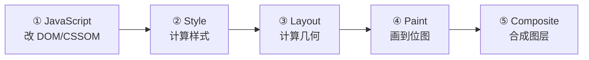
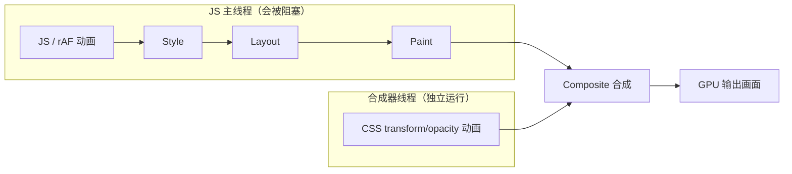

# 前端动画性能（面试深度题）

> **一句话本质**：动画性能优化的本质 = 让动画只走「合成（Composite）」阶段，跳过 Layout 和 Paint；能做到这一点的只有 `transform` 和 `opacity` 两个属性。
>
> **为什么面试会问**：动画是 CUI/Chatbot 类产品体验的直接载体（流式输出打字机、工具调用卡片展开、画布节点拖拽），AI 应用前端岗位（添科智能 TapNow 的「灵活画布 + Agentic 工作流」）尤其看重这类动效。面试官用「CSS 动画为什么比 JS 快」「transform 和 left 差多少」快速测出你是「背了八股」还是「真懂合成层」。

配套可运行 demo → [前端动画-demo](./前端动画-demo/README.md)；渲染/重排重绘基础见 [浏览器相关-原理、性能优化](../浏览器原理/浏览器相关-原理、性能优化.md)。

---

## 〇、先背这条主线（所有题的答案都从这推）

浏览器渲染一帧画面的完整流程：



| 阶段 | 干什么 | 属性变化对应 |
| --- | --- | --- |
| JavaScript | 执行 JS，改 DOM/CSSOM | 脚本 |
| Style | 计算每个元素最终样式（选择器匹配 + 级联） | 样式重算 |
| Layout（重排/Reflow） | 计算几何信息（宽高、位置） | 重排 |
| Paint（重绘/Repaint） | 视觉属性（背景/边框/阴影/文字）画到位图 | 重绘 |
| Composite（合成） | 多个图层按顺序合成最终画面 | 合成 |

**每帧预算 16.67ms（60fps）**，大致分配：JS ≤10ms、Style & Layout ≤3ms、Paint ≤2ms、Composite ≤1ms。

**动画性能优化的本质**：让动画只走 Composite。只有 `transform`/`opacity` 能跳过 Layout 和 Paint——它们不影响布局、像素已缓存，只需 GPU 做矩阵变换/透明度混合。

---

## 一、渲染管线与合成层

### Q1 一帧画面怎么走？

答案即上图的渲染管线，背下来并报出每阶段帧预算即可。

### Q2 CSS 动画为什么比 JS 动画性能好？本质是什么？

面试官要的不是「CSS 用了 GPU」这句，而是**线程模型**：



- **CSS 动画（transform/opacity）**：元素被提升到独立**合成层**，动画由**合成器线程（Compositor Thread）**独立驱动。主线程被大量计算阻塞时，动画依然流畅。
- **JS 动画（rAF/setTimeout）**：回调全跑在 **JS 主线程**。主线程一被阻塞（DOM 操作、复杂计算、长任务），动画立即掉帧。

**另一个差异**：页面切后台时，CSS 动画和 rAF 都自动暂停省资源；`setInterval/setTimeout` 不会（继续空转）。

**常见误区（主动纠正）**：CSS 动画操作 `width/height/left/top` 时，同样走 Layout + Paint，性能没有优势。所以「CSS 一定快」是错的——**快的是「跑在合成器线程的 transform/opacity」，不是「CSS」这个形式**。

### Q3 什么是合成层？什么条件下会创建？

**合成层（Composite Layer）**：浏览器把页面拆成多个独立图层，每层对应一块 **GPU 纹理（Texture）**。元素属性变化时只更新对应层纹理，由 GPU 合成，不触发其他层重排重绘。

**常见创建条件**：

- 元素有 `transform`/`opacity` 的 transition/animation
- 3D transform（`translateZ(0)` 等）
- `<video>` / `<canvas>` / `<iframe>` 等替换元素
- `filter` / `backdrop-filter`
- `will-change` 指定的属性

**隐式合成（Implicit Compositing）——高阶考点**：元素 A 被提升为合成层后，若元素 B 在层叠顺序中位于 A 上方，浏览器为正确显示重叠关系，会**被迫把 B 及其上方兄弟也提升为合成层**，造成「**层爆炸**（Layer Explosion）」。对策：显式管理 `z-index`，减少无关重叠。

### Q4 will-change 的原理、用法和陷阱

**原理**：提前告知浏览器「这个元素即将变化」，让它提前建合成层、缓存绘制内容，避免动画第一帧卡顿。

```css
/* 触发前动态加：hover 时给子元素预热 */
.element:hover .animated-child {
  will-change: transform;
}
```

```js
// 按需管理：动画开始加，结束立即释放
target.addEventListener('mousedown', () => {
  target.style.willChange = 'transform';
});
target.addEventListener('transitionend', () => {
  target.style.willChange = 'auto'; // 结束即释放
});
```

**三大陷阱**：

1. **层爆炸**：给所有元素加 will-change → 大量合成层 → GPU 显存暴涨 → 反而更卡甚至 OOM。
2. **只写不删**：动画结束后不移除，合成层永驻，持续吃显存。
3. **`* { will-change: transform }`**：面试最典型的反面教材。

**最佳实践**：动画开始前约 0.5s 预热，结束后在 `transitionend`/`animationend` 里置回 `auto`。

---

## 二、属性选择与帧同步

### Q5 transform: translateX(100px) 和 left: 100px 差多少？为什么？

| 维度 | `transform: translateX()` | `left` |
| --- | --- | --- |
| 触发阶段 | 仅 Composite | Layout → Paint → Composite |
| 影响其他元素 | ❌ 不影响（不改变占位） | ✅ 兄弟元素需重新布局 |
| 是否走 GPU | ✅ 合成层独立处理 | ❌ 主线程处理 |
| 子像素渲染 | ✅ GPU 反锯齿，丝滑 | ❌ 取整像素，阶梯感 |
| 帧率 | 稳定 60fps | 可能掉到 30–45fps |

**子像素渲染（加分点）**：`left/top/margin` 只能取整数像素，移动时产生阶梯抖动；`transform` 借助 GPU 反锯齿，可在亚像素间平滑过渡。

### Q6 requestAnimationFrame 和 setInterval(fn, 16) 的本质区别？

| 维度 | requestAnimationFrame | setInterval(fn, 16) |
| --- | --- | --- |
| 帧同步 | ✅ 与显示器刷新率（VSync）对齐 | ❌ 固定 16ms，与刷新可能不同步 |
| 后台 | ✅ 自动暂停 | ❌ 继续执行 |
| 掉帧 | 自动合并，不堆积 | 回调堆积，「追赶」现象 |
| 精度 | 浏览器保证下帧绘制前调用 | 受事件循环影响，间隔不稳 |

**本质**：rAF 由浏览器在**下一次重绘前**调用，与 VSync 信号对齐；setInterval 只是把回调塞进任务队列，不保证与刷新同步，会出现「一帧执行两次」或「跳帧」。

---

## 三、工程实践

### Q7 什么是强制同步布局（Force Synchronous Layout / Layout Thrashing）？怎么避免？

**原理**：先改 DOM 样式、紧接着又读布局属性（`offsetWidth`/`getBoundingClientRect()`），浏览器被迫**立即执行 Layout** 返回值，打断正常异步渲染。

```js
// ❌ 读写交替：每次都触发强制同步布局
boxes.forEach(box => {
  const width = box.offsetWidth;            // 读（触发 Layout）
  box.style.width = width + 10 + 'px';      // 写（再次触发）
});

// ✅ 批量读 → 批量写：只触发两次
const widths = boxes.map(box => box.offsetWidth);  // 一次 Layout
boxes.forEach((box, i) => {
  box.style.width = widths[i] + 10 + 'px';          // 一次 Layout
});
```

进阶：用 rAF 把写推迟到下一帧，或用 `fastdom` 库自动批量读写。

### Q8 如何实现高性能滚动动画（scroll-driven）？

核心：滚动事件里 rAF 节流 + transform（不用布局属性）。

```js
let ticking = false;
window.addEventListener('scroll', () => {
  if (!ticking) {
    requestAnimationFrame(() => {
      const scrollY = window.scrollY;
      header.style.transform = `translateY(${scrollY * 0.5}px)`;
      ticking = false;
    });
    ticking = true;
  }
});
```

**2026 新方案**：CSS `animation-timeline: scroll()` 让浏览器在**合成器线程**直接处理滚动驱动动画，完全不经过 JS 主线程，性能最优。

### Q9 动画技术选型（判断力）

| 方案 | 适用场景 | 优势 | 劣势 |
| --- | --- | --- | --- |
| CSS transition/animation | 简单 UI 动效（hover、淡入） | 声明式、GPU 加速、简洁 | 难动态控制、逻辑复杂难维护 |
| Web Animations API | 需 JS 精确控制 | 可编程 + 合成器线程执行 | 心智稍高（兼容已基本解决） |
| Canvas 2D | 大量粒子、图表 | 像素级控制 | 无 DOM 语义、手动帧循环 |
| WebGL / Three.js | 3D 场景、复杂视觉效果 | GPU 全能力 | 学习曲线陡 |
| SVG + SMIL/GSAP | 图标、路径变形 | 矢量无损、可交互 | 节点多时性能差 |

**选型金句**：简单 UI 动效优先 CSS；复杂交互用 WAAPI；大规模粒子/3D 用 Canvas/WebGL；图标微动效用 SVG。

### Q10 进入视口才播放的动画？

```js
const observer = new IntersectionObserver((entries) => {
  entries.forEach(entry => {
    if (entry.isIntersecting) {
      entry.target.classList.add('animate-in');
      observer.unobserve(entry.target); // 只触发一次
    }
  });
}, { threshold: 0.2 });

document.querySelectorAll('.fade-up').forEach(el => observer.observe(el));
```

加分：CSS `animation-timeline: view()` 原生支持滚动视图驱动，无需 JS 监听。

---

## 面试答题逻辑

按「**原理 → 方案 → 优化**」三段组织：

1. **原理**：渲染管线（JS→Style→Layout→Paint→Composite）+ 线程模型（合成器线程 vs 主线程）+ 合成层。
2. **方案**：CSS vs WAAPI vs Canvas/WebGL vs SVG 选型。
3. **优化**：will-change 管理、避免强制同步布局、滚动 rAF 节流、帧预算控制。

主动提到「**隐式合成 / 层爆炸 / 子像素渲染 / Layout Thrashing**」这些词，面试官会认为你有工程级理解，不是背八股。
