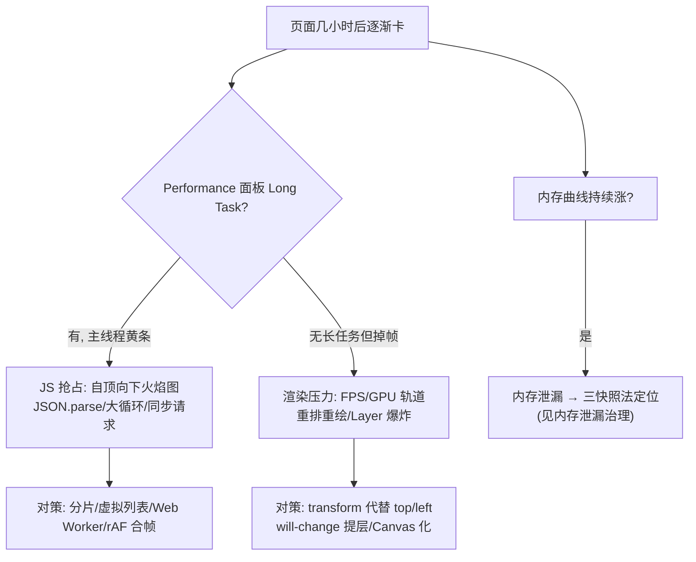

# 稳定性压测与渐进式卡顿定位

> **一句话结论：** 稳定性压测 = 无头浏览器挂屏长跑，**每小时采样一次关键指标**（堆内存 / 帧率 / 连接数），看曲线是「平稳」还是「渐变」；渐进式卡顿 = 指标随时间劣化的卡顿，定位靠「内存三快照判泄漏」+「Performance 长录判渲染/JS 忙」两条路，先分清是「内存泄漏累积」还是「渲染压力」。

---

## 一、怎么压测：无头浏览器挂屏 24h

```typescript
// 无头浏览器挂屏，每小时采样一次，输出对比曲线
// ① 堆内存（Chrome 非标 API，可空判断降级）
const heapMB = (performance as any).memory?.usedJSHeapSize / 1024 / 1024;

// ② 帧率：rAF 差值法，统计 1s 内帧间隔 > 50ms 的次数 = 卡顿次数
let last = performance.now(), janks = 0;
function frame(t: number) {
  if (t - last > 50) janks++;
  last = t;
  requestAnimationFrame(frame);
}

// ③ 业务指标：拉流卡顿率（freezeCount 增量）、WS 重连次数、消息积压量
reporter.gauge('fe.heap_mb', heapMB);
reporter.gauge('fe.jank_per_min', janks);
```

**验收标准**：内存平稳 + 卡顿率不涨 = 通过；曲线往上走 = 有泄漏或累积问题。

---

## 二、重点关注哪些指标

| 指标 | 正常 | 异常信号 |
| --- | --- | --- |
| **堆内存** `usedJSHeapSize` | 锯齿上升后回落（GC） | **持续不回落** → 泄漏 |
| **帧率 / 卡顿次数** | 卡顿率稳定 | 随时间上涨 → 渐进式卡顿 |
| **连接数**（WS/MQTT/PC） | 恒定 | 每次重连 +1 → 旧连接未释放 |
| **拉流指标** `freezeCount` | 冻结次数低 | 冻结增多 → 解码/网络劣化 |
| **DOM 节点数** | 稳定 | 只增不减 → Detached DOM 泄漏 |

---

## 三、渐进式卡顿怎么定位（先分清 JS 忙还是渲染忙）

渐进式卡顿 = 「跑了几个小时才卡」，不是一上来就卡。定位第一步先分类：



**两种渐进式卡顿的根因与对策**：

| 症状 | 根因 | 定位手段 | 对策 |
| --- | --- | --- | --- |
| 车辆更新时整页掉帧 | 每条消息直更 DOM | Performance 长录 | rAF 合帧 + 视野裁剪 |
| 拖动地图卡 | Marker 数量过大 | 火焰图渲染压力 | MassMarks / CustomLayer |
| CPU 飙高 + 视频花 | 多路软解抢占 | getStats + CPU | 限制并发 / 子码流 |
| 几小时后逐渐卡 | 内存泄漏 → GC 频繁 | 三快照法 | 修泄漏源 |

> 关键区分：**内存泄漏的卡**是「GC 越来越频繁 → 停顿越来越长」，曲线是堆内存阶梯/锯齿上升；**渲染压力/JS 忙的卡**是「掉帧但内存稳定」，看 Performance 的 Long Task 和 FPS。

---

## 面试回答

> 稳定性压测我用无头浏览器挂屏长跑，每小时采样一次关键指标——堆内存、帧率卡顿次数、连接数、拉流 freezeCount——输出对比曲线，验收标准是内存平稳、卡顿率不涨。渐进式卡顿的定位分两步：先分清是「内存泄漏累积」还是「渲染/JS 压力」。内存曲线持续不回落就是泄漏，用三快照法定位；否则看 Performance 的 Long Task——有长任务是 JS 忙（火焰图找大循环/JSON.parse），无长任务但掉帧是渲染压力（FPS/GPU 轨道找重排重绘）。视频花加 CPU 高是多路软解抢占，要限制并发拉子码流。

## 相关资料

- [内存泄漏治理](./内存泄漏治理.md)
- [线上问题定位](./线上问题定位.md)
