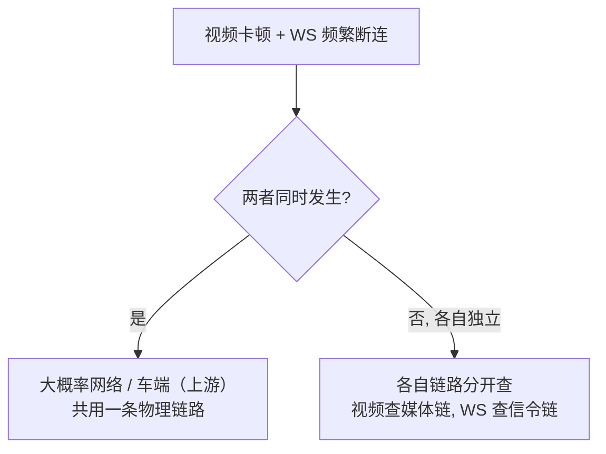

# 线上视频卡顿、WebSocket 频繁断连怎么定位

> **一句话结论：** 定位靠**分层隔离**——先看两个信号「同时发生还是独立发生」：同时发生大概率是上游（网络/车端），独立发生是各自链路。再逐层用各层的特征信号排除：视频看 getStats（丢包/冻结/解码），WS 看心跳时序与重连模式，网络看 RTT/丢包，后端看日志/连接数，车端看上行推流状态。

---

## 一、先做第一刀：两个信号是否联动

> 视频和 WS 若走**同一条网络**（车端 4G 上行），同时劣化基本锁定「车端网络 / 运营商」；若独立发生，视频是媒体链路、WS 是信令链路，分别排查。

---

## 二、视频卡顿：逐层排除

| 层 | 特征信号 | 判断 |
| --- | --- | --- |
| **前端** | `getStats` 的 `framesDecoded` 不涨 + CPU 高 | 多路软解抢占 / 解码跟不上（前端自己的问题） |
| **前端** | 内存曲线持续涨 + GC 频繁 | 内存泄漏 → 渐进式卡顿 |
| **网络** | `packetsLost` / `jitter` 高 | 弱网丢包（前端↔SFU 这段） |
| **后端 SFU** | `framesDecoded` 不涨但 `connectionState` 正常 | 服务端没推数据来（转码/转发故障） |
| **车端** | 同上 + 车端推流日志中断 | 车端上行断（对比车端↔SFU 与 前端↔SFU 两段） |

关键判据：**`connectionState === 'connected'` 但 `framesDecoded` 不涨** = 不是前端传输问题，是**上游没数据来**（车端推流断了或 SFU 故障），此时往前端/网络查就是白费功夫。

---

## 三、WebSocket 频繁断连：逐层排除

| 层 | 特征信号 | 判断 |
| --- | --- | --- |
| **前端** | 页面 `hidden` / 主线程卡死心跳发不出 | 前端自己切后台或被 JS 阻塞 |
| **网络** | 心跳超时 + 全网断（`navigator.onLine` 变 false） | 本地网络（而非服务端） |
| **后端 broker** | 重连成功后**立刻又断**、连接数骤降 | broker 重启/过载/被限流 |
| **车端** | 前端↔broker 正常，但车端上行消息停更 | 车端断网（车端是另一个客户端） |

关键判据：**重连后立刻又断** = 服务端问题（broker 重启循环）；**心跳超时但业务消息正常** = 只是心跳链路问题；**全网断** = 本地网络。

---

## 四、快速定位的「三板斧」信号

1. **看时序**：把视频卡顿时间点和 WS 断连时间点画在同一时间轴上，重叠 → 上游，分散 → 各自链路；
2. **看 getStats**：丢包/jitter 高 → 网络；framesDecoded 不涨但连接正常 → 上游没数据；CPU/内存高 → 前端自己；
3. **看连接生命周期**：重连后立刻断 → 后端；心跳超时但业务正常 → 网络抖动；连接数只增 → 前端泄漏没释放旧连接。

---

## 面试回答

> 定位思路是分层隔离。第一刀先看视频卡顿和 WS 断连是不是同时发生——同时发生大概率是上游网络或车端，因为共用一条物理链路；独立发生就分开查。视频这条看 getStats：丢包 jitter 高是网络，framesDecoded 不涨但 connectionState 正常说明上游没数据来、是车端推流断了或 SFU 故障，CPU 内存高才是前端自己（软解抢占或内存泄漏）。WS 这条看连接生命周期：重连后立刻又断是 broker 重启过载，心跳超时但业务消息正常是网络抖动，连接数只增是前端没释放旧连接。核心是每个层有各自的判据，别拿前端的工具去查上游的问题。

## 相关资料

- [内存泄漏治理](./内存泄漏治理.md)
- [稳定性压测与渐进式卡顿定位](./稳定性压测与渐进式卡顿定位.md)
- [WebRTC 断线恢复](../../跨端与多媒体/音视频/面试题/webRTC/断线恢复.md)
