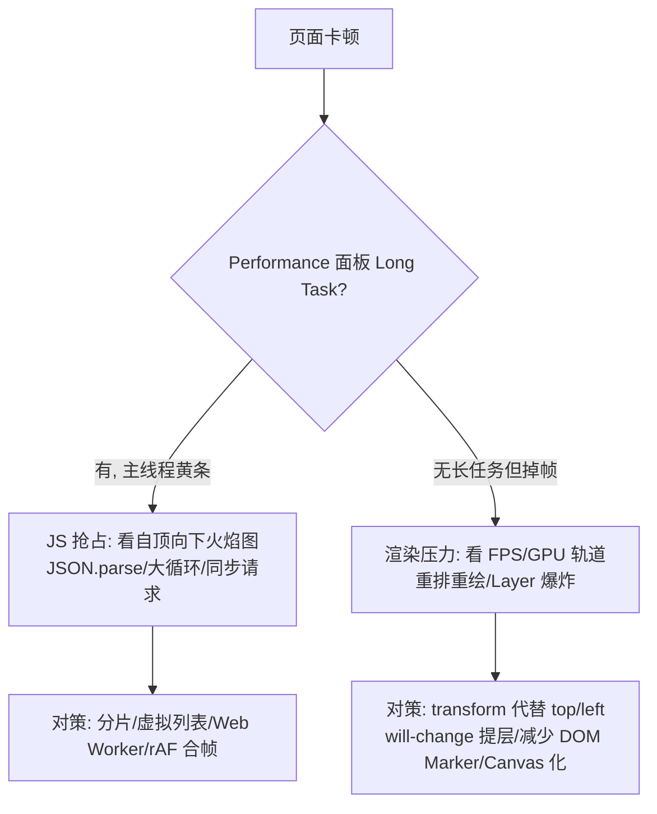

# 长时运行稳定性治理与排查（监控大屏 / 云远平台）

> **一句话结论：** 无人车云远平台是 7×24 挂屏运行，「跑几小时就卡死/崩溃」是常态风险；治理 = **事前防**（泄漏源清单 + 卸载清理规范）+ **事中监控**（内存/帧率上报）+ **事后查**（Memory 三快照法 + Performance 长录）。

---

## 一、为什么普通中后台不用管、云远平台必须管

- 常规页面用户几分钟就关，泄漏来不及积累；
- 挂屏大屏连续运行数天，**每分钟泄漏 1MB，一天就是 1.4GB** → 卡顿 → 崩溃（tab crash）；
- 长时间运行还叠加：WebSocket/MQTT 重连次数多（重连路径泄漏会被反复触发）、视频流反复重建（PC 未释放是大对象）、轨迹数据只增不减。

---

## 二、泄漏源清单（事前防）

| 泄漏源 | 典型代码 | 排查特征 |
| --- | --- | --- |
| 定时器/rAF | `setInterval` 心跳、看门狗、rAF 帧循环未清理 | Memory 里 Detached 上下文增长 |
| 事件监听 | `window`/`document`/地图实例 `map.on(...)` 未 `off` | 监听器随页面切换线性增长 |
| **RTCPeerConnection** | 重连时旧 PC 未 `close()`，或先 `close()` 后才摘 `srcObject` | 每次重连堆一个解码器+缓冲，几十 MB 级 |
| WebSocket/MQTT | 页面卸载/重连旧连接未 close | 连接数上涨（Network 面板） |
| 无界数组 | 轨迹点、日志、消息缓冲只 push 不截断 | JSHeapSize 线性上涨 |
| Detached DOM | `removeChild` 后 JS 变量仍持有节点引用 | Heap snapshot 里 Detached 节点 |
| 组件实例 | echarts/地图/播放器实例未 `dispose`/`destroy` | 反复进出页面内存阶梯式上涨 |
| 闭包持有大对象 | 长生命周期回调捕获了大数据 | Retained Size 大的闭包 |

### React 组件卸载清理模板（防泄漏标准写法）

```typescript
function useVehicleMonitor(vehicleId: string) {
  useEffect(() => {
    const socket = new ReconnectableSocket(WS_URL, handleMessage);
    const layer = new VehicleLayer(map);
    const statsTimer = setInterval(() => sampleStats(pc), 5000);

    return () => {
      // 卸载时逆向清理：定时器 → 监听 → 媒体 → 连接 → 实例
      clearInterval(statsTimer);
      map.off('moveend', handleMoveEnd);
      layer.destroy();
      player.destroy();        // video.srcObject = null; pc.close()
      socket.destroy();
    };
  }, [vehicleId]);
}
```

**规范沉淀（岗位 JD 第 4 条「沉淀可复用组件与规范」）**：把清理顺序固化成 checklist——**定时器 → 事件 → 媒体流 → 长连接 → 图层/图表实例**，封装成 `usePlayer` / `useMqtt` / `useMapLayer` 三个 hook，业务方无法漏清理。

---

## 三、事后查：Memory 三快照法（必会）

**场景**：怀疑进出「车辆详情弹窗/页面路由」泄漏。


**操作路径**：DevTools → Memory → Heap snapshot → 三次快照 → 选快照 3，下拉切 **"Objects allocated between Snapshot 2 and Snapshot 3"** → 增长对象看 **Retainers（保留链）** → 定位到具体变量/监听器。

| 看什么 | 说明 |
| --- | --- |
| `Detached` 开头的节点 | DOM 已移除但被 JS 持有 → 监听器/变量未清 |
| Retained Size 排序 | 谁被删不掉，保留链顶就是泄漏根因 |
| `(string)`/`(array)` 巨大 | 无界缓冲，push 未截断 |
| `RTCPeerConnection`/`MediaStream` 计数 | 每次重连 +1 → 旧 PC 未关 |

**辅助手段**：

- `Performance` 面板勾选 **Memory** 长录 10 分钟：JSHeap / Nodes 曲线**锯齿上升不回落** = 泄漏；回落 = 只是压力大；
- 命令行加速验证：`--js-flags="--max-old-space-size=256"` 压小堆，让泄漏快速暴露成 OOM。

---

## 四、卡顿排查（渲染类）

**判定顺序：先分清是「JS 忙」还是「渲染忙」。**



监控大屏高频踩坑对应：

| 症状 | 根因 | 对策 |
| --- | --- | --- |
| 车辆更新时整页掉帧 | 每条消息直更 DOM | [rAF 合帧 + 视野裁剪](../../跨端与多媒体/地图/高德地图与高频轨迹渲染.md) |
| 拖动地图卡 | Marker 数量过大 | MassMarks / CustomLayer |
| CPU 飙高 + 视频花 | 多路软解抢占 | [限制并发/子码流](../../跨端与多媒体/音视频/面试题/webRTC/多路拉流与断线恢复.md) |
| 几小时后逐渐卡 | 内存泄漏 → GC 频繁 | 三快照法 |

---

## 五、事中监控：可上报的指标

```typescript
// ① 堆内存（Chrome 非标 API，可空判断降级）
const heapMB = (performance as any).memory?.usedJSHeapSize / 1024 / 1024;

// ② 帧率：rAF 差值法，统计 1s 内帧间隔 > 50ms 的次数 = 卡顿次数
let last = performance.now(), janks = 0;
function frame(t: number) {
  if (t - last > 50) janks++;
  last = t;
  requestAnimationFrame(frame);
}

// ③ 业务指标：拉流卡顿率（freezeCount 增量）、WS 重连次数、消息积压量
reporter.gauge('fe.heap_mb', heapMB);
reporter.gauge('fe.jank_per_min', janks);
```

**验收方式（JD 加分项「连续数小时稳定性压测」）**：无头浏览器挂屏 24h，每小时采样堆内存/帧率/连接数，输出对比曲线——内存平稳 + 卡顿率不涨 = 通过。

**相关阅读**：

- [分析运行时性能（Chrome 官方教程）](./Chrome%20开发者工具/分析运行时性能.md)
- [浏览器渲染原理、重排重绘](../浏览器原理/浏览器相关-原理、性能优化.md)
