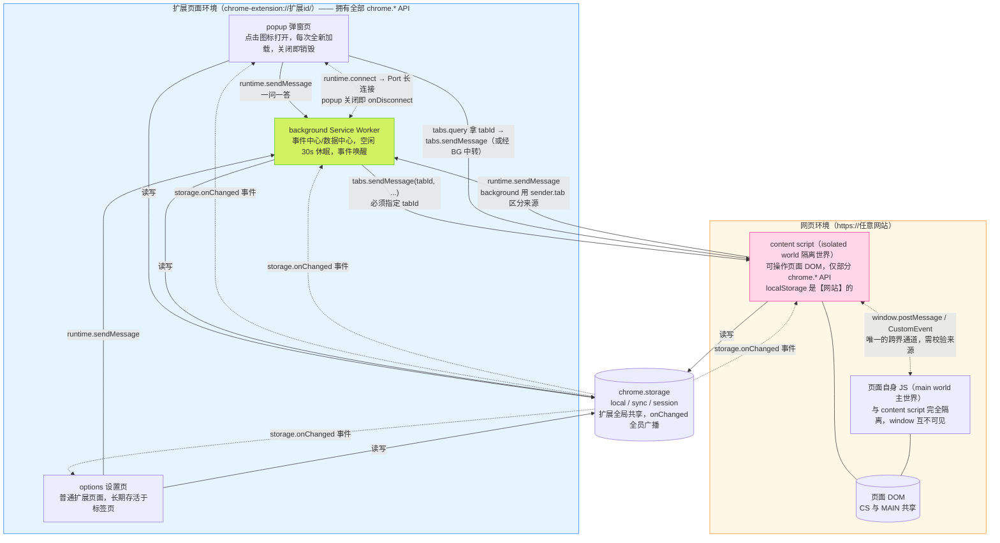

# 浏览器插件（Chrome Extension）完整指南

> 面向面试的浏览器扩展学习文档。
> 配套两个可运行 demo：
> - [`demo-vanilla/`](./demo-vanilla/) —— 原生 JS + Manifest V3，零构建，Chrome 直接加载
> - [`demo-enterprise/`](./demo-enterprise/) —— 企业级工程化：Vite + React + TS + CRXJS + Shadow DOM + 类型安全消息层
>
> 面试题清单见 [面试题.md](./面试题.md)。

---

## 目录

1. [扩展是什么 / 能做什么](#1-扩展是什么--能做什么)
2. [Manifest V3 架构总览](#2-manifest-v3-架构总览)
3. [三大运行环境](#3-三大运行环境)
4. [消息通信](#4-消息通信)
5. [存储](#5-存储)
6. [权限模型](#6-权限模型)
7. [CSP 与安全](#7-csp-与安全)
8. [常用 API 速查](#8-常用-api-速查)
9. [企业级工程化实践](#9-企业级工程化实践)
10. [调试与排错](#10-调试与排错)
11. [Demo 使用说明](#11-demo-使用说明)

---

## 1. 扩展是什么 / 能做什么

浏览器扩展是运行在浏览器里、用来**增强或修改浏览体验**的一小套 Web 技术程序（HTML/CSS/JS + manifest.json）。

与普通网页的本质差异：**权限和能力**。

| 能力 | 普通网页 | 扩展 |
|---|---|---|
| 操作自己页面的 DOM | ✅ | ✅ |
| 操作**别人网站**的 DOM（注入脚本） | ❌（跨域限制） | ✅ content script |
| 跨域 fetch | 受 CORS 限制 | 声明 host 权限后不受限 |
| 访问浏览器 API（标签页、书签、历史、通知、右键菜单…） | ❌ | ✅ chrome.* API |
| 持久化存储 | localStorage（按站点隔离） | chrome.storage（扩展全局共享） |
| 常驻后台逻辑 | ❌（标签页关了就没了） | ✅ service worker |

典型应用：广告拦截（uBlock）、密码管理（1Password）、翻译划词（沙拉查词）、开发者工具（React DevTools）、页面美化（Stylus）。

---

## 2. Manifest V3 架构总览

`manifest.json` 是扩展的"配置文件 + 权限声明书"，Chrome 据此知道扩展有哪些入口、要什么权限。

### 2.1 核心字段

```jsonc
{
  "manifest_version": 3,        // 清单版本，现在必须 3
  "name": "...", "version": "1.0.0", "description": "...",

  "action": { "default_popup": "popup.html" },  // 点击工具栏图标弹出的页面
  "background": { "service_worker": "background.js" },  // 后台脚本
  "content_scripts": [{         // 注入到匹配页面的脚本
    "matches": ["<all_urls>"],
    "js": ["content.js"], "css": ["content.css"],
    "run_at": "document_idle"
  }],
  "options_page": "options.html",  // 扩展设置页

  "permissions": ["storage", "contextMenus"],  // API 权限
  "host_permissions": ["https://*.example.com/*"],  // 站点权限（MV3 独立出来）
  "commands": { ... }           // 快捷键
}
```

完整可运行示例见 [demo-vanilla/manifest.json](./demo-vanilla/manifest.json)。

### 2.2 MV2 vs MV3 对比（高频面试题）

| 维度 | MV2（已淘汰） | MV3（现行） |
|---|---|---|
| 后台脚本 | background page，可**常驻**（persistent） | **Service Worker**，事件驱动，空闲即休眠 |
| 远程代码 | 允许加载远程 JS | **禁止**，所有代码必须打包在扩展内 |
| `eval` / `new Function` | 可通过 CSP 放行 | **禁止**（CSP 不可放宽） |
| 网络请求拦截 | `webRequest`（阻塞式，能改请求） | `declarativeNetRequest`（声明式规则，能力受限） |
| 主机权限 | 混在 `permissions` 里 | 独立为 `host_permissions` |
| Promise 支持 | 回调为主 | 大部分 API 原生支持 Promise |

**为什么 Google 要推 MV3？**（面试常问"为什么"）
1. **性能**：常驻 background page 即使没事干也占内存；SW 休眠后零占用
2. **安全**：禁止远程代码/eval，杜绝了"审核时是一套代码、运行时加载另一套恶意代码"的套路
3. **隐私**：权限粒度更细，主机权限与功能权限分离，配合 activeTab 按需授权
4. （争议）declarativeNetRequest 削弱了广告拦截器的能力，社区普遍认为这才是真实动机之一

---

## 3. 三大运行环境

扩展不是"一个程序"，而是**跑在多个互相隔离环境里的几段代码 + 消息总线**。这是整个扩展体系最重要的认知模型：



读图要点：
- **实线 = 直接消息通道**，**虚线 = 长连接/事件/特殊通道**，**圆柱 = 共享状态**
- popup、options、background 是"自家人"（扩展页面），content script 是"派驻到别人家的专员"
- **background 是唯一所有人都说得上话的中心**——所以企业级架构把数据收口在 background
- content script 与页面主世界之间隔着 isolated world，只能走 postMessage

### 3.1 Background Service Worker

- **角色**：事件中心 / 数据中心。接收各环境消息、调用浏览器 API、统一管理数据。
- **生命周期（高频题）**：事件驱动。没有事件约 30 秒后**被浏览器杀掉**；有事件（消息、闹钟、菜单点击…）再**冷启动唤醒**。
- 由此引出三条铁律：
  1. **状态不能放全局变量**——worker 重启后内存清空。持久状态一律 `chrome.storage`；badge 这类浏览器托管状态重启后要恢复（demo 里 `background.js` 启动时从 storage 读笔记数重设 badge 就是在演示这一点）。
  2. **不能用 `setInterval`/`setTimeout` 做长延时任务**——休眠后定时器随 worker 一起死。用 `chrome.alarms`（最短周期 30 秒，响铃时会唤醒 worker）。
  3. **事件监听器必须顶层同步注册**——不能放进 `chrome.storage.get(...).then(...)` 之类的异步回调。worker 冷启动时 Chrome 只同步执行一遍顶层代码来"重建监听器清单"，异步注册的监听器赶不上第一次事件分发，事件直接丢失。
- **保活手段与弊端**：社区有每 20 秒 `chrome.runtime.getPlatformInfo` 之类的 hack 强行保活，但违背 MV3 设计意图，耗资源，商店审核可能被拒——面试答"不推荐，应拥抱事件驱动 + alarms"。

### 3.2 Popup

- 点击工具栏图标弹出的页面，**就是一个普通 HTML 页面**，只是地址是 `chrome-extension://`。
- **生命周期（高频题）**：每次打开都是**全新加载**，关闭即销毁——页面内 state 全丢。要持久化请走 storage，不要指望 popup 记住东西。
- **调试**：右键扩展图标 → "审查弹出内容"打开 DevTools。注意 DevTools 不关而 popup 失焦关闭时，JS 上下文已被销毁。
- popup 属于扩展页面，fetch 跨域不受 CORS 限制（但 MV3 中要在 `host_permissions` 里声明目标域）。

### 3.3 Content Script

- 注入到**别人网页**里运行的脚本，扩展里唯一能直接读写页面 DOM 的角色。
- **Isolated World（隔离世界，高频题）**：content script 与页面**共享 DOM、不共享 JS 环境**：
  - 页面 `window.foo = 1`，content script 里 `window.foo` 是 `undefined`，反之亦然
  - 双方各自有独立的全局对象、独立原型链——页面改了 `Array.prototype` 不影响 content script（安全设计）
  - 想交换数据只能走"公共通道"：`window.postMessage` 或 DOM 上的 `CustomEvent`
- **注入方式三种**：
  1. **声明式**：manifest `content_scripts`（最常用，页面加载自动注入）
  2. **编程式**：`chrome.scripting.executeScript`（按需注入，popup 点按钮才注入，权限更省）
  3. **动态注册**：`chrome.scripting.registerContentScripts`（运行时增删声明式规则）
- **经典坑**：content script 里的 `localStorage` 是**页面站点**的 localStorage，不是扩展的！扩展自己的数据必须 `chrome.storage`。

---

## 4. 消息通信

三个环境互相隔离，通信全靠 Chrome 的消息总线。**这是面试绝对高频区**，demo-vanilla 里每个方向都有代码。

### 4.1 通信矩阵

| 发起 → 接收 | API | 说明 |
|---|---|---|
| popup/options → background | `chrome.runtime.sendMessage` | 最常见 |
| content → background | `chrome.runtime.sendMessage` | 同上，background 侧可用 `sender.tab` 区分来源标签页 |
| background → content | `chrome.tabs.sendMessage(tabId, ...)` | **必须指定 tabId**（background 不知道你在说哪个页面） |
| popup → content | 先 `tabs.query` 拿 tabId，再 `tabs.sendMessage` | 或经 background 中转 |
| 任意 → 任意（长连接） | `chrome.runtime.connect` / `tabs.connect` → `Port` | 持续双向通信，一方断开触发 `onDisconnect` |
| content ↔ 页面主世界 | `window.postMessage` / `CustomEvent` | 唯一的"跨界"通道 |

### 4.2 经典坑：异步响应必须 `return true`

```js
chrome.runtime.onMessage.addListener((msg, sender, sendResponse) => {
  (async () => {
    const data = await chrome.storage.local.get('notes');
    sendResponse(data); // 异步回包
  })();
  return true; // ← 没有这行，监听器返回后 Chrome 立刻关闭消息通道，
               //    sendResponse 变成"死信"，发送方永远等不到响应
});
```

面试答法：Chrome 用监听器的返回值判断"你是否要异步回包"——返回 `true` 表示"别关通道，我等下自己调 sendResponse"。同步场景直接调 `sendResponse` 即可。企业级封装（见 demo-enterprise `src/shared/messaging.ts`）会统一 `return true`，业务代码不用记这个坑。

### 4.3 一次响应原则

一个消息只有**第一个** `sendResponse` 生效；多个 onMessage 监听器里只有一个能回包。需要多方响应的场景用 Port 长连接。

---

## 5. 存储

### 5.1 chrome.storage 三个 area

| area | 容量 | 同步 | 生命周期 | 适用 |
|---|---|---|---|---|
| `storage.local` | ~10MB | 否 | 卸载才清 | 大部分数据（笔记、缓存） |
| `storage.sync` | 总 100KB，单条 8KB，**写频率有限制** | 跟随 Google 账号跨设备 | 卸载才清 | 用户偏好配置 |
| `storage.session` | ~10MB | 否 | 浏览器关闭即清；**SW 休眠不丢** | 临时会话状态 |

### 5.2 高频考点

- **content script 里的 localStorage 是网站的**，多个扩展/网站互相可见、会被站点脚本清掉，且不同标签页数据不共享给扩展。扩展数据一律 `chrome.storage`（在 content script 里同样可用）。
- **`chrome.storage.onChanged`**：任一环境写入，**所有**已加载该扩展代码的环境都收到事件——这是"配置实时生效"的正确姿势（demo 里 options 改颜色 → 所有已打开页面的高亮色立即变，无需刷新、无需发消息）。
- sync 有配额：写太频繁会触发 `MAX_WRITE_OPERATIONS_PER_MINUTE` 报错，真实项目要做**节流/合并写入**。

---

## 6. 权限模型

### 6.1 三类权限

| 声明位置 | 管什么 | 例子 |
|---|---|---|
| `permissions` | API 功能权限 | `storage`、`tabs`、`contextMenus`、`alarms` |
| `host_permissions` | 能访问哪些站点（读 DOM、跨域 fetch） | `https://*.example.com/*`、`<all_urls>` |
| `optional_permissions` + `optional_host_permissions` | 运行时再向用户申请 | 按需扩展站点范围 |

### 6.2 activeTab（面试加分项）

`activeTab` 不给扩展任何"长期权限"，它的语义是：**用户通过点击图标/快捷键/菜单"主动激活"扩展的那一刻，临时获得当前标签页的访问权**（可注入脚本、读标题 URL），切走标签页即失效。

价值：很多"用户点一下才干活"的扩展用它就够了，**不用声明 `<all_urls>`**——权限最小化，商店审核快，用户安装时不会看到"读取你所有网站数据"的吓人提示。demo 的"提取页面信息"（popup 按钮 → `chrome.scripting.executeScript`）就是这个模式。

---

## 7. CSP 与安全

### 7.1 MV3 的 CSP（不可放宽）

扩展页面默认且**强制**：

```
script-src 'self';  object-src 'self';
```

含义：
- **禁止内联脚本**：`<script>alert(1)</script>`、`onclick="..."` 全部不执行 → 必须外链本地 JS，事件用 `addEventListener`
- **禁止远程脚本**：CDN 上的 JS 不能 `<script src>` 进来，所有代码必须打包进扩展（配合商店审核，杜绝运行时换恶意代码）
- **禁止 `eval` / `new Function`**：MV2 可用 `unsafe-eval` 放行，MV3 彻底不行 → 用了 eval 的库（某些模板引擎、老版本依赖）必须换掉

### 7.2 content script 的 CSP 归属（易错点）

content script **不受扩展 CSP 约束，也不受页面 CSP 约束**（它跑在自己的 isolated world，有自己的策略）。但：
- content script 往页面 `<head>` 插 `<script>` 标签时，那个脚本跑在**页面主世界**，受**页面** CSP 约束
- 页面 fetch/XHR 受页面 CSP 的 `connect-src` 限制，content script 里 fetch 不受页面 CSP 限制（MV3 中跨域 fetch 建议在 background 做）

### 7.3 web_accessible_resources 的安全含义

默认扩展内资源（图片、HTML）页面**碰不到**。声明为 web accessible 后页面可以 `chrome-extension://<id>/xxx` 访问——这同时意味着**网站能探测你的用户装没装这个扩展**（尝试加载某个资源看成败），带来指纹/隐私问题。真实项目要控制这个清单最小化。

---

## 8. 常用 API 速查

| API | 干什么 | 备注 / 考点 |
|---|---|---|
| `chrome.tabs` | 查询/创建/更新/关闭标签页 | 读 `url`/`title` 需 `tabs` 权限或 activeTab |
| `chrome.scripting` | 编程式注入 JS/CSS | MV3 取代 `tabs.executeScript`；注入函数默认跑 isolated world，`world: 'MAIN'` 可进主世界 |
| `chrome.contextMenus` | 右键菜单 | **在 `onInstalled` 里创建**，否则重复 id 报错 |
| `chrome.commands` | 全局快捷键 | `manifest.commands` 声明；用户可在 `chrome://extensions/shortcuts` 改键 |
| `chrome.alarms` | 定时任务 | 最短 30s；唤醒休眠的 SW；取代 setInterval |
| `chrome.notifications` | 系统通知 | 需 `notifications` 权限 |
| `chrome.storage` | 存储 | 见第 5 节 |
| `chrome.action` | 工具栏图标/badge | MV3 合并了 MV2 的 browserAction/pageAction |
| `chrome.declarativeNetRequest` | 声明式网络拦截 | 规则清单（JSON 静态/动态），能 block/redirect/改 header；不能读请求体、不能编程式决策 → 广告拦截能力被削弱，MV3 最大争议点 |
| `chrome.i18n` | 国际化 | `_locales/<locale>/messages.json` + `__MSG_xxx__` / `getMessage()` |
| `chrome.runtime` | 消息、生命周期、获取扩展内 URL | `onInstalled`/`onMessage`/`getURL` |

---

## 9. 企业级工程化实践

> 对应 demo-enterprise（Vite + React + TS + @crxjs/vite-plugin）。这是用户点名的重点，也是中高级前端面试的加分区。

### 9.1 为什么真实项目不裸写

裸写（demo-vanilla 方式）的问题：

1. 没有模块化：background/popup/content 全是全局脚本，几千行后没法维护
2. 没有 TS：chrome API 调用、消息 payload 全靠记忆和文档，错了运行才发现
3. 没有 HMR：改一行代码 → 去 `chrome://extensions` 点刷新 → 重新打开 popup 复现，开发效率极低
4. 没有构建：不能 tree-shaking、不能区分 dev/prod、产物没压缩
5. UI 复杂后（popup 是个完整 App）手写 DOM 不可维护

### 9.2 框架选型（面试常答对比）

| 方案 | 定位 | 特点 |
|---|---|---|
| **CRXJS**（本 demo） | Vite 插件 | 保留 Vite 全部能力，manifest 用 TS 定义，控制力最强，团队已有 Vite 体系时首选 |
| **Plasmo** | 全家桶框架 | 约定优于配置（文件名即入口），内置 React/存储/消息方案，上手最快，黑盒较多 |
| **WXT** | 全家桶框架 | 基于 Vite，API 设计现代，支持多浏览器一套代码 |
| 裸 Vite + 手写配置 | — | 自由但要自己处理 SW/content 的多入口打包、manifest 生成 |

CRXJS 的核心原理：把 manifest 当作"多入口描述"——popup/options 的 HTML 走 Vite 标准 HTML 构建，service worker 打成单文件（MV3 的 SW 是 module 但不能动态 import 拆包外的 chunk），content script 打成 IIFE（页面注入环境没有模块系统），并把 content script 的异步 chunk 自动加进 `web_accessible_resources`。构建产物就是一个标准 MV3 目录，直接加载/打包。

### 9.3 content script 样式隔离（必答题）

注入的 UI 和宿主页面 CSS 同处一份级联，双向污染。三种方案：

| 方案 | 隔离度 | 代价 |
|---|---|---|
| 类名前缀 + `all: initial`（demo-vanilla 用） | 弱——页面 `!important` / 内联样式仍可穿透 | 零成本 |
| **Shadow DOM**（demo-enterprise 用，主流） | 强——双向隔离，页面选择器进不来 | fixed 定位宿主要考虑 z-index 竞争；CSS 要用 `?inline` 注入 |
| iframe | 最强——连 JS 都隔离 | 尺寸/定位/通信（postMessage）麻烦，弹层类 UI 才用 |

demo-enterprise 的做法：宿主 `div` + `attachShadow` + `createRoot(shadowContainer)`，React 组件整个渲染进 shadow root，CSS 以 `import css from './panel.css?inline'` 字符串注入。

### 9.4 类型安全的消息层（必答题）

裸消息协议是"字符串约定"，重构即灾难。demo-enterprise `src/shared/` 的三件套：

1. **`types.ts`**：一张 `MessageMap` 定义全部消息协议（消息名 → payload/response 类型）
2. **`messaging.ts`**：泛型 `sendToBackground('ADD_NOTE', {...})`——消息名写错、payload 少字段、返回值用错类型，**全部编译期报错**；同时统一处理"异步响应 return true"和 Promise 化
3. **`storage.ts`**：schema 化存储——key/默认值/类型集中定义，`storage.get('notes')` 返回确定类型，`subscribe` 返回取消订阅函数（React useEffect 直接 return）

真实大厂项目还会引入 `webext-bridge` 等库解决 content → popup 直发消息、namespace 隔离等场景，并在外层加埋点/监控。

### 9.5 i18n

- `_locales/<locale>/messages.json` 存文案，`default_locale` 必填
- manifest 里用 `__MSG_key__` 占位，JS 里 `chrome.i18n.getMessage('key')`
- Chrome 按浏览器语言自动选择 locale，缺失时回退 default_locale

### 9.6 版本与发布

- `version` 遵循 `x.y.z`（最多 4 段数字）；商店只允许版本号递增
- CI 流程：`build → zip dist → 上传 Chrome Web Store Developer Dashboard → 审核（几小时~几天）→ 发布`
- 发布后可设置**灰度比例**（如先 10% 用户）
- 企业内部分发可走"自托管 crx + update_url"或 Chrome 企业策略强制安装

### 9.7 dev/prod 差异

demo-enterprise 的 `manifest.config.ts` 用 `defineManifest((env) => ...)`：开发环境扩展名加 `[DEV]` 前缀（避免和生产版混淆）、可放宽 CSP 方便调试；生产环境收紧。

---

## 10. 调试与排错

| 环境 | DevTools 入口 |
|---|---|
| popup | 右键扩展图标 → "审查弹出内容" |
| background SW | `chrome://extensions` → 扩展卡片上的 "Service Worker" 链接（⚠️ 这里的"inspect views"链接点开的就是 SW 的 DevTools；SW 休眠后链接变灰，点一下扩展图标唤醒） |
| content script | 页面 DevTools → Sources → Content scripts 标签；Console 面板顶部可切换 JS 上下文（top / 扩展的 isolated world） |
| options | 直接右键 → 检查 |

常见坑排查：
- **消息发不出去 / 收不到响应**：检查异步 `return true`；检查 background → content 是否带 tabId；`chrome.runtime.lastError` 要打出来看
- **SW 里状态丢失**：正常现象（休眠），改用 storage
- **content script 没注入**：chrome://、edge://、Chrome Web Store、PDF 查看器等**受限页面禁止注入**；检查 `matches` 和 `run_at`
- **改了代码没生效**：`chrome://extensions` 点扩展的刷新按钮；声明式 content script 的改动对**已打开页面**不生效，需刷新页面
- **CSP 报错**：内联脚本/eval/远程脚本，见第 7 节

---

## 11. Demo 使用说明

### 11.1 加载运行

**demo-vanilla（零构建）：**
1. 打开 `chrome://extensions`，右上角开启"开发者模式"
2. "加载已解压的扩展程序" → 选择 `demo-vanilla/` 目录

**demo-enterprise（需构建）：**
```bash
cd demo-enterprise
pnpm install
pnpm build   # 产物在 dist/
# 或 pnpm dev（开发模式，HMR）
```
然后 `chrome://extensions` 加载 `demo-enterprise/dist/`。

### 11.2 功能 ↔ 考点对照表

| 操作 | 演示的考点 | 代码位置 |
|---|---|---|
| 任意网页选中文字 → 右键"保存笔记" | contextMenus、background→content / content→background 消息、storage | `background.js` + `content/content.js` |
| `Cmd/Ctrl+Shift+H` 切换高亮模式 | commands API、background 查找活动标签页 | `background.js` |
| 工具栏图标上的红色数字 | action badge、SW 事件驱动与状态恢复 | `background.js` |
| 打开 popup：看当前标签信息、笔记列表、删除笔记 | popup 生命周期、tabs API、popup→background 消息、storage.onChanged 实时刷新 | `popup/popup.js` |
| popup 里点"提取页面信息" | `chrome.scripting.executeScript` + activeTab 权限最小化 | `popup/popup.js` → `background.js` |
| popup 里点"PING background" | Port 长连接 vs sendMessage 一问一答 | `popup/popup.js` + `background.js` |
| 设置页改高亮颜色 | options_page、storage.sync vs local、onChanged 跨页面实时生效 | `options/` |
| 页面右下角浮动面板 | DOM 注入；vanilla=类名前缀隔离 / enterprise=Shadow DOM+React | `content/` |
| enterprise 版改 popup 代码即时生效 | CRXJS HMR | `pnpm dev` |

### 11.3 验证 service worker 休眠（必做）

1. 打开 `chrome://extensions`，记下 SW 状态为"活动"
2. 等 30 秒不操作 → 状态变为"已停止"（休眠）
3. 点一下扩展图标（发消息）→ SW 重新激活，badge 数字依然正确（因为从 storage 恢复）

这一个动作就能把"SW 生命周期"和"状态不能放内存"两个考点都验证了。
