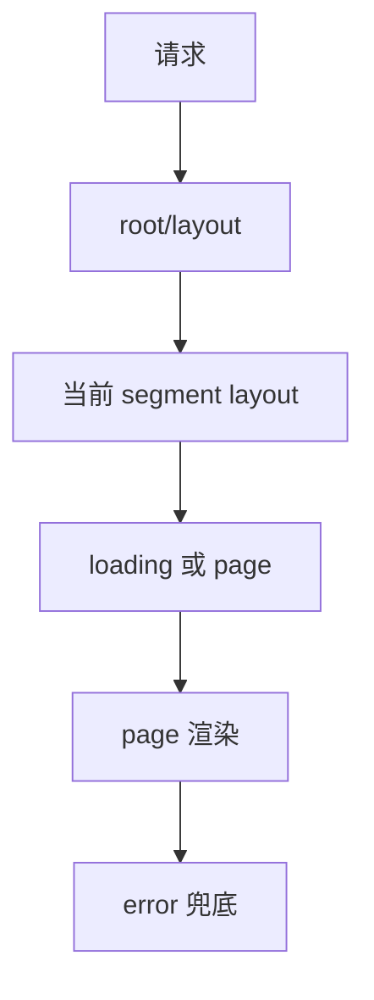
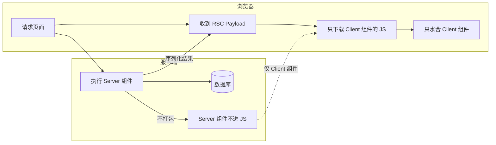
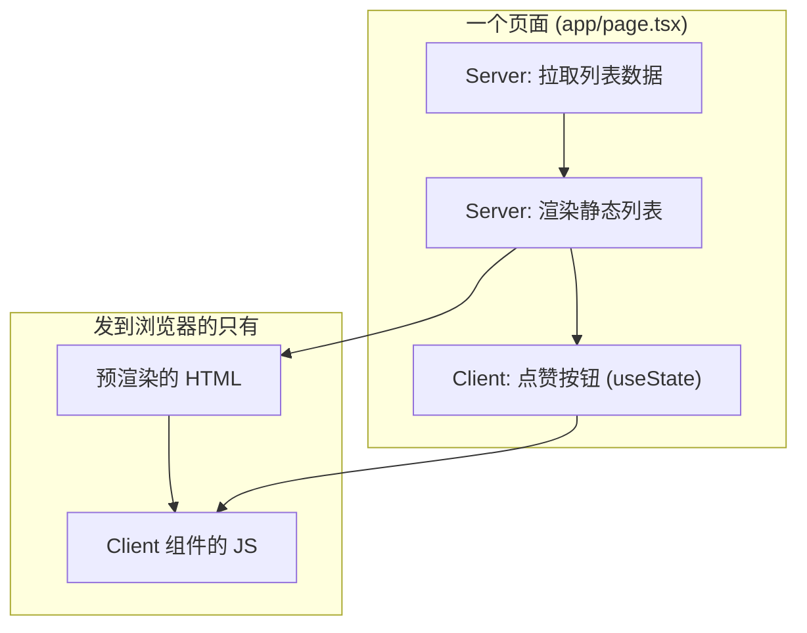
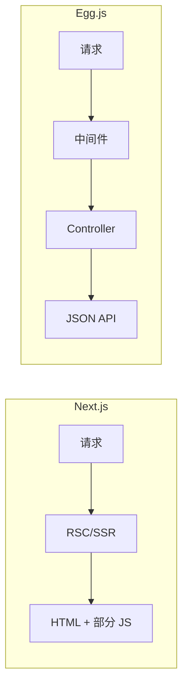

# Next.js 高频面试题

## 一、App Router 与路由

### 1. App Router 与 Pages Router 区别

**题目**：App Router 和 Pages Router 有什么区别？`page/layout/loading/error/not-found` 等约定文件的作用与执行顺序？

**答案**：

- **结论**：App Router 基于 `app/` 目录与约定文件，默认服务端组件、内置嵌套 layout；Pages Router 基于 `pages/` 与文件名即路由，默认客户端、需手写 getServerSideProps/getStaticProps。
- **约定文件**：
  - `page.tsx`：当前路由的 UI。
  - `layout.tsx`：共享布局（嵌套，子路由包裹在内）。
  - `loading.tsx`：加载态（自动包一层 Suspense）。
  - `error.tsx`：错误边界。
  - `not-found.tsx`：404。

**请求 → 布局 → 页面的关系**：



- **最小示例**：
  ```tsx
  // app/dashboard/layout.tsx
  export default function DashboardLayout({ children }: { children: React.ReactNode }) {
    return <div className="dashboard"><aside>导航</aside>{children}</div>;
  }
  // app/dashboard/page.tsx
  export default function DashboardPage() {
    return <h1>Dashboard</h1>;
  }
  ```

### 2. 动态路由、路由组、平行路由、拦截路由

**题目**：动态路由、路由组 `(group)`、平行路由 `@slot`、拦截路由 `(.)` 分别是什么？典型用法？

**答案**：

| 能力       | 写法示例           | 作用 |
| ---------- | ------------------ | ---- |
| 动态路由   | `[id]/page.tsx`    | URL 参数 `id`，如 `/post/123` |
| 路由组     | `(marketing)/about`| 括号目录不体现在 URL，仅做分组 |
| 平行路由   | `@modal/page.tsx`  | 同一 URL 下多块 UI 并行（如主内容 + 弹层） |
| 拦截路由   | `(.)photo/[id]`    | 同一 segment 内“拦截”到某子路由（如从列表点进显示 modal 而非跳转） |

- **示例**：动态路由 + 参数校验。
  ```tsx
  // app/post/[id]/page.tsx
  export default async function PostPage({ params }: { params: Promise<{ id: string }> }) {
    const { id } = await params;
    const post = await getPost(id);
    if (!post) notFound();
    return <article>{post.title}</article>;
  }
  ```

---

## 二、RSC 与 Client Component

### 1. RSC 是什么？与 SSR 的区别？

**题目**：什么是 React Server Components？和传统 SSR 有什么大的区别？为什么 Server Component 不能用 Hooks、事件、浏览器 API？

**答案**：

- **结论**：RSC 的粒度是**组件级**，部分组件只在服务端运行、不打包进客户端 JS；SSR 是**整页**服务端渲染，所有组件仍要下发并在客户端水合。
- **区别要点**：
  - 产物：SSR = HTML + 全量组件 JS；RSC = 服务端数据流 + 仅 Client 组件的 JS。
  - 能力：RSC 可在服务端组件内直连 DB/密钥；SSR 多在 getServerSideProps 等页面级取数。

**图例：RSC 请求到渲染的流程**



**图例：同一页面里 Server 与 Client 组件如何分工**



**示例：一页里既有 Server 组件又有 Client 组件**

```tsx
// app/post/[id]/page.tsx（默认是 Server Component，不写 'use client'）
import { db } from '@/lib/db';
import { LikeButton } from './LikeButton';  // Client 组件

export default async function PostPage({ params }: { params: Promise<{ id: string }> }) {
  const { id } = await params;
  const post = await db.post.findUnique({ where: { id } });  // 服务端直连 DB，不暴露到前端
  if (!post) return null;
  return (
    <article>
      <h1>{post.title}</h1>
      <p>{post.content}</p>
      <LikeButton postId={post.id} initialCount={post.likeCount} />  {/* 只有这里会变成前端 JS */}
    </article>
  );
}
```

```tsx
// app/post/[id]/LikeButton.tsx
'use client';
import { useState } from 'react';
export function LikeButton({ postId, initialCount }: { postId: string; initialCount: number }) {
  const [count, setCount] = useState(initialCount);
  return <button onClick={() => setCount((c) => c + 1)}>👍 {count}</button>;
}
```

- 上面页面中：`PostPage` 在服务端执行、可访问 `db`，**不会**被打进前端 bundle；只有 `LikeButton` 带 `'use client'`，其代码会下发给浏览器并水合。
- 详细对比见 [SSR、SSG、RSC 原理及优缺点](../../../服务端渲染/面试题/SSR、SSG、RSC%20原理及优缺点.md)。

| 维度     | SSR                    | RSC                          |
| -------- | ---------------------- | ----------------------------- |
| 渲染粒度 | 整页                   | 按组件（Server / Client 分流） |
| 前端 JS  | 整树都要水合           | 仅 Client 组件进 bundle       |
| 数据/密钥| 多在页面级 API 取数     | Server 组件内直接访问         |

- **限制**：Server Component 不能使用 `useState`、`useEffect`、事件、`window` 等。

  **为什么“不运行在浏览器”就不能用 Hooks？**  
  Server Component 只在**服务端**执行一次，产出的是序列化后的结果（RSC Payload）发给前端，**不会在浏览器里挂载成组件实例**。Hooks 依赖的是客户端的“组件实例 + 生命周期”：有挂载→更新→卸载，才有 state、effect、事件绑定。服务端没有这份运行时，也没有 DOM，所以没有 Hooks 的运行环境。需要交互的必须用 `'use client'` 标记为 Client Component，在浏览器里挂载后再用 Hooks。

### 2. Client Component 与 props 序列化

**题目**：传给 Client Component 的 props 有什么限制？为什么不能传函数、Date、类实例？

**答案**：

- **结论**：Server → Client 的 props 必须可序列化（能经 RSC Payload 从服务端传到浏览器）。函数、Date、自定义类实例等无法序列化，不能直接传。
- **做法**：复杂对象只传可序列化字段（如 `id`、`name`）；需要“行为”时在 Client 组件内根据 id 再取或通过 Server Action 调用。

```tsx
// 服务端组件
<ClientCard user={{ id: user.id, name: user.name }} />
// Client 组件内不能写：onClick={() => ...} 从 Server 传过来
```

---

## 三、渲染策略与数据获取

### 1. SSG / SSR / ISR / 流式

**题目**：Next.js 有哪几种渲染方式？如何控制某页是 SSG、SSR 还是 ISR？`revalidate`、`dynamic`、`cookies()`/`headers()` 各在什么场景用？

**答案**：

- **四种方式**：
  - **SSG**：构建时生成静态 HTML，默认行为（无动态 API 时）。
  - **SSR**：每次请求在服务端渲染；使用 `cookies()`、`headers()`、`searchParams` 等即触发。
  - **ISR**：静态 + 按时间或按需再验证；`fetch` 里 `next: { revalidate: 60 }` 或页级 `export const revalidate = 60`。
  - **CSR**：`'use client'` 组件内请求数据，纯客户端渲染。

- **常用控制**：
  - 强制动态（每次请求都跑服务端）：`export const dynamic = 'force-dynamic'`。
  - 静态 + 定时再验证：`export const revalidate = 60`（秒）。
  - 用 `cookies()`/`headers()` 读请求头即自动走 SSR。

- **流式渲染**：用 `loading.tsx` 或 `<Suspense>` 包住异步组件，先出 shell，再逐步把 RSC 流推下去，不用等整页渲染完。注意与动态 `generateMetadata` 的冲突（流式时 TDK 可能后到）。

```tsx
// app/products/page.tsx
export const revalidate = 60; // ISR：60 秒再验证
export default async function Page() {
  const list = await fetch('https://api.example.com/products', { next: { revalidate: 60 } });
  const data = await list.json();
  return <ProductList initialData={data} />;
}
```

---

## 四、Server Actions 与表单

### 1. Server Actions 是什么？和 API Route 的选用

**题目**：Server Actions 是什么？和 API Route 比有什么适用场景？如何做表单校验与错误反馈？

**答案**：

- **结论**：Server Action 是服务端函数，可在服务端直接执行（表单 submit、事件里调用），减少手写 API Route；适合 mutation、表单提交、服务端写库等。
- **与 API Route**：需要对外暴露 REST、给非 Next 前端或第三方调用的用 API Route；纯 Next 内表单/变更用 Server Action 更简洁。
- **示例**：表单提交 + pending 状态。
  ```tsx
  'use client';
  import { useFormStatus } from 'react-dom';
  function SubmitBtn() {
    const { pending } = useFormStatus();
    return <button type="submit" disabled={pending}>{pending ? '提交中...' : '提交'}</button>;
  }
  // 服务端
  async function createPost(formData: FormData) {
    'use server';
    const title = formData.get('title') as string;
    if (!title?.trim()) return { error: '标题必填' };
    await db.post.create({ data: { title } });
    revalidatePath('/posts');
  }
  ```
  ```tsx
  <form action={createPost}>
    <input name="title" />
    <SubmitBtn />
  </form>
  ```
- 校验可在 Server Action 内做，返回 `{ error: string }` 或配合 `useFormState` 展示。

---

## 五、Middleware 与鉴权/重定向

### 1. Middleware 时机与能力

**题目**：Next.js Middleware 的执行时机与能力？如何做路由级鉴权（如企业微信内 H5 未登录跳转）？与 `next.config` 里 rewrite/redirect 的选用？

**答案**：

- **结论**：Middleware 在 **Edge** 运行，在**响应返回前**执行，可改 request/response、做重定向、鉴权；适合“所有/部分路由统一前置逻辑”。`next.config` 的 rewrite/redirect 是静态配置，不能带复杂逻辑。

  **Edge 是什么？**  
  Edge 指**边缘运行时（Edge Runtime）**：代码跑在 CDN/边缘节点上（离用户更近），而不是只在某一台中心服务器（Node 服务器）上。Next 的 Middleware 默认用 Edge Runtime，所以**不能使用 Node 专有 API**（如 `fs`、`path`、部分 `crypto`、原生模块等），只能使用 Web 标准 API 和 V8 支持的能力；优点是延迟低、冷启动快，适合做鉴权、重定向、A/B 等轻量逻辑。
- **鉴权示例**：校验 cookie/token，未通过则重定向到登录。
  ```ts
  // middleware.ts 根目录
  import { NextResponse } from 'next/server';
  export function middleware(req: NextRequest) {
    const token = req.cookies.get('wecom_token')?.value;
    if (!token && req.nextUrl.pathname.startsWith('/dashboard')) {
      return NextResponse.redirect(new URL('/login', req.url));
    }
    return NextResponse.next();
  }
  export const config = { matcher: ['/dashboard/:path*'] };
  ```
- 与 Node 中间件（如 [中间件](../中间件.md)）对比：Next Middleware 跑在 Edge、无 Node API；Egg 中间件跑在 Node、可访问 DB/Redis，适合 BFF 内鉴权+聚合。

---

## 六、性能与工程化

### 1. RSC 与首屏 JS、流式对 LCP/TTI 的影响

**题目**：RSC 如何减少首屏 JS 体积？流式渲染对 LCP/TTI 有什么影响？图片优化、bundle 分析、Turbopack 的作用？

**答案**：

- **RSC 与体积**：服务端组件不进入客户端 bundle，只有 Client 组件和依赖会打进去，首屏 JS 明显减小。
- **流式**：先返回 shell 和关键内容，LCP 更快；非关键区块用 Suspense 延后，TTI 可被“逐步可交互”分摊。
- **图片**：`next/image` 自动优化格式与尺寸，`priority` 用于 LCP 关键图。
- **bundle 分析**：`@next/bundle-analyzer` 查看各 chunk 体积，便于做 code split。
- **Turbopack**：开发时替代 Webpack，加快 dev 启动与 HMR。

---

## 七、Next.js 与 Egg.js 的区别

### 1. 定位与选型

**题目**：Next.js 和 Egg.js 分别解决什么问题？技术选型如何取舍？企业微信 H5/文档这类业务更适合用哪个？

**答案**：

- **结论**：Next 是**以 React 为中心的全栈框架**（前端为主，顺带 SSR/API/Server Actions）；Egg 是** Node 服务端框架**（BFF、API、后台服务，不负责前端渲染）。两者可组合：Next 做文档/官网/SEO 页，Egg 做企业内 BFF/聚合/定时任务。

| 维度       | Next.js                          | Egg.js                          |
| ---------- | -------------------------------- | -------------------------------- |
| 定位       | React 全栈（前端为主）           | Node 服务端框架（BFF/API）       |
| 渲染/数据  | 内置 RSC/SSR/SSG/Server Actions  | 无内置，自接模板或纯 API         |
| 中间件     | Edge Middleware（轻量、前置）     | Node 中间件（可访问 DB/Redis）   |
| 多进程     | 无内置，靠部署/PM2                | Master + Agent + Worker 内置     |
| 典型场景   | 文档/官网/SEO 页、前后一体       | 企业内 BFF、聚合、定时/后台      |

- **运行环境**：Next 可跑在 Node/Edge/Vercel；Egg 跑在 Node，典型多进程（见 [egg高频梳理](./egg高频梳理.md) 多进程模型）。
- **数据与渲染**：Next 内置 RSC/SSR/SSG、流式、Server Actions；Egg 只提供 HTTP 层，需自接模板或纯 API + 前端请求。
- **鉴权/中间件**：Next Middleware 在 Edge、响应前做重定向/鉴权；Egg 中间件在 Node、可访问 ctx/DB，适合复杂鉴权与 BFF 聚合。
- **企业微信场景**：文档/协同 H5 若强依赖 SEO 或希望前后一体，可考虑 Next；若已有 React 前端且需要稳定 BFF、多进程、插件体系，选 Egg 更合适。


