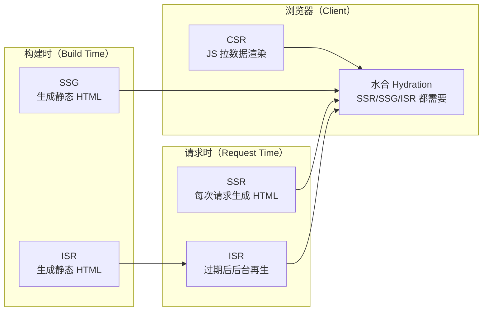
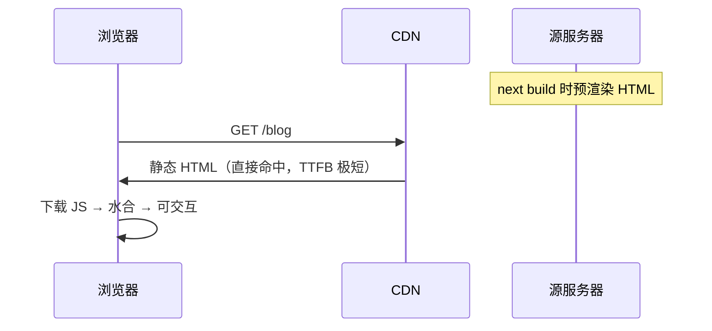
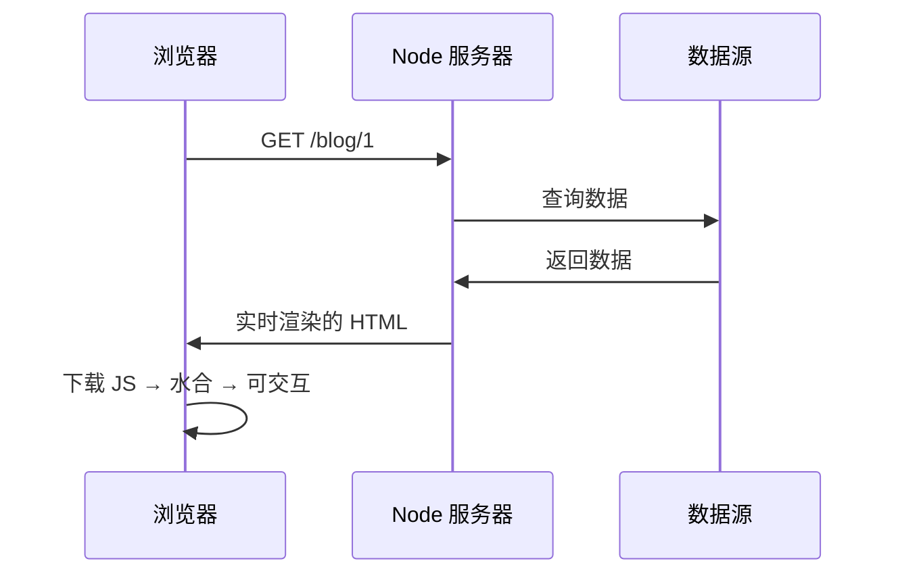
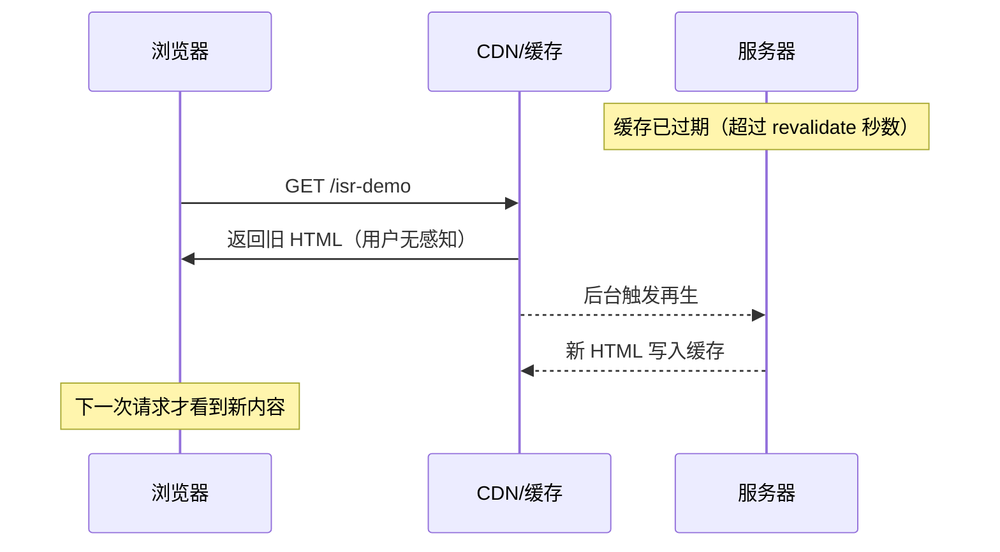
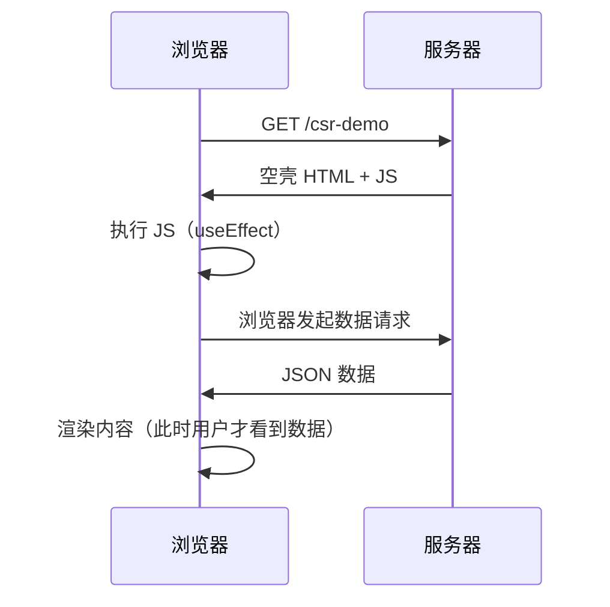
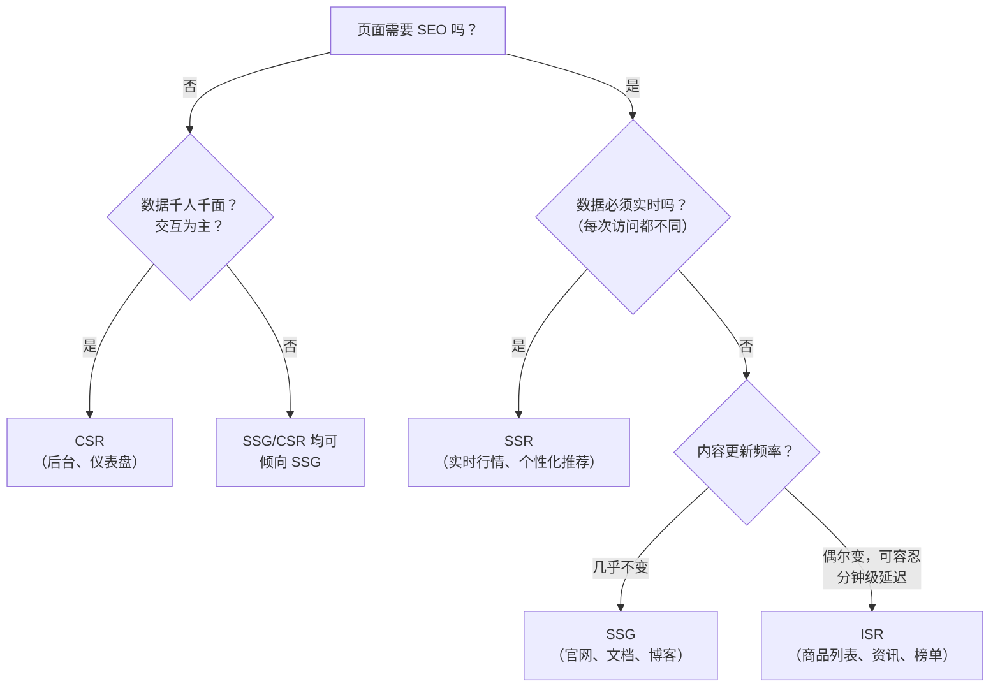
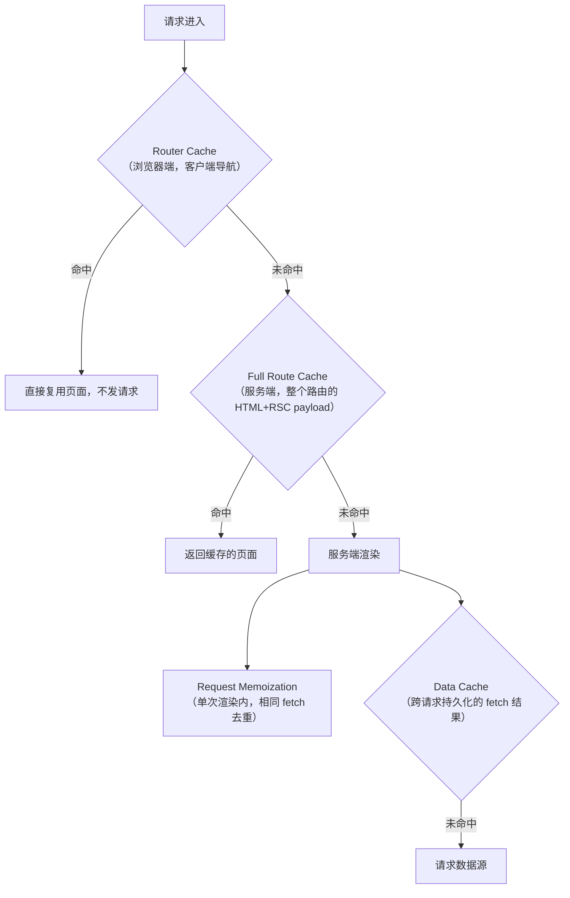

# Next.js 渲染模式详解（面试向）

> **一句话总览**：渲染模式的本质是回答"**HTML 在什么时机、在什么位置生成**"——SSG 在构建时、SSR 在每次请求时、ISR 构建时生成 + 过期后后台再生、CSR 在浏览器里生成。选型的核心权衡是 **数据新鲜度 vs 服务器成本 vs 首屏/SEO**。



---

## 高频题 1：SSR / SSG / ISR / CSR 的区别与适用场景（必考）

### 30 秒速答版

- **CSR**：服务器只发空壳 HTML + JS，浏览器执行 JS 拉数据渲染。SEO 差，适合后台类、强交互页面。
- **SSR**：每次请求在服务器实时生成 HTML。数据永远最新、SEO 好，但服务器成本高、TTFB 慢。
- **SSG**：构建时一次性生成静态 HTML，走 CDN。最快最便宜，但内容改了要重新构建。
- **ISR**：SSG 的基础上加"保质期"——过期后下一个请求触发后台再生（stale-while-revalidate）。兼顾 SSG 的性能和准实时的数据。

选型口径：**不需要 SEO 且千人千面 → CSR；内容基本不变 → SSG；内容偶尔变、允许短暂旧数据 → ISR；数据必须实时或千人千面且要 SEO → SSR。**

---

### 1.1 SSG（Static Site Generation，静态站点生成）

**结论**：构建时生成 HTML，之后所有请求直接返回静态文件，可全量走 CDN。



**Next.js App Router 实现**：Server Component 默认就是 SSG，不加任何动态标记即构建时预渲染。

```tsx
// demo/app/blog/page.tsx —— 无任何 export const dynamic，默认 SSG
export default async function BlogListPage() {
    const posts = await getAllPosts(); // 构建时执行一次
    return (/* ... */);
}
```

- 优点：首屏最快、服务器零压力、CDN 友好、源站挂了也能访问
- 缺点：内容更新要重新构建；数据量大时构建慢
- Demo：[`demo/app/blog/page.tsx`](./demo/app/blog/page.tsx)

---

### 1.2 SSR（Server-Side Rendering，服务端渲染）

**结论**：每个请求到达时实时渲染 HTML，数据永远最新，代价是每台请求都要付渲染成本。



**Next.js App Router 实现**：标记 `force-dynamic`（或在组件里用 `cookies()`/`headers()`/`searchParams` 等动态 API、fetch 用 `cache: 'no-store'`）。

```tsx
// demo/app/blog/[id]/page.tsx
export const dynamic = 'force-dynamic'; // 每次请求都重新渲染

export default async function BlogDetailPage({ params }) {
    const post = await getPostById(params.id); // 请求时执行
    // ...
}
```

- 优点：数据实时、SEO 好、弱设备友好
- 缺点：服务器压力大、TTFB 比静态慢、需要 Node 运行时
- Demo：[`demo/app/blog/[id]/page.tsx`](./demo/app/blog/[id]/page.tsx)

---

### 1.3 ISR（Incremental Static Regeneration，增量静态再生）

**结论**：像 SSG 一样返回静态 HTML，但设置过期时间；过期后**第一个请求仍返回旧缓存**，同时后台触发再生，后续请求拿到新内容（stale-while-revalidate）。



**Next.js App Router 实现**：导出 `revalidate`。

```tsx
// demo/app/isr-demo/page.tsx
export const revalidate = 10; // 缓存 10 秒，过期后下次请求触发后台再生

export default async function ISRDemoPage() {
    const currentTime = await getCurrentTime();
    // ...
}
```

- 优点：SSG 级的性能 + 准实时数据；再生在后台，用户永远拿缓存，TTFB 稳定
- 缺点：数据有最长 `revalidate` 秒的延迟；过期后第一个请求拿到的是旧数据
- Demo：[`demo/app/isr-demo/page.tsx`](./demo/app/isr-demo/page.tsx)（`revalidate = 10`，连续刷新观察时间戳变化）

---

### 1.4 CSR（Client-Side Rendering，客户端渲染）

**结论**：服务器只下发空壳 HTML 和 JS bundle，浏览器执行 JS 后才请求数据、渲染内容。



**Next.js App Router 实现**：`'use client'` + `useEffect` 拉数据。

```tsx
// demo/app/csr-demo/page.tsx
'use client';

export default function CSRDemoPage() {
    const [data, setData] = useState(null);
    useEffect(() => {
        fetchClientData().then(setData); // 仅在浏览器执行
    }, []);
    // ...
}
```

- 优点：服务器压力最小、页面切换流畅、适合强交互
- 缺点：SEO 不友好、首屏白屏时间长、弱网弱设备体验差
- Demo：[`demo/app/csr-demo/page.tsx`](./demo/app/csr-demo/page.tsx)

---

### 1.5 差异对比总表

| 维度 | CSR | SSR | SSG | ISR |
|---|---|---|---|---|
| HTML 生成时机 | 浏览器运行时 | 每次请求时 | 构建时 | 构建时 + 过期后再生 |
| 数据新鲜度 | 实时 | 实时 | 构建时的快照 | 最长延迟 revalidate 秒 |
| 首屏 TTFB | 快（但内容晚） | 慢（要渲染） | 极快（CDN） | 极快（CDN） |
| SEO | 差 | 好 | 好 | 好 |
| 服务器成本 | 最低 | 最高 | 几乎为零 | 低（偶尔再生） |
| 千人千面 | 适合 | 适合 | 不适合 | 不适合 |
| 典型场景 | 后台管理、仪表盘 | 实时行情、个性化页 | 官网、文档、博客 | 商品列表、资讯、榜单 |

---

### 1.6 适用场景决策（面试画图版）



**业务案例口径**：

- 公司官网 / 技术文档 / 营销页 → **SSG**（一年改不了几次，重新构建无成本）
- 电商商品列表 / 新闻资讯 → **ISR**（量大、更新频繁但允许分钟级延迟，纯 SSR 扛不住流量，纯 SSG 构建太慢）
- 股票行情 / 实时竞价 → **SSR**（数据必须实时 + 要 SEO）
- 后台管理系统 → **CSR**（无 SEO 需求、登录后千人千面、强交互）

---

## 高频题 2：ISR 原理与 revalidate 机制（重点）

### 时间触发 vs 按需触发

| 方式 | 写法 | 触发时机 | 适用 |
|---|---|---|---|
| 时间触发 | `export const revalidate = 60` | 缓存超过 N 秒后的第一个请求 | 内容周期性变化（榜单、资讯） |
| 按需触发 | `revalidatePath('/blog')` / `revalidateTag('blog-posts')` | 数据变更时主动调用（通常在 Server Action / Webhook 里） | CMS 发布、后台编辑后立即生效 |

```ts
// demo/lib/actions.ts —— 数据变更后主动让相关缓存失效
'use server';
export async function updatePost(id: string, formData: FormData) {
    // ...更新数据
    revalidatePath('/blog');        // 刷新列表页
    revalidatePath(`/blog/${id}`);  // 刷新详情页
}
```

Demo：[`demo/app/cache-demo/page.tsx`](./demo/app/cache-demo/page.tsx)（手动触发 `revalidatePath` / `revalidateTag`）

### 常见追问

**Q：过期后第一个请求拿到新数据还是旧数据？**
旧数据。stale-while-revalidate：先返回旧缓存（保证 TTFB），同时在后台再生，**下一个**请求才拿到新内容。面试时要主动说出这一点。

**Q：大量请求同时打到过期缓存会怎样（cache stampede）？**
Next.js 内部对同一路径的再生做了去重，并发请求共享同一次再生 Promise，不会击穿到数据源 N 次。

**Q：ISR 在 Vercel 和自托管上有区别吗？**
Vercel 上 ISR 缓存托管在其边缘网络，多实例间共享；自托管（`next start`）默认缓存写到本地文件系统（`.next/cache`），多实例部署需要共享存储（如 Redis handler），否则各实例各自再生。

**Q：`revalidate = 0` 和不写有什么区别？**
`revalidate = 0` 等价于动态渲染（每次请求都重新生成）；不写则走默认（静态页面永久缓存，fetch 数据默认缓存）。

---

## 高频题 3：Next.js 缓存体系（App Router 面试热点）

**结论**：App Router 有四层缓存，渲染模式的行为本质上是这四层缓存叠加的结果；"数据不更新"问题 90% 是缓存层没搞清楚。



| 缓存层 | 存什么 | 位置 | 生命周期 | 失效方式 |
|---|---|---|---|---|
| Request Memoization | 单次渲染中重复的 fetch | 服务端内存 | 一次渲染 | 渲染结束自动失效 |
| Data Cache | fetch 的返回结果 | 服务端（持久） | 永久 / `revalidate` | `revalidateTag`/`revalidatePath`、`cache: 'no-store'` |
| Full Route Cache | 整个路由的 HTML + RSC payload | 服务端（持久） | 静态路由永久 | 重新构建 / revalidate |
| Router Cache | 访问过的路由片段 | 浏览器内存 | 会话级（静态 5 分钟 / 动态 30 秒） | `router.refresh()`、重新访问超时 |

**"数据不更新"排查口径**（面试实际问题）：

1. 先 `next build` 看该路由是 ○ 还是 ƒ——是 ○ 说明被静态化了
2. 检查是否无意中满足了静态化条件（没用动态 API、fetch 默认缓存）
3. 按层排查：Data Cache（fetch 缓存）→ Full Route Cache（路由缓存）→ Router Cache（客户端导航没重新请求）
4. 处置：要实时用 `cache: 'no-store'` 或 `force-dynamic`；要准实时用 `revalidate`；数据变更后主动 `revalidatePath`

---

## 高频题 4：水合（Hydration）是什么？mismatch 怎么排查？

**速答**：SSR/SSG/ISR 下发的 HTML 是"死"的，React 在客户端把事件监听、状态挂到这颗已存在的 DOM 树上，让它变成可交互的 React 应用，这个过程叫水合。水合的前提是**客户端首帧渲染结果必须与服务端 HTML 一致**，否则就是 hydration mismatch。

**常见原因与解法**：

| 原因 | 例子 | 解法 |
|---|---|---|
| 时间戳/随机数 | `new Date().toLocaleString()`、`Math.random()` | 挪到 `useEffect` 里，或服务端算好传给客户端 |
| 浏览器专属 API | 渲染期访问 `window`/`localStorage` | `useEffect` / `dynamic(() => import(...), { ssr: false })` |
| HTML 嵌套非法 | `<p>` 里套 `<div>`，浏览器自动修正 DOM | 修正标签结构 |
| 浏览器插件改 DOM | 翻译插件注入节点 | `suppressHydrationWarning`（仅单层属性/文本差异） |

深入原理（水合流程、为什么需要 data-reactroot 等）见 [../水合原理.md](../水合原理.md)。

---

## 高频题 5：RSC 和 SSR 有什么区别？（Next 13+ 必考）

**速答**：SSR 是**页面级**的——整页在服务端渲染成 HTML，但所有组件的 JS 仍要下发到浏览器做水合；RSC 是**组件级**的——可以把任意组件标记为只在服务端运行，它的 JS **完全不下发**，客户端零成本。两者是正交的：App Router 里可以"RSC 拿数据 + 客户端组件做交互 + 整页再走 SSR/SSG/ISR 任一模式"。

| 维度 | SSR | RSC |
|---|---|---|
| 渲染粒度 | 整个页面 | 单个组件可选 |
| 产物 | HTML + 全部组件的 JS | HTML/RSC payload + 仅交互组件的 JS |
| 数据获取 | 页面级入口（getServerSideProps 思路） | 组件内直接查库/读文件 |
| 对包体积影响 | 无（全量下发） | 服务端组件零下发 |

详细展开见 [../面试题/SSR、SSG、RSC 原理及优缺点.md](../面试题/SSR、SSG、RSC%20原理及优缺点.md)（本文不重复）。

---

## 落地经验：实际项目怎么用

### 选型失误的真实教训

- **该用 ISR 用了 SSR**：资讯列表页每请求实时渲染，流量上来后 TTFB 从 200ms 劣化到 2s+。改 ISR（`revalidate = 60`）后命中 CDN，TTFB 回到 50ms 内，数据延迟 1 分钟业务可接受。
- **该用 SSR 用了 SSG**：个性化首页构建时写死，所有用户看到同一份"别人"的内容。个性化数据要么 SSR，要么 SSG 壳 + CSR 拉个性化模块。
- **全站 force-dynamic 图省事**：丢掉了全部静态化收益。应按路由逐个判断，动态化是最后一招。

### 常见踩坑

1. **fetch 默认缓存行为分场景**（Next 14）：静态路由中 `fetch` 默认缓存（force-cache），动态路由中默认不缓存（no-store）——同一个 `fetch(url)` 写在不同路由行为相反，"数据改了不生效/每次都回源"都先想这条。Next 15 起一律默认不缓存。真实可运行的三种策略对比见 [`demo/app/fetch-cache-demo/page.tsx`](./demo/app/fetch-cache-demo/page.tsx)。
2. **hydration mismatch**：时间戳、`Math.random()` 直接写在渲染输出里，开发环境报红。
3. **`useSearchParams` 未包 Suspense**：构建期预渲染直接报错（本 demo 的 `/login` 页就踩过，修法见 [`demo/app/login/page.tsx`](./demo/app/login/page.tsx)）。
4. **自托管多实例 ISR 各自再生**：缓存不共享，需要配置共享 cache handler。

### 上线验证清单：`next build` 输出怎么看

本 demo 的真实构建输出（已验证）：

```text
Route (app)                              Size     First Load JS
┌ ○ /                                    188 B          96.2 kB
├ ƒ /(.)blog/[id]                        1.39 kB        88.7 kB
├ ○ /about                               158 B          87.5 kB
├ ○ /blog                                188 B          96.2 kB
├ ƒ /blog/[id]                           188 B          96.2 kB
├ ○ /csr-demo                            1.53 kB        88.9 kB
├ ○ /isr-demo                            159 B          87.5 kB
└ ○ /login                               1.17 kB        88.5 kB
ƒ Middleware                             26.6 kB

○  (Static)   prerendered as static content
ƒ  (Dynamic)  server-rendered on demand
```

- **○ (Static)**：构建时预渲染。SSG 和 ISR 都归为此类——区分看代码里有没有 `export const revalidate`（如 `/isr-demo`）
- **ƒ (Dynamic)**：每次请求服务端渲染。`/blog/[id]` 因 `force-dynamic` 是 ƒ，而同站的 `/blog` 是 ○——**渲染模式是路由级的，不是应用级的**，这是面试加分点
- 上线前过一遍这个表，确认每个路由的符号符合预期，是最低成本的回归检查

---

## 动手实验（配合 demo 验证理解）

```bash
cd demo && yarn dev   # 依赖已安装，直接启动
```

| 实验 | 操作 | 观察点 |
|---|---|---|
| SSR vs SSG | 访问 `/blog`（SSG）和 `/blog/1`（SSR），Network 面板对比 | 两者 HTML 都含内容，但 SSR 每次请求都经过服务器渲染 |
| ISR 再生 | 访问 `/isr-demo`，记下时间戳，10 秒内刷新 vs 10 秒后连续刷新两次 | 10 秒内时间戳不变；过期后第一次刷新可能还是旧值，第二次才是新值（stale-while-revalidate） |
| CSR 空壳 | 访问 `/csr-demo`，DevTools 查看页面源代码 | 源码里没有数据，数据在浏览器后续请求中返回 |
| 缓存失效 | 在 `/cache-demo` 点击 Revalidate，再回 `/blog` | 手动触发 `revalidatePath` 后列表页拿到新内容 |
| 构建符号 | `npx next build` 看输出表 | 对照上面的符号表确认每个路由的模式 |

---

## 模拟面试自测清单

> 先自己答，再对照要点。能讲清"为什么"才算过。

1. **SSR 和 SSG 的核心区别？** → HTML 生成时机：请求时 vs 构建时；引出的代价：服务器成本 vs 数据陈旧。
2. **ISR 过期后第一个请求拿到什么？** → 旧缓存（stale），后台再生，下一请求才生效。
3. **ISR 适合什么场景？举一个不适合的。** → 适合商品/资讯列表；不适合实时库存、千人千面。
4. **App Router 有哪几层缓存？"数据不更新"怎么排查？** → 四层（见上表）；先 build 看符号，再按 Data Cache → Full Route Cache → Router Cache 排查。
5. **`revalidatePath` 和 `revalidateTag` 区别？** → 按路径失效 vs 按 fetch 标签批量失效；后者适合多页共享同一数据源。
6. **hydration mismatch 的三个常见原因？** → 时间戳/随机数、浏览器 API、非法标签嵌套。
7. **RSC 和 SSR 是一回事吗？** → 不是。RSC 是组件级、JS 不下发；SSR 是页面级、全量 JS 水合；二者可叠加。
8. **`generateStaticParams` 解决什么问题？** → 动态路由（`[id]`）在构建时预生成指定参数的页面；配合 ISR 可让未列出的参数按需生成。
9. **Streaming / Suspense 和 SSR 什么关系？** → SSR 基础上把 HTML 分块流式下发，慢数据组件用 Suspense 包裹后先出壳再补内容，降低 TTFB 感知。
10. **`next build` 输出里 ○ 和 ƒ 各代表什么？** → ○ 静态预渲染（SSG/ISR），ƒ 请求时渲染（SSR）；渲染模式是路由级的。
11. **Next 14 和 15 的 fetch 默认缓存行为差异？** → 14 默认缓存，15 默认不缓存；升级时"数据不更新/不缓存"类问题先想版本。

---

## 延伸阅读

- [demo/README.md](./demo/README.md) — Day 1-7 完整学习路径（路由、Server Actions、Middleware、性能优化、部署）
- [../水合原理.md](../水合原理.md) — 水合机制深挖
- [../面试题/SSR、SSG、RSC 原理及优缺点.md](../面试题/SSR、SSG、RSC%20原理及优缺点.md) — 原理问答版
- [../面试题/ssr、segment ssr、rsi.md](../面试题/ssr、segment%20ssr、rsi.md) — 边缘渲染等进阶形态
- [../常见问题.md](../常见问题.md) — SSR 概念问答
