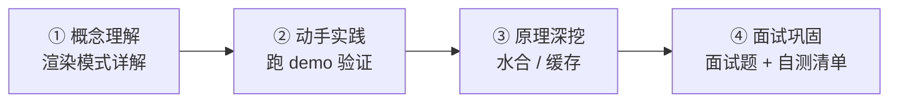

# Next.js 学习路径索引

> 目标：熟练使用 Next.js，理解 SSR/SSG/ISR 的差异与适用场景，具备实际落地能力。
> 本目录是学习入口，按下面的顺序看即可。

## 学习路线

| 阶段       | 看什么                                                                  | 做什么                                                            |
| ---------- | ----------------------------------------------------------------------- | ----------------------------------------------------------------- |
| ① 概念理解 | [Next.js 渲染模式详解（面试向）](./Next.js%20渲染模式详解（面试向）.md) | 重点看「高频题 1/2」：四种模式对比、ISR 机制                      |
| ② 动手实践 | [demo/README.md](./demo/README.md)                                      | `cd demo && yarn dev`，按渲染模式详解文末「动手实验」表格逐个验证 |
| ③ 原理深挖 | [../水合原理.md](../水合原理.md)、[../常见问题.md](../常见问题.md)      | 理解水合流程、SSR 常见疑问                                        |
| ④ 面试巩固 | [../面试题/](../面试题/) 三篇 + 渲染模式详解文末「模拟面试自测清单」    | 自测清单能口述「为什么」才算过                                    |

## 内容地图

- **[Next.js 渲染模式详解（面试向）](./Next.js%20渲染模式详解（面试向）.md)** — 核心文档。SSR/SSG/ISR/CSR 原理、差异对比、适用场景决策、缓存体系、落地踩坑、模拟面试自测
- **[demo/](./demo/)** — 可运行的 Next.js 14 项目（App Router + React 18 + TypeScript + Tailwind），依赖已安装，`yarn dev` 直接启动。README 按 Day 1-7 组织：路由 → 渲染模式 → 服务端功能 → 性能优化 → 高级特性 → 部署
- **[../面试题/](../面试题/)** — 问答式速答：SSR/SSG/RSC 原理及优缺点、segment SSR、SSR 堵塞排查
- **[../水合原理.md](../水合原理.md)** — Hydration 机制深挖
- **[../常见问题.md](../常见问题.md)** — SSR 概念问答
